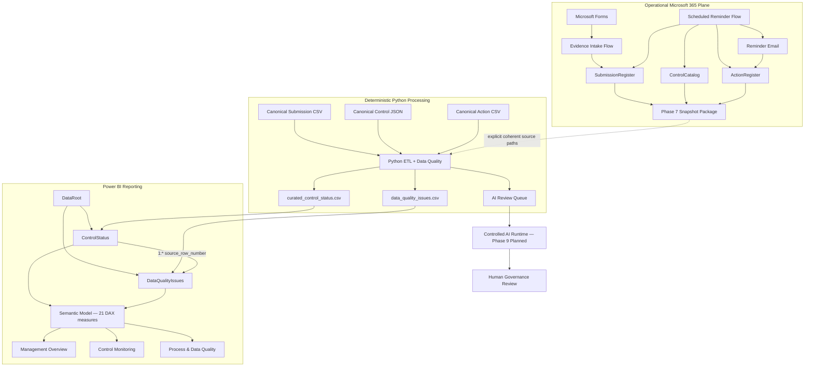

# Cyber Governance Automation Lab

**Security Control Evidence, Follow-up & Reporting Automation**

[](https://github.com/gw-ai-security/cyber-governance-automation-lab/actions/workflows/tests.yml)

A portfolio proof of concept for a recurring cybersecurity-governance evidence process. The lab combines explicit governance modeling, Microsoft Forms and Power Automate workflows, deterministic Python Data Quality processing, reminder/action tracking, an operational reporting-snapshot bridge, and a source-controlled Power BI dashboard.

The project is deliberately small and explicit. Its value is the end-to-end engineering boundary: operational workflow automation produces source facts; Python owns deterministic validation and reporting semantics; Power BI consumes only curated outputs; later AI remains downstream of deterministic controls and human governance authority.

## What This Project Demonstrates

- **Governance modeling** — Control, Submission, Action, and Data Quality Issue remain distinct domain concepts.
- **Expected-state design** — expected Submissions exist before evidence arrives, making missing evidence observable.
- **Controlled evidence intake** — authenticated Forms intake resolves an expected Submission and permits only `Not Submitted → In Review`.
- **Fail-safe workflow behavior** — ambiguous business keys, invalid states, missing/duplicate Controls, and duplicate active Actions are surfaced rather than guessed or silently repaired.
- **Scheduled follow-up** — overdue missing Submissions create or reuse an Action, send reminders, and persist reminder history with same-day idempotency.
- **Deterministic Data Quality** — DQ-001 through DQ-010 validate Submission data without semantic auto-correction.
- **Controlled reporting bridge** — live Microsoft 365 state is exported as a private snapshot package and processed through the same Python semantics as canonical fixtures.
- **Curated reporting boundary** — Power BI loads only Python-owned curated reporting outputs and does not reimplement upstream business rules.
- **Source-controlled BI engineering** — PBIP, PBIR, and TMDL definitions are versioned while machine-local state remains excluded.
- **Explicit semantic model** — Data Quality Issues relate to Submission-grain reporting through raw-row lineage rather than unreliable business identifiers.
- **Contracted KPI layer** — exactly 21 DAX measures implement governance, compliance, timeliness, DQ, and process semantics without inventing an overall status.
- **Runtime acceptance** — the same Power BI model is accepted against both canonical synthetic data and private processed Phase 7 operational output by changing only `DataRoot`.
- **Reproducible engineering** — GitHub Actions executes the complete Python regression suite on pushes and pull requests targeting `main`.

## Dashboard Evidence

All public screenshots use the canonical synthetic dataset. No private operational identities or tenant metadata are shown.

### Management Overview


Three slicers, six governance KPI cards, and three analytical views. Canonical headline values: `5 / 80.0% / 1 / 1 / 2 / 5`.

### Control Monitoring


Five operational slicers and a 15-field Submission-grain detail table. Invalid, Pending, unresolved-Control, Non-Compliant, and Overdue scenarios remain inspectable.

### Process & Data Quality


Operational follow-up and Data Quality are kept separate while sharing the same analytical workspace. Canonical Process values: `4 / 4 / 4 / 1 / 10.0%`. Canonical DQ values: `5 / 33.3% / 5`.

## Current Engineering Evidence

| Evidence | Current state |
| --- | ---: |
| Security Controls | 5 |
| Canonical synthetic Submissions | 15 |
| Canonical raw Actions | 5 |
| Explicit Submission DQ rules | 10 |
| Automated tests | **53 passing** |
| Canonical DQ findings | 5 |
| Canonical Valid / Invalid Submissions | 10 / 5 |
| Canonical raw / curated Submission rows | 15 / 15 |
| Canonical AI review queue items | 2 |
| Phase 5 evidence-intake workflow | ✅ Implemented and acceptance-tested |
| Phase 6 reminder workflow | ✅ Implemented and acceptance-tested |
| Phase 7 reporting snapshot bridge | ✅ End-to-end accepted |
| Phase 8 Power BI dashboard | ✅ Canonical and operational runtime accepted |
| Power BI reporting tables | 2 |
| Active Power BI relationships | 1 |
| DAX measures | 21 |
| Calculated tables / columns | 0 / 0 |
| Primary Power BI pages | 3 |
| Continuous Integration | ✅ GitHub Actions |
| Required CI merge gate | ⚠ Not currently enforced |

Canonical deterministic acceptance uses:

```text
as_of_date = 2026-08-15
```

and produces:

```text
Controls loaded: 5
Submissions loaded: 15
Actions loaded: 5
DQ issues: 5
Valid submissions: 10
Invalid submissions: 5
AI review queue items: 2
```

Power BI canonical runtime:

```text
ControlStatus      = 15 rows / 25 columns
DataQualityIssues  = 5 rows / 8 columns
```

The accepted private operational Phase 7 observation uses a separate data plane:

```text
snapshot_id = 20260823_112030
as_of_date  = 2026-08-23
Controls    = 5
Submissions = 17
Actions     = 2
DQ issues   = 5
Valid       = 12
Invalid     = 5
AI queue    = 3
```

Those operational values are acceptance observations only. The private snapshot and processed outputs remain outside Git.

## Architecture



The Phase 7 bridge is explicit rather than automatically synchronized. Power Automate exports source facts; Python processes either canonical defaults or one explicit complete operational source set; Power BI consumes the two curated reporting outputs only.

## Core Domain Model

```text
CONTROL
   │ 1:n
   ▼
SUBMISSION
   ├──────────────► ACTION
   └──────────────► DATA QUALITY ISSUE
```

Submission technical key:

```text
submission_id
```

Submission business key:

```text
control_id + reporting_period
```

Critical semantic separations:

```text
Evidence Present != Compliant
Not Submitted != Non-Compliant
Non-Compliant != Overdue
Compliance != Timeliness
Compliance != Data Quality
Submission Status != Action Status
Unknown != False
Not Evaluated != Failed
Action completion != Submission compliance
Control risk != DQ severity
```

## Phase Status

| Phase | Scope | Status |
| --- | --- | --- |
| Phase 0 | Repository & Project Foundation | ✅ Complete |
| Phase 1 | Business Process & Data Model | ✅ Complete |
| Phase 2 | Canonical Synthetic Dataset | ✅ Complete |
| Phase 3 | Deterministic Python Data Quality Pipeline | ✅ Complete |
| Phase 4 | Test Hardening & Acceptance | ✅ Complete |
| Phase 5 | Power Automate Evidence Intake | ✅ Core DoD complete |
| Phase 6 | Scheduled Reminder Automation | ✅ Complete and acceptance-tested |
| Phase 7 | Reporting Snapshot Bridge | ✅ Complete and end-to-end accepted |
| Phase 8.0 | Reporting & KPI Contract | ✅ Complete |
| Phase 8.1 | Canonical Curated Reporting Baseline | ✅ Complete |
| Phase 8.2 | PBIP/PBIR/TMDL Project Scaffold | ✅ Complete |
| Phase 8.3 | Curated CSV Loading & Technical Typing | ✅ Complete |
| Phase 8.4 | Semantic Relationship | ✅ Complete |
| Phase 8.5 | Governance, DQ & Process Measures | ✅ Complete |
| Phase 8.6 | Management Overview | ✅ Complete |
| Phase 8 consistency review | Semantic/documentation hardening | ✅ Complete |
| Phase 8.7 | Control Monitoring | ✅ Complete |
| Phase 8.8 | Process & Data Quality | ✅ Complete |
| Phase 8.9 | Canonical Power BI Acceptance | ✅ Complete |
| Phase 8.10 | Operational Phase 7 Output Acceptance | ✅ Complete |
| Phase 8.11 | Documentation, Screenshots, Regression & Final Acceptance | ✅ Complete after closure PR CI |
| **Phase 8** | **Power BI Dashboard** | **✅ Complete** |
| Phase 9 | Controlled AI Workflow | ○ Planned |
| Phase 10 | REST API | ○ Planned |
| Phase 11 | Documentation & Handover | ○ Planned |

## Phase 5 — Evidence Intake

Implemented path:

```text
Microsoft Forms
      ↓
Read expected SubmissionRegister
      ↓
Resolve control_id + reporting_period
      ↓
Require exactly one match
      ↓
Require status = Not Submitted
      ↓
Update existing row by submission_id
      ↓
status = In Review
```

The workflow performs **UPDATE, not APPEND** and never assigns `Compliant` or `Non-Compliant`.

Controlled outcomes:

```text
NO_MATCH
DUPLICATE_BUSINESS_KEY
INVALID_SUBMISSION_STATE
```

The original roadmap illustrated a custom confirmation e-mail after successful evidence intake. That action is not implemented. Phase 6 reminder e-mails are a separate capability.

## Phase 6 — Scheduled Reminder Automation

Schedule:

```text
Daily 08:00
W. Europe Standard Time
```

Canonical overdue rule:

```text
submitted_at IS NULL
AND
as_of_date > due_date
```

The live workflow additionally requires `status = Not Submitted` as an operational consistency guard.

Active Action resolution:

```text
0 active Actions  → CREATE
1 active Action   → REUSE
>1 active Actions → DUPLICATE_ACTIVE_ACTION
```

Same-day behavior:

```text
last_reminder_at == today
→ SAME_DAY_REMINDER_SKIPPED
```

Reminder history is persisted on Action through `reminder_count` and `last_reminder_at`.

Known lifecycle limitation: the current PoC does not automatically complete an existing missing-submission Action when later Phase 5 evidence moves the Submission to `In Review`.

## Phase 7 — Reporting Snapshot Bridge

A successful private snapshot package contains:

```text
security_control_snapshot_<snapshot_id>.json
security_submission_snapshot_<snapshot_id>.csv
security_action_snapshot_<snapshot_id>.csv
security_snapshot_manifest_<snapshot_id>.json
```

The manifest is written last and acts as the completion marker.

Python external source overrides are all-or-none:

```text
--controls-path
--submissions-path
--actions-path
```

`--output-directory` is independent. The manifest is not automatically parsed; its `as_of_date` is supplied explicitly through `--as-of-date`.

## Phase 8 — Power BI Dashboard

Power BI consumes exactly:

```text
curated_control_status.csv
data_quality_issues.csv
```

It does not directly load the operational workbook, raw Phase 7 snapshots, canonical raw files, or `ai_review_queue.json`.

### DataRoot and technical ingestion

The semantic model contains one required text parameter:

```text
DataRoot
```

Both table partitions use it and perform only:

```text
CSV load
→ promote headers
→ blank string to null
→ technical type assignment
```

`DataRoot` can point at canonical `data/curated` output or a private processed Phase 7 output directory without rewriting the semantic model.

### Semantic relationship

Exactly one active relationship exists:

```text
ControlStatus[source_row_number]
          1
          │
          *
DataQualityIssues[source_row_number]
```

```text
Cardinality      = one-to-many
Filter direction = ControlStatus → DataQualityIssues
```

The relationship does not use `submission_id`, because duplicate or missing identifiers are valid DQ scenarios. Both relationship keys are hidden from report consumers.

### Semantic measures

The model contains exactly 21 contracted DAX measures:

```text
ControlStatus       16 measures
DataQualityIssues    5 measures
Calculated tables    0
Calculated columns   0
```

DQ-invalid rows remain in expected volume; compliance and timeliness measures use the contracted trusted/evaluable subsets; DQ counts use raw-row lineage; reminder measures consume Python-owned Action aggregation.

Known empty count/sum results return `0`. Undefined ratios and averages remain `BLANK()` when their denominator is zero.

### Report pages

**Management Overview** — 3 slicers, 6 KPI cards, 3 analytical charts.

**Control Monitoring** — 5 slicers and a 15-field Submission-grain detail table.

**Process & Data Quality** — 5 Process KPI cards, 3 DQ KPI cards, 2 DQ charts, and a 6-field DQ detail table.

### Acceptance layers

**Canonical acceptance (8.9):** full refresh, all 21 measures, all three pages, slicers, known scenarios, cross-table propagation, row grain, zero-vs-blank behavior, and model invariants passed against the deterministic 2026-08-15 baseline.

**Operational acceptance (8.10):** the unchanged model was copied to a temporary location, only temporary `DataRoot` was pointed to private processed Phase 7 output, and the 17-row operational dataset refreshed successfully. `SUB-016` and `SUB-017` reminder state was represented correctly. The canonical pipeline and all 53 tests still passed afterward.

See [docs/phase8_final_acceptance.md](docs/phase8_final_acceptance.md) for the final Phase 8 closure record.

## Python Pipeline

```text
EXTRACT
   ↓
NORMALIZE
   ↓
VALIDATE
   ↓
TRANSFORM / ENRICH
   ↓
DERIVE
   ↓
LOAD
```

Submission remains the primary reporting grain. Control enrichment uses a `LEFT JOIN`; invalid rows remain visible; Action aggregation does not multiply Submission rows.

Derived reporting fields include:

```text
evidence_present
overdue_flag
submission_late
days_overdue
days_late
data_quality_status
active_action_id
active_action_status
active_action_due_date
reminder_count
last_reminder_at
```

## Data Quality

The Submission rule catalog remains exactly DQ-001 through DQ-010:

| Rule | Name | Severity |
| --- | --- | --- |
| DQ-001 | Missing Required Field | High |
| DQ-002 | Unknown Control ID | High |
| DQ-003 | Invalid Status | High |
| DQ-004 | Missing Evidence | High |
| DQ-005 | Duplicate Submission | High |
| DQ-006 | Invalid Reporting Period | Medium |
| DQ-007 | Invalid Due Date | High |
| DQ-008 | Invalid Submission State | High |
| DQ-009 | Invalid Evidence State | Medium |
| DQ-010 | Invalid Submitter Email | Medium |

Operational workflow outcomes such as `DUPLICATE_ACTIVE_ACTION` are not additional DQ rule IDs.

## Controlled AI Review Queue

Eligibility remains:

```text
data_quality_status = Valid
AND
(
    submission_status = Non-Compliant
    OR
    overdue_flag = True
)
```

For canonical `as_of_date = 2026-08-15`, the queue contains `SUB-005` and `SUB-014`.

AI remains downstream of deterministic validation and does not hold final compliance authority.

## Tech Stack

| Technology | Role |
| --- | --- |
| Microsoft Forms | Authenticated evidence intake |
| Power Automate | Evidence intake, scheduled reminders, reporting snapshot orchestration |
| Excel Online / OneDrive | Operational Control, Submission, Action state and private snapshots |
| Office 365 Outlook | Reminder and flow-failure notifications |
| Python 3.14.5 | Deterministic data pipeline |
| pandas | Transformation and enrichment |
| pytest | Automated testing |
| CSV / JSON | Canonical and snapshot data contracts |
| Power BI Desktop | Report authoring and local runtime acceptance |
| Power Query | Technical curated-source loading and typing |
| DAX | Contracted governance, compliance, timeliness, DQ, and process measures |
| PBIP / PBIR / TMDL | Source-controlled Power BI project, report, and semantic-model definitions |
| GitHub Actions | Continuous Integration |
| Git / GitHub | Version control and review workflow |

`requests`, `FastAPI`, and `uvicorn` are present in `requirements.txt` for later integration/API phases; their presence does not mean Phase 10 is implemented.

## Running the Pipeline

Canonical mode:

```bash
python -m pip install -r requirements.txt
python -m pytest -q
python src/main.py --as-of-date 2026-08-15
```

Explicit private snapshot mode:

```bash
python src/main.py \
  --as-of-date 2026-08-23 \
  --controls-path "/private/snapshots/security_control_snapshot_<id>.json" \
  --submissions-path "/private/snapshots/security_submission_snapshot_<id>.csv" \
  --actions-path "/private/snapshots/security_action_snapshot_<id>.csv" \
  --output-directory "/private/processed/<id>"
```

The three source overrides must be supplied together. No OneDrive, Graph, manifest-discovery, or automatic latest-snapshot integration is implemented.

## Repository Guide

| Document | Purpose |
| --- | --- |
| [docs/architecture.md](docs/architecture.md) | Current architecture and responsibility boundaries |
| [docs/business_process.md](docs/business_process.md) | Governance process and implementation-aware lifecycle semantics |
| [docs/data_model.md](docs/data_model.md) | Logical domain model |
| [docs/data_contract.md](docs/data_contract.md) | Canonical and operational physical data boundaries |
| [docs/data_quality.md](docs/data_quality.md) | DQ-001 through DQ-010 |
| [docs/phase3_pipeline_contract.md](docs/phase3_pipeline_contract.md) | Deterministic Python pipeline contract |
| [docs/phase4_test_acceptance.md](docs/phase4_test_acceptance.md) | Phase 4 regression acceptance |
| [docs/phase5_evidence_intake.md](docs/phase5_evidence_intake.md) | Phase 5 workflow and acceptance |
| [docs/phase6_reminder_automation.md](docs/phase6_reminder_automation.md) | Phase 6 workflow and acceptance |
| [docs/phase7_reporting_export.md](docs/phase7_reporting_export.md) | Phase 7 reporting bridge contract |
| [docs/phase7_power_automate_acceptance.md](docs/phase7_power_automate_acceptance.md) | Phase 7.2 runtime acceptance |
| [docs/phase7_python_external_input.md](docs/phase7_python_external_input.md) | Phase 7.3 CLI/input-boundary acceptance |
| [docs/phase7_end_to_end_acceptance.md](docs/phase7_end_to_end_acceptance.md) | Final Phase 7 end-to-end acceptance |
| [docs/phase8_power_bi_contract.md](docs/phase8_power_bi_contract.md) | Phase 8.0 reporting, KPI, page, and acceptance contract |
| [docs/phase8_canonical_baseline.md](docs/phase8_canonical_baseline.md) | Phase 8.1 deterministic canonical reporting baseline |
| [docs/phase8_power_bi_project.md](docs/phase8_power_bi_project.md) | Phase 8.2 PBIP/PBIR/TMDL project scaffold |
| [docs/phase8_curated_loading.md](docs/phase8_curated_loading.md) | Phase 8.3 curated source loading and typing |
| [docs/phase8_semantic_model.md](docs/phase8_semantic_model.md) | Phase 8.4 relationship and lineage contract |
| [docs/phase8_measures.md](docs/phase8_measures.md) | Phase 8.5 DAX measure semantics |
| [docs/phase8_management_overview.md](docs/phase8_management_overview.md) | Phase 8.6 Management Overview evidence |
| [docs/phase8_consistency_review.md](docs/phase8_consistency_review.md) | Cross-phase semantic hardening |
| [docs/phase8_control_monitoring.md](docs/phase8_control_monitoring.md) | Phase 8.7 Control Monitoring evidence |
| [docs/phase8_process_data_quality.md](docs/phase8_process_data_quality.md) | Phase 8.8 Process & Data Quality evidence |
| [docs/phase8_canonical_acceptance.md](docs/phase8_canonical_acceptance.md) | Phase 8.9 canonical Power BI runtime acceptance |
| [docs/phase8_operational_acceptance.md](docs/phase8_operational_acceptance.md) | Phase 8.10 private operational processed-output acceptance |
| [docs/phase8_final_acceptance.md](docs/phase8_final_acceptance.md) | Phase 8.11 final closure, screenshots, and regression evidence |
| [docs/repository_conventions.md](docs/repository_conventions.md) | Documentation and naming conventions |

## Security and Governance Boundaries

- canonical repository identities are synthetic,
- operational workbook and snapshot packages remain private,
- actual evidence files are not stored in this repository,
- reachable acceptance-test recipients are not published,
- tenant identifiers, connection identifiers, credentials, tokens, and private deployment packages are not committed,
- public Power Automate source is sanitized and uses deployment placeholders,
- generated `data/curated/` outputs remain outside Git,
- Power BI local settings/cache remain outside Git,
- TMDL contains source/query/model/measure definitions but no embedded reporting rows,
- evidence intake cannot assign compliance,
- reminder automation cannot assign compliance,
- reporting export cannot repair or reinterpret source state,
- Power Query cannot duplicate Python business rules,
- DQ-invalid records remain visible in reporting but do not enter the AI review queue,
- final governance review remains human-controlled.

## Limitations

This repository is a **portfolio proof of concept**, not a production cybersecurity-governance platform.

Current limitations include:

- Excel/OneDrive rather than a transactional production datastore,
- no transactional multi-table snapshot guarantee across the three Excel reads,
- no automatic snapshot discovery, manifest ingestion, or scheduled Python execution,
- no automatic completion of an existing missing-submission Action when later evidence is received,
- no Action-specific DQ rule catalog beyond existing Phase 6 operational guardrails,
- no automated reporting-period generation,
- no custom Phase 5 confirmation e-mail,
- no production escalation hierarchy or SLA engine,
- no production-grade IAM/RBAC, audit trail, monitoring, or telemetry datastore,
- the canonical fixture does not directly exercise null runtime behavior for every nullable timing column,
- `DataRoot` must be configured for the local clone or processed-output directory,
- no Power BI Service/Fabric deployment architecture, gateways, or enterprise RLS,
- no external AI model invocation yet,
- no REST API implementation yet,
- no enforced required CI status check before merge.

For production, Dataverse, SharePoint Lists, or a relational database would generally be preferable where stronger concurrency, governance, auditability, consistency, and scale are required.

## Source of Truth

Historical phase-specific documents remain valid for the phase they describe. Current-state foundation documents, implementation code, canonical datasets, automated tests, and final acceptance evidence define the present project state. Later phases must not rewrite historical acceptance fixtures merely to resemble later operational state.
