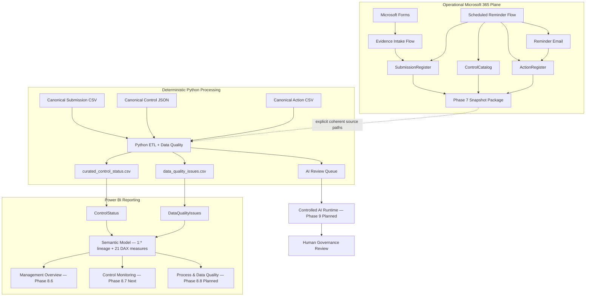

# Cyber Governance Automation Lab

**Security Control Evidence, Follow-up & Reporting Automation**

[](https://github.com/gw-ai-security/cyber-governance-automation-lab/actions/workflows/tests.yml)

A portfolio proof of concept for a recurring cybersecurity-governance evidence process. The project combines explicit governance modeling, Microsoft Forms and Power Automate workflows, deterministic Python Data Quality processing, reminder/action tracking, a controlled reporting-snapshot bridge, a source-controlled Power BI project, automated regression tests, and a minimized AI-review queue.

The project is intentionally small and explicit. It demonstrates how operational automation, deterministic data processing, semantic reporting, and later AI-assisted review can be connected without conflating evidence, compliance, timeliness, workflow state, or Data Quality, and without presenting a proof of concept as a production platform.

## What This Project Demonstrates

- **Governance modeling** — Control, Submission, Action, and Data Quality Issue remain separate domain concepts.
- **Expected-state design** — expected Submissions exist before evidence arrives, making missing submissions observable.
- **Controlled evidence intake** — authenticated Forms intake resolves an expected Submission and permits only `Not Submitted → In Review`.
- **Fail-safe workflow behavior** — ambiguous business keys, invalid states, missing/duplicate Controls, and duplicate active Actions are surfaced rather than guessed or silently repaired.
- **Scheduled follow-up** — overdue missing Submissions create or reuse an Action, send reminders, and persist reminder history with same-day idempotency.
- **Deterministic Data Quality** — DQ-001 through DQ-010 validate Submission data without silent semantic correction.
- **Controlled reporting bridge** — live Microsoft 365 state is exported as a private snapshot package and processed through the same Python semantics as the canonical fixtures.
- **Source-controlled Power BI** — PBIP, PBIR, and TMDL definitions are versioned while machine-local cache/state remains excluded.
- **Curated reporting boundary** — Power BI loads only Python-owned curated reporting outputs and does not reimplement upstream business rules.
- **Explicit semantic modeling** — Data Quality Issues relate to Submission-grain reporting through raw-row lineage rather than unreliable business identifiers.
- **Contracted KPI layer** — 21 version-controlled DAX measures implement governance, compliance, timeliness, Data Quality, and reminder/process semantics without collapsing them into an invented overall status.
- **Management reporting** — the source-controlled Management Overview provides three slicers, six governance KPI cards, and three analytical views against the canonical semantic model.
- **Controlled AI boundary** — only Data-Quality-valid Non-Compliant or overdue Submissions enter the minimized AI review queue; final compliance authority remains human.
- **Reproducible engineering** — GitHub Actions executes the Python regression suite on pushes and pull requests targeting `main`.

## Current Engineering Evidence

| Evidence | Current state |
| --- | ---: |
| Security Controls | 5 |
| Canonical synthetic Submissions | 15 |
| Canonical raw Actions | 5 |
| Explicit Submission DQ rules | 10 |
| Automated tests | **53 passing** |
| Canonical DQ findings | 5 |
| Canonical Valid / Invalid Submissions | 10 / 5 |
| Canonical raw / curated Submission rows | 15 / 15 |
| Canonical AI review queue items | 2 |
| Phase 5 evidence-intake workflow | ✅ Implemented and acceptance-tested |
| Phase 6 reminder workflow | ✅ Implemented and acceptance-tested |
| Phase 7 reporting snapshot bridge | ✅ Implemented and end-to-end accepted |
| Phase 8.0 Power BI reporting/KPI contract | ✅ Complete |
| Phase 8.1 canonical reporting baseline | ✅ Complete and CI-verified |
| Phase 8.2 PBIP/PBIR/TMDL project scaffold | ✅ Complete |
| Phase 8.3 curated Power BI source loading | ✅ Complete |
| Phase 8.4 semantic-model relationship | ✅ Complete |
| Phase 8.5 governance/DQ/process measures | ✅ Complete and CI-verified |
| Phase 8.6 Management Overview | ✅ Complete, smoke-tested and CI-verified |
| Continuous Integration | ✅ GitHub Actions |
| Required CI merge gate | ⚠ Not currently enforced |

Canonical deterministic acceptance uses:

```text
as_of_date = 2026-08-15
```

and produces:

```text
Controls loaded: 5
Submissions loaded: 15
Actions loaded: 5
DQ issues: 5
Valid submissions: 10
Invalid submissions: 5
AI review queue items: 2
```

Phase 8.3 loads the two canonical curated reporting outputs into Power BI as:

```text
ControlStatus       = 15 rows / 25 columns
DataQualityIssues   = 5 rows / 8 columns
```

Phase 8.4 adds the single active `1:*` relationship from `ControlStatus[source_row_number]` to `DataQualityIssues[source_row_number]`. Phase 8.5 adds the 21 contracted DAX measures. Phase 8.6 implements the first report page, **Management Overview**. Phase 8.7 is the next work package and builds **Control Monitoring**.

## Current Architecture



The Phase 7 bridge is caller-controlled rather than automatically synchronized. Power Automate creates private source snapshots; Python processes either canonical defaults or one explicit complete operational source set. Power BI then consumes only the two curated reporting outputs.

## Implementation Status

| Phase | Scope | Status |
| --- | --- | --- |
| Phase 0 | Repository & Project Foundation | ✅ Complete |
| Phase 1 | Business Process & Data Model | ✅ Complete |
| Phase 2 | Canonical Synthetic Dataset | ✅ Complete |
| Phase 3 | Deterministic Python Data Quality Pipeline | ✅ Complete |
| Phase 4 | Test Hardening & Acceptance | ✅ Complete |
| Phase 5 | Power Automate Evidence Intake | ✅ Core DoD complete |
| Phase 6 | Scheduled Reminder Automation | ✅ Complete and acceptance-tested |
| Phase 7.0 | Reporting Export Contract | ✅ Complete |
| Phase 7.1 | Reporting Export Implementation Preparation | ✅ Complete |
| Phase 7.2 | Power Automate Reporting Snapshot | ✅ Complete and acceptance-tested |
| Phase 7.3 | Python External Input Boundary | ✅ Complete and automated-tested |
| Phase 7 WP3 | Private snapshot → Python end-to-end acceptance | ✅ Complete |
| **Phase 7** | **Reporting Snapshot Bridge** | **✅ Complete** |
| Phase 8.0 | Power BI Reporting & KPI Contract | ✅ Complete |
| Phase 8.1 | Canonical Curated Reporting Baseline | ✅ Complete and CI-verified |
| Phase 8.2 | PBIP/PBIR/TMDL Power BI Project Scaffold | ✅ Complete |
| Phase 8.3 | Curated CSV Loading and Technical Typing | ✅ Complete |
| Phase 8.4 | Semantic Model Relationship | ✅ Complete |
| Phase 8.5 | Governance, DQ and Process Measures | ✅ Complete and CI-verified |
| Phase 8.6 | Management Overview | ✅ Complete, smoke-tested and CI-verified |
| Phase 8 consistency review | Cross-phase semantic/documentation hardening | ◐ Review PR in progress |
| Phase 8.7 | Control Monitoring | ○ Next |
| Phase 8.8 | Process & Data Quality | ○ Planned |
| Phase 8.9 | Canonical Power BI Acceptance | ○ Planned |
| Phase 8.10 | Operational Phase 7 Output Acceptance | ○ Planned |
| Phase 8.11 | Documentation, Screenshots, Regression & Final Acceptance | ○ Planned |
| **Phase 8** | **Power BI Dashboard** | **◐ In progress — Management Overview complete; Control Monitoring next** |
| Phase 9 | Controlled AI Workflow | ○ Planned |
| Phase 10 | REST API | ○ Planned |
| Phase 11 | Documentation & Handover | ○ Planned |

### Phase 5 roadmap delta

The original roadmap illustrated a custom confirmation e-mail after successful evidence intake. That action is **not implemented**. Phase 6 reminder e-mails are a separate capability and do not retroactively close that Phase 5 delta.

## Core Domain Model

```text
CONTROL
   │ 1:n
   ▼
SUBMISSION
   ├──────────────► ACTION
   └──────────────► DATA QUALITY ISSUE
```

Submission technical key:

```text
submission_id
```

Submission business key:

```text
control_id + reporting_period
```

Critical semantic separations:

```text
Evidence Present != Compliant
Not Submitted != Non-Compliant
Non-Compliant != Overdue
Compliance != Timeliness
Compliance != Data Quality
Submission Status != Action Status
Unknown != False
Not Evaluated != Failed
Action completion != Submission compliance
Control risk != DQ severity
```

## Phase 5 — Evidence Intake

Implemented path:

```text
Microsoft Forms
      ↓
Read expected SubmissionRegister
      ↓
Resolve control_id + reporting_period
      ↓
Require exactly one match
      ↓
Require status = Not Submitted
      ↓
Update existing row by submission_id
      ↓
status = In Review
```

The workflow performs **UPDATE, not APPEND** and never assigns `Compliant` or `Non-Compliant`.

Controlled outcomes:

```text
NO_MATCH
DUPLICATE_BUSINESS_KEY
INVALID_SUBMISSION_STATE
```

## Phase 6 — Scheduled Reminder Automation

Schedule:

```text
Daily 08:00
W. Europe Standard Time
```

Canonical overdue rule:

```text
submitted_at IS NULL
AND
as_of_date > due_date
```

The live workflow additionally requires `status = Not Submitted` as an operational consistency guard.

Active Action resolution:

```text
0 active Actions  → CREATE
1 active Action   → REUSE
>1 active Actions → DUPLICATE_ACTIVE_ACTION
```

Same-day behavior:

```text
last_reminder_at == today
→ SAME_DAY_REMINDER_SKIPPED
```

Reminder history is persisted on Action through `reminder_count` and `last_reminder_at`.

Known lifecycle limitation: the current PoC does **not** automatically complete an existing missing-submission Action when later Phase 5 evidence moves the Submission to `In Review`.

## Phase 7 — Reporting Snapshot Bridge

A successful private snapshot package contains:

```text
security_control_snapshot_<snapshot_id>.json
security_submission_snapshot_<snapshot_id>.csv
security_action_snapshot_<snapshot_id>.csv
security_snapshot_manifest_<snapshot_id>.json
```

The manifest is written last and acts as the completion marker.

Python external source overrides are all-or-none:

```text
--controls-path
--submissions-path
--actions-path
```

`--output-directory` is independent. The manifest is not automatically parsed; its `as_of_date` is supplied explicitly through `--as-of-date`.

Accepted private operational snapshot observation:

```text
as_of_date: 2026-08-23
Controls loaded: 5
Submissions loaded: 17
Actions loaded: 2
DQ issues: 5
Valid submissions: 12
Invalid submissions: 5
AI review queue items: 3
```

Those operational counts are acceptance observations, not new canonical repository fixtures.

## Phase 8 — Power BI Dashboard

Phase 8 preserves a strict reporting-consumer boundary.

Power BI consumes exactly:

```text
curated_control_status.csv
data_quality_issues.csv
```

It does **not** directly load the operational workbook, raw Phase 7 snapshots, canonical raw files, or `ai_review_queue.json`.

### Phase 8.3 — Curated loading

The source-controlled semantic model contains:

```text
DataRoot
ControlStatus
DataQualityIssues
```

`DataRoot` is a required text parameter used by both Power Query partitions. The two queries perform only technical ingestion:

```text
CSV load
→ promote headers
→ blank string to null
→ technical type assignment
```

Canonical Power BI load acceptance:

```text
ControlStatus       = 15 rows / 25 columns
DataQualityIssues   = 5 rows / 8 columns
Model tables        = exactly 2
```

Automatic time intelligence is disabled.

### Phase 8.4 — Semantic relationship

The model contains exactly one relationship:

```text
ControlStatus[source_row_number]
          1
          │
          *
DataQualityIssues[source_row_number]
```

Its behavior is:

```text
Cardinality      = one-to-many
Filter direction = ControlStatus → DataQualityIssues
Status           = active
```

The relationship is deliberately not built on `submission_id`, because duplicate or missing Submission identifiers are valid Data Quality scenarios. Both `source_row_number` fields remain in the semantic model but are hidden from report consumers.

### Phase 8.5 — Semantic measures

The model contains exactly 21 contracted DAX measures:

```text
ControlStatus       16 measures
DataQualityIssues    5 measures
-------------------------------
Total               21 measures
```

They cover governance/compliance, timeliness/exceptions, reminder/process impact, and Data Quality. DQ-invalid Submission rows remain in `Expected Submissions`; compliance rates use DQ-valid assessed records; timeliness measures use DQ-valid records; DQ-affected Submissions use `source_row_number`, not the potentially missing or duplicate `submission_id`.

Aggregate count/sum measures use explicit zero-result semantics, while rates and averages remain blank when their denominator is zero. This distinguishes a known `0` from a not-evaluable ratio without changing nullable source-state semantics.

Canonical semantic targets include:

```text
Controls in Scope                           5
Expected Submissions                       15
Assessed Compliance Rate                80.0%
Overdue Submissions                         1
Late Submissions                            1
High/Critical Exceptions                    2
Overdue Submission Rate                 10.0%
Total DQ Issues                             5
DQ Issue Rate                            33.3%
Total Automated Reminders                   4
Active Follow-up Submissions                4
Average Reminders per Reminded Submission 1.00
```

### Phase 8.6 — Management Overview

The first source-controlled report page is complete.

It contains:

```text
1 title
3 slicers
6 KPI cards
3 analytical charts
-------------------
13 visuals
```

Primary slicers:

```text
Business Unit
Risk Level
Reporting Period
```

KPI cards:

```text
Controls in Scope
Assessed Compliance Rate
Non-Compliant Submissions
Overdue Submissions
High/Critical Exceptions
Total DQ Issues
```

Analytical views:

```text
Submission Status Distribution
Assessed Compliance Rate by Business Unit
High/Critical Exceptions by Risk Level
```

Canonical smoke-test values remain:

```text
5 / 80.0% / 1 / 1 / 2 / 5
```

Formal complete Power BI runtime acceptance remains Phase 8.9.

## Python Pipeline

```text
EXTRACT
   ↓
NORMALIZE
   ↓
VALIDATE
   ↓
TRANSFORM / ENRICH
   ↓
DERIVE
   ↓
LOAD
```

Submission remains the primary reporting grain. Control enrichment uses a `LEFT JOIN`; invalid rows remain visible; Action aggregation does not multiply Submission rows.

Derived reporting fields include:

```text
evidence_present
overdue_flag
submission_late
days_overdue
days_late
data_quality_status
active_action_id
active_action_status
active_action_due_date
reminder_count
last_reminder_at
```

## Data Quality

The Submission rule catalog remains exactly DQ-001 through DQ-010:

| Rule | Name | Severity |
| --- | --- | --- |
| DQ-001 | Missing Required Field | High |
| DQ-002 | Unknown Control ID | High |
| DQ-003 | Invalid Status | High |
| DQ-004 | Missing Evidence | High |
| DQ-005 | Duplicate Submission | High |
| DQ-006 | Invalid Reporting Period | Medium |
| DQ-007 | Invalid Due Date | High |
| DQ-008 | Invalid Submission State | High |
| DQ-009 | Invalid Evidence State | Medium |
| DQ-010 | Invalid Submitter Email | Medium |

Operational workflow outcomes such as `DUPLICATE_ACTIVE_ACTION` are not additional DQ rule IDs.

## Controlled AI Review Queue

Eligibility remains:

```text
data_quality_status = Valid
AND
(
    submission_status = Non-Compliant
    OR
    overdue_flag = True
)
```

For canonical `as_of_date = 2026-08-15`:

```text
SUB-005
SUB-014
```

AI remains downstream of deterministic validation and does not hold final compliance authority.

## Tech Stack

| Technology | Role |
| --- | --- |
| Microsoft Forms | Authenticated evidence intake |
| Power Automate | Evidence intake, scheduled reminders, reporting snapshot orchestration |
| Excel Online / OneDrive | Operational Control, Submission, Action state and private snapshots |
| Office 365 Outlook | Reminder and flow-failure notifications |
| Python 3.14.5 | Deterministic data pipeline |
| pandas | Transformation and enrichment |
| pytest | Automated testing |
| CSV / JSON | Canonical and snapshot data contracts |
| Power BI Desktop | Phase 8 report authoring and local project validation |
| Power Query | Technical curated-source loading and typing |
| DAX | Contracted governance, compliance, timeliness, DQ, and process measures |
| PBIP / PBIR / TMDL | Source-controlled Power BI project, report, and semantic-model definitions |
| GitHub Actions | Continuous Integration |
| Git / GitHub | Version control and review workflow |

`requests`, `FastAPI`, and `uvicorn` are present in `requirements.txt` for later integration/API phases; their presence does not mean Phase 10 is implemented.

## Running the Pipeline

Canonical mode:

```bash
python -m pip install -r requirements.txt
python -m pytest -q
python src/main.py --as-of-date 2026-08-15
```

Explicit private snapshot mode:

```bash
python src/main.py \
  --as-of-date 2026-08-23 \
  --controls-path "/private/snapshots/security_control_snapshot_<id>.json" \
  --submissions-path "/private/snapshots/security_submission_snapshot_<id>.csv" \
  --actions-path "/private/snapshots/security_action_snapshot_<id>.csv" \
  --output-directory "/private/processed/<id>"
```

The three source overrides must be supplied together. No OneDrive, Graph, manifest-discovery, or automatic latest-snapshot integration is implemented.

## Repository Guide

| Document | Purpose |
| --- | --- |
| [docs/architecture.md](docs/architecture.md) | Current architecture and responsibility boundaries |
| [docs/business_process.md](docs/business_process.md) | Current governance process and implementation-aware lifecycle semantics |
| [docs/data_model.md](docs/data_model.md) | Logical domain model |
| [docs/data_contract.md](docs/data_contract.md) | Canonical and operational physical data boundaries |
| [docs/data_quality.md](docs/data_quality.md) | DQ-001 through DQ-010 |
| [docs/phase2_dataset_coverage.md](docs/phase2_dataset_coverage.md) | Canonical synthetic scenario coverage |
| [docs/phase3_pipeline_contract.md](docs/phase3_pipeline_contract.md) | Deterministic Python pipeline contract |
| [docs/phase4_test_acceptance.md](docs/phase4_test_acceptance.md) | Historical Phase 4 regression acceptance |
| [docs/phase5_evidence_intake.md](docs/phase5_evidence_intake.md) | Phase 5 workflow and acceptance |
| [docs/phase6_reminder_automation.md](docs/phase6_reminder_automation.md) | Phase 6 workflow and acceptance |
| [docs/phase7_reporting_export.md](docs/phase7_reporting_export.md) | Final Phase 7 reporting bridge contract |
| [docs/phase7_power_automate_acceptance.md](docs/phase7_power_automate_acceptance.md) | Phase 7.2 runtime acceptance |
| [docs/phase7_python_external_input.md](docs/phase7_python_external_input.md) | Phase 7.3 CLI/input-boundary acceptance |
| [docs/phase7_end_to_end_acceptance.md](docs/phase7_end_to_end_acceptance.md) | Final Phase 7 WP3 acceptance and regression proof |
| [docs/phase8_power_bi_contract.md](docs/phase8_power_bi_contract.md) | Phase 8.0 reporting, semantic-model, KPI, page, and acceptance contract |
| [docs/phase8_canonical_baseline.md](docs/phase8_canonical_baseline.md) | Phase 8.1 deterministic canonical reporting baseline and acceptance values |
| [docs/phase8_power_bi_project.md](docs/phase8_power_bi_project.md) | Phase 8.2 PBIP/PBIR/TMDL project scaffold and Git boundary |
| [docs/phase8_curated_loading.md](docs/phase8_curated_loading.md) | Phase 8.3 curated CSV loading, typing, null semantics, and model-state acceptance |
| [docs/phase8_semantic_model.md](docs/phase8_semantic_model.md) | Phase 8.4 lineage relationship, cardinality, filter direction, and hidden technical keys |
| [docs/phase8_measures.md](docs/phase8_measures.md) | Phase 8.5 DAX measure semantics, formatting, canonical targets, and scope boundaries |
| [docs/phase8_management_overview.md](docs/phase8_management_overview.md) | Phase 8.6 Management Overview implementation and runtime smoke-test evidence |
| [docs/phase8_consistency_review.md](docs/phase8_consistency_review.md) | Cross-phase consistency review and pre-8.7 semantic hardening |
| [docs/repository_conventions.md](docs/repository_conventions.md) | Documentation and naming conventions |

## Security and Governance Boundaries

- canonical repository identities are synthetic,
- the operational workbook and operational snapshot packages remain private,
- actual evidence files are not stored in this repository,
- reachable acceptance-test recipients are not published,
- tenant identifiers, connection identifiers, credentials, tokens, and private deployment ZIPs are not committed,
- public Power Automate source is sanitized and uses deployment placeholders,
- generated `data/curated/` outputs remain outside Git,
- Power BI local settings/cache remain outside Git,
- Phase 8 TMDL contains source/query/model/measure definitions but no embedded reporting rows,
- evidence intake cannot assign compliance,
- reminder automation cannot assign compliance,
- reporting export cannot repair or reinterpret source state,
- Power Query cannot duplicate Python business rules,
- DQ-invalid records remain visible in reporting but do not enter the AI review queue,
- final governance review remains human-controlled.

## Limitations

This repository is a **portfolio proof of concept**, not a production cybersecurity-governance platform.

Current limitations include:

- Excel/OneDrive rather than a transactional production datastore,
- no transactional multi-table snapshot guarantee across the three Excel reads,
- no automatic snapshot discovery, manifest ingestion, or scheduled Python execution,
- no automatic completion of an existing missing-submission Action when later evidence is received,
- no Action-specific DQ rule catalog beyond the existing Phase 6 operational guardrails,
- no automated reporting-period generation,
- no custom Phase 5 confirmation e-mail,
- no production escalation hierarchy or SLA engine,
- no production-grade IAM/RBAC, audit trail, monitoring, or telemetry datastore,
- Power BI Management Overview is implemented, but Control Monitoring, Process & Data Quality, and formal Phase 8 runtime acceptance remain incomplete,
- `DataRoot` must be configured for the local clone or target processed-output directory,
- no external AI model invocation,
- no REST API implementation,
- no enforced required CI status check before merge.

For production, Dataverse, SharePoint Lists, or a relational database would generally be preferable where stronger concurrency, governance, auditability, consistency, and scale are required.

## Source of Truth

Historical phase-specific documents remain valid for the phase they describe. Current-state foundation documents, implementation code, canonical datasets, automated tests, and final acceptance evidence define the present project state. Later phases must not rewrite historical acceptance fixtures or historical test counts merely to make them resemble later operational state.
