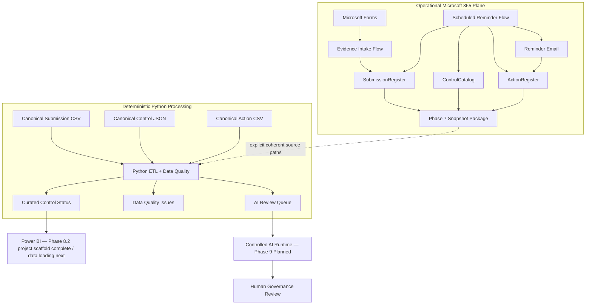

# Cyber Governance Automation Lab

**Security Control Evidence, Follow-up & Reporting Automation**

[](https://github.com/gw-ai-security/cyber-governance-automation-lab/actions/workflows/tests.yml)

A portfolio proof of concept for a recurring cybersecurity-governance evidence process. The project combines explicit governance modeling, Microsoft Forms and Power Automate workflows, a deterministic Python Data Quality pipeline, operational reminder tracking, a controlled reporting-snapshot bridge, automated tests, and a minimized AI-review queue.

The project is intentionally small and explicit. It demonstrates how operational automation and deterministic data processing can be connected without conflating evidence, compliance, timeliness, workflow state, or Data Quality, and without presenting a proof of concept as a production platform.

## What This Project Demonstrates

- **Governance modeling** — Control, Submission, Action, and Data Quality Issue remain separate domain concepts.
- **Expected-state design** — expected Submissions exist before evidence arrives, making missing submissions observable.
- **Controlled evidence intake** — authenticated Forms intake resolves an expected Submission and permits only `Not Submitted → In Review`.
- **Fail-safe workflow behavior** — ambiguous business keys, invalid states, missing/duplicate Controls, and duplicate active Actions are surfaced rather than guessed or silently repaired.
- **Scheduled follow-up** — overdue missing Submissions create or reuse an Action, send reminders, and persist reminder history with same-day idempotency.
- **Deterministic Data Quality** — DQ-001 through DQ-010 validate Submission data without silent semantic correction.
- **Controlled reporting boundary** — live Microsoft 365 Control, Submission, and Action state is exported as a private four-file snapshot package and processed through the existing Python semantics via explicit paths.
- **Deterministic regression baseline** — canonical repository fixtures remain unchanged while operational snapshots evolve independently.
- **Source-controlled Power BI foundation** — the dashboard is stored as PBIP with PBIR report metadata and a TMDL semantic-model scaffold before data/model logic is added.
- **Controlled AI boundary** — only Data-Quality-valid Non-Compliant or overdue Submissions enter the minimized AI review queue; final compliance authority remains human.
- **Reproducible engineering** — GitHub Actions executes the Python regression suite on pushes and pull requests targeting `main`.

## Current Engineering Evidence

| Evidence | Current state |
| --- | ---: |
| Security Controls | 5 |
| Canonical synthetic Submissions | 15 |
| Canonical raw Actions | 5 |
| Explicit Submission DQ rules | 10 |
| Automated tests | **53 passing** |
| Canonical DQ findings | 5 |
| Canonical Valid / Invalid Submissions | 10 / 5 |
| Canonical raw / curated Submission rows | 15 / 15 |
| Canonical AI review queue items | 2 |
| Phase 5 evidence-intake workflow | ✅ Implemented and acceptance-tested |
| Phase 6 reminder workflow | ✅ Implemented and acceptance-tested |
| Phase 7 reporting snapshot bridge | ✅ Implemented and end-to-end accepted |
| Phase 8.0 Power BI reporting/KPI contract | ✅ Complete |
| Phase 8.1 canonical reporting baseline | ✅ Complete and CI-verified |
| Phase 8.2 PBIP/PBIR/TMDL project scaffold | ✅ Complete |
| Continuous Integration | ✅ GitHub Actions |
| Required CI merge gate | ⚠ Not currently enforced |

Canonical deterministic acceptance uses:

```text
as_of_date = 2026-08-15
```

and produces:

```text
Controls loaded: 5
Submissions loaded: 15
Actions loaded: 5
DQ issues: 5
Valid submissions: 10
Invalid submissions: 5
AI review queue items: 2
```

Phase 7 additionally processed a private operational snapshot with its manifest date `2026-08-23` and observed:

```text
Controls loaded: 5
Submissions loaded: 17
Actions loaded: 2
DQ issues: 5
Valid submissions: 12
Invalid submissions: 5
AI review queue items: 3
```

Those operational counts are acceptance observations, **not new canonical repository fixtures**.

## Current Architecture

The project deliberately maintains two data planes connected by an explicit Phase 7 bridge.

### Operational Microsoft 365 plane

```text
Microsoft Forms
      ↓
Power Automate Evidence Intake
      ↓
Excel Online / OneDrive
      ├─ SubmissionRegister
      ├─ ControlCatalog
      └─ ActionRegister
      ↑
Scheduled Reminder Flow
      ↓
Reminder Email

ControlCatalog + SubmissionRegister + ActionRegister
      ↓
Weekly Reporting Snapshot Flow
      ↓
Private snapshot package
```

### Deterministic Python/repository plane

```text
Canonical defaults                       Explicit operational snapshot
------------------                       -----------------------------
data/reference/control_catalog.json      security_control_snapshot_*.json
data/raw/evidence_submissions.csv   OR   security_submission_snapshot_*.csv
data/raw/actions.csv                      security_action_snapshot_*.csv
                    \                     /
                     \                   /
                      Python ETL + DQ
                            ↓
                  curated_control_status.csv
                  data_quality_issues.csv
                  ai_review_queue.json
```

The bridge is **caller-controlled, not automatically synchronized**. Power Automate creates private source snapshots; Python processes either all canonical defaults or one complete explicit Control/Submission/Action source set. Phase 7 does not copy operational files over canonical repository data.



See [Architecture](docs/architecture.md), [Phase 7 End-to-End Acceptance](docs/phase7_end_to_end_acceptance.md), [Phase 8.0 Power BI Contract](docs/phase8_power_bi_contract.md), [Phase 8.1 Canonical Baseline](docs/phase8_canonical_baseline.md), and [Phase 8.2 Power BI Project Scaffold](docs/phase8_power_bi_project.md).

## Implementation Status

| Phase | Scope | Status |
| --- | --- | --- |
| Phase 0 | Repository & Project Foundation | ✅ Complete |
| Phase 1 | Business Process & Data Model | ✅ Complete |
| Phase 2 | Canonical Synthetic Dataset | ✅ Complete |
| Phase 3 | Deterministic Python Data Quality Pipeline | ✅ Complete |
| Phase 4 | Test Hardening & Acceptance | ✅ Complete |
| Phase 5 | Power Automate Evidence Intake | ✅ Core DoD complete |
| Phase 6 | Scheduled Reminder Automation | ✅ Complete and acceptance-tested |
| Phase 7.0 | Reporting Export Contract | ✅ Complete |
| Phase 7.1 | Reporting Export Implementation Preparation | ✅ Complete |
| Phase 7.2 | Power Automate Reporting Snapshot | ✅ Complete and acceptance-tested |
| Phase 7.3 | Python External Input Boundary | ✅ Complete and automated-tested |
| Phase 7 WP3 | Private snapshot → Python end-to-end acceptance | ✅ Complete |
| **Phase 7** | **Reporting Snapshot Bridge** | **✅ Complete** |
| Phase 8.0 | Power BI Reporting & KPI Contract | ✅ Complete |
| Phase 8.1 | Canonical Curated Reporting Baseline | ✅ Complete and CI-verified |
| Phase 8.2 | PBIP/PBIR/TMDL Power BI Project Scaffold | ✅ Complete |
| **Phase 8** | **Power BI Dashboard** | **◐ In progress — project scaffold complete; data loading next** |
| Phase 9 | Controlled AI Workflow | ○ Planned |
| Phase 10 | REST API | ○ Planned |
| Phase 11 | Documentation & Handover | ○ Planned |

### Phase 5 roadmap delta

The original roadmap illustrated a custom confirmation e-mail after successful evidence intake. That action is **not implemented**. Phase 6 reminder e-mails are a separate capability and do not retroactively close that Phase 5 delta.

## Core Domain Model

The logical model contains exactly four core entities:

```text
CONTROL
   │ 1:n
   ▼
SUBMISSION
   ├──────────────► ACTION
   └──────────────► DATA QUALITY ISSUE
```

Submission technical key:

```text
submission_id
```

Submission business key:

```text
control_id + reporting_period
```

Critical semantic separations:

```text
Evidence Present != Compliant
Not Submitted != Non-Compliant
Non-Compliant != Overdue
Compliance != Timeliness
Compliance != Data Quality
Submission Status != Action Status
Unknown != False
Not Evaluated != Failed
Action completion != Submission compliance
```

## Phase 5 — Evidence Intake

Implemented path:

```text
Microsoft Forms
      ↓
Read expected SubmissionRegister
      ↓
Resolve control_id + reporting_period
      ↓
Require exactly one match
      ↓
Require status = Not Submitted
      ↓
Update existing row by submission_id
      ↓
status = In Review
```

The workflow performs **UPDATE, not APPEND** and never assigns `Compliant` or `Non-Compliant`.

Controlled outcomes:

```text
NO_MATCH
DUPLICATE_BUSINESS_KEY
INVALID_SUBMISSION_STATE
```

See [Phase 5 Evidence Intake](docs/phase5_evidence_intake.md).

## Phase 6 — Scheduled Reminder Automation

Schedule:

```text
Daily 08:00
W. Europe Standard Time
```

Canonical overdue rule:

```text
submitted_at IS NULL
AND
as_of_date > due_date
```

The live workflow additionally requires `status = Not Submitted` as an operational consistency guard.

Action resolution:

```text
0 active Actions  → CREATE
1 active Action   → REUSE
>1 active Actions → DUPLICATE_ACTIVE_ACTION
```

Control resolution:

```text
0 Control matches  → CONTROL_NOT_FOUND
1 Control match    → resolve owner
>1 Control matches → DUPLICATE_CONTROL
```

Same-day behavior:

```text
last_reminder_at == today
→ SAME_DAY_REMINDER_SKIPPED
```

Reminder history is persisted on Action via `reminder_count` and `last_reminder_at`.

Known lifecycle limitation: the current PoC does **not** automatically complete an existing missing-submission Action when later Phase 5 evidence moves the Submission to `In Review`. Phase 7 exports the stored state as-is rather than repairing it.

See [Phase 6 Reminder Automation](docs/phase6_reminder_automation.md).

## Phase 7 — Reporting Snapshot Bridge

Phase 7 connects live Microsoft 365 state to the existing Python reporting pipeline without overwriting deterministic fixtures.

Every successful Power Automate snapshot package contains:

```text
security_control_snapshot_<snapshot_id>.json
security_submission_snapshot_<snapshot_id>.csv
security_action_snapshot_<snapshot_id>.csv
security_snapshot_manifest_<snapshot_id>.json
```

All four artifacts share one `snapshot_id`. The manifest is written last and acts as the completion marker.

Critical responsibility boundary:

```text
Power Automate exports source facts.
Python owns Data Quality, Control enrichment, Action aggregation, and derived metrics.
```

Python external source overrides are all-or-none:

```text
--controls-path
--submissions-path
--actions-path
```

`--output-directory` is independent. The manifest is not automatically parsed; its `as_of_date` is supplied explicitly through `--as-of-date`.

Phase 7 end-to-end acceptance proved:

- manifest source counts `5 / 17 / 2` matched Python load counts exactly,
- 5 operational DQ findings remained non-fatal outputs,
- 17 operational Submissions remained 17 curated rows,
- `reminder_count` and `last_reminder_at` crossed the bridge for the Phase 6 reminder fixtures,
- the operational AI queue contained the three expected valid exceptions for the snapshot date,
- the canonical `2026-08-15` regression remained exactly `5 / 15 / 5 / 5 / 10 / 5 / 2`,
- the complete suite remained **53 passing tests**,
- canonical fixtures remained unchanged.

See:

- [Phase 7 Reporting Export Contract](docs/phase7_reporting_export.md)
- [Phase 7.2 Power Automate Acceptance](docs/phase7_power_automate_acceptance.md)
- [Phase 7.3 Python External Input](docs/phase7_python_external_input.md)
- [Phase 7 End-to-End Acceptance](docs/phase7_end_to_end_acceptance.md)

## Phase 8 — Power BI Dashboard

Phase 8.0 froze the reporting and KPI semantics before report implementation. Phase 8.1 fixed the deterministic canonical reporting baseline. Phase 8.2 created the version-controlled Power BI project scaffold using PBIP, PBIR, and TMDL.

The current source-controlled artifact is:

```text
powerbi/CyberGovernanceDashboard/
├── CyberGovernanceDashboard.pbip
├── CyberGovernanceDashboard.Report/
└── CyberGovernanceDashboard.SemanticModel/
```

The PBIR report references the semantic model by repository-relative path. The semantic model is stored as TMDL and currently contains only initial model/culture metadata. Local Power BI settings and model cache remain ignored; source-control-safe editor settings remain versioned.

Power BI will consume exactly:

```text
curated_control_status.csv
data_quality_issues.csv
```

Those data sources are **not loaded in Phase 8.2**. Their ingestion and technical typing begin in Phase 8.3.

Submission remains the primary reporting grain. Data Quality Issues relate back to raw Submission lineage through:

```text
ControlStatus[source_row_number]
          1
          │
          *
DataQualityIssues[source_row_number]
```

The relationship is deliberately not based on `submission_id`, because missing or duplicate Submission identifiers are Data Quality scenarios. Power Query is restricted to technical loading and typing; Python remains the owner of DQ, Control enrichment, Action aggregation, and derived metrics.

The Phase 8 contract fixes the business definitions for governance, timeliness, Data Quality, and reminder/process-impact KPIs and defines three target report pages:

```text
Management Overview
Control Monitoring
Process & Data Quality
```

At the Phase 8.2 boundary, no curated data queries, semantic-model relationship, DAX measures, or final report visuals are claimed as implemented.

See:

- [Phase 8.0 Power BI Reporting and KPI Contract](docs/phase8_power_bi_contract.md)
- [Phase 8.1 Canonical Curated Reporting Baseline](docs/phase8_canonical_baseline.md)
- [Phase 8.2 Power BI Project Scaffold](docs/phase8_power_bi_project.md)

## Python Pipeline

The deterministic processing stages remain:

```text
EXTRACT
   ↓
NORMALIZE
   ↓
VALIDATE
   ↓
TRANSFORM / ENRICH
   ↓
DERIVE
   ↓
LOAD
```

Submission is the primary grain. Control enrichment uses a `LEFT JOIN`; invalid rows remain visible; Action aggregation does not multiply Submission rows.

Derived reporting fields include:

```text
evidence_present
overdue_flag
submission_late
days_overdue
days_late
data_quality_status
active_action_id
active_action_status
active_action_due_date
reminder_count
last_reminder_at
```

## Data Quality

The Submission rule catalog remains exactly DQ-001 through DQ-010:

| Rule | Name | Severity |
| --- | --- | --- |
| DQ-001 | Missing Required Field | High |
| DQ-002 | Unknown Control ID | High |
| DQ-003 | Invalid Status | High |
| DQ-004 | Missing Evidence | High |
| DQ-005 | Duplicate Submission | High |
| DQ-006 | Invalid Reporting Period | Medium |
| DQ-007 | Invalid Due Date | High |
| DQ-008 | Invalid Submission State | High |
| DQ-009 | Invalid Evidence State | Medium |
| DQ-010 | Invalid Submitter Email | Medium |

Operational workflow outcomes such as `DUPLICATE_ACTIVE_ACTION` are not additional DQ rule IDs. Phase 7 adds no new business rules.

## Controlled AI Review Queue

Eligibility remains:

```text
data_quality_status = Valid
AND
(
    submission_status = Non-Compliant
    OR
    overdue_flag = True
)
```

For canonical `as_of_date = 2026-08-15`:

```text
SUB-005
SUB-014
```

For the accepted private operational snapshot at `as_of_date = 2026-08-23`, the queue contained three valid exceptions. AI remains downstream of deterministic validation and does not hold final compliance authority.

## Tech Stack

| Technology | Role |
| --- | --- |
| Microsoft Forms | Authenticated evidence intake |
| Power Automate | Evidence intake, scheduled reminders, reporting snapshot orchestration |
| Excel Online / OneDrive | Operational Control, Submission, Action state and private snapshots |
| Office 365 Outlook | Reminder and flow-failure notifications |
| Python 3.14.5 | Deterministic data pipeline |
| pandas | Transformation and enrichment |
| pytest | Automated testing |
| CSV / JSON | Canonical and snapshot data contracts |
| Power BI Desktop | Phase 8 report authoring and local project validation |
| PBIP / PBIR / TMDL | Source-controlled Power BI project, report, and semantic-model definitions |
| GitHub Actions | Continuous Integration |
| Git / GitHub | Version control and review workflow |

`requests`, `FastAPI`, and `uvicorn` are present in `requirements.txt` for later integration/API phases; their presence does not mean Phase 10 is implemented.

## Running the Pipeline

Install and validate:

```bash
python -m pip install -r requirements.txt
python -m pytest -q
python src/main.py --as-of-date 2026-08-15
```

Explicit private snapshot mode:

```bash
python src/main.py \
  --as-of-date 2026-08-23 \
  --controls-path "/private/snapshots/security_control_snapshot_<id>.json" \
  --submissions-path "/private/snapshots/security_submission_snapshot_<id>.csv" \
  --actions-path "/private/snapshots/security_action_snapshot_<id>.csv" \
  --output-directory "/private/processed/<id>"
```

The three source overrides must be supplied together. No OneDrive, Graph, manifest-discovery, or automatic latest-snapshot integration is implemented.

## Repository Guide

| Document | Purpose |
| --- | --- |
| [docs/architecture.md](docs/architecture.md) | Current architecture and responsibility boundaries |
| [docs/business_process.md](docs/business_process.md) | Current governance process and implementation-aware lifecycle semantics |
| [docs/data_model.md](docs/data_model.md) | Logical domain model |
| [docs/data_contract.md](docs/data_contract.md) | Canonical and operational physical data boundaries |
| [docs/data_quality.md](docs/data_quality.md) | DQ-001 through DQ-010 |
| [docs/phase2_dataset_coverage.md](docs/phase2_dataset_coverage.md) | Canonical synthetic scenario coverage |
| [docs/phase3_pipeline_contract.md](docs/phase3_pipeline_contract.md) | Deterministic Python pipeline contract |
| [docs/phase4_test_acceptance.md](docs/phase4_test_acceptance.md) | Historical Phase 4 regression acceptance |
| [docs/phase5_evidence_intake.md](docs/phase5_evidence_intake.md) | Phase 5 workflow and acceptance |
| [docs/phase6_reminder_automation.md](docs/phase6_reminder_automation.md) | Phase 6 workflow and acceptance |
| [docs/phase7_reporting_export.md](docs/phase7_reporting_export.md) | Final Phase 7 reporting bridge contract |
| [docs/phase7_power_automate_acceptance.md](docs/phase7_power_automate_acceptance.md) | Phase 7.2 runtime acceptance |
| [docs/phase7_python_external_input.md](docs/phase7_python_external_input.md) | Phase 7.3 CLI/input-boundary acceptance |
| [docs/phase7_end_to_end_acceptance.md](docs/phase7_end_to_end_acceptance.md) | Final Phase 7 WP3 acceptance and regression proof |
| [docs/phase8_power_bi_contract.md](docs/phase8_power_bi_contract.md) | Phase 8.0 reporting, semantic-model, KPI, page, and acceptance contract |
| [docs/phase8_canonical_baseline.md](docs/phase8_canonical_baseline.md) | Phase 8.1 deterministic canonical reporting baseline and acceptance values |
| [docs/phase8_power_bi_project.md](docs/phase8_power_bi_project.md) | Phase 8.2 PBIP/PBIR/TMDL project scaffold and Git boundary |
| [docs/repository_conventions.md](docs/repository_conventions.md) | Documentation and naming conventions |

## Security and Governance Boundaries

- canonical repository identities are synthetic,
- the operational workbook and operational snapshot packages remain private,
- actual evidence files are not stored in this repository,
- reachable acceptance-test recipients are not published,
- tenant identifiers, connection identifiers, credentials, tokens, and private deployment ZIPs are not committed,
- public Power Automate source is sanitized and uses deployment placeholders,
- the Phase 8.2 Power BI scaffold contains no reporting or operational data,
- evidence intake cannot assign compliance,
- reminder automation cannot assign compliance,
- reporting export cannot repair or reinterpret source state,
- DQ-invalid records do not enter the AI review queue,
- final governance review remains human-controlled.

## Limitations

This repository is a **portfolio proof of concept**, not a production cybersecurity-governance platform.

Current limitations include:

- Excel/OneDrive rather than a transactional production datastore,
- no transactional multi-table snapshot guarantee across the three Excel reads,
- no automatic snapshot discovery, manifest ingestion, or scheduled Python execution,
- no automatic completion of an existing missing-submission Action when later evidence is received,
- no Action-specific DQ rule catalog beyond the existing Phase 6 operational guardrails,
- no automated reporting-period generation,
- no custom Phase 5 confirmation e-mail,
- no production escalation hierarchy or SLA engine,
- no production-grade IAM/RBAC, audit trail, monitoring, or telemetry datastore,
- Power BI project scaffold exists, but curated data ingestion, semantic relationship, DAX measures, and final visuals are not implemented yet,
- no external AI model invocation,
- no REST API implementation,
- no enforced required CI status check before merge.

For production, Dataverse, SharePoint Lists, or a relational database would generally be preferable where stronger concurrency, governance, auditability, consistency, and scale are required.

## Source of Truth

Historical phase-specific documents remain valid for the phase they describe. Current-state foundation documents, implementation code, canonical datasets, automated tests, and final acceptance evidence define the present project state. Later phases must not rewrite historical acceptance fixtures or historical test counts merely to make them resemble later operational state.
