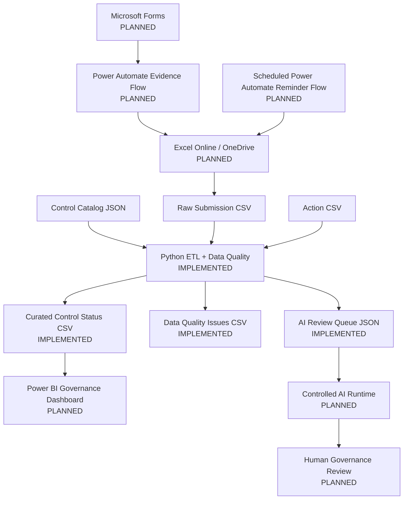

# Cyber Governance Automation Lab

**Security Control Evidence, Follow-up & Reporting Automation**

[](https://github.com/gw-ai-security/cyber-governance-automation-lab/actions/workflows/tests.yml)

A portfolio proof of concept for a recurring cybersecurity governance process. The project models control-evidence submissions, validates their data quality deterministically, derives governance and timeliness metrics, tracks follow-up work, and prepares selected valid exceptions for controlled AI-assisted review.

The project is intentionally small and explicit. Its purpose is to demonstrate business-process understanding, data modeling, automation design, Python data processing, testing, governance controls, and reproducible engineering practices without presenting a proof of concept as a production platform.

## What This Project Demonstrates

- **Cybersecurity governance modeling** — Controls, recurring Submissions, follow-up Actions, reporting periods, deadlines, and human compliance review are modeled as separate business concepts.
- **Deterministic Python data processing** — Raw CSV/JSON inputs are structurally checked, normalized without silent semantic repair, validated, enriched, transformed, and serialized into contractual outputs.
- **Explicit Data Quality controls** — Ten documented DQ rules cover completeness, referential integrity, validity, consistency, and uniqueness.
- **Engineering discipline** — Critical business invariants are regression-tested, CI runs the complete test suite, and `main` is protected by a pull-request and required-check workflow.
- **Controlled AI design** — Only Data-Quality-valid governance exceptions can enter the AI review queue; the payload is minimized and final compliance authority remains human.
- **Incremental end-to-end architecture** — The implemented Python/data layer is designed to connect to Microsoft Forms, Power Automate, Excel/OneDrive, Power BI, and a later controlled AI runtime without claiming those planned components already exist.

## Current Engineering Evidence

| Evidence | Current repository state |
| --- | ---: |
| Security Controls | 5 |
| Synthetic Submissions | 15 |
| Follow-up Actions | 5 |
| Explicit Submission DQ rules | 10 |
| Automated tests | **42 passing in the Phase 4 acceptance baseline** |
| Canonical DQ findings | 5 |
| Valid / invalid Submissions | 10 / 5 |
| Raw / curated Submission rows | 15 / 15 |
| AI review queue items | 2 |
| Contractual pipeline outputs | 3 |
| Continuous Integration | GitHub Actions |
| `main` governance | Protected; pull request + required test check |

The canonical deterministic acceptance run uses:

```text
as_of_date = 2026-08-15
```

and must produce:

```text
Controls loaded: 5
Submissions loaded: 15
Actions loaded: 5
DQ issues: 5
Valid submissions: 10
Invalid submissions: 5
AI review queue items: 2
```

## Architecture

The full target architecture is intentionally broader than the currently implemented scope. The diagram therefore labels planned components explicitly.



The current implemented core is the contract-driven Python and data layer. Microsoft workflow integration, dashboarding, external AI invocation, and the mock REST API are implemented in later phases.

See [docs/architecture.md](docs/architecture.md) for the detailed architecture and workflow semantics.

## Current Implementation Status

| Phase | Scope | Status |
| --- | --- | --- |
| Phase 0 | Repository & Project Foundation | ✅ Complete |
| Phase 1 | Business Process & Data Model | ✅ Complete |
| Phase 2 | Synthetic Dataset | ✅ Complete |
| Phase 3 | Python Data Quality Pipeline | ✅ Complete |
| Phase 4 | Test Hardening & Acceptance | ✅ Complete |
| Repository Governance | GitHub Actions CI + protected `main` | ✅ Active |
| Phase 5 | Power Automate Evidence Flow | ▶ Next |
| Phase 6 | Reminder Automation | ○ Planned |
| Phase 7 | Reporting Export | ○ Planned |
| Phase 8 | Power BI Dashboard | ○ Planned |
| Phase 9 | Controlled AI Workflow | ○ Planned |
| Phase 10 | REST API | ○ Planned |
| Phase 11 | Documentation & Handover | ○ Planned |

This distinction is deliberate: **target architecture is not presented as implemented architecture**.

---

# Technical Documentation

## Business Problem

Recurring cybersecurity control-evidence processes can require governance teams to:

- maintain control and ownership information,
- collect periodic evidence,
- determine whether expected submissions have arrived,
- check completeness and consistency,
- identify overdue submissions,
- follow up with responsible owners,
- track remediation or correction work,
- prepare management reporting.

When this work is handled manually across spreadsheets, emails, and files, common problems include incomplete evidence, inconsistent data, repeated manual follow-up, weak traceability, and error-prone reporting.

This project models a simplified process in which expected control Submissions are known in advance, evidence updates those expected records, deterministic validation identifies Data Quality problems, follow-up work is represented separately through Actions, and curated data becomes the basis for reporting and controlled AI-assisted exception review.

## Core Domain Model

The logical model contains four core entities:

```text
CONTROL
   │
   │ 1:n
   ▼
SUBMISSION
   │
   ├──────────────► ACTION
   │
   └──────────────► DATA QUALITY ISSUE
```

### Control

A stable security requirement with ownership, business-unit, frequency, and risk metadata.

### Submission

One expected assessment of a Control for one reporting period.

The technical identifier is:

```text
submission_id
```

The business identity is:

```text
control_id + reporting_period
```

Expected Submission records exist before evidence arrives so that missing submissions can be detected explicitly.

### Action

Represents follow-up work caused by an overdue Submission, a Non-Compliant assessment, or a Data Quality correction requirement.

Submission state and workflow state are intentionally separate.

### Data Quality Issue

Represents one deterministic validation finding against one raw Submission source row.

See:

- [docs/business_process.md](docs/business_process.md)
- [docs/data_model.md](docs/data_model.md)
- [docs/data_contract.md](docs/data_contract.md)

## Critical Business Semantics

Several distinctions are intentionally preserved throughout the project:

```text
Evidence Present != Compliant
Not Submitted != Non-Compliant
Non-Compliant != Overdue
Compliance != Timeliness
Compliance != Data Quality
Submission Status != Action Status
Unknown != False
Not Evaluated != Failed
```

These distinctions prevent a single generic status from hiding materially different governance states.

For example, a Submission can be:

- valid data but `Non-Compliant`,
- valid data but late,
- valid data but currently overdue,
- formally marked `Compliant` in the raw input but Data-Quality-invalid.

## Tech Stack

### Implemented now

| Technology | Role |
| --- | --- |
| Python 3.14.5 | Pipeline orchestration and business-rule execution |
| pandas | CSV/JSON tabular processing, enrichment, derivation |
| pytest | Unit, regression, and end-to-end testing |
| CSV | Raw workflow inputs and curated reporting outputs |
| JSON | Control reference data and AI review queue |
| GitHub Actions | Reproducible CI test execution |
| Git / GitHub | Version control, PR workflow, protected `main`, documentation |

### Planned integration layers

| Technology | Intended role |
| --- | --- |
| Microsoft Forms | Evidence intake |
| Power Automate | Evidence workflow, reminders, reporting snapshot |
| Excel Online / OneDrive | Low-complexity PoC workflow register/storage |
| Power BI | Governance, Data Quality, and Process Impact reporting |
| Controlled AI runtime | Advisory review of validated exceptions |
| FastAPI / requests | Small REST integration demonstration |

The planned technologies are not treated as implemented merely because dependencies or placeholder directories exist.

## Python Pipeline

Phase 3 implements the explicit processing model:

```text
EXTRACT
   ↓
NORMALIZE
   ↓
VALIDATE
   ↓
TRANSFORM / ENRICH
   ↓
DERIVE
   ↓
LOAD
```

### Extract

`src/extract.py`:

- reads the Control Catalog JSON,
- reads Submission and Action CSV inputs,
- validates physical file structure,
- preserves raw strings,
- treats malformed structural input as fatal.

Business Data Quality rules do not run in the extraction layer.

### Normalize

Normalization may standardize technical representation, for example:

```text
" Compliant " -> "Compliant"
"" -> missing value
"2" -> integer reminder_count
```

It may **not** repair business meaning:

```text
"compliant" != automatically corrected to "Compliant"
"Pending" != automatically mapped to "In Review"
unknown control IDs != replaced
missing evidence != invented
```

Core principle:

> Normalize technical representation. Do not silently repair business meaning.

### Validate

`src/validate.py` implements exactly DQ-001 through DQ-010.

### Transform / Enrich

Submission rows are enriched with Control metadata using a `LEFT JOIN` so invalid or unknown Control IDs remain visible rather than disappearing.

Actions are aggregated before they are joined to Submissions so the one-row-per-raw-Submission grain is preserved.

### Derive

The curated dataset derives:

- `evidence_present`
- `overdue_flag`
- `submission_late`
- `days_overdue`
- `days_late`
- `data_quality_status`
- active Action context
- reminder metrics

Timing states that cannot be evaluated are represented as unknown rather than being silently forced to `False`.

### Load

`src/load.py` serializes outputs only. It does not contain governance or Data Quality business logic.

See [docs/phase3_pipeline_contract.md](docs/phase3_pipeline_contract.md) for the canonical implementation contract.

## Data Quality

The project applies ten explicit Submission-level Data Quality rules:

| Rule | Name | Category | Severity |
| --- | --- | --- | --- |
| DQ-001 | Missing Required Field | Completeness | High |
| DQ-002 | Unknown Control ID | Referential Integrity | High |
| DQ-003 | Invalid Status | Validity | High |
| DQ-004 | Missing Evidence | Consistency | High |
| DQ-005 | Duplicate Submission | Uniqueness | High |
| DQ-006 | Invalid Reporting Period | Validity | Medium |
| DQ-007 | Invalid Due Date | Consistency | High |
| DQ-008 | Invalid Submission State | Consistency | High |
| DQ-009 | Invalid Evidence State | Consistency | Medium |
| DQ-010 | Invalid Submitter Email | Validity | Medium |

Validation has explicit prerequisites. For example, if a `control_id` is unknown, frequency-dependent reporting-period and due-date checks are not evaluated because their prerequisite Control metadata cannot be resolved.

A DQ issue is an expected governance output, not automatically a technical pipeline crash.

See:

- [docs/data_quality.md](docs/data_quality.md)
- [docs/phase2_dataset_coverage.md](docs/phase2_dataset_coverage.md)

## Lineage and Row Preservation

Every raw Submission row receives a 1-based:

```text
source_row_number
```

This is used for Data Quality lineage because `submission_id` itself may be missing or duplicated.

The pipeline deliberately preserves invalid rows and duplicate business keys.

Canonical acceptance invariant:

```text
15 raw Submission rows
        ↓
15 curated Submission rows
```

No silent deletion or deduplication occurs.

## Testing and Repository Governance

Phase 4 hardened critical business invariants and boundary conditions rather than adding redundant tests for already-covered behavior.

The Phase 4 acceptance baseline contains **42 passing automated tests** covering, among other areas:

- exact physical input schemas,
- raw-string preservation,
- DQ-001 through DQ-010,
- validation dependencies,
- technical and business-key duplicates,
- one-finding-per-rule-per-row behavior,
- source-row lineage,
- deterministic issue ordering and IDs,
- Control `LEFT JOIN` behavior,
- Action aggregation,
- overdue and late boundary conditions,
- AI queue eligibility and payload minimization,
- CSV and strict JSON serialization,
- CLI date handling,
- fatal input behavior,
- end-to-end acceptance counts.

GitHub Actions runs:

```bash
python -m pytest -q
```

for pull requests against `main` and pushes to `main`.

Repository governance additionally requires a pull request and the `Python tests / test` status check before changes can be merged to the protected `main` branch.

See [docs/phase4_test_acceptance.md](docs/phase4_test_acceptance.md) for the Phase 4 acceptance record.

## Controlled AI Review Queue

The implemented Python pipeline creates a data-minimized AI review queue.

A Submission is eligible only when:

```text
data_quality_status = Valid
AND
(
    submission_status = Non-Compliant
    OR
    overdue_flag = True
)
```

DQ-invalid records are excluded from AI-assisted review and remain in deterministic Data Quality / human-correction workflows.

The queue deliberately excludes fields such as:

- `owner_email`
- `submitted_by`
- `evidence_reference`
- Action descriptions

The implemented queue is **not** an autonomous compliance engine. External model invocation and human-review workflow integration are later phases.

Final compliance authority remains human.

## Power Automate Workflows

**Status: planned; Phase 5 is next.**

The first workflow will implement:

```text
Microsoft Forms
      ↓
Get Response Details
      ↓
Validate / resolve business key
      ↓
Find expected Submission by control_id + reporting_period
      ↓
Update existing Submission to In Review
      ↓
Confirmation / error handling
```

The design explicitly avoids blindly appending a second Submission row for the same business key.

A later scheduled reminder flow will:

```text
Read Submission Register
      ↓
Identify currently overdue Submissions
      ↓
Resolve Control Owner
      ↓
Find or create follow-up Action
      ↓
Send reminder
      ↓
Increment reminder_count
      ↓
Set last_reminder_at
```

## Power BI and Process Impact

**Status: planned.**

The reporting layer is designed to separate three analytical perspectives:

1. **Governance State** — What is the current control situation?
2. **Data Quality** — Can the underlying data be trusted?
3. **Process Impact** — What work is being automated and where is repeated follow-up required?

Planned governance metrics include:

- Compliance Rate
- Non-Compliant Controls
- Overdue Submissions
- High-Risk Overdue Controls
- Open Actions
- Data Quality Issues

Planned Process Impact metrics include:

- Total Automated Reminders
- Submissions Requiring Follow-up
- Overdue Submission Rate
- Late Submission Rate
- Data Quality Issue Rate

The project does **not** invent unsupported claims such as hours saved, cost reductions, or percentage productivity improvements. Process Impact metrics must be observable from actual project data.

## Security and Governance Considerations

The project applies the following guardrails:

- all repository identities and business records are synthetic,
- actual evidence files are not stored in the repository,
- evidence is represented only through synthetic references,
- credentials, tokens, keys, and secrets must not be committed,
- `.env` and sensitive key formats are excluded from version control,
- DQ-invalid records do not enter the AI review queue,
- AI payloads are minimized,
- AI output is advisory,
- AI may not autonomously assign compliance status,
- final governance review remains human-controlled.

## How to Run

From the repository root, install dependencies:

```bash
python -m pip install -r requirements.txt
```

Run the complete automated test suite:

```bash
python -m pytest -q
```

Run the pipeline using the current processing date:

```bash
python src/main.py
```

Run the deterministic canonical acceptance scenario:

```bash
python src/main.py --as-of-date 2026-08-15
```

Successful execution writes:

```text
data/curated/curated_control_status.csv
data/curated/data_quality_issues.csv
data/curated/ai_review_queue.json
```

Generated curated outputs are runtime artifacts and are not committed as redundant snapshots.

## Repository Guide

| Document | Purpose |
| --- | --- |
| [docs/architecture.md](docs/architecture.md) | System architecture and workflow responsibilities |
| [docs/business_process.md](docs/business_process.md) | Governance business process and role semantics |
| [docs/data_model.md](docs/data_model.md) | Logical domain model |
| [docs/data_contract.md](docs/data_contract.md) | Physical raw CSV contracts |
| [docs/data_quality.md](docs/data_quality.md) | DQ-001 through DQ-010 |
| [docs/phase2_dataset_coverage.md](docs/phase2_dataset_coverage.md) | Synthetic scenario coverage |
| [docs/phase3_pipeline_contract.md](docs/phase3_pipeline_contract.md) | Python pipeline contract |
| [docs/phase4_test_acceptance.md](docs/phase4_test_acceptance.md) | Regression-hardening and acceptance record |

## Limitations

This repository is a **portfolio proof of concept**, not a production cybersecurity governance platform.

Current limitations include:

- flat files rather than a transactional production datastore,
- Excel/OneDrive target architecture selected for low-complexity Power Automate integration rather than enterprise-scale concurrency,
- no production IAM or RBAC implementation,
- no production audit-trail service,
- no production secrets-management integration,
- no Control version-history model,
- no automated reporting-period generation,
- no Action-specific DQ rule IDs,
- no Power Automate workflows implemented yet,
- no Power BI report artifact implemented yet,
- no external AI model invocation implemented yet,
- no REST API implementation yet.

For a production implementation, Dataverse, SharePoint Lists, or a relational database would generally be preferable to an Excel-based register where stronger concurrency, governance, auditability, and scale are required.

## Screenshots and Demo Evidence

UI evidence will be added as the Microsoft and reporting phases are implemented.

Planned evidence includes:

1. architecture overview,
2. Microsoft Forms evidence intake,
3. Power Automate evidence flow,
4. Power Automate reminder flow,
5. deterministic Python pipeline execution,
6. Data Quality output,
7. Power BI management dashboard,
8. controlled AI JSON input/output.

No screenshot is included merely to imply an implementation that does not yet exist.

## Learning Outcomes

The implemented scope demonstrates:

- translating governance requirements into explicit data and workflow contracts,
- separating source facts from derived metrics,
- modeling expected state so missing process events can be detected,
- preserving invalid data for traceability rather than silently deleting it,
- implementing deterministic Data Quality validation,
- protecting reporting grain during enrichment,
- separating compliance, timeliness, Data Quality, and workflow state,
- designing AI-assisted review behind deterministic validation and data minimization,
- regression-testing business invariants and boundary conditions,
- running the same acceptance contract locally and in CI,
- using pull-request-based repository governance for a protected main branch.

## Source of Truth

Historical planning documents provide background context only. The current repository documentation, canonical datasets, implementation code, and automated tests are the source of truth for the implemented project state.
