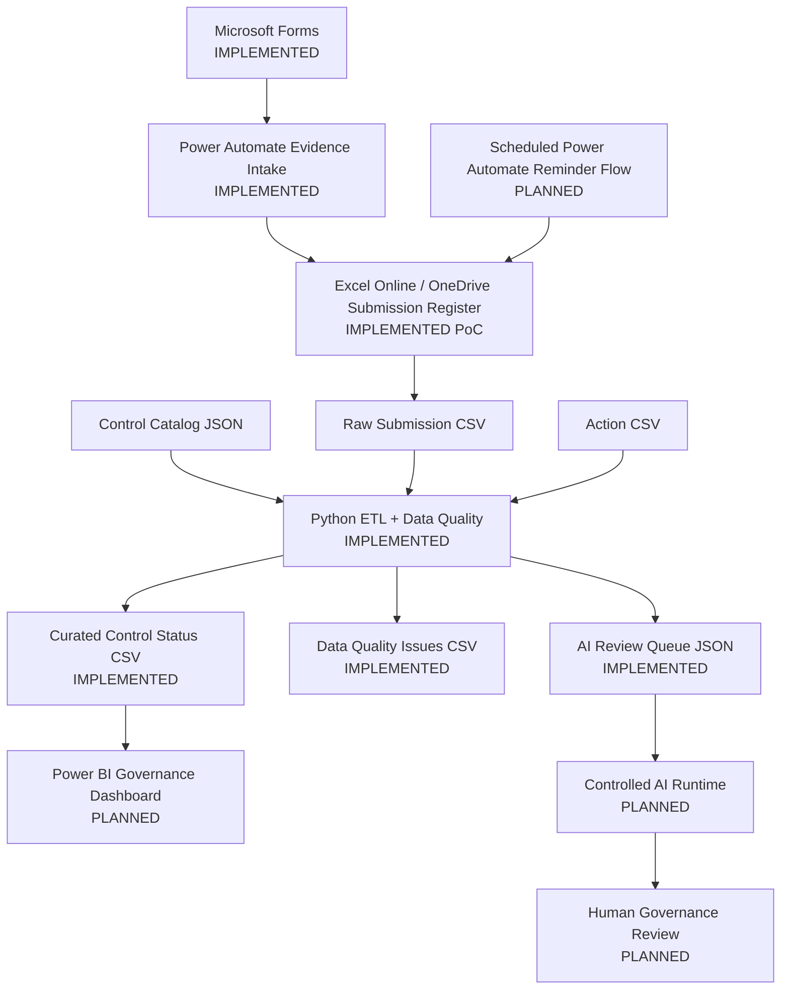

# Cyber Governance Automation Lab

**Security Control Evidence, Follow-up & Reporting Automation**

[](https://github.com/gw-ai-security/cyber-governance-automation-lab/actions/workflows/tests.yml)

A portfolio proof of concept for a recurring cybersecurity-governance process. The project models expected control-evidence submissions, automates authenticated evidence intake, validates Data Quality deterministically, derives governance and timeliness metrics, tracks follow-up work, and prepares selected valid exceptions for controlled AI-assisted review.

The project is intentionally small and explicit. It demonstrates business-process understanding, data modeling, workflow automation, Python data processing, testing, governance controls, and reproducible engineering practices without presenting a proof of concept as a production platform.

## What This Project Demonstrates

- **Cybersecurity governance modeling** — Controls, recurring Submissions, follow-up Actions, reporting periods, deadlines, and human compliance review are separate business concepts.
- **Controlled evidence intake** — Microsoft Forms and Power Automate resolve an expected Submission by business key and update the existing record from `Not Submitted` to `In Review`.
- **Fail-safe workflow design** — missing targets, duplicate business keys, and invalid Submission states stop automated processing explicitly instead of being silently repaired or overwritten.
- **Deterministic Python processing** — raw CSV/JSON inputs are structurally checked, normalized without semantic repair, validated, enriched, transformed, and serialized into contractual outputs.
- **Explicit Data Quality controls** — ten documented DQ rules cover completeness, referential integrity, validity, consistency, and uniqueness.
- **Engineering discipline** — critical business invariants are regression-tested, CI runs the full test suite, and `main` is governed through pull requests and required checks.
- **Controlled AI design** — only Data-Quality-valid governance exceptions enter the AI review queue; payloads are minimized and final compliance authority remains human.

## Current Engineering Evidence

| Evidence | Current state |
| --- | ---: |
| Security Controls | 5 |
| Synthetic Submissions | 15 |
| Follow-up Actions | 5 |
| Explicit Submission DQ rules | 10 |
| Automated tests | **42 passing in the Phase 4 acceptance baseline** |
| Canonical DQ findings | 5 |
| Valid / invalid Submissions | 10 / 5 |
| Raw / curated Submission rows | 15 / 15 |
| AI review queue items | 2 |
| Contractual pipeline outputs | 3 |
| Power Automate evidence-intake workflow | Implemented and acceptance-tested |
| Evidence-intake failure codes | 3 |
| Continuous Integration | GitHub Actions |

The deterministic Python acceptance run uses:

```text
as_of_date = 2026-08-15
```

and must produce:

```text
Controls loaded: 5
Submissions loaded: 15
Actions loaded: 5
DQ issues: 5
Valid submissions: 10
Invalid submissions: 5
AI review queue items: 2
```

## Architecture



Phase 5 implements the operational evidence-intake path. The Python/data layer remains the deterministic validation and reporting-data layer. Reminder automation, Power BI, external AI invocation, and the mock REST API remain later phases.

See [docs/architecture.md](docs/architecture.md) and [docs/power_automate.md](docs/power_automate.md).

## Current Implementation Status

| Phase | Scope | Status |
| --- | --- | --- |
| Phase 0 | Repository & Project Foundation | ✅ Complete |
| Phase 1 | Business Process & Data Model | ✅ Complete |
| Phase 2 | Synthetic Dataset | ✅ Complete |
| Phase 3 | Python Data Quality Pipeline | ✅ Complete |
| Phase 4 | Test Hardening & Acceptance | ✅ Complete |
| Repository Governance | GitHub Actions CI + protected `main` | ✅ Active |
| Phase 5 | Power Automate Evidence Flow | ✅ Complete |
| Phase 6 | Reminder Automation | ▶ Next |
| Phase 7 | Reporting Export | ○ Planned |
| Phase 8 | Power BI Dashboard | ○ Planned |
| Phase 9 | Controlled AI Workflow | ○ Planned |
| Phase 10 | REST API | ○ Planned |
| Phase 11 | Documentation & Handover | ○ Planned |

## Core Domain Model

The logical model contains four core entities:

```text
CONTROL
   │ 1:n
   ▼
SUBMISSION
   ├──────────────► ACTION
   └──────────────► DATA QUALITY ISSUE
```

A Submission represents one expected assessment of a Control for one reporting period.

Technical identifier:

```text
submission_id
```

Business identity:

```text
control_id + reporting_period
```

Expected Submission records exist before evidence arrives so missing submissions can be detected explicitly.

Critical semantics are preserved throughout the project:

```text
Evidence Present != Compliant
Not Submitted != Non-Compliant
Non-Compliant != Overdue
Compliance != Timeliness
Compliance != Data Quality
Submission Status != Action Status
Unknown != False
Not Evaluated != Failed
```

## Phase 5: Controlled Evidence Intake

The implemented workflow is:

```text
Microsoft Forms
      ↓
Get Response Details
      ↓
Read Submission Register
      ↓
Filter by control_id
      ↓
Filter by reporting_period
      ↓
Require exactly one business-key match
      ↓
Require status = Not Submitted
      ↓
Update existing row by submission_id
      ↓
status = In Review
```

The workflow deliberately performs **UPDATE, not APPEND**.

The Control Owner supplies evidence but does not choose compliance status. The workflow only performs:

```text
Not Submitted → In Review
```

Final `Compliant` / `Non-Compliant` assessment remains a Governance Reviewer decision.

Three explicit failure paths are implemented and acceptance-tested:

| Code | Condition |
| --- | --- |
| `NO_MATCH` | No expected Submission exists for the submitted business key |
| `DUPLICATE_BUSINESS_KEY` | More than one Submission exists for the business key |
| `INVALID_SUBMISSION_STATE` | A unique Submission exists but is not `Not Submitted` |

See [docs/power_automate.md](docs/power_automate.md) for the complete workflow contract, screenshots, and acceptance evidence.

## Python Pipeline

Phase 3 implements:

```text
EXTRACT
   ↓
NORMALIZE
   ↓
VALIDATE
   ↓
TRANSFORM / ENRICH
   ↓
DERIVE
   ↓
LOAD
```

Normalization standardizes technical representation but does not silently repair business meaning. Submission rows are enriched with Control metadata using a `LEFT JOIN`; invalid rows remain visible, and Action aggregation preserves one row per raw Submission.

Derived fields include:

- `evidence_present`
- `overdue_flag`
- `submission_late`
- `days_overdue`
- `days_late`
- `data_quality_status`
- active Action context
- reminder metrics

See [docs/phase3_pipeline_contract.md](docs/phase3_pipeline_contract.md).

## Data Quality

The project applies exactly DQ-001 through DQ-010:

| Rule | Name | Category | Severity |
| --- | --- | --- | --- |
| DQ-001 | Missing Required Field | Completeness | High |
| DQ-002 | Unknown Control ID | Referential Integrity | High |
| DQ-003 | Invalid Status | Validity | High |
| DQ-004 | Missing Evidence | Consistency | High |
| DQ-005 | Duplicate Submission | Uniqueness | High |
| DQ-006 | Invalid Reporting Period | Validity | Medium |
| DQ-007 | Invalid Due Date | Consistency | High |
| DQ-008 | Invalid Submission State | Consistency | High |
| DQ-009 | Invalid Evidence State | Consistency | Medium |
| DQ-010 | Invalid Submitter Email | Validity | Medium |

Invalid rows and duplicate business keys are preserved for traceability rather than silently deleted or repaired.

Canonical invariant:

```text
15 raw Submission rows → 15 curated Submission rows
```

See [docs/data_quality.md](docs/data_quality.md) and [docs/phase2_dataset_coverage.md](docs/phase2_dataset_coverage.md).

## Testing and Repository Governance

The Phase 4 acceptance baseline contains **42 passing automated tests** covering input contracts, DQ rules, validation dependencies, duplicates, lineage, deterministic issue IDs, enrichment behavior, timing boundaries, AI queue eligibility, serialization, CLI handling, and end-to-end acceptance counts.

GitHub Actions runs:

```bash
python -m pytest -q
```

for pull requests against `main` and pushes to `main`.

Phase 5 was additionally acceptance-tested through real Microsoft Forms submissions and Power Automate run history for:

- successful evidence intake,
- resubmission / invalid state,
- zero business-key matches,
- duplicate business-key matches.

## Controlled AI Review Queue

A Submission is eligible only when:

```text
data_quality_status = Valid
AND
(
    submission_status = Non-Compliant
    OR
    overdue_flag = True
)
```

DQ-invalid records remain in deterministic Data Quality / human-correction workflows. External model invocation is a later phase and final compliance authority remains human.

## Tech Stack

| Technology | Role |
| --- | --- |
| Microsoft Forms | Authenticated evidence intake |
| Power Automate | Evidence-intake orchestration and guardrails |
| Excel Online / OneDrive | Operational Submission Register for the PoC |
| Python 3.14.5 | Pipeline orchestration and business rules |
| pandas | Transformation and enrichment |
| pytest | Automated testing |
| CSV / JSON | Contractual inputs and outputs |
| GitHub Actions | Continuous Integration |
| Git / GitHub | Version control and repository governance |

## How to Run

```bash
python -m pip install -r requirements.txt
python -m pytest -q
python src/main.py --as-of-date 2026-08-15
```

Successful pipeline execution writes runtime artifacts to `data/curated/`.

## Repository Guide

| Document | Purpose |
| --- | --- |
| [docs/architecture.md](docs/architecture.md) | System architecture and component responsibilities |
| [docs/business_process.md](docs/business_process.md) | Governance process and role semantics |
| [docs/data_model.md](docs/data_model.md) | Logical domain model |
| [docs/data_contract.md](docs/data_contract.md) | Physical raw CSV contracts |
| [docs/data_quality.md](docs/data_quality.md) | DQ-001 through DQ-010 |
| [docs/phase2_dataset_coverage.md](docs/phase2_dataset_coverage.md) | Synthetic scenario coverage |
| [docs/phase3_pipeline_contract.md](docs/phase3_pipeline_contract.md) | Python pipeline contract |
| [docs/phase4_test_acceptance.md](docs/phase4_test_acceptance.md) | Regression hardening and acceptance |
| [docs/power_automate.md](docs/power_automate.md) | Phase 5 workflow, guardrails, screenshots, and acceptance tests |

## Security and Governance Considerations

- repository business records and identities are synthetic,
- actual evidence files are not stored in the repository,
- credentials, tokens, keys, and secrets must not be committed,
- evidence intake is authenticated in the Microsoft 365 PoC,
- evidence submission cannot assign compliance,
- ambiguous or invalid-state workflow targets fail safely,
- DQ-invalid records do not enter the AI review queue,
- AI payloads are minimized,
- final governance review remains human-controlled.

Screenshots committed as Phase 5 evidence are sanitized where necessary so personal account identifiers are not published.

## Limitations

This repository is a **portfolio proof of concept**, not a production cybersecurity-governance platform.

Current limitations include Excel/OneDrive rather than a transactional production datastore, no production IAM/RBAC or audit-trail service, no automated reporting-period generation, no scheduled reminder workflow yet, no Power BI report artifact yet, no external AI model invocation, and no REST API implementation.

For production, Dataverse, SharePoint Lists, or a relational database would generally be preferable where stronger concurrency, governance, auditability, and scale are required.

## Source of Truth

Historical planning documents provide background context only. Current repository documentation, canonical datasets, implementation code, automated tests, and implemented workflow acceptance evidence are the source of truth for the implemented project state.
