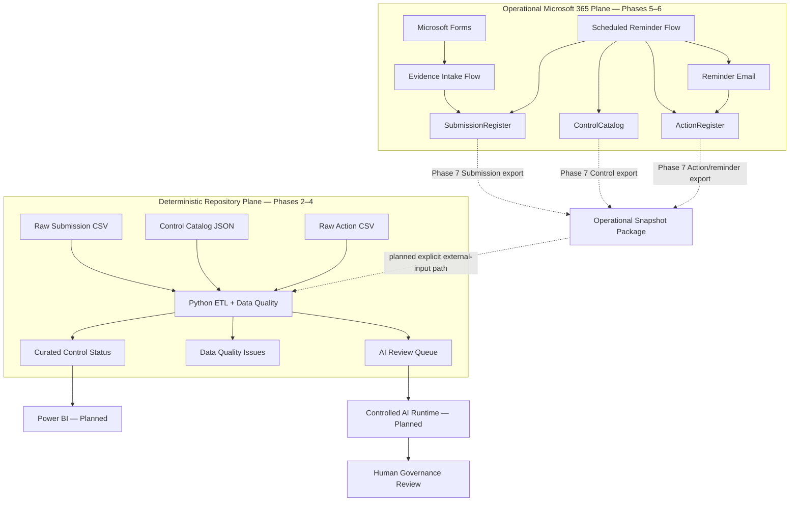

# Cyber Governance Automation Lab

**Security Control Evidence, Follow-up & Reporting Automation**

[](https://github.com/gw-ai-security/cyber-governance-automation-lab/actions/workflows/tests.yml)

A portfolio proof of concept for a recurring cybersecurity-governance process. The project models expected control-evidence Submissions, automates authenticated evidence intake and overdue follow-up, validates Data Quality deterministically, derives governance and timeliness metrics, tracks Actions and reminder history, and prepares selected valid exceptions for controlled AI-assisted review.

The implementation is intentionally small and explicit. It demonstrates business-process modeling, Power Automate workflow design, deterministic Python processing, testing, governance guardrails, and reproducible engineering practices without presenting a proof of concept as a production platform.

## What This Project Demonstrates

- **Governance modeling** — Control, Submission, Action, and Data Quality Issue are separate domain concepts.
- **Expected-state design** — a Submission exists before evidence arrives, making missing submissions observable.
- **Controlled evidence intake** — Microsoft Forms and Power Automate resolve the expected Submission by business key and perform `Not Submitted → In Review`.
- **Scheduled overdue follow-up** — a separate Power Automate flow detects missing past-due Submissions, resolves the Control Owner, creates or reuses an Action, and persists reminder history.
- **Fail-safe workflow behavior** — missing/duplicate business keys, invalid Submission states, missing/duplicate Control mappings, and duplicate active Actions are not guessed or silently repaired.
- **Same-day idempotency** — repeated reminder-flow execution on the same day does not resend or increment tracking.
- **Deterministic Data Quality** — DQ-001 through DQ-010 are applied to canonical repository Submission data without silent semantic correction.
- **Deterministic engineering baseline** — GitHub Actions executes the complete Python test suite on pushes and pull requests targeting `main`.
- **Controlled reporting boundary** — Phase 7.0 fixes how live Microsoft 365 Control, Submission, and Action state will be exported without overwriting deterministic repository fixtures.
- **Controlled AI boundary** — only Data-Quality-valid governance exceptions enter the AI review queue; final compliance authority remains human.

## Current Engineering Evidence

| Evidence | Current state |
| --- | ---: |
| Security Controls | 5 |
| Canonical synthetic Submissions | 15 |
| Canonical raw Actions | 5 |
| Explicit Submission DQ rules | 10 |
| Automated tests | **42 passing** |
| Canonical DQ findings | 5 |
| Valid / invalid Submissions | 10 / 5 |
| Raw / curated Submission rows | 15 / 15 |
| AI review queue items | 2 |
| Contractual Python outputs | 3 |
| Phase 5 evidence-intake workflow | ✅ Implemented and acceptance-tested |
| Phase 5 controlled failure outcomes | 3 |
| Phase 6 reminder workflow | ✅ Implemented and acceptance-tested |
| Phase 6 guard outcomes | 4 |
| Phase 7.0 reporting export contract | ✅ Defined |
| Phase 7 runtime snapshot export | ○ Not implemented yet |
| Continuous Integration | ✅ GitHub Actions |
| Required CI merge gate | ⚠ Not currently enforced |

The deterministic Python acceptance baseline uses:

```text
as_of_date = 2026-08-15
```

and produces:

```text
Controls loaded: 5
Submissions loaded: 15
Actions loaded: 5
DQ issues: 5
Valid submissions: 10
Invalid submissions: 5
AI review queue items: 2
```

The operational Microsoft 365 workbook evolves independently during Phase 5–6 acceptance testing and does not alter these canonical repository counts.

## Current Architecture

The project deliberately contains two data planes.

### Operational Microsoft 365 plane — Phases 5–6

```text
Microsoft Forms
      ↓
Power Automate Evidence Intake
      ↓
Excel Online / OneDrive
      ├─ SubmissionRegister
      ├─ ControlCatalog
      └─ ActionRegister
      ↑
Scheduled Power Automate Reminder Flow
      ↓
Reminder Email
```

### Deterministic repository plane — Phases 2–4

```text
data/reference/control_catalog.json
                    ┐
data/raw/evidence_submissions.csv ──► Python ETL + Data Quality
data/raw/actions.csv                ┘
                                    ↓
                         data/curated/*
```

These planes are intentionally **not automatically synchronized yet**. Phase 7.0 defines the planned reporting snapshot/export bridge; the runtime export and Python external-input path are not implemented yet.



See [Architecture](docs/architecture.md), [Phase 5 Evidence Intake](docs/phase5_evidence_intake.md), [Phase 6 Reminder Automation](docs/phase6_reminder_automation.md), and [Phase 7 Reporting Export Contract](docs/phase7_reporting_export.md).

## Current Implementation Status

| Phase | Scope | Status |
| --- | --- | --- |
| Phase 0 | Repository & Project Foundation | ✅ Complete |
| Phase 1 | Business Process & Data Model | ✅ Complete |
| Phase 2 | Synthetic Dataset | ✅ Complete |
| Phase 3 | Python Data Quality Pipeline | ✅ Complete |
| Phase 4 | Test Hardening & Acceptance | ✅ Complete |
| Repository CI | GitHub Actions | ✅ Active |
| Repository merge gating | Required CI check before merge | ⚠ Not currently enforced |
| Phase 5 | Power Automate Evidence Intake | ✅ Core DoD complete |
| Phase 6 | Scheduled Reminder Automation | ✅ Complete and acceptance-tested |
| Phase 7.0 | Reporting Export Contract | ✅ Complete |
| Phase 7 runtime | Reporting Snapshot Export + Python Bridge | ○ Planned |
| Phase 8 | Power BI Dashboard | ○ Planned |
| Phase 9 | Controlled AI Workflow | ○ Planned |
| Phase 10 | REST API | ○ Planned |
| Phase 11 | Documentation & Handover | ○ Planned |

### Phase 5 roadmap delta

The original roadmap illustrated a custom confirmation e-mail after successful evidence intake. That action is not implemented. This remains explicitly documented rather than being presented as complete. Phase 6 reminder e-mails are a different capability and do not close that Phase 5 delta.

## Core Domain Model

The logical model contains exactly four core entities:

```text
CONTROL
   │ 1:n
   ▼
SUBMISSION
   ├──────────────► ACTION
   └──────────────► DATA QUALITY ISSUE
```

Submission technical key:

```text
submission_id
```

Submission business key:

```text
control_id + reporting_period
```

Critical semantics:

```text
Evidence Present != Compliant
Not Submitted != Non-Compliant
Non-Compliant != Overdue
Compliance != Timeliness
Compliance != Data Quality
Submission Status != Action Status
Unknown != False
Not Evaluated != Failed
```

## Phase 5: Evidence Intake

Implemented path:

```text
Microsoft Forms
      ↓
Read expected SubmissionRegister
      ↓
Resolve control_id + reporting_period
      ↓
Require exactly one match
      ↓
Require status = Not Submitted
      ↓
Update existing row by submission_id
      ↓
status = In Review
```

The workflow performs **UPDATE, not APPEND** and never assigns `Compliant` or `Non-Compliant`.

Controlled outcomes:

```text
NO_MATCH
DUPLICATE_BUSINESS_KEY
INVALID_SUBMISSION_STATE
```

See [docs/phase5_evidence_intake.md](docs/phase5_evidence_intake.md).

## Phase 6: Scheduled Reminder Automation

Schedule:

```text
Daily 08:00
W. Europe Standard Time
```

Canonical overdue rule:

```text
submitted_at IS NULL
AND
as_of_date > due_date
```

The live workflow additionally requires `status = Not Submitted` as an operational consistency guard. It does **not** define overdue as `status != Compliant`.

Action cardinality behavior:

```text
0 active Actions → CREATE
1 active Action  → REUSE
>1 active Actions → DUPLICATE_ACTIVE_ACTION
```

Control lookup behavior:

```text
0 Control matches → CONTROL_NOT_FOUND
1 Control match   → resolve owner
>1 Control matches → DUPLICATE_CONTROL
```

Same-day behavior:

```text
last_reminder_at == today
→ SAME_DAY_REMINDER_SKIPPED
```

A successful first reminder writes:

```text
reminder_count = 1
last_reminder_at = local processing date
```

Later reminders reuse the same active Action and increment the existing count dynamically.

See [docs/phase6_reminder_automation.md](docs/phase6_reminder_automation.md).

## Phase 7: Reporting Export Contract

Phase 7.0 defines the planned operational reporting bridge but does not yet implement it.

The snapshot contract carries all three operational source tables:

```text
ControlCatalog     → Control JSON snapshot
SubmissionRegister → Submission CSV snapshot
ActionRegister     → Action CSV snapshot
```

All artifacts share one `snapshot_id` and are completed by a manifest that records the snapshot `as_of_date`, file names, row counts, and completion state.

Critical boundary:

```text
Power Automate exports source facts.
Python owns Data Quality, Control enrichment, Action aggregation, and derived metrics.
```

The operational snapshot must not overwrite:

```text
data/reference/control_catalog.json
data/raw/evidence_submissions.csv
data/raw/actions.csv
```

Those files remain the deterministic acceptance baseline.

See [docs/phase7_reporting_export.md](docs/phase7_reporting_export.md).

## Python Pipeline

Phase 3 implements:

```text
EXTRACT
   ↓
NORMALIZE
   ↓
VALIDATE
   ↓
TRANSFORM / ENRICH
   ↓
DERIVE
   ↓
LOAD
```

Submission is the primary grain. Control enrichment uses a `LEFT JOIN`, invalid rows remain visible, and Action aggregation does not multiply Submission rows.

Derived fields include:

```text
evidence_present
overdue_flag
submission_late
days_overdue
days_late
data_quality_status
active_action_id
active_action_status
active_action_due_date
reminder_count
last_reminder_at
```

Phase 7 runtime implementation is planned to add explicit external input paths while preserving the current canonical file paths as defaults.

See [docs/phase3_pipeline_contract.md](docs/phase3_pipeline_contract.md).

## Data Quality

The canonical Submission rule catalog is exactly DQ-001 through DQ-010:

| Rule | Name | Severity |
| --- | --- | --- |
| DQ-001 | Missing Required Field | High |
| DQ-002 | Unknown Control ID | High |
| DQ-003 | Invalid Status | High |
| DQ-004 | Missing Evidence | High |
| DQ-005 | Duplicate Submission | High |
| DQ-006 | Invalid Reporting Period | Medium |
| DQ-007 | Invalid Due Date | High |
| DQ-008 | Invalid Submission State | High |
| DQ-009 | Invalid Evidence State | Medium |
| DQ-010 | Invalid Submitter Email | Medium |

Phase 6 outcomes such as `DUPLICATE_ACTIVE_ACTION` are operational workflow guards, not additional DQ rule IDs.

Canonical invariant:

```text
15 raw Submission rows → 15 curated Submission rows
```

## Testing and Repository Governance

GitHub Actions runs:

```bash
python -m pytest -q
```

for pull requests targeting `main` and pushes to `main`.

The current deterministic suite contains **42 passing tests**. Phase 7.0 is documentation/contract work only and does not change the Python runtime or test count.

The repository currently does **not** enforce the Python check as a required merge gate. CI is active, but strict merge gating must be configured separately in GitHub repository rules/settings.

## Controlled AI Review Queue

Eligibility:

```text
data_quality_status = Valid
AND
(
    submission_status = Non-Compliant
    OR
    overdue_flag = True
)
```

For the canonical `as_of_date = 2026-08-15`, the queue contains:

```text
SUB-005
SUB-014
```

AI processing remains downstream of deterministic validation and does not hold final compliance authority.

## Tech Stack

| Technology | Role |
| --- | --- |
| Microsoft Forms | Authenticated evidence intake |
| Power Automate | Evidence intake, scheduled reminders, planned reporting snapshot orchestration |
| Excel Online / OneDrive | Operational Submission, Control, and Action tables; planned private snapshots |
| Office 365 Outlook | Reminder delivery |
| Python 3.14.5 | Deterministic data pipeline |
| pandas | Transformation and enrichment |
| pytest | Automated testing |
| CSV / JSON | Canonical repository contracts and planned operational snapshot formats |
| GitHub Actions | Continuous Integration |
| Git / GitHub | Version control and repository workflow |

`requests`, `FastAPI`, and `uvicorn` are already present in `requirements.txt` for later integration/API phases; their presence does not mean Phase 10 is implemented.

## How to Run the Repository Pipeline

```bash
python -m pip install -r requirements.txt
python -m pytest -q
python src/main.py --as-of-date 2026-08-15
```

Generated runtime outputs are written to `data/curated/` and ignored except for `.gitkeep`.

Power Automate workflows execute in the Microsoft 365 environment and are not executable from the repository CLI. The Phase 7 external-snapshot CLI path is still planned rather than implemented.

## Repository Guide

| Document | Purpose |
| --- | --- |
| [docs/architecture.md](docs/architecture.md) | Current architecture and data-plane boundaries |
| [docs/business_process.md](docs/business_process.md) | Governance process and role semantics |
| [docs/data_model.md](docs/data_model.md) | Logical domain model |
| [docs/data_contract.md](docs/data_contract.md) | Canonical raw flat-file contract |
| [docs/data_quality.md](docs/data_quality.md) | DQ-001 through DQ-010 |
| [docs/phase2_dataset_coverage.md](docs/phase2_dataset_coverage.md) | Canonical synthetic scenario coverage |
| [docs/phase3_pipeline_contract.md](docs/phase3_pipeline_contract.md) | Deterministic Python pipeline contract |
| [docs/phase4_test_acceptance.md](docs/phase4_test_acceptance.md) | Regression hardening and acceptance |
| [docs/phase5_evidence_intake.md](docs/phase5_evidence_intake.md) | Phase 5 evidence-intake workflow and acceptance |
| [docs/phase6_reminder_automation.md](docs/phase6_reminder_automation.md) | Phase 6 reminder workflow, guardrails, and acceptance |
| [docs/phase7_reporting_export.md](docs/phase7_reporting_export.md) | Phase 7.0 operational snapshot/export contract and later acceptance criteria |

## Security and Governance Considerations

- canonical repository identities are synthetic,
- the operational Microsoft 365 workbook is not a canonical repository source artifact,
- operational Phase 7 snapshots will remain private and outside GitHub,
- reachable acceptance-test recipients are not published,
- actual evidence files are not stored in the repository,
- credentials, connection tokens, keys, tenant identifiers, and secrets must not be committed,
- evidence intake cannot assign compliance,
- reminder automation cannot assign compliance,
- reporting export cannot assign compliance or silently repair operational state,
- Submission DQ failures and operational workflow ambiguity are surfaced explicitly,
- DQ-invalid records do not enter the AI review queue,
- final governance review remains human-controlled.

Published Phase 5–6 screenshots are sanitized where needed. Future Phase 7 screenshots must follow the same rule.

## Process Impact Boundary

Phase 6 operationalizes:

```text
reminder_count
last_reminder_at
```

Phase 7.0 now defines how this Action/reminder state must cross the reporting boundary. The runtime export must still be implemented before Phase 8 Power BI metrics can represent live reminder execution.

The project does not invent unmeasured labour-savings or ROI claims.

## Limitations

This repository is a **portfolio proof of concept**, not a production cybersecurity-governance platform.

Current limitations include:

- Excel/OneDrive rather than a transactional production datastore,
- Phase 7.0 reporting contract defined but no operational workbook → reporting runtime synchronization yet,
- no transactional multi-table snapshot guarantee for the Excel-based operational plane,
- no production IAM/RBAC or audit-trail service,
- no automated reporting-period generation,
- no custom Phase 5 confirmation e-mail,
- no production escalation hierarchy or SLA engine,
- no dedicated Power Automate telemetry/error datastore,
- no automatic completion of a missing-submission Action when Phase 5 later receives evidence,
- no Power BI report artifact yet,
- no external AI model invocation,
- no REST API implementation,
- no enforced required CI status check before merge.

For production, Dataverse, SharePoint Lists, or a relational database would generally be preferable where stronger concurrency, governance, auditability, consistency, and scale are required.

## Source of Truth

Historical phase documents remain valid for the phase they describe. Current repository documentation, canonical datasets, implementation code, automated tests, and acceptance evidence define the current project state. Later phases must not rewrite historical acceptance fixtures merely to make them resemble later operational state.
