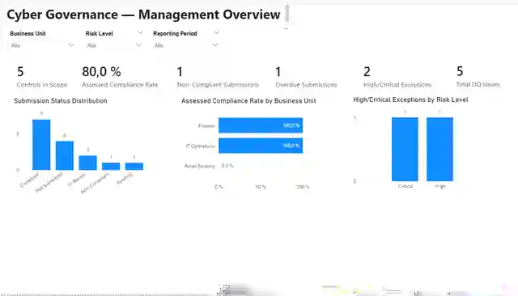
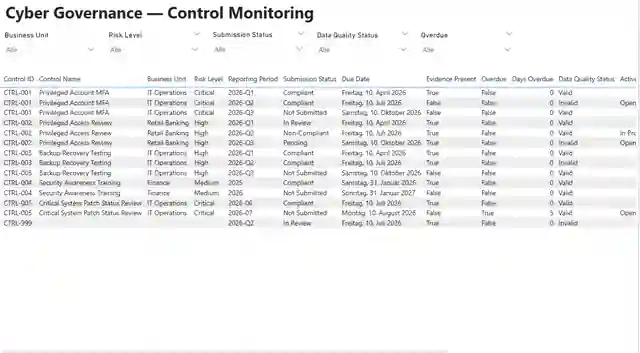
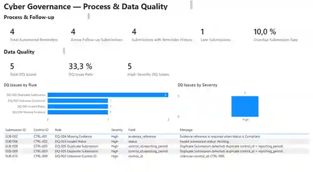

# Cyber Governance Automation Lab

**Security Control Evidence · Workflow Automation · Deterministic Data Quality · Power BI · Controlled AI Review · Read-only REST Integration**

[](https://github.com/gw-ai-security/cyber-governance-automation-lab/actions/workflows/tests.yml)

A portfolio proof of concept for a recurring cybersecurity-governance evidence process.

The lab demonstrates how expected control evidence can be modeled, collected, validated, followed up, reported, selectively reviewed with AI, and exposed through a minimized local REST boundary without collapsing compliance, timeliness, workflow state, and Data Quality into one ambiguous status.

The project is deliberately **not production-ready**. It is designed to make architecture, trust, failure handling, human authority, and production gaps explicit.

## System at a Glance

```text
Operational Microsoft 365 plane
Microsoft Forms
    ↓
Power Automate evidence intake
    ↓
SubmissionRegister

Scheduled reminder flow
    ↓
ControlCatalog + SubmissionRegister + ActionRegister
    ↓
Private Phase 7 snapshot package
    ↓
Deterministic Python pipeline
    ├────────────→ curated reporting → Power BI
    └────────────→ minimized AI queue → controlled AI review
                                      ↓
                              schema + correlation validation
                                      ↓
                              Human Governance Review

Canonical Control Catalog
    ↓ existing Python loader
Local read-only FastAPI service
    ↓ HTTP GET / JSON
requests-based Python client
```

Final authority remains human:

```text
Evidence intake != compliance decision
Data Quality     != compliance decision
AI output        != compliance decision
REST response    != governance authority
```

## What This Project Demonstrates

- explicit **Control / Submission / Action / Data Quality Issue** domain modeling,
- expected-state design so missing evidence is observable rather than absent data,
- authenticated Microsoft Forms intake with controlled `Not Submitted -> In Review`,
- fail-safe business-key and state handling in Power Automate,
- scheduled overdue detection, Action create/reuse, reminders, and same-day idempotency,
- deterministic Submission Data Quality using exactly **DQ-001 through DQ-010**,
- canonical and operational data-plane separation,
- a private reporting-snapshot bridge from Microsoft 365 to Python,
- Submission-grain preservation and explicit lineage,
- Power BI consuming only Python-owned curated outputs,
- source-controlled PBIP/PBIR/TMDL with **21 DAX measures**,
- deterministic AI candidate selection,
- minimized AI inputs and explicit untrusted-input handling,
- JSON Schema-constrained AI output and correlation validation,
- mandatory human Governance Review,
- a minimized local FastAPI read-only projection,
- explicit client timeout/HTTP/JSON/connection handling,
- GitHub Actions regression testing,
- reproducible dependency handover with an accepted lock file,
- explicit Security Considerations and PoC-to-production gap analysis.

## Final Engineering Baseline

Canonical deterministic acceptance uses:

```text
as_of_date = 2026-08-15
```

Expected result:

```text
Controls loaded: 5
Submissions loaded: 15
Actions loaded: 5
DQ issues: 5
Valid submissions: 10
Invalid submissions: 5
AI review queue items: 2
```

Canonical AI candidates:

```text
SUB-005
SUB-014
```

Final Phase 11 functional baseline:

```text
84 passed
```

The completed Phase 11 delivery was verified twice through GitHub Actions with the locked environment:

```text
PR #46 regression: 84 passed in 8.30s
Merged main:        84 passed in 8.12s
Python:             3.14.5
Runner:             Ubuntu 24.04.4
Dependencies:       requirements-lock.txt
```

## Engineering Evidence

| Evidence | Accepted state |
| --- | ---: |
| Security Controls | 5 |
| Canonical Submissions | 15 |
| Canonical raw Actions | 5 |
| Submission DQ rules | 10 |
| Canonical DQ findings | 5 |
| Valid / Invalid Submissions | 10 / 5 |
| Canonical raw / curated Submission rows | 15 / 15 |
| AI queue items | 2 |
| AI candidates human-reviewed | 2 / 2 accepted as review input |
| Power BI tables | 2 |
| Active Power BI relationships | 1 |
| DAX measures | 21 |
| Calculated tables / columns | 0 / 0 |
| Primary Power BI pages | 3 |
| REST business endpoints | 2 GET endpoints |
| REST public Control fields | 2 |
| REST client timeout | 3 seconds |
| Final functional test baseline | 84 |
| Continuous Integration | GitHub Actions |

Curated evidence navigation: [docs/evidence.md](docs/evidence.md).

## Dashboard Evidence

All public dashboard images use canonical synthetic data.

### Management Overview



Canonical headline values: `5 / 80.0% / 1 / 1 / 2 / 5`.

### Control Monitoring



Submission-grain monitoring keeps invalid, unresolved-Control, Non-Compliant, and Overdue scenarios visible rather than silently dropping them.

### Process & Data Quality



Process follow-up and Data Quality remain separate analytical dimensions.

## Core Domain Model

Exactly four core business entities are modeled:

```text
CONTROL
   │ 1:n
   ▼
SUBMISSION
   ├──────────────► ACTION
   └──────────────► DATA QUALITY ISSUE
```

Submission technical key:

```text
submission_id
```

Submission business key:

```text
control_id + reporting_period
```

Critical semantic separations:

```text
Evidence Present != Compliant
Not Submitted != Non-Compliant
Non-Compliant != Overdue
Compliance != Timeliness
Compliance != Data Quality
Submission Status != Action Status
Unknown != False
Not Evaluated != Failed
Action completion != Submission compliance
Control risk != DQ severity
Control risk != AI review priority
Schema-valid != factually correct
AI recommendation accepted != Submission compliant
REST API != Governance authority
API response != Compliance decision
```

## Deterministic Python Pipeline

```text
EXTRACT
   ↓
NORMALIZE
   ↓
VALIDATE
   ↓
TRANSFORM / ENRICH
   ↓
DERIVE
   ↓
LOAD
```

Runtime outputs:

```text
data/curated/
├── curated_control_status.csv
├── data_quality_issues.csv
└── ai_review_queue.json
```

Submission remains the primary reporting grain. Control enrichment uses a `LEFT JOIN`; invalid rows remain visible; Action aggregation does not multiply Submission rows.

## Data Quality

Submission DQ remains exactly:

| Rule | Name | Severity |
| --- | --- | --- |
| DQ-001 | Missing Required Field | High |
| DQ-002 | Unknown Control ID | High |
| DQ-003 | Invalid Status | High |
| DQ-004 | Missing Evidence | High |
| DQ-005 | Duplicate Submission | High |
| DQ-006 | Invalid Reporting Period | Medium |
| DQ-007 | Invalid Due Date | High |
| DQ-008 | Invalid Submission State | High |
| DQ-009 | Invalid Evidence State | Medium |
| DQ-010 | Invalid Submitter Email | Medium |

Workflow outcomes and REST/client errors are not new DQ rule IDs.

## Power Automate Workflows

### Phase 5 — Evidence Intake

```text
Microsoft Forms
      ↓
resolve control_id + reporting_period
      ↓
require exactly one expected Submission
      ↓
require status = Not Submitted
      ↓
update existing row by submission_id
      ↓
status = In Review
```

The workflow performs **UPDATE, not APPEND** and never assigns `Compliant` or `Non-Compliant`.

### Phase 6 — Scheduled Reminder Automation

Overdue rule:

```text
submitted_at IS NULL
AND as_of_date > due_date
```

Active Action resolution:

```text
0 active Actions  -> CREATE
1 active Action   -> REUSE
>1 active Actions -> DUPLICATE_ACTIVE_ACTION
```

Reminder history is persisted through `reminder_count` and `last_reminder_at`.

### Phase 7 — Reporting Snapshot Bridge

Successful private package:

```text
security_control_snapshot_<snapshot_id>.json
security_submission_snapshot_<snapshot_id>.csv
security_action_snapshot_<snapshot_id>.csv
security_snapshot_manifest_<snapshot_id>.json
```

The manifest is written last. Private snapshots remain outside Git.

Sanitized workflow source:

```text
power_automate/solutions/cyber_governance_automation/
```

## Power BI

Power BI consumes exactly:

```text
curated_control_status.csv
data_quality_issues.csv
```

Source-controlled model:

```text
2 reporting tables
1 active relationship
21 DAX measures
0 calculated tables
0 calculated columns
3 primary report pages
```

The repository `DataRoot` is a configurable Power Query parameter. Its checked-in default is a local development path and must be changed for another workstation.

Final Phase 8 acceptance: [docs/phase8_final_acceptance.md](docs/phase8_final_acceptance.md).

## Controlled AI Workflow

Eligibility:

```text
data_quality_status = Valid
AND
(
    submission_status = Non-Compliant
    OR
    overdue_flag = True
)
```

The queue excludes selected identity/evidence-reference fields including:

```text
owner_email
submitted_by
evidence_reference
```

Every supplied record value, including `comment`, remains untrusted input.

Relevant implementation:

```text
ai/prompts/control_review_prompt.md
ai/schemas/control_review.schema.json
ai/examples/
src/ai_validation.py
tests/test_ai_contract.py
```

AI output must pass schema and Submission/Control correlation validation before human review.

The project does **not** claim universal prompt-injection resistance and does not implement an external AI provider runtime or automatic source write-back.

Final Phase 9 acceptance: [docs/phase9_ai_acceptance.md](docs/phase9_ai_acceptance.md).

## Local Read-only REST Integration

Server:

```text
api/mock_api.py
```

Client:

```text
src/api_client.py
```

Business endpoints:

```text
GET /api/v1/controls
GET /api/v1/controls/{control_id}
```

Public representation:

```text
control_id
risk_level
```

Failure contracts:

```text
unknown Control -> 404 CONTROL_NOT_FOUND
source failure  -> 500 CONTROL_SOURCE_ERROR
```

The accepted runtime target is loopback only. No authentication is implemented because Phase 10 is explicitly a local, synthetic, minimized, read-only PoC; that is not a production API pattern.

Final Phase 10 acceptance: [docs/phase10_rest_api_acceptance.md](docs/phase10_rest_api_acceptance.md).

## Run the Project

Primary accepted Python runtime:

```text
Python 3.14.5
```

### Reproducible accepted environment

```bash
python -m venv .venv
python -m pip install --upgrade pip
python -m pip install -r requirements-lock.txt
python -m pytest -q
python src/main.py --as-of-date 2026-08-15
```

`requirements.txt` remains the concise direct-dependency declaration; `requirements-lock.txt` records the concrete accepted environment used for Phase 11 handover/CI reproducibility.

Detailed operating instructions: [docs/handover.md](docs/handover.md).

### Explicit private snapshot mode

```bash
python src/main.py \
  --as-of-date 2026-08-23 \
  --controls-path "/private/snapshots/security_control_snapshot_<id>.json" \
  --submissions-path "/private/snapshots/security_submission_snapshot_<id>.csv" \
  --actions-path "/private/snapshots/security_action_snapshot_<id>.csv" \
  --output-directory "/private/processed/<id>"
```

The three source overrides are all-or-none.

### Local API

```bash
python -m uvicorn api.mock_api:app --host 127.0.0.1 --port 8000
```

Then for example:

```bash
python -c "from src.api_client import get_controls; print(get_controls())"
```

## Tech Stack

| Technology | Role |
| --- | --- |
| Microsoft Forms | Authenticated evidence intake |
| Power Automate | Evidence intake, reminders, reporting snapshot orchestration |
| Excel Online / OneDrive | Operational PoC state and private snapshots |
| Office 365 Outlook | Reminder and flow-failure notifications |
| Python 3.14.5 | Deterministic processing, AI validation, API/client implementation |
| pandas | Transformation and enrichment |
| FastAPI | Local read-only REST service |
| Uvicorn | Local ASGI runtime |
| requests | Runtime REST client |
| pytest | Regression and contract tests |
| jsonschema | Draft 2020-12 AI-output validation |
| Power BI Desktop | Reporting runtime/authoring |
| Power Query | Curated loading and typing |
| DAX | Reporting measures |
| PBIP / PBIR / TMDL | Source-controlled Power BI definitions |
| GitHub Actions | Continuous Integration |
| Git / GitHub | Version control and review workflow |

## Security and Production Boundaries

Consolidated security review:

- [docs/security_considerations.md](docs/security_considerations.md)

PoC-to-production gap assessment:

- [docs/production_gap_assessment.md](docs/production_gap_assessment.md)

Key accepted limitations include:

- Excel/OneDrive rather than a transactional production datastore,
- no transactional multi-table snapshot guarantee,
- no automatic snapshot discovery/manifest ingestion/scheduled Python execution,
- no automatic completion of a missing-submission Action after later evidence intake,
- no Action-specific DQ rule catalog,
- no production escalation/SLA engine,
- no production IAM/RBAC/DLP/audit/retention/monitoring architecture,
- no Power BI Service/Fabric enterprise deployment/RLS architecture,
- no external AI provider runtime,
- no universal prompt-injection-resistance claim,
- no AI source write-back,
- no production API authentication/authorization/gateway/rate limiting/telemetry,
- no enforced required CI status check before merge.

## Phase Status

| Phase | Scope | Status |
| --- | --- | --- |
| Phase 0 | Repository & Project Foundation | ✅ Complete |
| Phase 1 | Business Process & Data Model | ✅ Complete |
| Phase 2 | Canonical Synthetic Dataset | ✅ Complete |
| Phase 3 | Deterministic Python Data Quality Pipeline | ✅ Complete |
| Phase 4 | Test Hardening & Acceptance | ✅ Complete |
| Phase 5 | Power Automate Evidence Intake | ✅ Complete |
| Phase 6 | Scheduled Reminder Automation | ✅ Complete |
| Phase 7 | Reporting Snapshot Bridge | ✅ Complete |
| Phase 8 | Power BI Dashboard | ✅ Complete |
| Phase 9 | Controlled AI Workflow | ✅ Complete |
| Phase 10 | Local Read-only REST API Integration | ✅ Complete |
| Phase 11 | Documentation & Handover | ✅ Complete |

Phase 11 adds documentation, reproducibility, evidence navigation, Security Considerations, production-gap analysis, and technical handover. It intentionally adds no new runtime business semantics.

## Documentation

Start with [docs/README.md](docs/README.md).

Key current documents:

| Document | Purpose |
| --- | --- |
| [docs/architecture.md](docs/architecture.md) | Final implemented runtime architecture |
| [docs/business_process.md](docs/business_process.md) | Governance-process semantics |
| [docs/data_model.md](docs/data_model.md) | Four-entity logical model |
| [docs/data_contract.md](docs/data_contract.md) | Physical data/snapshot/REST contracts |
| [docs/data_quality.md](docs/data_quality.md) | DQ-001 through DQ-010 |
| [docs/security_considerations.md](docs/security_considerations.md) | Consolidated security/privacy/trust boundaries |
| [docs/production_gap_assessment.md](docs/production_gap_assessment.md) | PoC-to-production gaps |
| [docs/handover.md](docs/handover.md) | Technical runbook |
| [docs/evidence.md](docs/evidence.md) | Curated engineering evidence |
| [docs/phase11_handover_acceptance.md](docs/phase11_handover_acceptance.md) | Final project acceptance |

## Source of Truth

For current-state questions:

```text
implemented code + canonical data + automated tests
        ↓
current-state foundation documents
        ↓
Phase 11 handover/final acceptance
        ↓
historical phase contracts and acceptance records
```

Historical phase-specific documents remain valid for the phase they describe.
