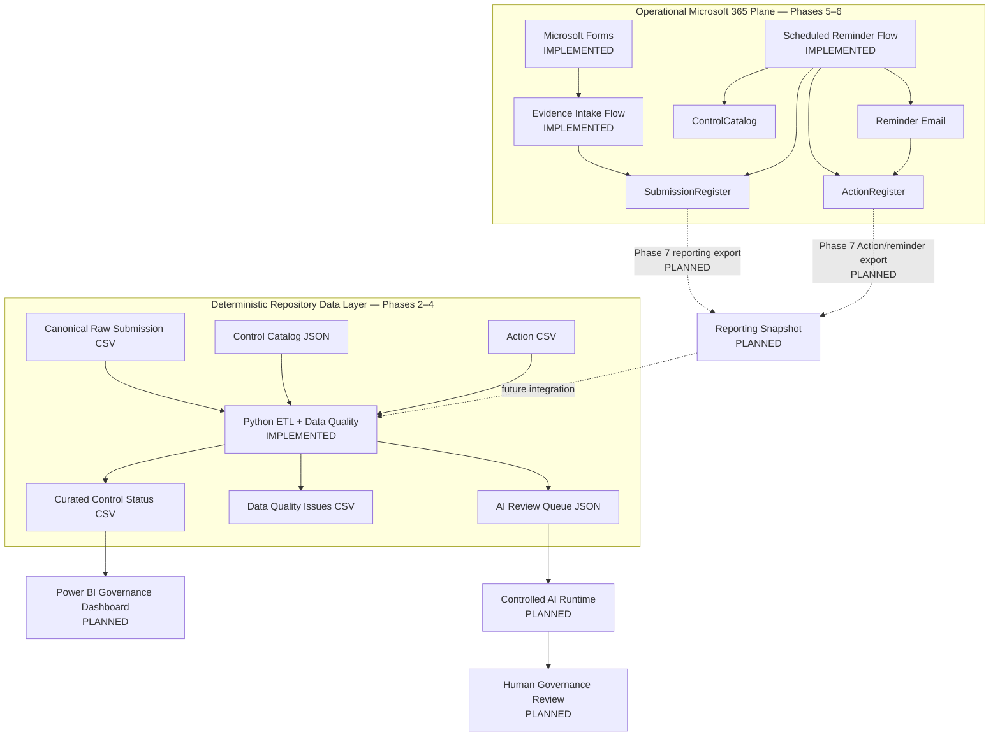

# Cyber Governance Automation Lab

**Security Control Evidence, Follow-up & Reporting Automation**

[](https://github.com/gw-ai-security/cyber-governance-automation-lab/actions/workflows/tests.yml)

A portfolio proof of concept for a recurring cybersecurity-governance process. The project models expected control-evidence submissions, automates authenticated evidence intake and overdue follow-up, validates Data Quality deterministically, derives governance and timeliness metrics, tracks Actions and reminder history, and prepares selected valid exceptions for controlled AI-assisted review.

The project is intentionally small and explicit. It demonstrates business-process understanding, data modeling, Power Automate workflow design, Python data processing, testing, governance controls, and reproducible engineering practices without presenting a proof of concept as a production platform.

## What This Project Demonstrates

- **Cybersecurity governance modeling** — Controls, recurring Submissions, follow-up Actions, reporting periods, deadlines, human compliance review, timeliness, and Data Quality remain separate concepts.
- **Controlled evidence intake** — Microsoft Forms and Power Automate resolve an expected Submission by business key and update the existing operational record from `Not Submitted` to `In Review`.
- **Scheduled overdue follow-up** — a second Power Automate flow detects currently overdue expected Submissions, resolves the accountable Control Owner, creates or reuses a follow-up Action, sends reminders, and persists reminder history.
- **Fail-safe workflow design** — missing/duplicate business keys, invalid Submission states, missing/duplicate Control mappings, and duplicate active Actions are handled explicitly rather than guessed or silently repaired.
- **Idempotent reminder behavior** — a same-day guard prevents repeated reminder sends and counter increments when the scheduled flow is rerun.
- **Deterministic Python processing** — canonical repository CSV/JSON inputs are structurally checked, normalized without semantic repair, validated, enriched, transformed, and serialized into contractual outputs.
- **Explicit Data Quality controls** — ten documented DQ rules cover completeness, referential integrity, validity, consistency, and uniqueness.
- **Engineering discipline** — critical business invariants are regression-tested and GitHub Actions runs the complete test suite on pull requests and pushes to `main`.
- **Controlled AI design** — only Data-Quality-valid governance exceptions enter the AI review queue; payloads are minimized and final compliance authority remains human.

## Current Engineering Evidence

| Evidence | Current state |
| --- | ---: |
| Security Controls | 5 |
| Canonical synthetic Submissions | 15 |
| Canonical raw Follow-up Actions | 5 |
| Explicit Submission DQ rules | 10 |
| Automated tests | **42 passing** |
| Canonical DQ findings | 5 |
| Valid / invalid Submissions | 10 / 5 |
| Raw / curated Submission rows | 15 / 15 |
| AI review queue items | 2 |
| Contractual Python pipeline outputs | 3 |
| Power Automate evidence-intake workflow | ✅ Implemented and acceptance-tested |
| Evidence-intake failure codes | 3 |
| Scheduled reminder workflow | ✅ Implemented and acceptance-tested |
| Reminder guard outcomes | `CONTROL_NOT_FOUND`, `DUPLICATE_CONTROL`, `DUPLICATE_ACTIVE_ACTION`, `SAME_DAY_REMINDER_SKIPPED` |
| Operational reminder tracking | `reminder_count`, `last_reminder_at` |
| Continuous Integration | GitHub Actions |
| Required CI merge gate | **Not currently enforced** |

The deterministic Python acceptance run remains fixed at:

```text
as_of_date = 2026-08-15
```

and must produce:

```text
Controls loaded: 5
Submissions loaded: 15
Actions loaded: 5
DQ issues: 5
Valid submissions: 10
Invalid submissions: 5
AI review queue items: 2
```

The operational Microsoft 365 workbook evolves independently during Phase 5–6 acceptance testing and does not change these canonical repository counts.

## Architecture

The project has two deliberately distinct data planes.

### Operational Microsoft 365 plane — Phases 5–6

```text
Microsoft Forms
      ↓
Power Automate Evidence Intake
      ↓
Excel Online / OneDrive
      ├─ SubmissionRegister
      ├─ ControlCatalog
      └─ ActionRegister
      ↑
Scheduled Power Automate Reminder Flow
      ↓
Reminder Email
```

### Deterministic repository plane — Phases 2–4

```text
data/reference/control_catalog.json
                    ┐
data/raw/evidence_submissions.csv ──► Python ETL + Data Quality
data/raw/actions.csv                ┘
                                    ↓
                         data/curated/*
```

The two planes are intentionally **not automatically synchronized yet**. Phase 7 is the planned reporting snapshot/export bridge.



See [docs/architecture.md](docs/architecture.md), [docs/power_automate.md](docs/power_automate.md), and [docs/phase6_reminder_automation.md](docs/phase6_reminder_automation.md).

## Current Implementation Status

| Phase | Scope | Status |
| --- | --- | --- |
| Phase 0 | Repository & Project Foundation | ✅ Complete |
| Phase 1 | Business Process & Data Model | ✅ Complete |
| Phase 2 | Synthetic Dataset | ✅ Complete |
| Phase 3 | Python Data Quality Pipeline | ✅ Complete |
| Phase 4 | Test Hardening & Acceptance | ✅ Complete |
| Repository CI | GitHub Actions | ✅ Active |
| Repository merge gating | Required CI check before merge | ⚠ Not currently enforced |
| Phase 5 | Power Automate Evidence Flow | ✅ Core DoD complete; see roadmap delta below |
| Phase 6 | Scheduled Reminder Automation | ✅ Complete and acceptance-tested |
| Phase 7 | Reporting Export | ▶ Next |
| Phase 8 | Power BI Dashboard | ○ Planned |
| Phase 9 | Controlled AI Workflow | ○ Planned |
| Phase 10 | REST API | ○ Planned |
| Phase 11 | Documentation & Handover | ○ Planned |

### Phase 5 roadmap delta

The original roadmap illustrated a separate custom **Confirmation Email** after a successful evidence submission. The implemented Phase 5 flow does not contain that custom confirmation-email action. The core Phase 5 Definition of Done — deterministic update of the expected Submission with validation and explicit failure handling — is implemented and acceptance-tested. The delta remains documented rather than falsely presented as implemented.

## Core Domain Model

The logical model contains exactly four core entities:

```text
CONTROL
   │ 1:n
   ▼
SUBMISSION
   ├──────────────► ACTION
   └──────────────► DATA QUALITY ISSUE
```

A Submission represents one expected assessment of a Control for one reporting period.

Technical identifier:

```text
submission_id
```

Business identity:

```text
control_id + reporting_period
```

Expected Submission records exist before evidence arrives so missing submissions can be detected explicitly.

Critical semantics are preserved throughout the project:

```text
Evidence Present != Compliant
Not Submitted != Non-Compliant
Non-Compliant != Overdue
Compliance != Timeliness
Compliance != Data Quality
Submission Status != Action Status
Unknown != False
Not Evaluated != Failed
```

## Phase 5: Controlled Evidence Intake

The implemented workflow is:

```text
Microsoft Forms
      ↓
Get Response Details
      ↓
Read Submission Register
      ↓
Filter by control_id
      ↓
Filter by reporting_period
      ↓
Require exactly one business-key match
      ↓
Require status = Not Submitted
      ↓
Update existing row by submission_id
      ↓
status = In Review
```

The workflow deliberately performs **UPDATE, not APPEND**.

The Control Owner supplies evidence but does not choose compliance status. The workflow only performs:

```text
Not Submitted → In Review
```

Final `Compliant` / `Non-Compliant` assessment remains a Governance Reviewer decision.

Three explicit Phase 5 failure paths are acceptance-tested:

| Code | Condition |
| --- | --- |
| `NO_MATCH` | No expected Submission exists for the submitted business key |
| `DUPLICATE_BUSINESS_KEY` | More than one Submission exists for the business key |
| `INVALID_SUBMISSION_STATE` | A unique Submission exists but is not `Not Submitted` |

See [docs/power_automate.md](docs/power_automate.md).

## Phase 6: Scheduled Reminder Automation

Phase 6 runs daily at 08:00 using `W. Europe Standard Time` and evaluates overdue expected Submissions in the operational workbook.

Canonical overdue rule:

```text
submitted_at IS NULL
AND
as_of_date > due_date
```

The live flow also requires `status = Not Submitted` as an operational consistency guard. It explicitly does **not** use `status != Compliant` as an overdue definition.

### Reminder workflow

```text
Read SubmissionRegister
      ↓
Identify overdue Submissions
      ↓
Resolve Control + Owner
      ↓
Resolve active Action cardinality
      ↓
0 active Actions → CREATE
1 active Action  → REUSE
>1 active Actions → CONFLICT
      ↓
Same-day reminder guard
      ↓
Send reminder
      ↓
Persist reminder_count + last_reminder_at
```

### Fail-safe lookup outcomes

```text
Control matches = 0  → CONTROL_NOT_FOUND
Control matches > 1  → DUPLICATE_CONTROL
Active Actions > 1   → DUPLICATE_ACTIVE_ACTION
Already reminded today → SAME_DAY_REMINDER_SKIPPED
```

A first successful reminder produces:

```text
reminder_count = 1
last_reminder_at = local processing date
```

A later successful reminder reuses the same active Action and increments the existing counter dynamically.

Phase 6 was acceptance-tested for overdue filtering, new Action creation, actual e-mail delivery, same-day idempotency, existing Action reuse (`1 → 2` reminders), duplicate active Actions, unknown Controls, and duplicate Controls.

See [docs/phase6_reminder_automation.md](docs/phase6_reminder_automation.md) for the complete workflow contract and acceptance matrix.

## Python Pipeline

Phase 3 implements:

```text
EXTRACT
   ↓
NORMALIZE
   ↓
VALIDATE
   ↓
TRANSFORM / ENRICH
   ↓
DERIVE
   ↓
LOAD
```

Normalization standardizes technical representation but does not silently repair business meaning. Submission rows are enriched with Control metadata using a `LEFT JOIN`; invalid rows remain visible, and Action aggregation preserves one row per raw Submission.

Derived fields include:

- `evidence_present`
- `overdue_flag`
- `submission_late`
- `days_overdue`
- `days_late`
- `data_quality_status`
- active Action context
- reminder metrics

See [docs/phase3_pipeline_contract.md](docs/phase3_pipeline_contract.md).

## Data Quality

The project applies exactly DQ-001 through DQ-010:

| Rule | Name | Category | Severity |
| --- | --- | --- | --- |
| DQ-001 | Missing Required Field | Completeness | High |
| DQ-002 | Unknown Control ID | Referential Integrity | High |
| DQ-003 | Invalid Status | Validity | High |
| DQ-004 | Missing Evidence | Consistency | High |
| DQ-005 | Duplicate Submission | Uniqueness | High |
| DQ-006 | Invalid Reporting Period | Validity | Medium |
| DQ-007 | Invalid Due Date | Validity | High |
| DQ-008 | Invalid Submission State | Consistency | High |
| DQ-009 | Invalid Evidence State | Consistency | Medium |
| DQ-010 | Invalid Submitter Email | Validity | Medium |

Phase 6 operational outcomes such as `DUPLICATE_ACTIVE_ACTION` are workflow guard outcomes; they do not create additional DQ rule IDs.

Invalid rows and duplicate business keys are preserved for traceability rather than silently deleted or repaired.

Canonical invariant:

```text
15 raw Submission rows → 15 curated Submission rows
```

See [docs/data_quality.md](docs/data_quality.md) and [docs/phase2_dataset_coverage.md](docs/phase2_dataset_coverage.md).

## Testing and Repository Governance

The Phase 4 acceptance baseline contains **42 passing automated tests** covering input contracts, DQ rules, validation dependencies, duplicates, lineage, deterministic issue IDs, enrichment behavior, timing boundaries, AI queue eligibility, serialization, CLI handling, and end-to-end acceptance counts.

GitHub Actions runs:

```bash
python -m pytest -q
```

for pull requests against `main` and pushes to `main`.

Phase 5 and Phase 6 add manual Power Automate acceptance evidence on top of the deterministic Python regression baseline. Phase 6 does not require Python source changes or additional dependencies.

The current GitHub configuration does **not** enforce completion of the Python check as a required merge gate. CI is active and useful, but required-check enforcement must be configured in repository rules/settings if strict merge gating is intended.

## Controlled AI Review Queue

A Submission is eligible only when:

```text
data_quality_status = Valid
AND
(
    submission_status = Non-Compliant
    OR
    overdue_flag = True
)
```

DQ-invalid records remain in deterministic Data Quality / human-correction workflows. External model invocation is a later phase and final compliance authority remains human.

## Tech Stack

| Technology | Role |
| --- | --- |
| Microsoft Forms | Authenticated evidence intake |
| Power Automate | Evidence intake, scheduled overdue follow-up, fail-safe guardrails |
| Excel Online / OneDrive | Operational Submission, Control, and Action registers for the PoC |
| Office 365 Outlook | Reminder delivery in Phase 6 |
| Python 3.14.5 | Pipeline orchestration and business rules |
| pandas | Transformation and enrichment |
| pytest | Automated testing |
| CSV / JSON | Contractual repository inputs and outputs |
| GitHub Actions | Continuous Integration |
| Git / GitHub | Version control and repository workflow |

`requests`, `FastAPI`, and `uvicorn` are already present in `requirements.txt` for later integration/API phases; they are not evidence that Phase 10 is implemented.

## How to Run

```bash
python -m pip install -r requirements.txt
python -m pytest -q
python src/main.py --as-of-date 2026-08-15
```

Successful pipeline execution writes runtime artifacts to `data/curated/`.

The Power Automate workflows execute in the operational Microsoft 365 environment and are not executable from the repository CLI.

## Repository Guide

| Document | Purpose |
| --- | --- |
| [docs/architecture.md](docs/architecture.md) | Current architecture, operational/repository boundaries, and component responsibilities |
| [docs/business_process.md](docs/business_process.md) | Governance process and role semantics |
| [docs/data_model.md](docs/data_model.md) | Logical domain model |
| [docs/data_contract.md](docs/data_contract.md) | Physical raw CSV contracts |
| [docs/data_quality.md](docs/data_quality.md) | DQ-001 through DQ-010 |
| [docs/phase2_dataset_coverage.md](docs/phase2_dataset_coverage.md) | Synthetic scenario coverage |
| [docs/phase3_pipeline_contract.md](docs/phase3_pipeline_contract.md) | Python pipeline contract |
| [docs/phase4_test_acceptance.md](docs/phase4_test_acceptance.md) | Regression hardening and acceptance |
| [docs/power_automate.md](docs/power_automate.md) | Phase 5 evidence-intake workflow and acceptance tests |
| [docs/phase6_reminder_automation.md](docs/phase6_reminder_automation.md) | Phase 6 scheduled reminder workflow, guardrails, and acceptance matrix |

## Security and Governance Considerations

- repository business records and identities are synthetic,
- the operational Microsoft 365 workbook is not a repository source artifact,
- reachable reminder-test recipients are not published,
- actual evidence files are not stored in the repository,
- credentials, connection tokens, keys, tenant identifiers, and secrets must not be committed,
- evidence intake is authenticated in the Microsoft 365 PoC,
- evidence submission cannot assign compliance,
- reminder automation cannot assign compliance,
- ambiguous Control or Action state fails safely,
- DQ-invalid records do not enter the AI review queue,
- AI payloads are minimized,
- final governance review remains human-controlled.

Phase 5/6 screenshots must be sanitized before publication so authenticated test-account identifiers are not exposed.

## Process Impact Boundary

Phase 6 operationalizes:

```text
reminder_count
last_reminder_at
```

These enable later reporting metrics such as total automated reminders and submissions requiring follow-up. Phase 7 must carry operational Action/reminder state into the reporting snapshot before Phase 8 Power BI metrics can represent live reminder execution.

The project does not invent unmeasured labour-savings or ROI claims.

## Limitations

This repository is a **portfolio proof of concept**, not a production cybersecurity-governance platform.

Current limitations include:

- Excel/OneDrive rather than a transactional production datastore,
- no automatic operational workbook → repository raw/reporting synchronization before Phase 7,
- no production IAM/RBAC or audit-trail service,
- no automated reporting-period generation,
- no custom Phase 5 confirmation email,
- no production escalation hierarchy or SLA engine,
- no dedicated Power Automate telemetry/error datastore,
- no automatic completion of a missing-submission Action when Phase 5 later receives evidence,
- no Power BI report artifact yet,
- no external AI model invocation,
- no REST API implementation,
- no enforced required CI status check before merge at the current repository configuration.

For production, Dataverse, SharePoint Lists, or a relational database would generally be preferable where stronger concurrency, governance, auditability, and scale are required.

## Source of Truth

Historical phase documents remain valid for the phase they describe. Current repository documentation, canonical datasets, implementation code, automated tests, and implemented workflow acceptance evidence define the current project state. Later implementation must not retroactively rewrite historical acceptance records merely to make them read like current-state documentation.
