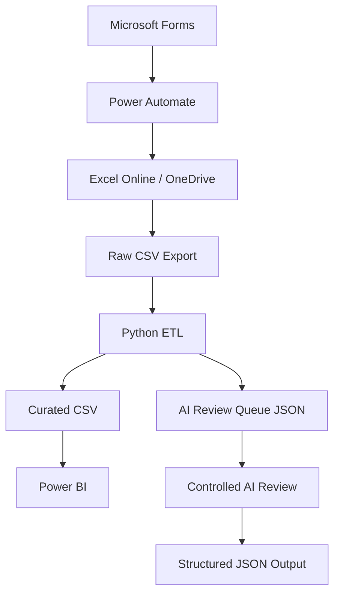
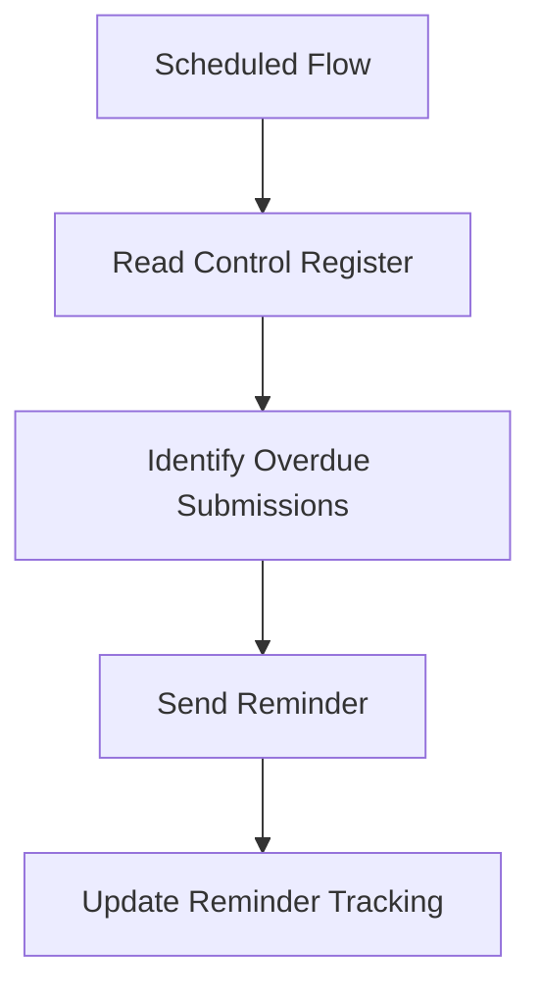

# Architecture

## Purpose

This document describes the initial architecture of the Cyber Governance Automation Lab.

It is a simplified cybersecurity control evidence process built as a portfolio proof of concept. The system is not production-ready. Its focus is a small, traceable, end-to-end data flow rather than a fully engineered platform.

## High-Level Architecture

## Scheduled Reminder Workflow

## Component Responsibilities

### Microsoft Forms

* Collects evidence submissions from control owners.

### Power Automate

* Processes evidence submissions.
* Validates required information.
* Writes data to the central register.
* Sends confirmations.
* Identifies overdue submissions.
* Sends reminders.
* Creates reporting snapshots.

### Excel Online / OneDrive

* Excel Online provides the tabular control register used by the workflow.
* OneDrive provides the underlying file storage for the portfolio proof of concept.
* This combination is chosen deliberately for its low complexity and direct Power Automate integration.
* For a production environment, Dataverse, SharePoint Lists, or a relational database would be more appropriate.

### Python

* Reads CSV and JSON data.
* Normalizes values.
* Applies data quality rules.
* Merges control reference data with submission data.
* Computes derived fields.
* Produces a curated reporting dataset.
* Produces structured AI review inputs.

### Power BI

* Provides governance and management reporting based on curated data.

### Controlled AI Workflow

* May summarize supplied control information.
* May identify missing information.
* May recommend follow-up actions.
* May not autonomously set a control to compliant.
* Human review is mandatory.

## Architecture Principles

* Small and modular design.
* Explicit component responsibilities.
* Synthetic data only.
* No credentials or secrets in the repository.
* Human-in-the-loop for AI-assisted decisions.
* Data quality checks before reporting.
* Simple technology choices over unnecessary enterprise complexity.

## Business Model Reference

The technical architecture implements the governance process and data model defined in:

* [business_process.md](business_process.md)
* [data_model.md](data_model.md)
* [data_quality.md](data_quality.md)

## Out of Scope

* SIEM
* SOC operations
* Malware analysis
* Penetration testing
* Machine learning
* Kubernetes
* Kafka
* Spark
* Complex cloud infrastructure
* Custom frontend
* Enterprise authentication architecture
