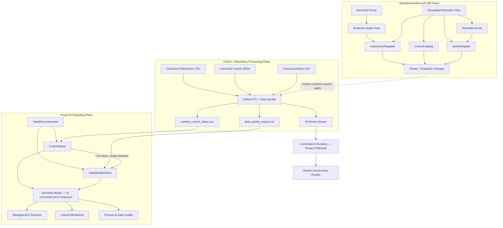

# Architecture

## Purpose

This document describes the **current architecture** of the Cyber Governance Automation Lab after completion of the Phase 8 Power BI reporting layer.

The project is a simplified cybersecurity-control evidence process built as a portfolio proof of concept. It is not production-ready. The architecture emphasizes explicit business semantics, traceable state transitions, deterministic Data Quality, controlled workflow automation, reproducible acceptance, and strict separation between operational Microsoft 365 state, canonical repository fixtures, curated reporting outputs, Power BI analytics, and later AI processing.

## 1. Architectural Overview

The system contains three implemented planes and one planned downstream capability:

```text
Operational Microsoft 365 plane
        ↓
Phase 7 reporting snapshot boundary
        ↓
Deterministic Python processing plane
        ↓
Phase 8 curated Power BI reporting plane
        ↓
Controlled AI runtime — Phase 9 planned
```

The key architecture rule is that each layer has a narrow responsibility:

```text
Power Automate exports and updates operational source facts.
Python owns deterministic validation and reporting derivation.
Power BI consumes curated facts and calculates contracted reporting measures.
AI remains downstream and cannot become the compliance authority.
```

### Operational Microsoft 365 plane

```text
Microsoft Forms
      ↓
Power Automate Evidence Intake
      ↓
Excel Online / OneDrive
      ├─ SubmissionRegister
      ├─ ControlCatalog
      └─ ActionRegister
      ↑
Power Automate Scheduled Reminder Flow
      ↓
Reminder Email

ControlCatalog + SubmissionRegister + ActionRegister
      ↓
Power Automate Weekly Reporting Snapshot
      ↓
Private snapshot package
```

Phase 5 implements authenticated evidence intake. Phase 6 implements scheduled overdue follow-up and reminder tracking. Phase 7 exports current operational source facts into a private snapshot package.

### Deterministic Python / repository plane

Canonical inputs:

```text
data/reference/control_catalog.json
data/raw/evidence_submissions.csv
data/raw/actions.csv
```

Alternative explicit Phase 7 operational inputs:

```text
security_control_snapshot_<snapshot_id>.json
security_submission_snapshot_<snapshot_id>.csv
security_action_snapshot_<snapshot_id>.csv
```

Both source modes use the same deterministic processing semantics:

```text
EXTRACT
  ↓
NORMALIZE
  ↓
VALIDATE
  ↓
TRANSFORM / ENRICH
  ↓
DERIVE
  ↓
LOAD
```

Runtime outputs:

```text
curated_control_status.csv
data_quality_issues.csv
ai_review_queue.json
```

The repository CSV/JSON datasets remain canonical synthetic acceptance fixtures. Operational snapshot processing does not overwrite them.

### Power BI reporting plane

Phase 8 uses the source-controlled project:

```text
powerbi/CyberGovernanceDashboard/
├── CyberGovernanceDashboard.pbip
├── CyberGovernanceDashboard.Report/
└── CyberGovernanceDashboard.SemanticModel/
```

Representation:

```text
PBIP → project container
PBIR → report metadata
TMDL → semantic-model source representation
```

Power BI loads exactly the two Python-curated reporting outputs through one configurable `DataRoot` parameter:

```text
DataRoot
   ├─ curated_control_status.csv → ControlStatus
   └─ data_quality_issues.csv    → DataQualityIssues
```

The reporting tables are related through raw-row lineage:

```text
ControlStatus[source_row_number]
          1
          │
          *
DataQualityIssues[source_row_number]
```

The relationship is active, one-to-many, single-direction, and filters from `ControlStatus` to `DataQualityIssues`.

The semantic layer contains exactly:

```text
ControlStatus       16 DAX measures
DataQualityIssues    5 DAX measures
-------------------------------
Total               21 measures

Calculated tables    0
Calculated columns   0
```

The completed report contains exactly three primary pages:

```text
Management Overview
Control Monitoring
Process & Data Quality
```

Both the canonical synthetic dataset and one private processed Phase 7 operational dataset have been accepted against this same model. Operational acceptance changed only the temporary `DataRoot` value in a temporary project copy; the source-controlled model and report were not rebuilt.

## 2. High-Level Architecture



The Phase 7 bridge is deliberately explicit rather than automatically synchronized. Power Automate creates private source snapshots; a caller explicitly supplies one coherent Control/Submission/Action source set and the matching `as_of_date` to Python. Power BI consumes Python-curated outputs rather than operational tables or raw snapshots.

## 3. Core Domain Model

The logical business model contains exactly four core entities:

```text
CONTROL
   │ 1:n
   ▼
SUBMISSION
   ├──────────────► ACTION
   └──────────────► DATA QUALITY ISSUE
```

Technical runtime metadata such as `snapshot_id`, `as_of_date`, `source_row_number`, manifests, Power Query parameters, or workflow branches do not create additional business entities.

Critical semantic separations:

```text
Evidence Present != Compliant
Not Submitted != Non-Compliant
Non-Compliant != Overdue
Compliance != Timeliness
Compliance != Data Quality
Submission Status != Action Status
Unknown != False
Not Evaluated != Failed
Action completion != Submission compliance
Control risk != DQ severity
```

These separations are enforced across workflow behavior, Python transformation, DAX semantics, and report design.

## 4. Canonical vs Operational State

The canonical files:

```text
data/reference/control_catalog.json
data/raw/evidence_submissions.csv
data/raw/actions.csv
```

represent a deterministic synthetic acceptance scenario evaluated at:

```text
as_of_date = 2026-08-15
```

Canonical source/result baseline:

```text
Controls loaded: 5
Submissions loaded: 15
Actions loaded: 5
DQ issues: 5
Valid submissions: 10
Invalid submissions: 5
AI review queue items: 2
```

Operational Microsoft 365 state evolves independently. The accepted Phase 7 operational snapshot observation is:

```text
snapshot_id = 20260823_112030
as_of_date  = 2026-08-23
Controls    = 5
Submissions = 17
Actions     = 2
DQ issues   = 5
Valid       = 12
Invalid     = 5
AI queue    = 3
```

Therefore:

```text
Operational Microsoft 365 state
!=
Canonical repository fixtures
```

Changing canonical fixtures merely to resemble later operational state would destroy reproducible regression evidence. Phase 7 connects the planes through explicit external files, not destructive synchronization.

## 5. Expected Submission Initialization

Expected Submission records exist before evidence arrives and start with:

```text
status = Not Submitted
```

Submission business key:

```text
control_id + reporting_period
```

Technical key:

```text
submission_id
```

Automatic future reporting-period generation is not implemented in the current PoC.

## 6. Phase 5 Evidence Intake

Implemented path:

```text
Microsoft Forms
      ↓
Read SubmissionRegister
      ↓
Resolve control_id + reporting_period
      ↓
Require exactly one match
      ↓
Require status = Not Submitted
      ↓
Update existing row by submission_id
      ↓
status = In Review
```

Evidence intake performs **UPDATE, not APPEND** and permits only:

```text
Not Submitted → In Review
```

It does not assign `Compliant` or `Non-Compliant`.

Controlled outcomes:

```text
NO_MATCH
DUPLICATE_BUSINESS_KEY
INVALID_SUBMISSION_STATE
```

See [phase5_evidence_intake.md](phase5_evidence_intake.md).

## 7. Phase 6 Scheduled Reminder Automation

Schedule:

```text
Daily 08:00
W. Europe Standard Time
```

Canonical overdue rule:

```text
submitted_at IS NULL
AND
as_of_date > due_date
```

The live workflow additionally requires `status = Not Submitted` as an operational consistency guard.

Control resolution:

```text
0 Control matches  → CONTROL_NOT_FOUND
1 Control match    → resolve owner
>1 Control matches → DUPLICATE_CONTROL
```

Active Action resolution:

```text
0 active Actions  → create one
1 active Action   → reuse it
>1 active Actions → DUPLICATE_ACTIVE_ACTION
```

Same-day idempotency:

```text
last_reminder_at == today
→ SAME_DAY_REMINDER_SKIPPED
```

A confirmed reminder updates:

```text
reminder_count
last_reminder_at
```

Known lifecycle limitation: the current Phase 5/6 PoC does not automatically complete a missing-submission Action after later evidence intake moves the related Submission to `In Review`.

See [phase6_reminder_automation.md](phase6_reminder_automation.md).

## 8. Phase 7 Reporting Snapshot Bridge

A successful run creates:

```text
security_control_snapshot_<snapshot_id>.json
security_submission_snapshot_<snapshot_id>.csv
security_action_snapshot_<snapshot_id>.csv
security_snapshot_manifest_<snapshot_id>.json
```

The manifest is written only after all three source artifacts succeed and acts as the completion marker.

Runtime schedule:

```text
Weekly
Monday
09:00
W. Europe Standard Time
```

Power Automate exports source facts only. It does not calculate compliance, apply DQ-001 through DQ-010, calculate overdue/lateness metrics, aggregate Actions, or repair source records.

Python external source overrides are all-or-none:

```text
--controls-path
--submissions-path
--actions-path
```

The manifest is not automatically ingested; the caller supplies its matching `as_of_date` explicitly.

The private operational package remains outside Git because it can contain authenticated identities, reachable owner addresses, comments, and deployment metadata.

See [phase7_end_to_end_acceptance.md](phase7_end_to_end_acceptance.md).

## 9. Operational Workbook Contract

### `ControlCatalog`

```text
control_id
control_name
control_statement
business_unit
owner_role
owner_email
frequency
risk_level
```

### `SubmissionRegister`

```text
submission_id
control_id
reporting_period
due_date
status
evidence_reference
submitted_at
submitted_by
comment
```

### `ActionRegister`

```text
action_id
control_id
submission_id
owner_email
created_at
due_date
status
reminder_count
last_reminder_at
description
```

The operational workbook remains private.

## 10. Python Reporting Contract

Submission remains the primary reporting grain.

Control enrichment:

```text
Submission LEFT JOIN Control
ON control_id
```

Action aggregation:

```text
reminder_count   = SUM(Action.reminder_count)
last_reminder_at = MAX(Action.last_reminder_at)
```

Active Action information is projected only from currently active Actions (`Open` or `In Progress`) under the existing Phase 6 contract.

Derived fields include:

```text
evidence_present
overdue_flag
submission_late
days_overdue
days_late
data_quality_status
active_action_id
active_action_status
active_action_due_date
reminder_count
last_reminder_at
```

Action-specific DQ rule IDs are not introduced. Python continues to apply DQ-001 through DQ-010 to Submission data.

Unknown or non-evaluable timing state remains null rather than being silently converted to `False` or `0`.

## 11. Phase 8 Power BI Reporting Architecture

Phase 8 is complete. Its dependency chain is:

```text
Phase 8.0  → reporting/KPI contract
Phase 8.1  → canonical acceptance baseline
Phase 8.2  → PBIP/PBIR/TMDL scaffold
Phase 8.3  → curated CSV loading and technical typing
Phase 8.4  → semantic-model relationship
Phase 8.5  → DAX measures
Phase 8.6  → Management Overview
Consistency review → semantic/documentation hardening
Phase 8.7  → Control Monitoring
Phase 8.8  → Process & Data Quality
Phase 8.9  → canonical runtime acceptance
Phase 8.10 → operational Phase 7 output acceptance
Phase 8.11 → public evidence, documentation and final regression closure
```

### 11.1 Source boundary and DataRoot

Power BI consumes exactly:

```text
curated_control_status.csv
data_quality_issues.csv
```

It does not read the operational Excel workbook, raw Phase 7 snapshots, canonical raw inputs, or `ai_review_queue.json` directly.

The semantic model contains the required text parameter:

```text
DataRoot
```

Both partitions use the parameter and append their own contractual filenames. This lets the same project consume either canonical generated output or a private processed Phase 7 output directory without rebuilding the semantic model.

The two Power Query partitions perform only:

```text
CSV load
→ promote headers
→ empty string to null
→ technical type assignment
```

They do not implement compliance, timing, DQ, Action, or AI business rules.

Automatic time intelligence is disabled.

### 11.2 Semantic model

Exactly two reporting tables exist:

```text
ControlStatus
DataQualityIssues
```

The semantic relationship is:

```text
ControlStatus[source_row_number]
          1
          │
          *
DataQualityIssues[source_row_number]
```

Behavior:

```text
Cardinality      = one-to-many
Filter direction = ControlStatus → DataQualityIssues
Status           = active
Relationships    = exactly 1
```

The relationship does not use `submission_id`, because missing or duplicate identifiers are valid DQ scenarios. `source_row_number` remains physically present in both tables but is hidden from report consumers.

The model contains exactly 21 DAX measures:

```text
ControlStatus       16 measures
DataQualityIssues    5 measures
Calculated tables    0
Calculated columns   0
```

The measure layer preserves the frozen reporting semantics:

- `Expected Submissions` keeps DQ-invalid source rows visible in expected volume,
- compliance measures operate on DQ-valid assessed records,
- `Controls in Scope` excludes unresolved Control enrichment such as canonical `CTRL-999`,
- timeliness measures operate on DQ-valid records,
- DQ-affected Submission counts use `source_row_number`, not potentially missing or duplicate `submission_id`,
- reminder/process measures consume Python-owned aggregation rather than reconstructing Action history,
- count/sum measures return explicit zero for known empty result sets,
- rate/average measures preserve blank when their denominator is zero.

Therefore:

```text
known count = 0
undefined ratio = blank
```

This aggregate representation does not rewrite nullable timing state.

The row-detail numeric attributes:

```text
days_overdue
days_late
reminder_count
```

use `summarizeBy: none`, preventing accidental additive presentation in Submission-grain detail visuals. Explicit aggregate reporting continues through DAX measures such as `[Total Automated Reminders]`.

### 11.3 Management Overview

The first report page contains:

```text
1 page title
3 slicers
6 KPI cards
3 analytical charts
-------------------
13 visuals
```

Primary slicers:

```text
Business Unit
Risk Level
Reporting Period
```

KPI cards:

```text
Controls in Scope
Assessed Compliance Rate
Non-Compliant Submissions
Overdue Submissions
High/Critical Exceptions
Total DQ Issues
```

Analytical views:

```text
Submission Status Distribution
Assessed Compliance Rate by Business Unit
High/Critical Exceptions by Risk Level
```

Canonical accepted values:

```text
5 / 80.0% / 1 / 1 / 2 / 5
```

### 11.4 Control Monitoring

The second report page contains:

```text
1 page title
5 slicers
1 Submission-grain detail table
-------------------------------
7 visuals
```

Primary slicers:

```text
Business Unit
Risk Level
Submission Status
Data Quality Status
Overdue
```

The detail table contains exactly:

```text
Control ID
Control Name
Business Unit
Risk Level
Reporting Period
Submission Status
Due Date
Evidence Present
Overdue
Days Overdue
Data Quality Status
Active Action Status
Active Action Due Date
Reminder Count
Last Reminder At
```

Business-friendly labels are PBIR presentation metadata only. The page does not add model aliases, calculated columns, new measures, or business logic.

Canonical acceptance observed 15 unfiltered Submission rows. Operational acceptance observed 17 rows with the same 15-field layout.

### 11.5 Process & Data Quality

The third report page intentionally separates operational follow-up behavior from Data Quality.

Process KPI cards:

```text
Total Automated Reminders
Active Follow-up Submissions
Submissions with Reminder History
Late Submissions
Overdue Submission Rate
```

Data Quality KPI cards:

```text
Total DQ Issues
DQ Issue Rate
High-Severity DQ Issues
```

Analytical/detail views:

```text
DQ Issues by Rule
DQ Issues by Severity
DQ Issue Details
```

The DQ detail table contains exactly:

```text
Submission ID
Control ID
Rule
Severity
Field
Message
```

Canonical accepted Process values:

```text
4 / 4 / 4 / 1 / 10.0%
```

Canonical accepted DQ values:

```text
5 / 33.3% / 5
```

Operational acceptance demonstrated the same page against the private 17-row dataset, including `3 / 2 / 2 / 2 / 16.7%` for the Process cards and `5 / 29.4% / 5` for DQ.

### 11.6 Canonical runtime acceptance

Phase 8.9 executed a full canonical Power BI refresh and formally accepted:

```text
ControlStatus      = 15 rows
DataQualityIssues  = 5 rows
Controls in Scope  = 5
```

All 21 measures matched their frozen canonical expected values. Known scenarios `SUB-004`, `SUB-005`, `SUB-014`, `SUB-015`, and all five DQ findings were verified. All three pages, slicers, cross-table filter propagation, zero-vs-blank behavior, and row-grain preservation passed.

The unresolved `CTRL-999` row remains visible but does not inflate Controls in Scope.

See [phase8_canonical_acceptance.md](phase8_canonical_acceptance.md).

### 11.7 Operational runtime acceptance

Phase 8.10 tested the already accepted private Phase 7 processed output without modifying the source-controlled project.

Acceptance method:

```text
source-controlled PBIP project
        ↓ copy to private temporary location
change temporary DataRoot only
        ↓
private processed Phase 7 output
        ↓
full Power BI refresh
```

Operational runtime:

```text
ControlStatus      = 17 rows
DataQualityIssues  = 5 rows
```

All 21 measures executed successfully. All values directly derivable from the Phase 7 acceptance contract matched their targets. The accepted reminder-state rows `SUB-016` and `SUB-017` were represented correctly without new columns, measures, relationships, or visuals.

After the operational test, the temporary PBIP copy and processed outputs were removed; the canonical pipeline was rerun and returned the original baseline; the complete Python suite still passed.

This proves:

```text
same PBIP / PBIR / TMDL model
+ different DataRoot
= canonical and operational reporting accepted
```

See [phase8_operational_acceptance.md](phase8_operational_acceptance.md).

### 11.8 Public dashboard evidence and final closure

Public screenshots are canonical-only and stored under:

```text
docs/images/phase8/management-overview.webp
docs/images/phase8/control-monitoring.webp
docs/images/phase8/process-data-quality.webp
```

No private operational screenshots are committed.

Final Phase 8 closure is documented in [phase8_final_acceptance.md](phase8_final_acceptance.md).

## 12. Controlled AI Boundary

AI queue eligibility remains:

```text
data_quality_status = Valid
AND
(
    submission_status = Non-Compliant
    OR
    overdue_flag = True
)
```

The queue is a minimized review-preparation artifact, not a compliance engine or DQ repair mechanism. Final compliance authority remains human.

The controlled AI runtime itself is planned for Phase 9 and is not implemented by Phase 8.

## 13. Storage and Privacy Boundary

Operational snapshots can contain:

```text
owner_email
submitted_by
comments
operational acceptance state
```

and therefore remain private.

The public repository can contain only:

- synthetic canonical fixtures,
- sanitized Power Automate source and screenshots,
- non-sensitive aggregate acceptance observations,
- source-controlled Power BI project/query/model/report metadata,
- canonical Power BI screenshots,
- documentation and automated test evidence.

The following remain outside Git:

- private Phase 7 snapshots,
- private processed operational outputs,
- reachable operational e-mail addresses,
- authenticated submitter identities,
- private comments,
- tenant/environment/connection/workbook identifiers,
- credentials and tokens,
- local Power BI cache/state,
- generated curated runtime outputs.

Power BI machine-local files remain outside Git through the project ignore boundary, including:

```text
**/.pbi/localSettings.json
**/.pbi/cache.abf
```

Generated Python curated runtime outputs remain ignored under:

```text
data/curated/
```

## 14. Consistency and Concurrency Boundary

Excel Online / OneDrive does not provide a transactional three-table snapshot for this PoC. Tables are read sequentially, so a concurrent Phase 5/6 write can theoretically occur between reads.

Mitigations are:

- one shared `snapshot_id`,
- short sequential reads,
- scheduled execution after the reminder run,
- manifest created only after all source artifacts succeed,
- explicit documentation of the limitation.

Phase 7 does not claim ACID or point-in-time transactional semantics. Phase 8 accepts the processed output contract; it does not remove this upstream limitation.

## 15. Component Responsibilities

### Microsoft Forms

- authenticated evidence intake,
- collects Control ID, reporting period, evidence reference, optional comment,
- does not collect a compliance decision.

### Power Automate Evidence Intake

- resolves one expected Submission,
- enforces business-key and current-state guardrails,
- updates intake-owned fields only.

### Power Automate Reminder Automation

- detects overdue missing Submissions,
- resolves accountable owner,
- creates/reuses one active follow-up Action,
- sends reminders,
- updates reminder tracking after successful delivery.

### Power Automate Reporting Snapshot

- exports exact operational source facts,
- creates completion provenance,
- fails explicitly on snapshot build errors.

### Excel Online / OneDrive

- stores operational PoC state and private snapshots,
- is not presented as a production transactional datastore.

### Python

- deterministic extract/normalize/validate/transform/derive/load,
- supports canonical and explicit external source modes,
- owns DQ, Control enrichment, Action aggregation, derived timing, curated reporting output, and AI queue preparation.

### Power BI

- PBIP/PBIR/TMDL project is source-controlled,
- `DataRoot` resolves the curated reporting directory,
- loads exactly `ControlStatus` and `DataQualityIssues`,
- implements the active one-to-many lineage relationship on `source_row_number`,
- hides technical relationship keys from report consumers,
- implements exactly 21 contracted DAX measures,
- represents known empty counts as zero while undefined ratios remain blank,
- keeps Submission-grain numeric detail attributes non-additive by default,
- implements Management Overview, Control Monitoring, and Process & Data Quality,
- has passed canonical and operational runtime acceptance,
- uses no calculated tables or calculated columns.

### Controlled AI Runtime

- planned for Phase 9,
- consumes minimized deterministic review candidates,
- must remain advisory and human-governed.

## 16. Repository Governance Boundary

GitHub Actions runs the complete Python test suite for pull requests targeting `main` and pushes to `main`.

Current CI is active, but the Python check is not enforced as a required merge gate by repository rules.

Operational snapshot artifacts, private workbook data, credentials, tokens, tenant identifiers, connection bindings, local Power BI cache/state, generated curated outputs, and private deployment packages do not belong in version control.

Phase-specific historical documents remain valid for the phase they describe. Current-state foundation documents plus later acceptance evidence define the present architecture.

## 17. Architecture Principles

- Expected state exists before observed evidence.
- Evidence submission is not a compliance decision.
- Business identity and technical identity are separate.
- Compliance, timeliness, Data Quality, and workflow state are separate dimensions.
- Reminder state belongs to Action, not Submission compliance state.
- Source records are not silently repaired to make processing convenient.
- Evidence intake performs update, not append.
- Ambiguous workflow state fails safely.
- Same-day reminder execution is idempotent.
- Operational and canonical data planes remain distinct.
- Phase 7 is an explicit reporting bridge, not destructive or automatic synchronization.
- A completion manifest distinguishes valid snapshots from partial artifacts.
- Python semantics are reused for canonical and operational source sets.
- Power BI consumes curated outputs rather than duplicating upstream business logic.
- Power Query performs technical ingestion only.
- Power BI relates Submission-grain reporting to DQ issue grain through technical raw-row lineage rather than unreliable business identifiers.
- DAX implements contracted reporting measures without inventing a composite overall status or redefining Python-owned business rules.
- Known empty aggregate counts are represented as zero; undefined ratios remain blank.
- Null/non-evaluable timing state remains null rather than becoming false/zero.
- Submission-grain detail attributes are not additively summarized by default.
- Power BI project/report/model definitions are version-controlled separately from machine-local cache and generated reporting data.
- The same semantic model must work across canonical and operational curated outputs through configuration, not rebuilding.
- AI processing remains downstream of deterministic validation.
- Final compliance authority remains human.
- Excel/OneDrive is a PoC boundary, not an enterprise architecture claim.

## 18. Current Limitations

Phase 8 completion does not make the lab a production governance platform. Current limitations include:

- no automatic expected-Submission generation,
- no automatic completion of missing-submission Actions after later evidence intake,
- no transactional multi-table snapshot guarantee,
- no automatic manifest ingestion or latest-snapshot discovery,
- no scheduled Python snapshot-processing service,
- no Action-specific DQ rule catalog,
- no production-grade IAM/RBAC, DLP, audit, monitoring, retention, or telemetry architecture,
- the canonical fixture does not directly exercise a runtime null example for every nullable timing column,
- `DataRoot` must be configured for the relevant local clone or processed-output directory,
- no Power BI Service/Fabric deployment architecture, gateway, deployment pipeline, or enterprise RLS implementation,
- no external AI invocation yet,
- no REST API implementation yet,
- CI is not configured as an enforced required merge gate.

## 19. References

Current-state foundation:

- [business_process.md](business_process.md)
- [data_model.md](data_model.md)
- [data_contract.md](data_contract.md)
- [data_quality.md](data_quality.md)

Phase-specific evidence:

- [phase3_pipeline_contract.md](phase3_pipeline_contract.md)
- [phase4_test_acceptance.md](phase4_test_acceptance.md)
- [phase5_evidence_intake.md](phase5_evidence_intake.md)
- [phase6_reminder_automation.md](phase6_reminder_automation.md)
- [phase7_reporting_export.md](phase7_reporting_export.md)
- [phase7_power_automate_acceptance.md](phase7_power_automate_acceptance.md)
- [phase7_python_external_input.md](phase7_python_external_input.md)
- [phase7_end_to_end_acceptance.md](phase7_end_to_end_acceptance.md)
- [phase8_power_bi_contract.md](phase8_power_bi_contract.md)
- [phase8_canonical_baseline.md](phase8_canonical_baseline.md)
- [phase8_power_bi_project.md](phase8_power_bi_project.md)
- [phase8_curated_loading.md](phase8_curated_loading.md)
- [phase8_semantic_model.md](phase8_semantic_model.md)
- [phase8_measures.md](phase8_measures.md)
- [phase8_management_overview.md](phase8_management_overview.md)
- [phase8_consistency_review.md](phase8_consistency_review.md)
- [phase8_control_monitoring.md](phase8_control_monitoring.md)
- [phase8_process_data_quality.md](phase8_process_data_quality.md)
- [phase8_canonical_acceptance.md](phase8_canonical_acceptance.md)
- [phase8_operational_acceptance.md](phase8_operational_acceptance.md)
- [phase8_final_acceptance.md](phase8_final_acceptance.md)

Historical phase-specific documents remain valid for the phase they describe. Current-state foundation documents, implementation code, canonical datasets, automated tests, and later acceptance evidence define the present architecture.
