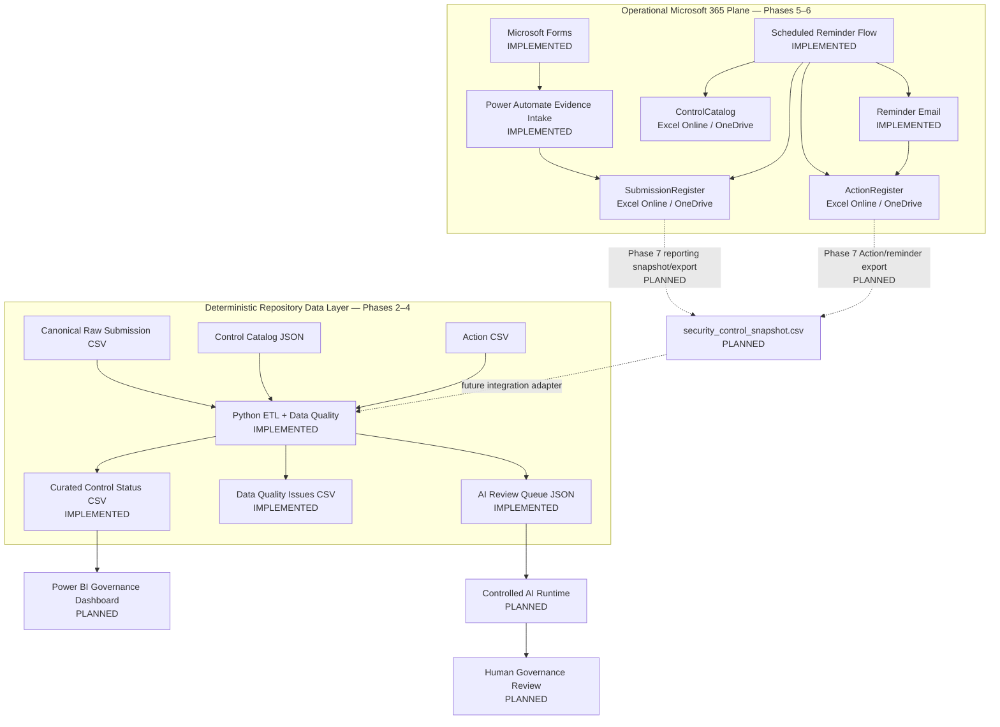
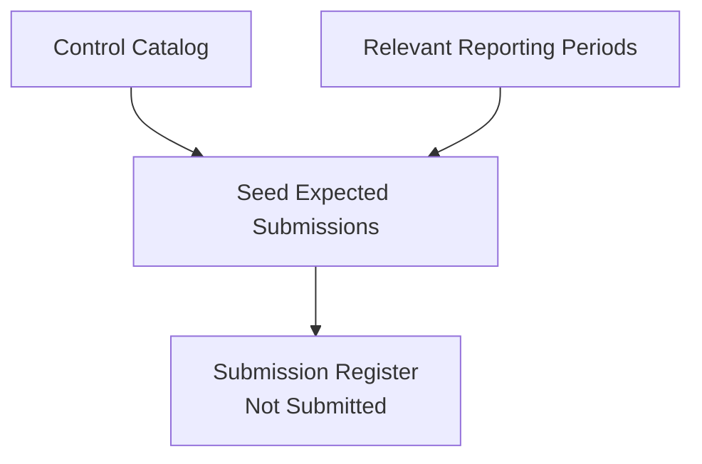
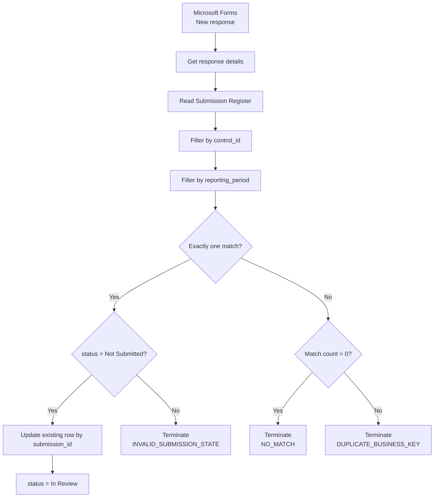

# Architecture

## Purpose

This document describes the current architecture of the Cyber Governance Automation Lab.

The project is a simplified cybersecurity-control evidence process built as a portfolio proof of concept. It is not production-ready. The architecture emphasizes explicit business semantics, traceable state transitions, deterministic Data Quality checks, controlled workflow automation, and small technology choices over unnecessary platform complexity.

## Current Architecture and Data-Plane Boundary

The project contains two deliberately distinct data planes that must not be conflated.

### Operational Microsoft 365 plane — Phases 5–6

```text
Microsoft Forms
      ↓
Power Automate Evidence Intake
      ↓
Excel Online / OneDrive
      ├─ SubmissionRegister
      ├─ ControlCatalog
      └─ ActionRegister
      ↑
Power Automate Scheduled Reminder Flow
```

Phase 5 implements authenticated evidence intake. Phase 6 implements scheduled overdue detection, Control-owner resolution, Action creation/reuse, reminder delivery, and reminder tracking.

### Deterministic repository data plane — Phases 2–4

```text
data/reference/control_catalog.json
                    ┐
data/raw/evidence_submissions.csv ──► Python ETL + Data Quality
data/raw/actions.csv                ┘
                                    ↓
                         data/curated/*
```

The repository raw CSV/JSON files are canonical synthetic acceptance fixtures. They are **not** automatically generated from the live Microsoft 365 workbook.

## High-Level Architecture



Phase 7 remains the planned bridge between the operational Microsoft 365 plane and later repository/reporting integration.

## Why the Operational Workbook Does Not Replace the Canonical Raw Dataset

The Phase 5 happy-path acceptance test updated the operational Excel record for `SUB-014` from `Not Submitted` to `In Review` on the live test date.

Phase 6 later added operational acceptance fixtures and live Actions to validate reminder automation.

The repository files:

```text
data/raw/evidence_submissions.csv
data/raw/actions.csv
```

intentionally remain unchanged. In the canonical synthetic dataset, `SUB-014` remains `Not Submitted` because the deterministic Phase 2–4 acceptance scenario is evaluated at:

```text
as_of_date = 2026-08-15
```

Changing repository fixtures merely to mirror later operational tests would destroy the deterministic acceptance baseline. The operational workbook and repository data therefore serve different purposes.

## Expected Submission Initialization

Expected Submission records are pre-generated for the relevant synthetic reporting periods. Each expected record is seeded with:

```text
status = Not Submitted
```

This is a critical modeling decision. The system can only detect a missing submission when an expected state exists before observed evidence arrives.



The Submission business key is:

```text
control_id + reporting_period
```

The technical key is:

```text
submission_id
```

## Phase 5 Evidence-Intake Workflow

Phase 5 implements the operational Microsoft Forms → Power Automate → Excel path.



The evidence-intake workflow performs **UPDATE, not APPEND** and only allows:

```text
Not Submitted → In Review
```

It does not assign `Compliant` or `Non-Compliant`.

See [power_automate.md](power_automate.md) for the Phase 5 workflow contract and acceptance evidence.

## Phase 6 Scheduled Reminder Workflow

Phase 6 is implemented as a separate scheduled Power Automate flow:

```text
Cyber Governance - Overdue Submission Reminder
```

Schedule:

```text
Daily at 08:00
W. Europe Standard Time
```

Implemented architecture:


Reminder state belongs to the Action workflow rather than the Submission compliance state.

Canonical overdue rule:

```text
submitted_at IS NULL
AND
as_of_date > due_date
```

The implementation additionally requires `status = Not Submitted` as an operational guardrail. It must not collapse overdue state into a generic `status != Compliant` condition.

### Action cardinality invariant

For missing-submission follow-up, the flow expects at most one active Action for a Submission:

```text
status = Open OR In Progress
```

Resolution behavior:

```text
0 active Actions → create one
1 active Action  → reuse it
>1 active Actions → DUPLICATE_ACTIVE_ACTION
```

The flow does not choose an arbitrary Action when state is ambiguous.

### Same-day idempotency

If an existing Action has already been reminded on the current local processing date:

```text
last_reminder_at == today
```

then:

```text
SAME_DAY_REMINDER_SKIPPED
```

No e-mail is sent and the reminder counter is not incremented.

See [phase6_reminder_automation.md](phase6_reminder_automation.md) for the complete Phase 6 contract and acceptance evidence.

## Operational Workbook Contract

Phase 6 extends the operational workbook with three physical tables representing existing business entities.

### `SubmissionRegister`

```text
submission_id
control_id
reporting_period
due_date
status
evidence_reference
submitted_at
submitted_by
comment
```

### `ControlCatalog`

```text
control_id
control_name
control_statement
business_unit
owner_role
owner_email
frequency
risk_level
```

### `ActionRegister`

```text
action_id
control_id
submission_id
owner_email
created_at
due_date
status
reminder_count
last_reminder_at
description
```

The workbook is not committed because live testing can contain authenticated organizational identities and reachable test recipients.

## Component Responsibilities

### Microsoft Forms

- collects Control ID, reporting period, evidence reference, and optional comment,
- restricts intake to authenticated organizational users in the PoC,
- records responder identity,
- does not collect compliance decisions.

### Power Automate — Evidence Intake

- reacts to new Form responses,
- resolves the Submission business key,
- validates match cardinality and current state,
- updates the expected Submission,
- terminates explicitly on controlled Phase 5 failure states.

### Power Automate — Reminder Automation

- runs daily on a controlled local schedule,
- reads operational Submission, Control, and Action tables,
- applies the canonical overdue rule,
- resolves the accountable Control Owner,
- creates or reuses a single active follow-up Action,
- sends reminder e-mail,
- increments reminder tracking only after successful send,
- prevents same-day duplicate reminders,
- fails safely on missing/duplicate Controls and duplicate active Actions.

### Excel Online / OneDrive

- stores operational Submission, Control, and Action state,
- provides low-complexity Microsoft 365 integration for the PoC,
- is intentionally not presented as a production transactional datastore,
- is not automatically synchronized into repository raw files before Phase 7.

For production, Dataverse, SharePoint Lists, or a relational database would generally be preferable where stronger concurrency, auditability, and transactional behavior are required.

### Python

- reads canonical repository CSV and JSON inputs,
- normalizes technical representation,
- applies DQ-001 through DQ-010,
- enriches Submission data with Control metadata,
- preserves invalid records and lineage,
- derives governance/timeliness fields,
- produces curated reporting data,
- produces a data-minimized AI review queue.

### Power BI

Planned to provide governance, Data Quality, and Process Impact reporting based on curated/reporting snapshot outputs.

Phase 6 now produces the operational fields needed for future reminder metrics:

```text
reminder_count
last_reminder_at
```

### Controlled AI Workflow

Planned to review selected Data-Quality-valid exceptions. AI output is advisory and may not autonomously assign compliance status.

## Repository Governance Boundary

GitHub Actions runs the Python test suite for pull requests and pushes to `main`.

Current repository metadata marks `main` as protected, but required status-check enforcement is not currently active in classic branch protection. CI is active, but it is not presently a guaranteed merge gate.

If strict repository governance is intended, the required `Python tests / test` check must be enforced in GitHub branch/ruleset settings.

## Architecture Principles

- Expected state exists before observed evidence.
- Evidence submission is not a compliance decision.
- Business identity and technical identity are separate.
- Compliance, timeliness, Data Quality, and workflow state are separate dimensions.
- Reminder state belongs to Action, not Submission compliance state.
- Invalid or ambiguous data is rejected explicitly; it is not silently repaired.
- Evidence intake performs update, not append.
- Reminder automation creates at most one active follow-up Action per Submission.
- Same-day reminder execution is idempotent.
- The live operational workbook and canonical repository raw dataset are separate artifacts.
- Cross-platform snapshot/export is not claimed before Phase 7 implements it.
- AI-assisted processing is downstream of deterministic validation.
- Actual evidence files are not stored in the repository.
- Synthetic repository data only.
- No credentials, tokens, keys, or secrets in version control.
- Human-in-the-loop for compliance decisions.
- Excel/OneDrive is a PoC boundary, not an enterprise architecture claim.

## Business Model Reference

The architecture implements the governance process and data model defined in:

- [business_process.md](business_process.md)
- [data_model.md](data_model.md)
- [data_contract.md](data_contract.md)
- [data_quality.md](data_quality.md)
- [power_automate.md](power_automate.md)
- [phase6_reminder_automation.md](phase6_reminder_automation.md)

Historical phase-specific acceptance documents remain valid for the phase they describe and are not rewritten merely to read like current-state documentation.

## Out of Scope

- SIEM / SOC operations
- malware analysis
- penetration testing
- Kubernetes
- Kafka / Spark infrastructure for this project
- custom frontend
- enterprise authentication architecture
- production evidence-document repository
- production-grade Power Platform monitoring and alerting
- production escalation/SLA engine
