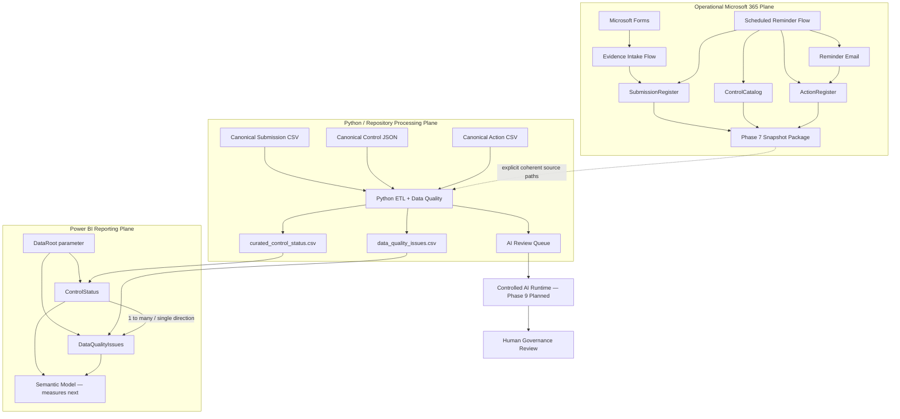

# Architecture

## Purpose

This document describes the **current architecture** of the Cyber Governance Automation Lab.

The project is a simplified cybersecurity-control evidence process built as a portfolio proof of concept. It is not production-ready. The architecture emphasizes explicit business semantics, traceable state transitions, deterministic Data Quality, controlled workflow automation, reproducible acceptance, and strict separation between operational Microsoft 365 state, canonical repository fixtures, curated reporting outputs, and later AI processing.

## 1. Architectural Overview

The project contains two data planes connected by a controlled Phase 7 reporting bridge and consumed by a Phase 8 Power BI reporting layer.

### Operational Microsoft 365 plane

```text
Microsoft Forms
      ↓
Power Automate Evidence Intake
      ↓
Excel Online / OneDrive
      ├─ SubmissionRegister
      ├─ ControlCatalog
      └─ ActionRegister
      ↑
Power Automate Scheduled Reminder Flow
      ↓
Reminder Email

ControlCatalog + SubmissionRegister + ActionRegister
      ↓
Power Automate Weekly Reporting Snapshot
      ↓
Private snapshot package
```

Phase 5 implements authenticated evidence intake. Phase 6 implements scheduled overdue follow-up and reminder tracking. Phase 7 exports current operational source facts into a private snapshot package.

### Deterministic Python / repository plane

Canonical inputs:

```text
data/reference/control_catalog.json
data/raw/evidence_submissions.csv
data/raw/actions.csv
```

Alternative Phase 7 operational inputs:

```text
security_control_snapshot_<snapshot_id>.json
security_submission_snapshot_<snapshot_id>.csv
security_action_snapshot_<snapshot_id>.csv
```

Both modes use the same deterministic processing semantics:

```text
EXTRACT
  ↓
NORMALIZE
  ↓
VALIDATE
  ↓
TRANSFORM / ENRICH
  ↓
DERIVE
  ↓
LOAD
```

Outputs:

```text
curated_control_status.csv
data_quality_issues.csv
ai_review_queue.json
```

The repository CSV/JSON datasets remain canonical synthetic acceptance fixtures. Operational snapshot processing does not overwrite them.

### Power BI reporting plane

Phase 8 uses the source-controlled project:

```text
powerbi/CyberGovernanceDashboard/
├── CyberGovernanceDashboard.pbip
├── CyberGovernanceDashboard.Report/
└── CyberGovernanceDashboard.SemanticModel/
```

The project uses:

```text
PBIP → project container
PBIR → report metadata
TMDL → semantic-model source representation
```

Phase 8.3 loads exactly the two curated reporting outputs through a configurable `DataRoot` parameter:

```text
DataRoot
   ├─ curated_control_status.csv → ControlStatus
   └─ data_quality_issues.csv    → DataQualityIssues
```

Phase 8.4 connects the two reporting tables through the technical lineage key:

```text
ControlStatus[source_row_number]
          1
          │
          *
DataQualityIssues[source_row_number]
```

The relationship is active, single-direction, and filters from `ControlStatus` to `DataQualityIssues`. DAX measures begin in Phase 8.5.

## 2. High-Level Architecture



The Phase 7 bridge is deliberately explicit rather than automatically synchronized. Power Automate creates a private source snapshot; a caller explicitly supplies all three snapshot paths and the matching manifest `as_of_date` to Python. Power BI consumes Python-curated outputs rather than operational source tables.

## 3. Core Domain Model

The logical business model contains exactly four core entities:

```text
CONTROL
   │ 1:n
   ▼
SUBMISSION
   ├──────────────► ACTION
   └──────────────► DATA QUALITY ISSUE
```

Technical runtime metadata such as `snapshot_id`, `as_of_date`, `source_row_number`, manifests, Power Query parameters, or workflow branches do not create additional business entities.

Critical semantic separations:

```text
Evidence Present != Compliant
Not Submitted != Non-Compliant
Non-Compliant != Overdue
Compliance != Timeliness
Compliance != Data Quality
Submission Status != Action Status
Unknown != False
Not Evaluated != Failed
Action completion != Submission compliance
Control risk != DQ severity
```

## 4. Canonical vs Operational State

The canonical files:

```text
data/reference/control_catalog.json
data/raw/evidence_submissions.csv
data/raw/actions.csv
```

represent a deterministic synthetic acceptance scenario evaluated at:

```text
as_of_date = 2026-08-15
```

Operational Microsoft 365 state evolved later during Phase 5–7 acceptance. Changing canonical fixtures merely to resemble later live PoC state would destroy reproducible regression evidence.

Therefore:

```text
Operational Microsoft 365 state
!=
Canonical repository fixtures
```

Phase 7 connects the planes through explicit external files, not destructive synchronization.

## 5. Expected Submission Initialization

Expected Submission records exist before evidence arrives and start with:

```text
status = Not Submitted
```

Submission business key:

```text
control_id + reporting_period
```

Technical key:

```text
submission_id
```

Automatic future reporting-period generation is not implemented in the current PoC.

## 6. Phase 5 Evidence Intake

Implemented path:

```text
Microsoft Forms
      ↓
Read SubmissionRegister
      ↓
Resolve control_id + reporting_period
      ↓
Require exactly one match
      ↓
Require status = Not Submitted
      ↓
Update existing row by submission_id
      ↓
status = In Review
```

Evidence intake performs **UPDATE, not APPEND** and permits only:

```text
Not Submitted → In Review
```

It does not assign `Compliant` or `Non-Compliant`.

Controlled outcomes:

```text
NO_MATCH
DUPLICATE_BUSINESS_KEY
INVALID_SUBMISSION_STATE
```

See [phase5_evidence_intake.md](phase5_evidence_intake.md).

## 7. Phase 6 Scheduled Reminder Automation

Schedule:

```text
Daily 08:00
W. Europe Standard Time
```

Canonical overdue rule:

```text
submitted_at IS NULL
AND
as_of_date > due_date
```

The live workflow additionally requires `status = Not Submitted` as an operational consistency guard.

Control resolution:

```text
0 Control matches  → CONTROL_NOT_FOUND
1 Control match    → resolve owner
>1 Control matches → DUPLICATE_CONTROL
```

Active Action resolution:

```text
0 active Actions  → create one
1 active Action   → reuse it
>1 active Actions → DUPLICATE_ACTIVE_ACTION
```

Same-day idempotency:

```text
last_reminder_at == today
→ SAME_DAY_REMINDER_SKIPPED
```

A confirmed reminder updates:

```text
reminder_count
last_reminder_at
```

Known lifecycle limitation: the current Phase 5/6 PoC does not automatically complete a missing-submission Action after later evidence intake moves the related Submission to `In Review`.

## 8. Phase 7 Reporting Snapshot Bridge

A successful run creates:

```text
security_control_snapshot_<snapshot_id>.json
security_submission_snapshot_<snapshot_id>.csv
security_action_snapshot_<snapshot_id>.csv
security_snapshot_manifest_<snapshot_id>.json
```

The manifest is written only after all three source artifacts succeed and acts as the completion marker.

Runtime schedule:

```text
Weekly
Monday
09:00
W. Europe Standard Time
```

Power Automate exports source facts only. It does not calculate compliance, apply DQ-001 through DQ-010, calculate overdue/lateness metrics, aggregate Actions, or repair source records.

Python external source overrides are all-or-none:

```text
--controls-path
--submissions-path
--actions-path
```

The manifest is not automatically ingested; the caller supplies its matching `as_of_date` explicitly.

Accepted operational snapshot observation:

```text
snapshot_id = 20260823_112030
as_of_date  = 2026-08-23
Controls    = 5
Submissions = 17
Actions     = 2
DQ issues   = 5
Valid       = 12
Invalid     = 5
AI queue    = 3
```

The canonical acceptance baseline remained unchanged and the complete Python suite remained 53 passing tests.

## 9. Operational Workbook Contract

### `ControlCatalog`

```text
control_id
control_name
control_statement
business_unit
owner_role
owner_email
frequency
risk_level
```

### `SubmissionRegister`

```text
submission_id
control_id
reporting_period
due_date
status
evidence_reference
submitted_at
submitted_by
comment
```

### `ActionRegister`

```text
action_id
control_id
submission_id
owner_email
created_at
due_date
status
reminder_count
last_reminder_at
description
```

The operational workbook remains private.

## 10. Python Reporting Contract

Submission remains the primary reporting grain.

Control enrichment:

```text
Submission LEFT JOIN Control
ON control_id
```

Action aggregation:

```text
reminder_count   = SUM(Action.reminder_count)
last_reminder_at = MAX(Action.last_reminder_at)
```

Derived fields include:

```text
evidence_present
overdue_flag
submission_late
days_overdue
days_late
data_quality_status
active_action_id
active_action_status
active_action_due_date
reminder_count
last_reminder_at
```

Action-specific DQ rule IDs are not introduced by Phase 7. Python continues to apply DQ-001 through DQ-010 to Submission data.

## 11. Phase 8 Reporting Boundary

Power BI consumes exactly:

```text
curated_control_status.csv
data_quality_issues.csv
```

It does not read the operational Excel workbook, raw Phase 7 snapshots, canonical raw inputs, or `ai_review_queue.json` directly.

Dependency chain:

```text
Phase 8.0 → reporting/KPI contract
Phase 8.1 → canonical acceptance baseline
Phase 8.2 → PBIP/PBIR/TMDL scaffold
Phase 8.3 → curated CSV loading and technical typing
Phase 8.4 → semantic-model relationship
Phase 8.5 → DAX measures
```

### Current model state after Phase 8.4

The semantic model contains a required text parameter:

```text
DataRoot
```

and exactly two reporting tables:

```text
ControlStatus
DataQualityIssues
```

Canonical Power BI load acceptance remains:

```text
ControlStatus       = 15 rows / 25 columns
DataQualityIssues   = 5 rows / 8 columns
Model tables        = exactly 2
```

The two Power Query partitions perform only:

```text
CSV load
→ promote headers
→ empty string to null
→ technical type assignment
```

They do not implement compliance, timing, DQ, Action, or AI business rules.

Automatic time intelligence is disabled.

The semantic relationship is now implemented as:

```text
ControlStatus[source_row_number]
          1
          │
          *
DataQualityIssues[source_row_number]
```

Behavior:

```text
Cardinality      = one-to-many
Filter direction = ControlStatus → DataQualityIssues
Status           = active
Relationships    = exactly 1
```

The relationship does not use `submission_id`, because missing or duplicate Submission identifiers are valid Data Quality scenarios. `source_row_number` remains physically present in both tables but is hidden from report consumers.

No DAX measures, calculated columns, calculated tables, or final report visuals are implemented at the Phase 8.4 boundary.

See:

- [phase8_power_bi_contract.md](phase8_power_bi_contract.md)
- [phase8_canonical_baseline.md](phase8_canonical_baseline.md)
- [phase8_power_bi_project.md](phase8_power_bi_project.md)
- [phase8_curated_loading.md](phase8_curated_loading.md)
- [phase8_semantic_model.md](phase8_semantic_model.md)

## 12. Controlled AI Boundary

AI queue eligibility remains:

```text
data_quality_status = Valid
AND
(
    submission_status = Non-Compliant
    OR
    overdue_flag = True
)
```

The queue is a minimized review-preparation artifact, not a compliance engine or DQ repair mechanism. Final compliance authority remains human.

## 13. Storage and Privacy Boundary

Operational snapshots may contain:

```text
owner_email
submitted_by
comments
operational acceptance state
```

and therefore remain private.

The public repository may contain only sanitized screenshots, sanitized Power Automate source, synthetic examples, non-sensitive acceptance observations, and source-controlled Power BI project/query/model metadata that contains no embedded reporting rows or private connection state.

Power BI machine-local files remain outside Git through:

```text
**/.pbi/localSettings.json
**/.pbi/cache.abf
```

Generated Python curated runtime outputs remain ignored under:

```text
data/curated/
```

The TMDL `DataRoot` parameter stores an authoring path that can be changed for another clone or later operational processed-output directory.

## 14. Consistency and Concurrency Boundary

Excel Online / OneDrive does not provide a transactional three-table snapshot for this PoC. Tables are read sequentially, so a concurrent Phase 5/6 write can theoretically occur between reads.

Mitigations are:

- one shared `snapshot_id`,
- short sequential reads,
- scheduled execution after the reminder run,
- manifest created only after all source artifacts succeed,
- explicit documentation of the limitation.

Phase 7 does not claim ACID or point-in-time transactional semantics.

## 15. Component Responsibilities

### Microsoft Forms

- authenticated evidence intake,
- collects Control ID, reporting period, evidence reference, optional comment,
- does not collect a compliance decision.

### Power Automate Evidence Intake

- resolves one expected Submission,
- enforces business-key and current-state guardrails,
- updates intake-owned fields only.

### Power Automate Reminder Automation

- detects overdue missing Submissions,
- resolves accountable owner,
- creates/reuses one active follow-up Action,
- sends reminders,
- updates reminder tracking after successful delivery.

### Power Automate Reporting Snapshot

- exports exact operational source facts,
- creates completion provenance,
- fails explicitly on snapshot build errors.

### Excel Online / OneDrive

- operational PoC state and private snapshots,
- not presented as a production transactional datastore.

### Python

- deterministic extract/normalize/validate/transform/derive/load,
- canonical and explicit external source modes,
- DQ, Control enrichment, Action aggregation, and derived reporting metrics.

### Power BI

- PBIP/PBIR/TMDL project is source-controlled,
- `DataRoot` resolves the curated reporting directory,
- `ControlStatus` and `DataQualityIssues` are technically loaded and typed,
- the active one-to-many lineage relationship is implemented on `source_row_number`,
- technical relationship keys are hidden from report consumers,
- no DAX measure exists yet,
- later Phase 8 work packages own KPI measures and report pages.

### Controlled AI Runtime

Planned for Phase 9 and not yet implemented.

## 16. Repository Governance Boundary

GitHub Actions runs the complete Python test suite for pull requests targeting `main` and pushes to `main`.

Current CI is active, but the Python check is not enforced as a required merge gate by repository rules.

Operational snapshot artifacts, private workbook data, credentials, tokens, tenant identifiers, connection bindings, local Power BI cache/state, generated curated outputs, and private deployment packages do not belong in version control.

## 17. Architecture Principles

- Expected state exists before observed evidence.
- Evidence submission is not a compliance decision.
- Business identity and technical identity are separate.
- Compliance, timeliness, Data Quality, and workflow state are separate dimensions.
- Reminder state belongs to Action, not Submission compliance state.
- Source records are not silently repaired to make processing convenient.
- Evidence intake performs update, not append.
- Ambiguous workflow state fails safely.
- Same-day reminder execution is idempotent.
- Operational and canonical data planes remain distinct.
- Phase 7 is an explicit reporting bridge, not destructive or automatic synchronization.
- A completion manifest distinguishes valid snapshots from partial artifacts.
- Python semantics are reused for both canonical and operational source sets.
- Power BI consumes curated outputs rather than duplicating upstream business logic.
- Power Query performs technical ingestion only.
- Power BI relates Submission-grain reporting to DQ issue grain through technical raw-row lineage rather than unreliable business identifiers.
- Null/non-evaluable timing state remains null rather than becoming false/zero.
- Power BI project/report/model definitions are version-controlled separately from machine-local cache and generated reporting data.
- AI processing remains downstream of deterministic validation.
- Final compliance authority remains human.
- Excel/OneDrive is a PoC boundary, not an enterprise architecture claim.

## 18. Current Limitations

- no automatic expected-Submission generation,
- no automatic completion of missing-submission Actions after later evidence intake,
- no transactional multi-table snapshot guarantee,
- no automatic manifest ingestion or latest-snapshot discovery,
- no scheduled Python snapshot-processing service,
- no Action-specific DQ rule catalog,
- no production-grade IAM/RBAC, DLP, audit, monitoring, retention, or telemetry architecture,
- Power BI curated-source loading and the semantic relationship exist, but DAX measures and final visuals are not implemented yet,
- `DataRoot` must be configured for the relevant local clone or processed-output directory,
- no external AI invocation,
- no REST API implementation.

## 19. References

Current-state foundation:

- [business_process.md](business_process.md)
- [data_model.md](data_model.md)
- [data_contract.md](data_contract.md)
- [data_quality.md](data_quality.md)

Phase-specific evidence:

- [phase3_pipeline_contract.md](phase3_pipeline_contract.md)
- [phase4_test_acceptance.md](phase4_test_acceptance.md)
- [phase5_evidence_intake.md](phase5_evidence_intake.md)
- [phase6_reminder_automation.md](phase6_reminder_automation.md)
- [phase7_reporting_export.md](phase7_reporting_export.md)
- [phase7_power_automate_acceptance.md](phase7_power_automate_acceptance.md)
- [phase7_python_external_input.md](phase7_python_external_input.md)
- [phase7_end_to_end_acceptance.md](phase7_end_to_end_acceptance.md)
- [phase8_power_bi_contract.md](phase8_power_bi_contract.md)
- [phase8_canonical_baseline.md](phase8_canonical_baseline.md)
- [phase8_power_bi_project.md](phase8_power_bi_project.md)
- [phase8_curated_loading.md](phase8_curated_loading.md)
- [phase8_semantic_model.md](phase8_semantic_model.md)

Historical phase-specific documents remain valid for the phase they describe. Current-state foundation documents, implementation code, and final acceptance evidence define the present architecture.