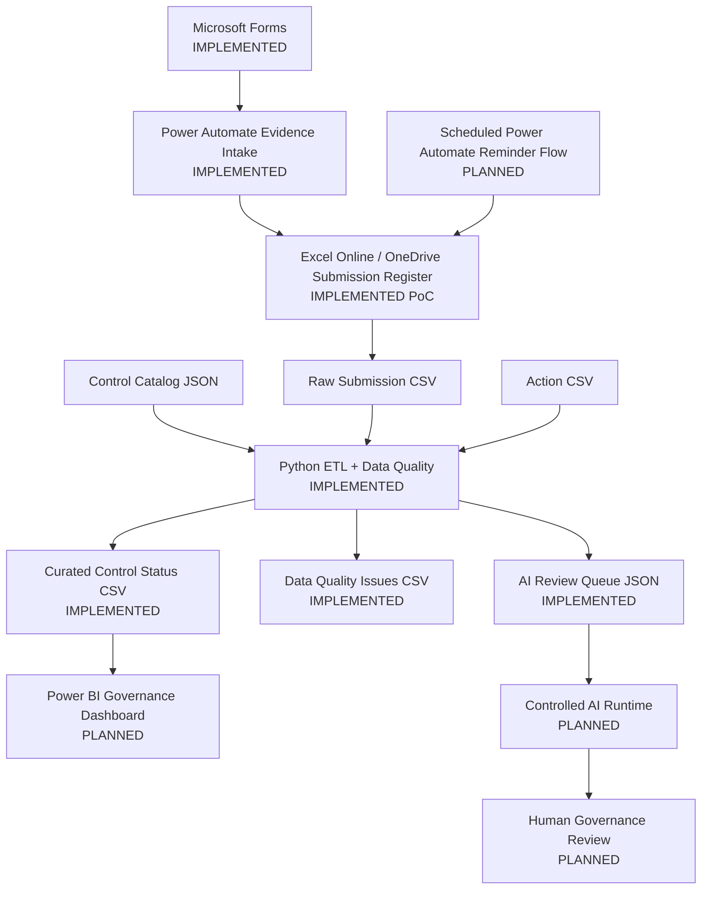
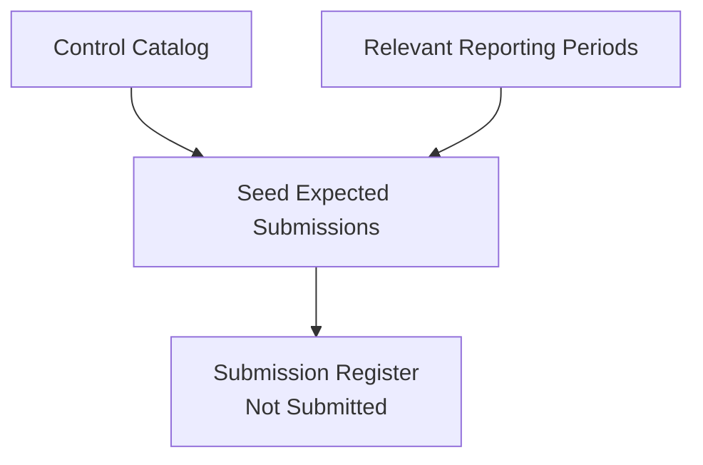
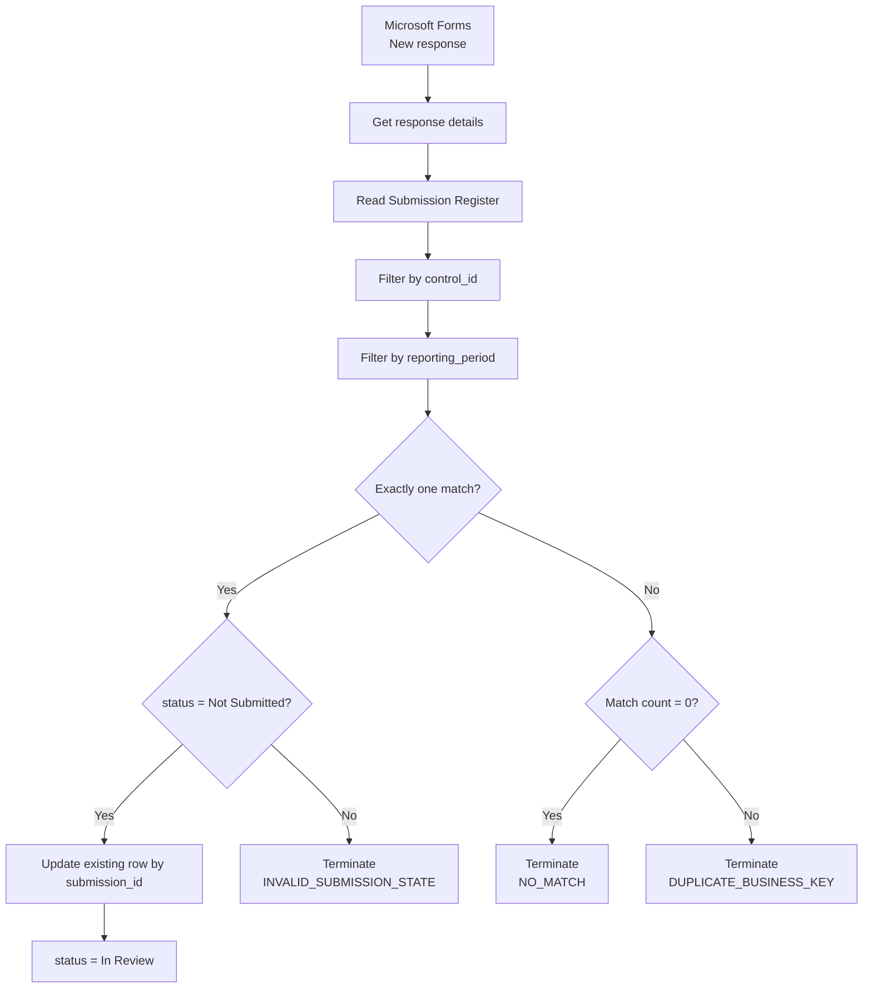
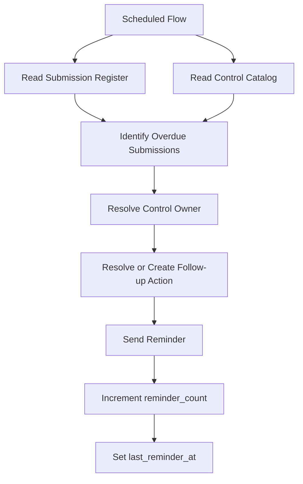

# Architecture

## Purpose

This document describes the current architecture of the Cyber Governance Automation Lab.

The project is a simplified cybersecurity-control evidence process built as a portfolio proof of concept. It is not production-ready. The architecture emphasizes explicit business semantics, traceable state transitions, deterministic Data Quality checks, controlled workflow automation, and small technology choices over unnecessary platform complexity.

## High-Level Architecture



The physical Raw Submission contract is defined in [data_contract.md](data_contract.md). The Control Catalog JSON provides stable control reference data joined by the Python pipeline.

## Expected Submission Initialization

Expected Submission records are pre-generated for the relevant synthetic reporting periods. Each expected record is seeded with:

```text
status = Not Submitted
```

This is a critical modeling decision. The system can only detect a missing submission when an expected state exists before observed evidence arrives.



The Submission business key is:

```text
control_id + reporting_period
```

The technical key is:

```text
submission_id
```

## Phase 5 Evidence-Intake Workflow

Phase 5 implements the operational Microsoft Forms → Power Automate → Excel path.



The evidence-intake workflow must **update an existing expected Submission**. It must not blindly append a new Submission row for each form response.

This preserves the domain model:

```text
Expected Submission
        +
Evidence Intake
        ↓
Controlled State Transition
```

and not:

```text
Every Form Response
        ↓
New Submission Row
```

### Allowed Phase 5 state transition

```text
Not Submitted → In Review
```

The workflow does not assign:

```text
Compliant
Non-Compliant
```

Those remain Governance Reviewer decisions.

See [power_automate.md](power_automate.md) for the complete workflow contract, screenshots, and acceptance evidence.

## Evidence-Intake Guardrails

### Unique business-key match

The combination:

```text
control_id + reporting_period
```

must resolve to exactly one expected Submission.

If no match exists, processing terminates with:

```text
NO_MATCH
```

If multiple matches exist, processing terminates with:

```text
DUPLICATE_BUSINESS_KEY
```

The workflow does not guess which duplicate record is correct.

### Valid current state

Even a unique match is writable only when:

```text
status = Not Submitted
```

Otherwise processing terminates with:

```text
INVALID_SUBMISSION_STATE
```

This protects `In Review`, `Compliant`, and `Non-Compliant` records from resubmission overwrite.

### Technical update key

After the business key is resolved and validated, Excel `Update a row` uses:

```text
submission_id
```

as the technical key.

The update changes only intake-owned fields:

```text
status
evidence_reference
submitted_at
submitted_by
comment
```

The workflow preserves:

```text
submission_id
control_id
reporting_period
due_date
```

## Component Responsibilities

### Microsoft Forms

- collects Control ID, reporting period, evidence reference, and optional comment,
- restricts intake to authenticated organizational users in the PoC,
- records responder identity,
- does not collect compliance decisions.

### Power Automate

- reacts to new Form responses,
- retrieves response details,
- reads the Submission Register,
- resolves the Submission business key,
- validates match cardinality,
- validates current Submission state,
- updates the existing expected Submission,
- terminates explicitly on controlled failure states.

### Excel Online / OneDrive

- stores the operational `SubmissionRegister` used by Phase 5,
- provides low-complexity integration with Power Automate,
- is intentionally a PoC storage choice rather than a production database.

For production, Dataverse, SharePoint Lists, or a relational database would generally be preferable where stronger concurrency, governance, auditability, and transactional behavior are required.

### Python

- reads CSV and JSON inputs,
- normalizes technical representation,
- applies DQ-001 through DQ-010,
- enriches Submission data with Control metadata,
- preserves invalid records and lineage,
- derives governance/timeliness fields,
- produces curated reporting data,
- produces a data-minimized AI review queue.

### Power BI

Planned to provide governance, Data Quality, and Process Impact reporting based on curated outputs.

### Controlled AI Workflow

Planned to review selected Data-Quality-valid exceptions. AI output is advisory and may not autonomously assign compliance status.

## Scheduled Reminder Workflow — Phase 6

Phase 6 remains separate from Phase 5 evidence intake.

Planned architecture:



Reminder state belongs to the Action workflow rather than the Submission compliance state.

## Architecture Principles

- Expected state exists before observed evidence.
- Evidence submission is not a compliance decision.
- Business identity and technical identity are separate.
- Compliance, timeliness, Data Quality, and workflow state are separate dimensions.
- Invalid or ambiguous data is preserved or rejected explicitly; it is not silently repaired.
- Evidence intake performs update, not append.
- AI-assisted processing is downstream of deterministic validation.
- Actual evidence files are not stored in the repository.
- Synthetic repository data only.
- No credentials, tokens, keys, or secrets in version control.
- Human-in-the-loop for compliance decisions.
- Excel/OneDrive is a PoC boundary, not an enterprise architecture claim.

## Business Model Reference

The architecture implements the governance process and data model defined in:

- [business_process.md](business_process.md)
- [data_model.md](data_model.md)
- [data_contract.md](data_contract.md)
- [data_quality.md](data_quality.md)
- [power_automate.md](power_automate.md)

## Out of Scope

- SIEM / SOC operations
- malware analysis
- penetration testing
- Kubernetes
- Kafka / Spark infrastructure for this project
- custom frontend
- enterprise authentication architecture
- production evidence-document repository
- production-grade Power Platform monitoring and alerting
