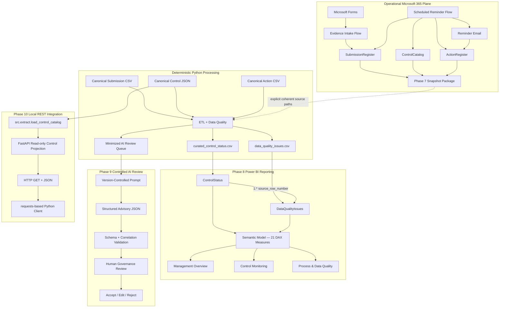

# Architecture

## Document Role

**CURRENT-STATE FOUNDATION DOCUMENT — CURRENT THROUGH PHASE 10**

Documentation index: [README.md](README.md)

## Purpose

This document defines the current architecture of the Cyber Governance Automation Lab after completion of Phase 10.

The project is a portfolio proof of concept for a recurring cybersecurity-control evidence process. It is intentionally small and explicit. It demonstrates governance modeling, deterministic processing, workflow automation, reporting, controlled AI assistance, and a local read-only REST integration without claiming production readiness.

## 1. Architectural Overview

The current system contains four primary processing/reporting planes plus one narrow local integration boundary:

```text
Operational Microsoft 365 plane
        ↓
Phase 7 private reporting snapshot boundary
        ↓
Deterministic Python processing plane
        ├──────────────→ Phase 8 Power BI reporting plane
        └──────────────→ Phase 9 controlled AI-review plane

Canonical Control Catalog
        ↓ existing Python loader
Phase 10 local read-only REST boundary
        ↓
requests-based Python client
```

Phase 10 does not create a second business-rule engine and does not expose operational Microsoft 365 state.

Responsibility boundaries remain:

```text
Power Automate updates/exports operational source facts.
Python owns deterministic DQ, derivation, enrichment, aggregation, and AI candidate selection.
Power BI consumes Python-owned curated reporting outputs only.
AI consumes minimized deterministic review candidates only.
Python validates AI output structure and input/output correlation.
Human Governance Review retains final governance authority.
The REST API exposes only a minimized read-only canonical Control projection.
The REST client validates HTTP/JSON transport contracts, not governance outcomes.
```

## 2. High-Level Architecture



Power BI does not consume AI output. The AI workflow does not write back automatically. The REST API does not consume reporting outputs, AI output, raw Submission/Action data, or private operational snapshots.

## 3. Core Domain Model

The logical business model contains exactly four core entities:

```text
CONTROL
   │ 1:n
   ▼
SUBMISSION
   ├──────────────► ACTION
   └──────────────► DATA QUALITY ISSUE
```

Submission technical key:

```text
submission_id
```

Submission business key:

```text
control_id + reporting_period
```

The following are **not** additional core entities:

- Phase 7 snapshot manifest,
- Power BI tables/measures,
- Phase 9 AI review output,
- Phase 10 `ControlSummary` API response model,
- HTTP responses or client exceptions.

They are technical/reporting/advisory integration artifacts around the four-entity model.

## 4. Frozen Semantic Separations

These distinctions are architectural invariants across all implemented phases:

```text
Evidence Present != Compliant
Not Submitted != Non-Compliant
Non-Compliant != Overdue
Compliance != Timeliness
Compliance != Data Quality
Submission Status != Action Status
Unknown != False
Not Evaluated != Failed
Action completion != Submission compliance
Control risk != DQ severity
Control risk != AI review priority
Schema-valid != factually correct
AI recommendation accepted != Submission compliant
```

Phase 10 adds two more integration-boundary statements without changing business semantics:

```text
REST API != Governance authority
API response != Compliance decision
```

## 5. Canonical and Operational Data Planes

Canonical repository inputs:

```text
data/reference/control_catalog.json
data/raw/evidence_submissions.csv
data/raw/actions.csv
```

Canonical acceptance reference date:

```text
as_of_date = 2026-08-15
```

Canonical inventory and deterministic result:

```text
Controls loaded: 5
Submissions loaded: 15
Actions loaded: 5
DQ issues: 5
Valid submissions: 10
Invalid submissions: 5
AI review queue items: 2
```

Canonical AI candidates:

```text
SUB-005
SUB-014
```

Operational Microsoft 365 state is separate:

```text
Operational Microsoft 365 state
!=
Canonical repository fixtures
```

Phase 7 snapshots operational source facts into private files and passes those files to the same deterministic Python semantics through explicit all-or-none source paths.

## 6. Operational Microsoft 365 Plane — Phases 5–7

Operational workbook tables:

```text
ControlCatalog
SubmissionRegister
ActionRegister
```

### Phase 5 evidence intake

```text
Microsoft Forms
      ↓
resolve control_id + reporting_period
      ↓
require exactly one expected Submission
      ↓
require status = Not Submitted
      ↓
update by submission_id
      ↓
Not Submitted → In Review
```

Evidence intake cannot assign `Compliant` or `Non-Compliant`.

### Phase 6 reminder automation

Overdue missing Submission:

```text
submitted_at IS NULL
AND as_of_date > due_date
```

Active Action resolution:

```text
0 active Actions  → CREATE
1 active Action   → REUSE
>1 active Actions → DUPLICATE_ACTIVE_ACTION
```

Same-day reminder behavior is idempotent through `last_reminder_at`.

### Phase 7 reporting snapshot

Successful private package:

```text
security_control_snapshot_<snapshot_id>.json
security_submission_snapshot_<snapshot_id>.csv
security_action_snapshot_<snapshot_id>.csv
security_snapshot_manifest_<snapshot_id>.json
```

The manifest is written last and acts as the completion marker. Snapshot content can include operational identities and comments and therefore remains outside public Git history.

## 7. Deterministic Python Plane — Phases 3–4 and 7

Pipeline:

```text
EXTRACT
  ↓
NORMALIZE
  ↓
VALIDATE
  ↓
TRANSFORM / ENRICH
  ↓
DERIVE
  ↓
LOAD
```

Runtime outputs:

```text
curated_control_status.csv
data_quality_issues.csv
ai_review_queue.json
```

Python owns:

- physical input validation,
- DQ-001 through DQ-010,
- Control enrichment,
- timing derivation,
- Action aggregation,
- Submission-grain preservation,
- curated reporting outputs,
- deterministic AI candidate selection.

Source facts are not silently repaired.

## 8. Data Quality Boundary

Python applies exactly:

```text
DQ-001 through DQ-010
```

DQ findings:

- remain separate from compliance,
- preserve invalid rows,
- do not silently repair source facts,
- use deterministic issue ordering and lineage.

Derived DQ status:

```text
0 DQ issues  → Valid
1+ DQ issues → Invalid
```

Non-evaluable dependent checks remain not evaluated rather than being converted into false failures.

## 9. Action and Reminder Boundary

Reminder state belongs to Action:

```text
reminder_count
last_reminder_at
```

Python aggregates Actions before reporting so Submission rows are not multiplied.

Known lifecycle limitation:

```text
Phase 5 evidence intake
→ can move Submission to In Review
→ does not automatically complete an existing missing-submission Action
```

## 10. Phase 8 Power BI Reporting Boundary

Power BI consumes exactly:

```text
curated_control_status.csv
data_quality_issues.csv
```

It does not directly read:

- operational workbook tables,
- private Phase 7 source snapshots,
- canonical raw Submission/Action files,
- `ai_review_queue.json`,
- Phase 9 AI outputs,
- Phase 10 REST responses.

Source-controlled model:

```text
2 reporting tables
1 active one-to-many relationship
21 DAX measures
0 calculated tables
0 calculated columns
3 primary report pages
```

Relationship:

```text
ControlStatus[source_row_number]
          1
          │
          *
DataQualityIssues[source_row_number]
```

The source-controlled PBIP/PBIR/TMDL project passed both canonical and private operational runtime acceptance.

## 11. Phase 9 Controlled AI Boundary

AI candidate eligibility is deterministic:

```text
data_quality_status = Valid
AND
(
    submission_status = Non-Compliant
    OR
    overdue_flag = True
)
```

The queue excludes identity/evidence-reference fields such as:

```text
owner_email
submitted_by
evidence_reference
```

Free-text `comment` remains untrusted data.

Version-controlled prompt:

```text
ai/prompts/control_review_prompt.md
```

Structured output schema:

```text
ai/schemas/control_review.schema.json
```

Deterministic validator:

```text
src/ai_validation.py
```

Validation chain:

```text
JSON parse
   ↓
Top-level object
   ↓
Draft 2020-12 schema
   ↓
submission_id correlation
   ↓
control_id correlation
   ↓
Human Governance Review
```

Human decisions:

```text
Accept
Edit
Reject
```

Canonical Phase 9 human acceptance:

```text
SUB-005 → Accept
SUB-014 → Accept
```

Acceptance means usable governance-review input, not a compliance-state mutation.

## 12. Phase 10 REST Integration Boundary

Implementation:

```text
api/mock_api.py
src/api_client.py
```

Frozen source boundary:

```text
data/reference/control_catalog.json
        ↓
src.extract.load_control_catalog()
        ↓
FastAPI ControlSummary projection
```

Business endpoints:

```text
GET /api/v1/controls
GET /api/v1/controls/{control_id}
```

External fields:

```text
control_id
risk_level
```

Internal fields such as `owner_email`, `owner_role`, `business_unit`, `control_name`, `control_statement`, and `frequency` are intentionally excluded.

The service is read-only and has no POST/PUT/PATCH/DELETE business route.

Failure behavior:

```text
unknown control_id     → 404 CONTROL_NOT_FOUND
unusable Control source → 500 CONTROL_SOURCE_ERROR
```

The generic 500 response does not expose local paths or exception internals.

The client uses:

```text
requests
explicit 3-second timeout
raise_for_status()
JSON parsing
external response-shape validation
ApiClientError translation
```

Local manual acceptance target:

```text
127.0.0.1:8000
```

No authentication is implemented because the accepted Phase 10 scope is a local, synthetic, read-only, minimized PoC. This is not a production security pattern.

See [phase10_rest_api_acceptance.md](phase10_rest_api_acceptance.md).

## 13. Component Responsibilities

### Microsoft Forms

- authenticated evidence intake,
- captures evidence-submission information,
- does not assign final compliance.

### Power Automate Evidence Intake

- resolves one expected Submission,
- enforces business-key/current-state guardrails,
- updates intake-owned fields only.

### Power Automate Reminder Automation

- detects overdue missing Submissions,
- resolves owner and active Action cardinality,
- creates/reuses one active Action,
- sends reminders and persists reminder tracking.

### Power Automate Reporting Snapshot

- exports exact source facts,
- writes completion provenance,
- does not calculate DQ/compliance/reporting semantics.

### Deterministic Python Pipeline

- loads canonical or explicit coherent external sources,
- validates physical inputs,
- applies DQ and deterministic derivations,
- aggregates Actions,
- creates curated reporting outputs,
- creates the minimized AI queue.

### Power BI

- consumes curated reporting outputs only,
- owns reporting measures/visualization only,
- does not redefine upstream Python rules.

### Controlled AI Review

- consumes only deterministic candidates,
- provides advisory structured output,
- has no compliance or source-write authority.

### Human Governance Reviewer

- reviews AI recommendations,
- chooses Accept/Edit/Reject,
- retains final governance authority.

### FastAPI Service

- loads the canonical Control Catalog through the existing loader,
- exposes only a minimized read-only Control projection,
- translates source/not-found failures to controlled HTTP responses,
- contains no governance business rules.

### Python API Client

- performs bounded GET requests,
- parses/validates the external JSON shape,
- translates integration failures to `ApiClientError`,
- contains no governance business rules.

## 14. Storage and Privacy Boundary

Public repository content may include:

- canonical synthetic fixtures,
- sanitized Power Automate source/screenshots,
- source-controlled Power BI metadata,
- canonical dashboard images,
- synthetic Phase 9 AI examples,
- Phase 10 API/client source and tests,
- non-sensitive acceptance documentation.

The following remain outside Git:

- private operational snapshots,
- private processed operational outputs,
- reachable operational identities,
- authenticated submitter identities,
- private comments,
- tenant/environment/connection/workbook identifiers,
- credentials and tokens,
- local Power BI cache/state,
- generated curated runtime outputs.

Phase 10 does not require any private operational data.

## 15. Testing and CI Boundary

GitHub Actions runs the complete Python suite for pull requests targeting `main` and pushes to `main`.

Historical progression:

```text
Phase 4 baseline/start        35 tests
Phase 9 completed state       64 tests
Phase 10 completed state      84 tests
```

Phase 10 adds 20 focused API/client tests while preserving the canonical deterministic acceptance baseline.

The workflow is active, but repository branch protection does not currently enforce the Python check as a required merge gate.

## 16. Architecture Principles

- Expected state exists before observed evidence.
- Evidence submission is not a compliance decision.
- Business identity and technical identity are separate.
- Compliance, timeliness, DQ, and workflow state are separate dimensions.
- Source facts are not silently repaired.
- Ambiguous state fails safely.
- Operational and canonical data planes remain distinct.
- Python semantics are reused across canonical and operational source sets.
- Power BI consumes curated outputs rather than duplicating upstream logic.
- AI remains downstream of deterministic validation.
- AI input is minimized but still untrusted.
- AI output validation is not factual/governance approval.
- Human governance review remains mandatory.
- REST is a technical integration boundary, not governance authority.
- External API contracts can be smaller than internal source models.
- Real HTTP clients use explicit timeouts.
- Local no-auth acceptance does not imply production readiness.

## 17. Current Limitations

Current limitations include:

- Excel/OneDrive instead of a transactional production datastore,
- no transactional multi-table snapshot guarantee across Phase 7 Excel reads,
- no automatic snapshot discovery/manifest ingestion/scheduled Python execution,
- no automatic expected-Submission generation,
- no automatic completion of missing-submission Actions after later evidence intake,
- no dedicated Governance Reviewer UI,
- no Action-specific DQ rule catalog,
- no production escalation/SLA engine,
- no production IAM/RBAC, DLP, audit, retention, monitoring, or telemetry architecture,
- no Power BI Service/Fabric deployment architecture or enterprise RLS,
- no external AI provider runtime/API integration,
- no automatic AI source write-back,
- no universal prompt-injection-resistance claim,
- Phase 10 API is local-only, unauthenticated, read-only, and canonical-synthetic only,
- no API Gateway, cloud deployment, rate limiting, production observability, or write API,
- no enforced required CI status check before merge.

## 18. Source of Truth

For current state, use this priority:

```text
implemented code + canonical data + automated tests
        ↓
current-state foundation documents
        ↓
latest phase implementation/acceptance record
        ↓
historical contracts, plans, and acceptance records
```

Documentation navigation and role/status mapping are maintained in [README.md](README.md).
