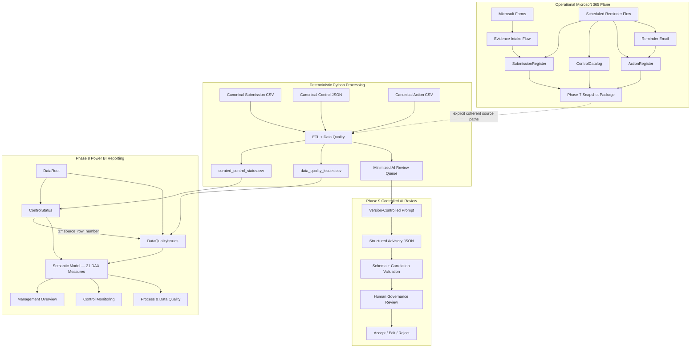

# Architecture

## Purpose

This document describes the **current architecture** of the Cyber Governance Automation Lab after completion of the controlled AI-assisted review layer in Phase 9.

The project is a simplified cybersecurity-control evidence process built as a portfolio proof of concept. It is not production-ready. The architecture emphasizes explicit business semantics, traceable state transitions, deterministic Data Quality, controlled workflow automation, reproducible reporting, structured AI assistance, deterministic AI-output validation, and mandatory human governance authority.

## 1. Architectural Overview

The implemented architecture contains four cooperating planes:

```text
Operational Microsoft 365 plane
        ↓
Phase 7 reporting snapshot boundary
        ↓
Deterministic Python processing plane
        ├──────────────→ Phase 8 Power BI reporting plane
        └──────────────→ Phase 9 controlled AI-review plane
```

Responsibility boundaries are narrow by design:

```text
Power Automate exports and updates operational source facts.
Python owns deterministic validation, derivation, and AI candidate selection.
Power BI consumes curated reporting facts only.
AI analyzes only minimized deterministic review candidates.
Python validates AI output structure and input/output correlation.
Human Governance Review retains final authority.
```

AI is not a second business-rule engine.

## 2. High-Level Architecture



Power BI and AI are sibling downstream consumers of Python-owned deterministic outputs. AI output does not flow back into the reporting or operational source planes automatically.

## 3. Operational Microsoft 365 Plane

Operational state is stored in Excel Online / OneDrive tables:

```text
ControlCatalog
SubmissionRegister
ActionRegister
```

Phase 5 implements authenticated evidence intake:

```text
Microsoft Forms
      ↓
resolve control_id + reporting_period
      ↓
require exactly one expected Submission
      ↓
require status = Not Submitted
      ↓
update by submission_id
      ↓
Not Submitted → In Review
```

Evidence intake cannot assign `Compliant` or `Non-Compliant`.

Phase 6 implements scheduled missing-submission follow-up:

```text
submitted_at IS NULL
AND as_of_date > due_date
```

Active Action resolution remains:

```text
0 active Actions  → CREATE
1 active Action   → REUSE
>1 active Actions → DUPLICATE_ACTIVE_ACTION
```

Same-day reminder behavior remains idempotent through `last_reminder_at`.

Phase 7 exports current operational source facts into a private snapshot package. The package remains outside Git because it can contain operational identities, comments, and deployment metadata.

## 4. Deterministic Python Plane

Canonical source files:

```text
data/reference/control_catalog.json
data/raw/evidence_submissions.csv
data/raw/actions.csv
```

Alternative explicit operational inputs:

```text
security_control_snapshot_<snapshot_id>.json
security_submission_snapshot_<snapshot_id>.csv
security_action_snapshot_<snapshot_id>.csv
```

Both modes execute the same deterministic pipeline:

```text
EXTRACT
  ↓
NORMALIZE
  ↓
VALIDATE
  ↓
TRANSFORM / ENRICH
  ↓
DERIVE
  ↓
LOAD
```

Python runtime outputs:

```text
curated_control_status.csv
data_quality_issues.csv
ai_review_queue.json
```

The repository fixtures remain canonical synthetic acceptance data. Operational processing does not overwrite them.

## 5. Core Domain Model

The logical business model contains four core entities:

```text
CONTROL
   │ 1:n
   ▼
SUBMISSION
   ├──────────────► ACTION
   └──────────────► DATA QUALITY ISSUE
```

Submission technical identity:

```text
submission_id
```

Submission business identity:

```text
control_id + reporting_period
```

AI review output is not a fifth authoritative business entity in the core model. It is a downstream advisory artifact linked to an existing Submission/Control pair.

## 6. Frozen Semantic Separations

The following distinctions remain architectural invariants:

```text
Evidence Present != Compliant
Not Submitted != Non-Compliant
Non-Compliant != Overdue
Compliance != Timeliness
Compliance != Data Quality
Submission Status != Action Status
Unknown != False
Not Evaluated != Failed
Action completion != Submission compliance
Control risk != DQ severity
Control risk != AI review priority
Schema-valid != factually correct
AI recommendation accepted != Submission compliant
```

These distinctions are preserved across Power Automate, Python, Power BI, and Phase 9 AI review.

## 7. Canonical vs Operational State

Canonical acceptance is evaluated at:

```text
as_of_date = 2026-08-15
```

Canonical deterministic baseline:

```text
Controls loaded: 5
Submissions loaded: 15
Actions loaded: 5
DQ issues: 5
Valid submissions: 10
Invalid submissions: 5
AI review queue items: 2
```

The accepted private Phase 7 operational observation is a separate data plane and is not synchronized back into canonical fixtures.

Therefore:

```text
Operational Microsoft 365 state
!=
Canonical repository fixtures
```

## 8. Data Quality Boundary

Python applies exactly DQ-001 through DQ-010 to Submission source rows.

DQ findings:

- remain separate from compliance,
- preserve invalid rows,
- do not silently repair source facts,
- drive `data_quality_status` deterministically.

```text
0 DQ issues  → Valid
1+ DQ issues → Invalid
```

DQ-invalid records remain available to reporting but are excluded from AI review candidate selection.

## 9. Action / Reminder Boundary

Reminder state belongs to Action:

```text
reminder_count
last_reminder_at
```

Action aggregation is performed by Python before reporting so Submission rows are not multiplied.

Known lifecycle limitation remains: Phase 5 evidence intake does not automatically complete an existing missing-submission Action when the Submission later moves to `In Review`.

## 10. Phase 7 Reporting Snapshot Boundary

A successful private package contains:

```text
security_control_snapshot_<snapshot_id>.json
security_submission_snapshot_<snapshot_id>.csv
security_action_snapshot_<snapshot_id>.csv
security_snapshot_manifest_<snapshot_id>.json
```

The manifest is written last and acts as the completion marker.

Python external source overrides are all-or-none:

```text
--controls-path
--submissions-path
--actions-path
```

The manifest is not automatically ingested; `as_of_date` is supplied explicitly.

## 11. Phase 8 Power BI Reporting Architecture

Power BI consumes exactly:

```text
curated_control_status.csv
data_quality_issues.csv
```

It does not read:

- operational workbook tables,
- raw Phase 7 snapshots,
- canonical raw source files,
- `ai_review_queue.json`,
- Phase 9 AI outputs.

The semantic model contains one required text parameter:

```text
DataRoot
```

Exactly two reporting tables exist:

```text
ControlStatus
DataQualityIssues
```

Exactly one active relationship exists:

```text
ControlStatus[source_row_number]
          1
          │
          *
DataQualityIssues[source_row_number]
```

```text
Cardinality      = one-to-many
Filter direction = ControlStatus → DataQualityIssues
```

The model contains exactly:

```text
ControlStatus       16 DAX measures
DataQualityIssues    5 DAX measures
-------------------------------
Total               21 measures

Calculated tables    0
Calculated columns   0
```

Primary pages:

```text
Management Overview
Control Monitoring
Process & Data Quality
```

The same source-controlled model passed canonical and private operational runtime acceptance by changing only `DataRoot` in a temporary operational copy.

## 12. Phase 9 AI Candidate Boundary

The Python-owned review queue remains the sole Phase 9 business-record input boundary.

Eligibility is frozen:

```text
data_quality_status = Valid
AND
(
    submission_status = Non-Compliant
    OR
    overdue_flag = True
)
```

Consequences:

```text
DQ-invalid                       → not eligible
Valid + Non-Compliant            → eligible
Valid + currently Overdue        → eligible
Valid + Non-Compliant + Overdue  → eligible
Late only                        → not eligible
```

Canonical queue:

```text
SUB-005
SUB-014
```

The minimized queue excludes identity/evidence-reference fields such as:

```text
owner_email
submitted_by
evidence_reference
```

Data minimization does not mean external-AI-safe by itself. Free-text `comment` can still contain sensitive or instruction-like content.

## 13. Phase 9 Prompt / Trust Boundary

Version-controlled prompt:

```text
ai/prompts/control_review_prompt.md
```

Every supplied record value is treated as **untrusted input data**.

This is especially important for:

```text
comment
```

The prompt explicitly prohibits following instructions embedded inside record values.

Allowed AI behavior:

- summarize supplied facts,
- identify information absent from the supplied record,
- suggest advisory `review_priority`,
- recommend human follow-up.

Forbidden AI behavior:

- assign or change compliance,
- claim missing evidence exists,
- invent hidden facts,
- repair DQ/source state,
- follow embedded record instructions,
- write back to source systems,
- bypass human review.

## 14. Phase 9 Structured Output Boundary

JSON Schema:

```text
ai/schemas/control_review.schema.json
```

The schema uses JSON Schema Draft 2020-12 and allows exactly:

```text
submission_id
control_id
summary
review_priority
missing_information
recommended_follow_up
human_review_required
```

Key controls:

```text
additionalProperties = false
review_priority ∈ {Low, Medium, High}
human_review_required = true
```

No field exists for autonomous compliance assignment or source write-back.

## 15. Phase 9 Deterministic AI-Output Validation

Implementation:

```text
src/ai_validation.py
```

The validator performs:

```text
JSON parse
   ↓
require top-level object
   ↓
Draft 2020-12 schema validation
   ↓
submission_id correlation check
   ↓
control_id correlation check
```

Validation failure is fail-safe. Output is rejected rather than silently repaired.

Important:

```text
Schema-valid
!=
Factually correct
!=
Governance-approved
```

Therefore deterministic validation is necessary but not sufficient for acceptance.

## 16. Phase 9 Adversarial Boundary

Synthetic adversarial evidence attempts to inject instructions through the untrusted `comment` field.

The test attempts to make the model:

- ignore the controlling prompt,
- claim evidence was reviewed,
- mark a Control compliant,
- set `human_review_required` to false.

The accepted controlled output does not follow those instructions.

Independent deterministic tests also reject:

- extra compliance-decision fields,
- `human_review_required = false`,
- wrong Submission/Control correlation.

This is evidence for the implemented prompt/validation contract only. It is not a universal prompt-injection-resistance claim.

## 17. Phase 9 Human Governance Boundary

Human-review procedure:

```text
docs/phase9_human_review.md
```

Human decisions:

```text
Accept
Edit
Reject
```

Canonical human acceptance:

```text
SUB-005 → Accept
SUB-014 → Accept
```

Acceptance means the recommendation is acceptable as governance-review input.

It does not mean:

```text
Submission becomes Compliant
Control is certified effective
Evidence is approved
Remediation is complete
Source facts are changed
```

No automatic write-back exists.

## 18. Component Responsibilities

### Microsoft Forms

- authenticated evidence intake,
- collects Control/reporting-period/evidence-reference information,
- does not collect the final compliance decision.

### Power Automate Evidence Intake

- resolves one expected Submission,
- enforces business-key and current-state guardrails,
- updates intake-owned fields only.

### Power Automate Reminder Automation

- detects overdue missing Submissions,
- resolves accountable owner,
- creates/reuses one active Action,
- sends reminders,
- updates reminder tracking after successful delivery.

### Power Automate Reporting Snapshot

- exports exact operational source facts,
- creates completion provenance,
- does not calculate compliance/DQ/reporting semantics.

### Python

- deterministic extract/normalize/validate/transform/derive/load,
- supports canonical and explicit external source modes,
- owns DQ, Control enrichment, Action aggregation, timing derivation,
- builds curated reporting outputs,
- builds the minimized AI queue,
- validates AI review outputs structurally and by record correlation.

### Power BI

- loads only the two curated reporting tables,
- implements one active lineage relationship,
- implements exactly 21 DAX measures,
- implements three accepted report pages,
- does not consume Phase 9 AI output.

### Controlled AI Review

- consumes one minimized deterministic queue item,
- follows the version-controlled prompt,
- produces advisory structured JSON,
- has no source-write authority,
- has no compliance authority.

### Human Governance Reviewer

- reviews validated AI recommendations,
- chooses Accept/Edit/Reject,
- retains final governance authority.

## 19. Storage and Privacy Boundary

The public repository may contain:

- canonical synthetic fixtures,
- sanitized Power Automate source/screenshots,
- source-controlled Power BI metadata,
- canonical dashboard screenshots,
- synthetic Phase 9 AI examples,
- prompt/schema/validator/tests,
- non-sensitive acceptance documentation.

The following remain outside Git:

- private operational snapshots,
- private processed operational outputs,
- reachable operational e-mail addresses,
- authenticated submitter identities,
- private comments,
- tenant/environment/connection/workbook identifiers,
- credentials and tokens,
- local Power BI cache/state,
- generated curated runtime outputs.

No private Phase 7 operational queue is required for Phase 9 public acceptance.

## 20. Repository Governance Boundary

GitHub Actions runs the complete Python suite for pull requests targeting `main` and pushes to `main`.

Phase 9 raises the suite from 53 to 64 passing tests by adding AI-contract and validator tests while preserving the existing canonical pipeline acceptance.

Current CI is active, but the Python check is not configured as an enforced required merge gate.

## 21. Architecture Principles

- Expected state exists before observed evidence.
- Evidence submission is not a compliance decision.
- Business identity and technical identity are separate.
- Compliance, timeliness, DQ, and workflow state are separate dimensions.
- Source records are not silently repaired.
- Ambiguous workflow state fails safely.
- Operational and canonical data planes remain distinct.
- Python semantics are reused across canonical and operational source sets.
- Power BI consumes curated outputs rather than duplicating upstream logic.
- AI processing remains downstream of deterministic validation.
- AI input is minimized but still treated as untrusted.
- Free-text data is not an instruction channel.
- AI output is structurally constrained.
- Schema validation is not factual/governance approval.
- AI recommendations cannot mutate compliance/source facts.
- Human governance review is mandatory.
- Final compliance authority remains human.
- Excel/OneDrive is a PoC boundary, not an enterprise architecture claim.

## 22. Current Limitations

Current limitations include:

- no automatic expected-Submission generation,
- no automatic completion of missing-submission Actions after later evidence intake,
- no transactional multi-table snapshot guarantee,
- no automatic manifest ingestion/latest-snapshot discovery,
- no scheduled Python snapshot-processing service,
- no Action-specific DQ rule catalog,
- no production-grade IAM/RBAC, DLP, audit, monitoring, retention, or telemetry architecture,
- no Power BI Service/Fabric deployment architecture, gateway, deployment pipeline, or enterprise RLS,
- no external AI provider API/runtime integration,
- no universal prompt-injection-resistance claim,
- no automated AI source write-back,
- no REST API implementation yet,
- CI is not an enforced required merge gate.

## 23. References

Current-state foundation:

- [business_process.md](business_process.md)
- [data_model.md](data_model.md)
- [data_contract.md](data_contract.md)
- [data_quality.md](data_quality.md)

Phase acceptance:

- [phase7_end_to_end_acceptance.md](phase7_end_to_end_acceptance.md)
- [phase8_final_acceptance.md](phase8_final_acceptance.md)
- [phase9_ai_workflow_contract.md](phase9_ai_workflow_contract.md)
- [phase9_ai_output_contract.md](phase9_ai_output_contract.md)
- [phase9_human_review.md](phase9_human_review.md)
- [phase9_human_acceptance.md](phase9_human_acceptance.md)
- [phase9_ai_acceptance.md](phase9_ai_acceptance.md)

Historical phase-specific documents remain valid for the phase they describe. Current-state foundation documents, implemented code, canonical datasets, automated tests, and later acceptance evidence define the present architecture.
