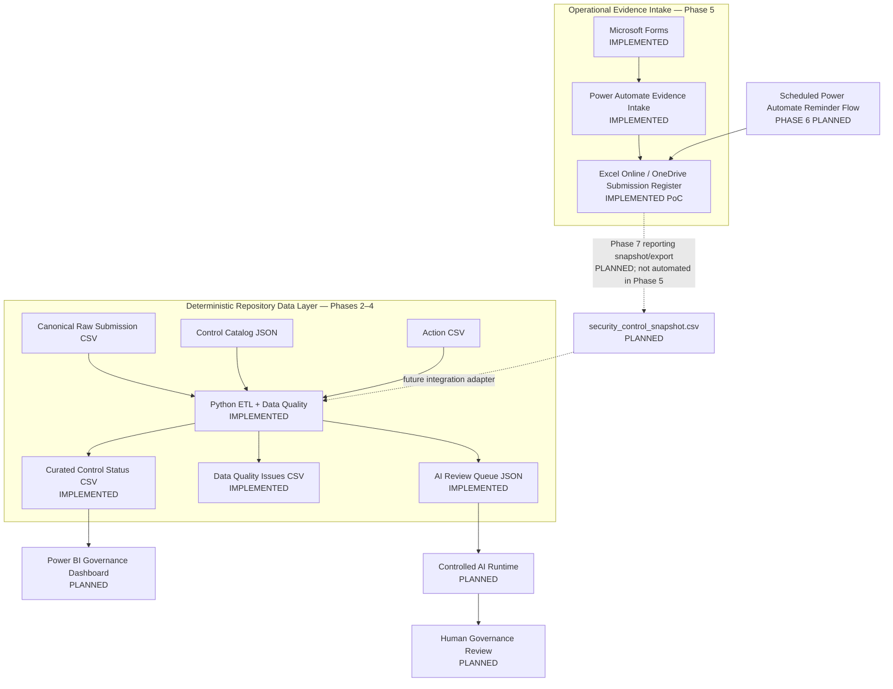
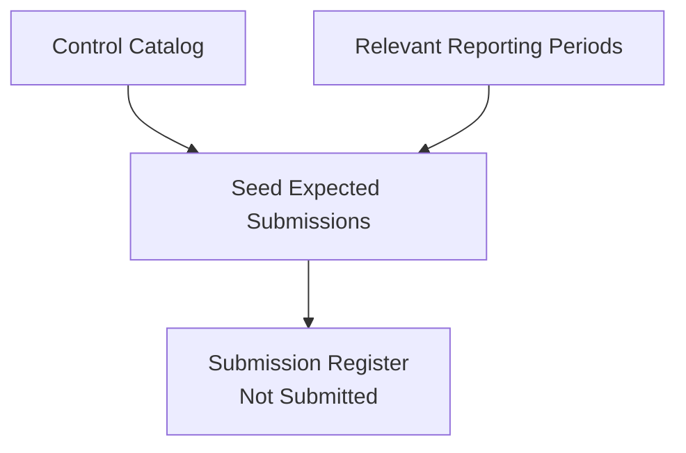
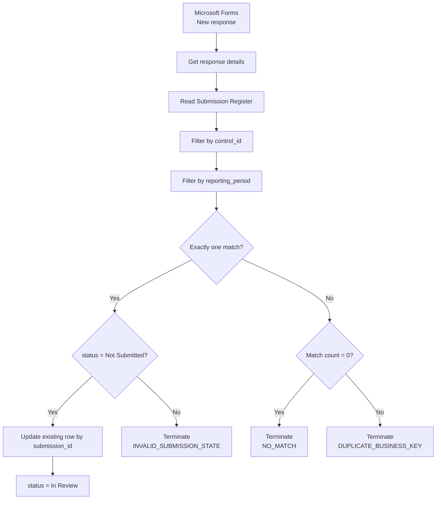
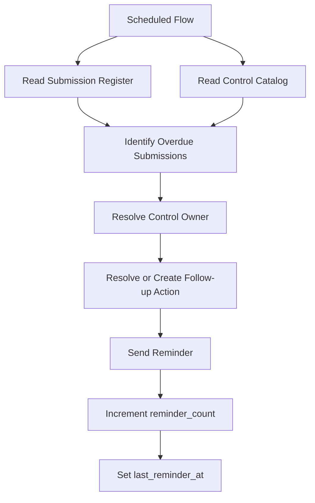

# Architecture

## Purpose

This document describes the current architecture of the Cyber Governance Automation Lab.

The project is a simplified cybersecurity-control evidence process built as a portfolio proof of concept. It is not production-ready. The architecture emphasizes explicit business semantics, traceable state transitions, deterministic Data Quality checks, controlled workflow automation, and small technology choices over unnecessary platform complexity.

## Current Architecture and Data-Plane Boundary

The project currently contains two distinct data planes that must not be conflated.

### Operational evidence-intake plane

Implemented in Phase 5:

```text
Microsoft Forms
      ↓
Power Automate
      ↓
Excel Online / OneDrive Submission Register
```

This is the live Microsoft 365 workflow PoC.

### Deterministic repository data plane

Implemented in Phases 2–4:

```text
data/reference/control_catalog.json
                    ┐
data/raw/evidence_submissions.csv ──► Python ETL + Data Quality
data/raw/actions.csv                ┘
                                    ↓
                         data/curated/*
```

The repository raw CSV is a canonical synthetic acceptance dataset. It is **not** automatically generated from the Phase 5 Excel workbook.

## High-Level Architecture



The Phase 7 snapshot/export is the planned bridge between the Power Platform workflow and later Python/reporting integration. Phase 5 does not claim such synchronization already exists.

## Why the Operational Workbook Does Not Replace the Canonical Raw Dataset

The Phase 5 happy-path acceptance test updated the operational Excel record for `SUB-014` from `Not Submitted` to `In Review` on the live test date.

The repository file:

```text
data/raw/evidence_submissions.csv
```

intentionally remains unchanged. In that canonical synthetic dataset, `SUB-014` remains `Not Submitted` because the Phase 2–4 deterministic acceptance scenario is evaluated at:

```text
as_of_date = 2026-08-15
```

Changing the repository raw dataset merely to mirror a later operational test would destroy the deterministic test baseline and change the documented DQ/process scenarios. The two artifacts therefore serve different purposes.

## Expected Submission Initialization

Expected Submission records are pre-generated for the relevant synthetic reporting periods. Each expected record is seeded with:

```text
status = Not Submitted
```

This is a critical modeling decision. The system can only detect a missing submission when an expected state exists before observed evidence arrives.



The Submission business key is:

```text
control_id + reporting_period
```

The technical key is:

```text
submission_id
```

## Phase 5 Evidence-Intake Workflow

Phase 5 implements the operational Microsoft Forms → Power Automate → Excel path.



The evidence-intake workflow must **update an existing expected Submission**. It must not blindly append a new Submission row for each form response.

This preserves the domain model:

```text
Expected Submission
        +
Evidence Intake
        ↓
Controlled State Transition
```

and not:

```text
Every Form Response
        ↓
New Submission Row
```

### Allowed Phase 5 state transition

```text
Not Submitted → In Review
```

The workflow does not assign:

```text
Compliant
Non-Compliant
```

Those remain Governance Reviewer decisions.

See [power_automate.md](power_automate.md) for the complete workflow contract, expressions, screenshots, and acceptance evidence.

## Evidence-Intake Guardrails

### Unique business-key match

The combination:

```text
control_id + reporting_period
```

must resolve to exactly one expected Submission.

If no match exists, processing terminates with:

```text
NO_MATCH
```

If multiple matches exist, processing terminates with:

```text
DUPLICATE_BUSINESS_KEY
```

The workflow does not guess which duplicate record is correct.

### Valid current state

Even a unique match is writable only when:

```text
status = Not Submitted
```

Otherwise processing terminates with:

```text
INVALID_SUBMISSION_STATE
```

This protects `In Review`, `Compliant`, and `Non-Compliant` records from resubmission overwrite.

### Technical update key

After the business key is resolved and validated, Excel `Update a row` uses:

```text
submission_id
```

as the technical key.

The update changes only intake-owned fields:

```text
status
evidence_reference
submitted_at
submitted_by
comment
```

The workflow preserves:

```text
submission_id
control_id
reporting_period
due_date
```

## Phase 5 Roadmap Delta

The original project roadmap illustrated a separate **Confirmation Email** after the successful Excel write.

The implemented Phase 5 workflow currently ends after the controlled Excel update on the success path. No separate Power Automate confirmation-email action is implemented.

This is documented explicitly rather than being presented as implemented. The core Phase 5 Definition of Done — Forms input updating the expected register record with validation and controlled error handling — has been acceptance-tested successfully.

## Component Responsibilities

### Microsoft Forms

- collects Control ID, reporting period, evidence reference, and optional comment,
- restricts intake to authenticated organizational users in the PoC,
- records responder identity,
- does not collect compliance decisions.

### Power Automate

- reacts to new Form responses,
- retrieves response details,
- reads the Submission Register,
- resolves the Submission business key,
- validates match cardinality,
- validates current Submission state,
- updates the existing expected Submission,
- terminates explicitly on controlled failure states.

### Excel Online / OneDrive

- stores the operational `SubmissionRegister` used by Phase 5,
- provides low-complexity integration with Power Automate,
- is intentionally a PoC storage choice rather than a production database,
- is not automatically synchronized to the repository raw CSV in Phase 5.

The operational workbook is not committed to the repository because authenticated responder identity can be written into it during live testing.

For production, Dataverse, SharePoint Lists, or a relational database would generally be preferable where stronger concurrency, governance, auditability, and transactional behavior are required.

### Python

- reads canonical repository CSV and JSON inputs,
- normalizes technical representation,
- applies DQ-001 through DQ-010,
- enriches Submission data with Control metadata,
- preserves invalid records and lineage,
- derives governance/timeliness fields,
- produces curated reporting data,
- produces a data-minimized AI review queue.

### Power BI

Planned to provide governance, Data Quality, and Process Impact reporting based on curated outputs.

### Controlled AI Workflow

Planned to review selected Data-Quality-valid exceptions. AI output is advisory and may not autonomously assign compliance status.

## Scheduled Reminder Workflow — Phase 6

Phase 6 remains separate from Phase 5 evidence intake.

Planned architecture:



Reminder state belongs to the Action workflow rather than the Submission compliance state.

The exact Phase 6 overdue logic must continue to follow the canonical business rule:

```text
submitted_at IS NULL
AND
as_of_date > due_date
```

It must not collapse overdue state into a generic `status != Compliant` condition.

## Repository Governance Boundary

GitHub Actions runs the Python test suite for pull requests and pushes to `main`.

Current repository metadata marks `main` as protected, but required status-check enforcement is not currently active in classic branch protection. PR #8 was merged before its successful Python test workflow finished. Therefore CI is active, but it is not presently a guaranteed merge gate.

If strict repository governance is intended, the required `Python tests / test` check must be re-enabled in GitHub branch/ruleset settings.

## Architecture Principles

- Expected state exists before observed evidence.
- Evidence submission is not a compliance decision.
- Business identity and technical identity are separate.
- Compliance, timeliness, Data Quality, and workflow state are separate dimensions.
- Invalid or ambiguous data is preserved or rejected explicitly; it is not silently repaired.
- Evidence intake performs update, not append.
- The live operational workbook and canonical repository raw dataset are separate artifacts.
- Cross-platform snapshot/export is not claimed before Phase 7 implements it.
- AI-assisted processing is downstream of deterministic validation.
- Actual evidence files are not stored in the repository.
- Synthetic repository data only.
- No credentials, tokens, keys, or secrets in version control.
- Human-in-the-loop for compliance decisions.
- Excel/OneDrive is a PoC boundary, not an enterprise architecture claim.

## Business Model Reference

The architecture implements the governance process and data model defined in:

- [business_process.md](business_process.md)
- [data_model.md](data_model.md)
- [data_contract.md](data_contract.md)
- [data_quality.md](data_quality.md)
- [power_automate.md](power_automate.md)

Historical phase-specific acceptance documents remain valid for the phase they describe and are not rewritten merely to read like current-state documentation.

## Out of Scope

- SIEM / SOC operations
- malware analysis
- penetration testing
- Kubernetes
- Kafka / Spark infrastructure for this project
- custom frontend
- enterprise authentication architecture
- production evidence-document repository
- production-grade Power Platform monitoring and alerting
