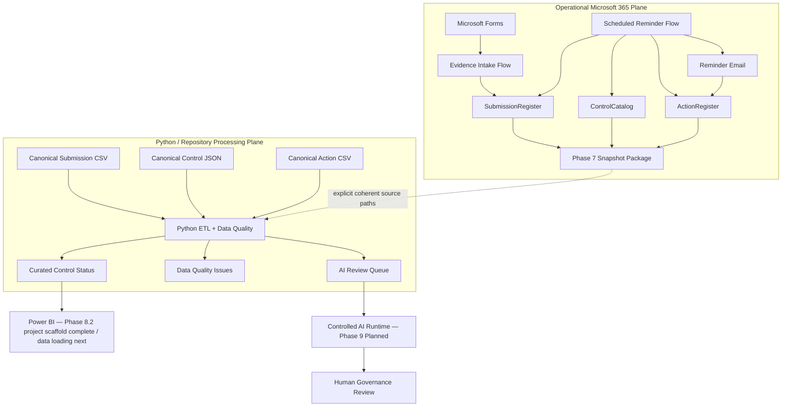
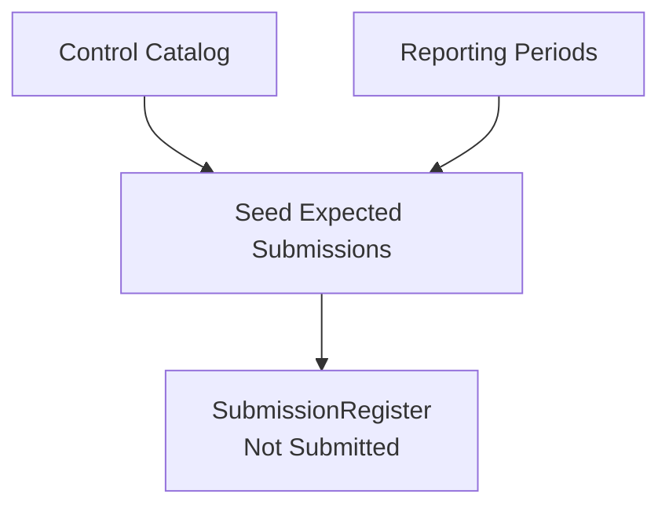
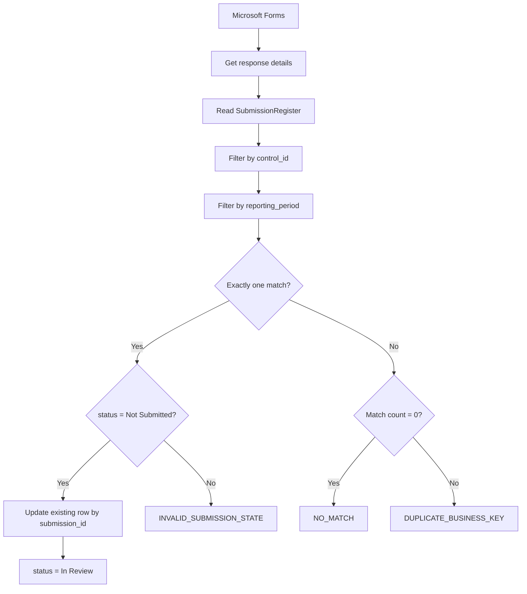

# Architecture

## Purpose

This document describes the **current architecture** of the Cyber Governance Automation Lab.

The project is a simplified cybersecurity-control evidence process built as a portfolio proof of concept. It is not production-ready. The architecture emphasizes explicit business semantics, traceable state transitions, deterministic Data Quality, controlled workflow automation, reproducible acceptance, and strict separation between operational Microsoft 365 state and canonical repository fixtures.

## 1. Architectural Overview

The project contains two distinct data planes connected by a controlled Phase 7 reporting bridge.

### Operational Microsoft 365 plane

```text
Microsoft Forms
      ↓
Power Automate Evidence Intake
      ↓
Excel Online / OneDrive
      ├─ SubmissionRegister
      ├─ ControlCatalog
      └─ ActionRegister
      ↑
Power Automate Scheduled Reminder Flow
      ↓
Reminder Email

ControlCatalog + SubmissionRegister + ActionRegister
      ↓
Power Automate Weekly Reporting Snapshot
      ↓
Private snapshot package
```

Phase 5 implements authenticated evidence intake. Phase 6 implements scheduled overdue follow-up and reminder tracking. Phase 7.2 exports the current operational source facts into a private reporting snapshot.

### Deterministic Python/repository plane

Canonical default inputs:

```text
data/reference/control_catalog.json
data/raw/evidence_submissions.csv
data/raw/actions.csv
```

Alternative Phase 7 operational inputs:

```text
security_control_snapshot_<snapshot_id>.json
security_submission_snapshot_<snapshot_id>.csv
security_action_snapshot_<snapshot_id>.csv
```

Both modes use the same processing semantics:

```text
EXTRACT
  ↓
NORMALIZE
  ↓
VALIDATE
  ↓
TRANSFORM / ENRICH
  ↓
DERIVE
  ↓
LOAD
```

Outputs:

```text
curated_control_status.csv
data_quality_issues.csv
ai_review_queue.json
```

The repository CSV/JSON datasets remain canonical synthetic acceptance fixtures. Operational snapshot processing does not overwrite them.

Phase 8.2 adds a source-controlled Power BI project scaffold under:

```text
powerbi/CyberGovernanceDashboard/
```

The scaffold uses PBIP for the project entry point, PBIR for report metadata, and TMDL for the semantic-model definition. At the Phase 8.2 boundary it contains no reporting data, model relationship, DAX measures, or final visuals.

## 2. High-Level Architecture



The Phase 7 bridge is deliberately **explicit rather than automatically synchronized**. Power Automate creates a private source snapshot; a caller explicitly supplies all three snapshot paths and the matching manifest `as_of_date` to Python.

## 3. Core Domain Model

The logical business model contains exactly four core entities:

```text
CONTROL
   │ 1:n
   ▼
SUBMISSION
   ├──────────────► ACTION
   └──────────────► DATA QUALITY ISSUE
```

Technical runtime metadata such as `snapshot_id`, `as_of_date`, `source_row_number`, manifests, or workflow branches do not create additional business entities.

Critical semantic separations:

```text
Evidence Present != Compliant
Not Submitted != Non-Compliant
Non-Compliant != Overdue
Compliance != Timeliness
Compliance != Data Quality
Submission Status != Action Status
Unknown != False
Not Evaluated != Failed
Action completion != Submission compliance
```

## 4. Why Operational State Does Not Replace Canonical Fixtures

The canonical files:

```text
data/reference/control_catalog.json
data/raw/evidence_submissions.csv
data/raw/actions.csv
```

represent a deterministic synthetic acceptance scenario evaluated at:

```text
as_of_date = 2026-08-15
```

Operational Microsoft 365 state evolved later during Phase 5–7 acceptance. For example:

- Phase 5 moved an operational expected Submission to `In Review` during evidence-intake acceptance.
- Phase 6 introduced operational overdue reminder fixtures and live Actions.
- Phase 7 exported and processed an operational snapshot containing 17 Submissions and 2 Actions.

Changing canonical fixtures merely to resemble later live PoC state would destroy the reproducible Phase 2–4 acceptance baseline.

Therefore:

```text
Operational Microsoft 365 state
!=
Canonical repository fixtures
```

Phase 7 connects the planes through explicit external files, not through destructive synchronization.

## 5. Expected Submission Initialization

Expected Submission records exist before evidence arrives and start with:

```text
status = Not Submitted
```

This makes missing process events observable.

Submission business key:

```text
control_id + reporting_period
```

Technical key:

```text
submission_id
```



Automatic generation of future expected reporting-period instances is not implemented in the current PoC.

## 6. Phase 5 Evidence Intake

Implemented path:



Evidence intake performs **UPDATE, not APPEND** and permits only:

```text
Not Submitted → In Review
```

It does not assign `Compliant` or `Non-Compliant`.

See [phase5_evidence_intake.md](phase5_evidence_intake.md).

## 7. Phase 6 Scheduled Reminder Automation

Flow:

```text
Cyber Governance - Overdue Submission Reminder
```

Schedule:

```text
Daily 08:00
W. Europe Standard Time
```

Canonical overdue rule:

```text
submitted_at IS NULL
AND
as_of_date > due_date
```

The live workflow additionally requires `status = Not Submitted` as an operational consistency guard.

Control resolution:

```text
0 Control matches  → CONTROL_NOT_FOUND
1 Control match    → resolve owner
>1 Control matches → DUPLICATE_CONTROL
```

Active Action resolution:

```text
0 active Actions  → create one
1 active Action   → reuse it
>1 active Actions → DUPLICATE_ACTIVE_ACTION
```

Same-day idempotency:

```text
last_reminder_at == today
→ SAME_DAY_REMINDER_SKIPPED
```

A confirmed reminder updates Action state:

```text
reminder_count
last_reminder_at
```

### Lifecycle limitation

The desired business lifecycle is that a missing-submission follow-up Action can be completed once the missing evidence has been received. The current Phase 5/6 PoC does **not** automate this later Action transition. An existing Action can therefore remain `Open` after the related Submission has moved to `In Review`.

Phase 7 deliberately exports the stored operational state and does not infer or repair Action lifecycle state.

See [phase6_reminder_automation.md](phase6_reminder_automation.md).

## 8. Phase 7 Reporting Snapshot Bridge

Phase 7 is complete and consists of four implementation/acceptance steps:

```text
Phase 7.0 → reporting export contract
Phase 7.1 → implementation preparation
Phase 7.2 → Power Automate reporting snapshot runtime
Phase 7.3 → explicit Python external-input boundary
WP3       → real private snapshot end-to-end acceptance
```

### Snapshot package

A successful run creates:

```text
security_control_snapshot_<snapshot_id>.json
security_submission_snapshot_<snapshot_id>.csv
security_action_snapshot_<snapshot_id>.csv
security_snapshot_manifest_<snapshot_id>.json
```

The manifest is written only after all three source artifacts succeed and contains:

```text
snapshot_id
as_of_date
generated_at_local
control_file
submission_file
action_file
control_rows
submission_rows
action_rows
status
```

A partial package without the completion manifest is not a valid snapshot.

### Runtime schedule

```text
Weekly
Monday
09:00
W. Europe Standard Time
```

The schedule follows the daily Phase 6 reminder flow at 08:00 so Monday snapshot state can include the latest confirmed reminder tracking.

### Responsibility boundary

Power Automate:

- reads `ControlCatalog`, `SubmissionRegister`, and `ActionRegister`,
- selects exact source fields,
- normalizes technical date representation for export,
- creates private source artifacts,
- records source row counts,
- writes the completion manifest last,
- follows an explicit TRY/CATCH failure path.

Power Automate does **not**:

- assign compliance,
- apply DQ-001 through DQ-010,
- calculate overdue/lateness metrics,
- aggregate Actions,
- deduplicate or repair source rows.

Python:

- accepts either canonical defaults or one explicit all-or-none source set,
- applies the existing deterministic pipeline,
- writes the existing contractual outputs.

CLI source overrides:

```text
--controls-path
--submissions-path
--actions-path
```

Output override:

```text
--output-directory
```

The three source overrides are all-or-none. The manifest is not automatically ingested; the caller passes the matching `as_of_date` explicitly.

See:

- [phase7_reporting_export.md](phase7_reporting_export.md)
- [phase7_power_automate_acceptance.md](phase7_power_automate_acceptance.md)
- [phase7_python_external_input.md](phase7_python_external_input.md)
- [phase7_end_to_end_acceptance.md](phase7_end_to_end_acceptance.md)

## 9. Phase 7 End-to-End Acceptance

The accepted private operational snapshot used:

```text
snapshot_id = 20260823_112030
as_of_date  = 2026-08-23
status      = complete
```

Manifest and Python source counts matched exactly:

```text
Controls     5 → 5
Submissions 17 → 17
Actions      2 → 2
```

Observed Python result:

```text
DQ issues: 5
Valid submissions: 12
Invalid submissions: 5
AI review queue items: 3
```

Submission grain remained `17 → 17`. Operational reminder state crossed the bridge for the two Phase 6 acceptance fixtures, including `reminder_count` and `last_reminder_at`.

After the operational run, the canonical acceptance result remained:

```text
5 Controls
15 Submissions
5 Actions
5 DQ issues
10 Valid
5 Invalid
2 AI queue items
```

and the complete automated suite remained:

```text
53 passed
```

## 10. Operational Workbook Contract

### `ControlCatalog`

```text
control_id
control_name
control_statement
business_unit
owner_role
owner_email
frequency
risk_level
```

### `SubmissionRegister`

```text
submission_id
control_id
reporting_period
due_date
status
evidence_reference
submitted_at
submitted_by
comment
```

### `ActionRegister`

```text
action_id
control_id
submission_id
owner_email
created_at
due_date
status
reminder_count
last_reminder_at
description
```

The operational workbook is private and is not committed because authenticated identities and reachable operational recipients can be written during live testing.

## 11. Python Reporting Contract

Submission remains the primary reporting grain.

Control enrichment:

```text
Submission LEFT JOIN Control
ON control_id
```

Action aggregation:

```text
reminder_count   = SUM(Action.reminder_count)
last_reminder_at = MAX(Action.last_reminder_at)
```

Active Action status is sourced from `Open` or `In Progress` Actions without multiplying Submission rows.

Derived fields include:

```text
evidence_present
overdue_flag
submission_late
days_overdue
days_late
data_quality_status
active_action_id
active_action_status
active_action_due_date
reminder_count
last_reminder_at
```

Action-specific DQ rule IDs are not introduced by Phase 7. The Python pipeline continues to apply DQ-001 through DQ-010 to Submission data.

## 12. Phase 8 Reporting Boundary

Phase 8 consumes exactly the two curated reporting outputs:

```text
curated_control_status.csv
data_quality_issues.csv
```

It does not read the operational Excel workbook or raw Phase 7 snapshots directly.

Phase 8.0 freezes the semantic/KPI contract. Phase 8.1 freezes the canonical acceptance baseline. Phase 8.2 establishes the source-controlled PBIP/PBIR/TMDL scaffold.

Current project structure:

```text
powerbi/CyberGovernanceDashboard/
├── CyberGovernanceDashboard.pbip
├── CyberGovernanceDashboard.Report/
└── CyberGovernanceDashboard.SemanticModel/
```

The report resolves the semantic model through a repository-relative path. The TMDL semantic model currently contains only initial model/culture metadata. Phase 8.3 will add the technical loading and typing of the two curated sources.

The reporting relationship remains contractually fixed as:

```text
ControlStatus[source_row_number]
          1
          │
          *
DataQualityIssues[source_row_number]
```

No Phase 8.3+ model logic is claimed by the Phase 8.2 scaffold.

See:

- [phase8_power_bi_contract.md](phase8_power_bi_contract.md)
- [phase8_canonical_baseline.md](phase8_canonical_baseline.md)
- [phase8_power_bi_project.md](phase8_power_bi_project.md)

## 13. Controlled AI Boundary

AI queue eligibility remains:

```text
data_quality_status = Valid
AND
(
    submission_status = Non-Compliant
    OR
    overdue_flag = True
)
```

The queue is a minimized review-preparation artifact, not a compliance engine or DQ repair mechanism.

Final compliance authority remains human.

## 14. Storage and Privacy Boundary

Operational snapshots remain private because they may contain:

```text
owner_email
submitted_by
comments
operational acceptance state
```

The public repository may contain only sanitized screenshots, sanitized Power Automate source, synthetic examples, non-sensitive acceptance observations, and source-controlled Power BI project metadata that contains no reporting data or private connection state.

The public workflow representation under:

```text
power_automate/solutions/cyber_governance_automation/
```

uses placeholders for environment-specific bindings.

For the Power BI project, machine-local model/cache state remains outside Git through:

```text
**/.pbi/localSettings.json
**/.pbi/cache.abf
```

## 15. Consistency and Concurrency Boundary

Excel Online / OneDrive does not provide a transactional three-table snapshot for this PoC.

The tables are read sequentially. A concurrent Phase 5/6 write could theoretically occur between reads.

Mitigations are:

- one shared `snapshot_id`,
- short sequential reads,
- scheduled execution after the normal reminder run,
- manifest created only after all source artifacts succeed,
- explicit documentation of the limitation.

Phase 7 does not claim ACID or point-in-time transactional semantics.

## 16. Component Responsibilities

### Microsoft Forms

- authenticated evidence intake,
- collects Control ID, reporting period, evidence reference, optional comment,
- does not collect a compliance decision.

### Power Automate Evidence Intake

- resolves one expected Submission,
- enforces business-key and current-state guardrails,
- updates intake-owned fields only.

### Power Automate Reminder Automation

- detects overdue missing Submissions,
- resolves accountable owner,
- creates/reuses one active follow-up Action,
- sends reminders,
- updates reminder tracking after successful delivery.

### Power Automate Reporting Snapshot

- exports exact operational source facts,
- creates completion provenance,
- fails explicitly on snapshot build errors.

### Excel Online / OneDrive

- operational PoC state and private snapshots,
- not presented as a production transactional datastore.

### Python

- deterministic extract/normalize/validate/transform/derive/load,
- canonical and explicit external source modes,
- DQ, enrichment, Action aggregation, derived reporting metrics.

### Power BI

Phase 8.2 has implemented the version-controlled PBIP/PBIR/TMDL project scaffold. The scaffold currently contains no curated source queries, model relationship, DAX measures, or final report visuals. Those are implemented in later Phase 8 work packages.

### Controlled AI Runtime

Planned for Phase 9 and not yet implemented.

## 17. Repository Governance Boundary

GitHub Actions runs the complete Python test suite for pull requests targeting `main` and pushes to `main`.

Current CI is active, but the Python check is not enforced as a required merge gate by repository rules.

Operational snapshot artifacts, private workbook data, credentials, tokens, tenant identifiers, Connection bindings, local Power BI cache/state, and private deployment packages do not belong in version control.

## 18. Architecture Principles

- Expected state exists before observed evidence.
- Evidence submission is not a compliance decision.
- Business identity and technical identity are separate.
- Compliance, timeliness, Data Quality, and workflow state are separate dimensions.
- Reminder state belongs to Action, not Submission compliance state.
- Source records are not silently repaired to make processing convenient.
- Evidence intake performs update, not append.
- Ambiguous workflow state fails safely.
- Same-day reminder execution is idempotent.
- Operational and canonical data planes remain distinct.
- Phase 7 is an explicit reporting bridge, not destructive or automatic synchronization.
- A completion manifest distinguishes valid snapshots from partial artifacts.
- Python semantics are reused for both canonical and operational source sets.
- Power BI consumes curated outputs rather than duplicating upstream business logic.
- Power BI project/report/model definitions are version-controlled separately from machine-local cache and settings.
- AI processing remains downstream of deterministic validation.
- Final compliance authority remains human.
- Excel/OneDrive is a PoC boundary, not an enterprise architecture claim.

## 19. Current Limitations

- no automatic expected-Submission generation,
- no automatic completion of missing-submission Actions after later evidence intake,
- no transactional multi-table snapshot guarantee,
- no automatic manifest ingestion or latest-snapshot discovery,
- no scheduled Python snapshot-processing service,
- no Action-specific DQ rule catalog,
- no production-grade IAM/RBAC, DLP, audit, monitoring, retention, or telemetry architecture,
- Power BI project scaffold exists, but curated data ingestion, semantic relationship, DAX measures, and final visuals are not implemented yet,
- no external AI invocation,
- no REST API implementation.

## 20. References

Current-state foundation:

- [business_process.md](business_process.md)
- [data_model.md](data_model.md)
- [data_contract.md](data_contract.md)
- [data_quality.md](data_quality.md)

Phase-specific evidence:

- [phase3_pipeline_contract.md](phase3_pipeline_contract.md)
- [phase4_test_acceptance.md](phase4_test_acceptance.md)
- [phase5_evidence_intake.md](phase5_evidence_intake.md)
- [phase6_reminder_automation.md](phase6_reminder_automation.md)
- [phase7_reporting_export.md](phase7_reporting_export.md)
- [phase7_power_automate_acceptance.md](phase7_power_automate_acceptance.md)
- [phase7_python_external_input.md](phase7_python_external_input.md)
- [phase7_end_to_end_acceptance.md](phase7_end_to_end_acceptance.md)
- [phase8_power_bi_contract.md](phase8_power_bi_contract.md)
- [phase8_canonical_baseline.md](phase8_canonical_baseline.md)
- [phase8_power_bi_project.md](phase8_power_bi_project.md)

Historical phase-specific documents remain valid for the phase they describe. Current-state foundation documents and final acceptance evidence define the present architecture.
