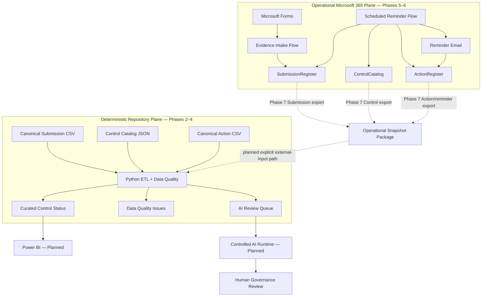
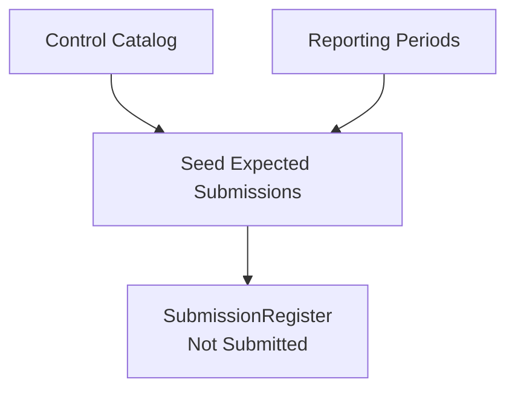
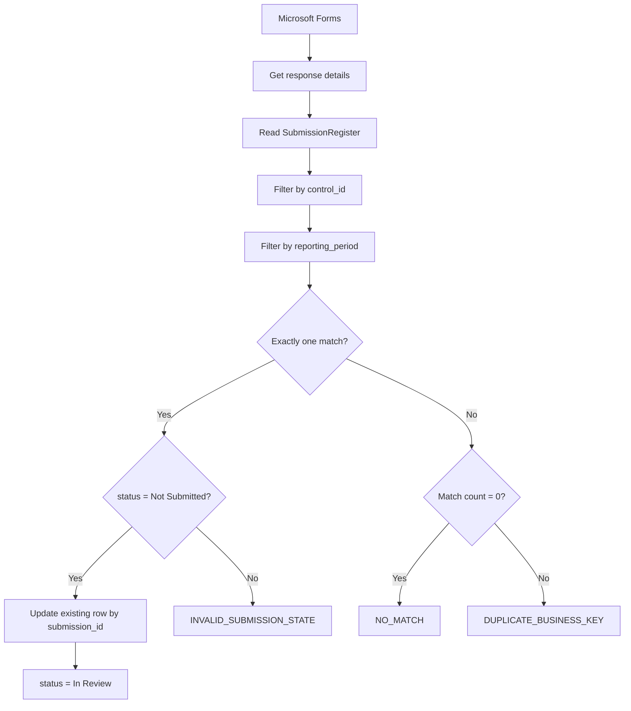
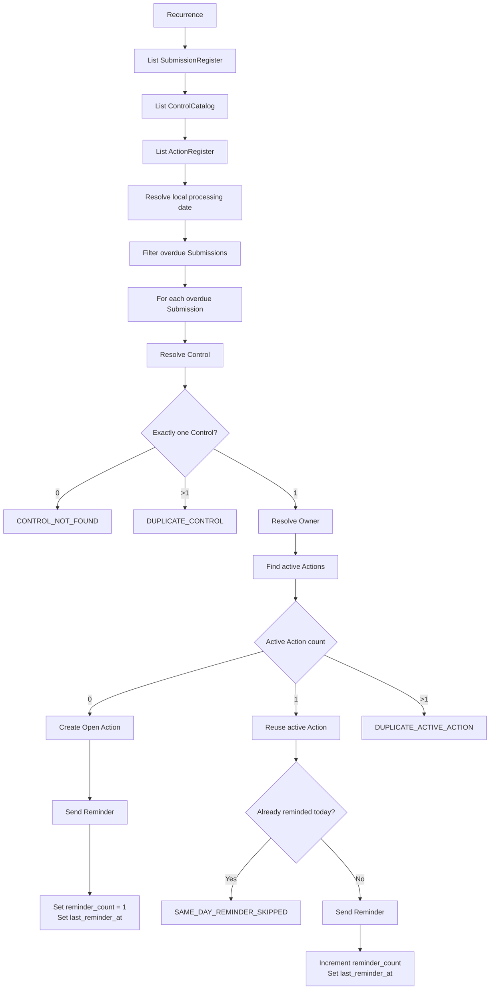

# Architecture

## Purpose

This document describes the current architecture of the Cyber Governance Automation Lab.

The project is a simplified cybersecurity-control evidence process built as a portfolio proof of concept. It is not production-ready. The architecture emphasizes explicit business semantics, traceable state transitions, deterministic Data Quality, controlled workflow automation, and clear phase/data-plane boundaries.

## 1. Current Data-Plane Boundary

The project deliberately contains two distinct data planes.

### Operational Microsoft 365 plane — Phases 5–6

```text
Microsoft Forms
      ↓
Power Automate Evidence Intake
      ↓
Excel Online / OneDrive
      ├─ SubmissionRegister
      ├─ ControlCatalog
      └─ ActionRegister
      ↑
Power Automate Scheduled Reminder Flow
      ↓
Reminder Email
```

Phase 5 implements authenticated evidence intake. Phase 6 implements scheduled overdue detection, Control-owner resolution, Action creation/reuse, reminder delivery, and reminder tracking.

### Deterministic repository plane — Phases 2–4

```text
data/reference/control_catalog.json
                    ┐
data/raw/evidence_submissions.csv ──► Python ETL + Data Quality
data/raw/actions.csv                ┘
                                    ↓
                         data/curated/*
```

The repository CSV/JSON files are canonical synthetic acceptance fixtures. They are **not** generated automatically from the live Microsoft 365 workbook.

### Planned Phase 7 bridge

Phase 7.0 now fixes the contract for a private operational snapshot package containing:

```text
Control snapshot JSON
Submission snapshot CSV
Action snapshot CSV
Completion manifest JSON
```

The runtime Power Automate export and Python external-input path are still **not implemented**. The contract is defined in [phase7_reporting_export.md](phase7_reporting_export.md).

## 2. High-Level Architecture



Phase 7.0 defines this bridge but does not yet implement the runtime synchronization.

## 3. Why Operational State Does Not Replace Canonical Fixtures

The Phase 5 happy-path acceptance test updated operational `SUB-014` from `Not Submitted` to `In Review` on 2026-08-21.

Phase 6 later added operational acceptance fixtures and live Actions for reminder testing.

The canonical repository files:

```text
data/reference/control_catalog.json
data/raw/evidence_submissions.csv
data/raw/actions.csv
```

remain unchanged because the deterministic Phase 2–4 acceptance scenario is evaluated at:

```text
as_of_date = 2026-08-15
```

Changing those fixtures merely to mirror later live testing would destroy the reproducible acceptance baseline. The two data planes serve different purposes.

Phase 7 therefore introduces an **explicit external snapshot boundary**, not an overwrite of canonical raw/reference files.

## 4. Expected Submission Initialization

Expected Submission records exist before evidence arrives and start with:

```text
status = Not Submitted
```

This is a core modeling decision: a missing submission can only be detected when an expected state exists.



Submission business key:

```text
control_id + reporting_period
```

Technical key:

```text
submission_id
```

## 5. Phase 5 Evidence Intake

Implemented flow:



The evidence-intake workflow performs **UPDATE, not APPEND** and permits only:

```text
Not Submitted → In Review
```

It does not assign `Compliant` or `Non-Compliant`.

See [phase5_evidence_intake.md](phase5_evidence_intake.md).

## 6. Phase 6 Scheduled Reminder Automation

Flow name:

```text
Cyber Governance - Overdue Submission Reminder
```

Schedule:

```text
Daily at 08:00
W. Europe Standard Time
```

Implemented logic:



Canonical overdue rule:

```text
submitted_at IS NULL
AND
as_of_date > due_date
```

The live workflow additionally requires `status = Not Submitted` as a consistency guard. It does **not** collapse overdue state into `status != Compliant`.

An active Action has status:

```text
Open
OR
In Progress
```

Operational resolution:

```text
0 active Actions → create one
1 active Action  → reuse it
>1 active Actions → DUPLICATE_ACTIVE_ACTION
```

Same-day guard:

```text
last_reminder_at == today
→ SAME_DAY_REMINDER_SKIPPED
```

Reminder state belongs to Action, not Submission compliance state.

See [phase6_reminder_automation.md](phase6_reminder_automation.md).

## 7. Phase 7 Reporting Snapshot Boundary

Phase 7.0 defines the planned bridge from operational Microsoft 365 state to downstream Python/reporting integration.

The snapshot includes all three operational source tables because mixing live Submissions/Actions with only the synthetic repository Control reference would create a mixed-state reporting run.

Planned logical package:

```text
ControlCatalog
    ↓
security_control_snapshot_<snapshot_id>.json

SubmissionRegister
    ↓
security_submission_snapshot_<snapshot_id>.csv

ActionRegister
    ↓
security_action_snapshot_<snapshot_id>.csv

all source artifacts complete
    ↓
security_snapshot_manifest_<snapshot_id>.json
```

The manifest is technical provenance metadata and completion state, not another business entity.

Power Automate will export source facts only. Python remains responsible for Data Quality, Control enrichment, Action aggregation, and derived governance/timeliness metrics.

See [phase7_reporting_export.md](phase7_reporting_export.md).

## 8. Operational Workbook Contract

### `SubmissionRegister`

```text
submission_id
control_id
reporting_period
due_date
status
evidence_reference
submitted_at
submitted_by
comment
```

### `ControlCatalog`

```text
control_id
control_name
control_statement
business_unit
owner_role
owner_email
frequency
risk_level
```

### `ActionRegister`

```text
action_id
control_id
submission_id
owner_email
created_at
due_date
status
reminder_count
last_reminder_at
description
```

The operational workbook is not committed because authenticated identities and reachable acceptance-test recipients can be written during live testing.

## 9. Component Responsibilities

### Microsoft Forms

- collects Control ID, reporting period, evidence reference, and optional comment,
- records authenticated organizational responder identity,
- does not collect compliance decisions.

### Power Automate — Evidence Intake

- resolves the Submission business key,
- validates match cardinality and current state,
- updates the expected Submission,
- exposes explicit controlled failure outcomes.

### Power Automate — Reminder Automation

- runs daily on a local schedule,
- applies the canonical overdue rule,
- resolves the accountable Control Owner,
- creates or reuses a single active follow-up Action,
- prevents same-day duplicate reminders,
- sends reminder e-mail,
- updates tracking only after successful delivery,
- fails safely on missing/duplicate Controls and duplicate active Actions.

### Power Automate — Reporting Snapshot

Phase 7.0 contract only; runtime implementation remains planned.

The planned flow may:

- read `ControlCatalog`, `SubmissionRegister`, and `ActionRegister`,
- create one shared snapshot identity,
- serialize exact source-field contracts,
- normalize technical date representation for export,
- write private source artifacts and a completion manifest,
- fail explicitly when required export steps fail.

It must not implement compliance, Data Quality rules, Action aggregation, or silent source-data repair.

### Excel Online / OneDrive

- stores operational Submission, Control, and Action state,
- provides low-complexity Microsoft 365 integration for the PoC,
- is not presented as a production transactional datastore,
- remains separate from canonical repository raw/reference data,
- will host private Phase 7 reporting snapshots once the export flow is implemented.

For production, Dataverse, SharePoint Lists, or a relational database would generally be preferable where stronger concurrency, auditability, transactional behavior, or snapshot consistency are required.

### Python

Currently:

- reads canonical repository CSV/JSON inputs,
- normalizes technical representation without semantic repair,
- applies DQ-001 through DQ-010 to Submission data,
- enriches Submission data with Control metadata,
- aggregates Action context without changing Submission grain,
- derives governance/timeliness fields,
- writes curated reporting and AI-queue outputs.

Phase 7 implementation is planned to add explicit external input paths while preserving canonical paths as defaults. Phase 7.0 does not yet change Python code.

### Power BI

Planned for Phase 8. Phase 6 now produces operational reminder fields needed for future process-impact measures:

```text
reminder_count
last_reminder_at
```

Phase 7 must carry those facts across the reporting boundary before live reminder execution can be represented in Phase 8.

### Controlled AI Workflow

Planned for Phase 9. AI output remains advisory and cannot autonomously assign final compliance status.

## 10. Repository Governance Boundary

GitHub Actions runs the Python test suite for pull requests and pushes to `main`.

Current repository metadata marks `main` as protected, but the Python check is not enforced as a required merge gate. CI is active; strict merge gating requires an explicit GitHub ruleset/branch-protection configuration.

Operational snapshot artifacts must remain outside the public repository because they can contain authenticated or reachable identities and operational comments.

## 11. Architecture Principles

- Expected state exists before observed evidence.
- Evidence submission is not a compliance decision.
- Business identity and technical identity are separate.
- Compliance, timeliness, Data Quality, and workflow state are separate dimensions.
- Reminder state belongs to Action, not Submission compliance state.
- Submission DQ failures and operational workflow ambiguity are surfaced explicitly; source Submission records are not silently repaired.
- Evidence intake performs update, not append.
- Reminder automation operationally enforces at most one active missing-submission follow-up Action per Submission.
- Same-day reminder execution is idempotent.
- The operational workbook and canonical repository fixtures are separate artifacts.
- Phase 7 snapshots are explicit external artifacts; they do not overwrite canonical fixtures.
- Phase 7.0 defines the integration contract but does not claim runtime synchronization is implemented.
- Source facts are exported before Data Quality, aggregation, and derived metrics are applied.
- AI-assisted processing is downstream of deterministic validation.
- Actual evidence files are not stored in the repository.
- Canonical repository business data is synthetic.
- No credentials, tokens, keys, or secrets belong in version control.
- Final compliance authority remains human.
- Excel/OneDrive is a PoC boundary, not an enterprise architecture claim.

## 12. Business Model Reference

- [business_process.md](business_process.md)
- [data_model.md](data_model.md)
- [data_contract.md](data_contract.md)
- [data_quality.md](data_quality.md)
- [phase5_evidence_intake.md](phase5_evidence_intake.md)
- [phase6_reminder_automation.md](phase6_reminder_automation.md)
- [phase7_reporting_export.md](phase7_reporting_export.md)

Historical phase-specific acceptance documents remain valid for the phase they describe and are not rewritten merely to resemble later operational state.

## 13. Out of Scope

- SIEM / SOC operations,
- malware analysis,
- penetration testing,
- Kubernetes,
- Kafka / Spark infrastructure for this project,
- custom frontend,
- enterprise authentication architecture,
- production evidence-document repository,
- production-grade Power Platform monitoring and alerting,
- production escalation/SLA engine,
- production transactional snapshot guarantees for the Excel-based operational plane.
