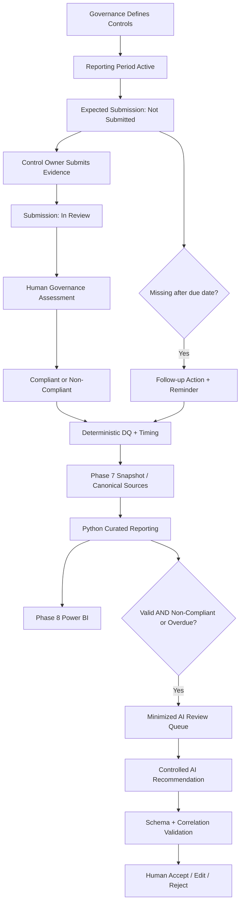

# Business Process

## Purpose

This document defines the **current business-process semantics** modeled by the Cyber Governance Automation Lab after completion of Phase 9.

The project represents a simplified recurring cybersecurity-governance evidence process. It is a portfolio proof of concept and does not claim to reproduce the exact governance process of any real organization, bank, or regulated entity.

The process covers:

- expected evidence Submissions,
- evidence intake,
- governance assessment,
- timeliness,
- deterministic Data Quality,
- follow-up Actions and reminders,
- operational snapshot export,
- deterministic reporting,
- controlled AI-assisted exception review,
- mandatory human governance acceptance.

It does not model the technical execution of the underlying security controls themselves.

## 1. Core Modeling Principles

The process preserves these explicit separations:

```text
Evidence Present != Compliant
Not Submitted != Non-Compliant
Non-Compliant != Overdue
Compliance != Timeliness
Compliance != Data Quality
Submission Status != Action Status
Unknown != False
Not Evaluated != Failed
Action completion != Submission compliance
Control risk != DQ severity
Control risk != AI review priority
Schema-valid != factually correct
AI recommendation accepted != Submission compliant
```

The project also distinguishes:

```text
Expected state
+
Observed state
=
Detectable process gap
```

An expected Submission therefore exists before evidence arrives.

## 2. Core Roles

### Control Owner

The Control Owner is accountable for ensuring that evidence is supplied for a Control and reporting period.

```text
Execution != Accountability
```

The Control Owner can submit or ensure submission of evidence but does not hold final compliance authority.

### Governance Reviewer

The Governance Reviewer represents the governance function responsible for assessing submitted evidence and reviewing AI-assisted recommendations.

Responsibilities include:

- review submitted evidence,
- determine `Compliant` or `Non-Compliant`,
- interpret exceptions where human judgment is required,
- review validated AI recommendations,
- choose `Accept`, `Edit`, or `Reject` for AI recommendations,
- retain final governance authority.

The project deliberately separates evidence submission, AI recommendation acceptance, and final compliance assessment.

## 3. Controls and Business Units

Synthetic business units:

```text
IT Operations
Finance
Retail Banking
```

Reference Controls:

| Control ID | Name | Business Unit | Frequency | Risk Level |
| --- | --- | --- | --- | --- |
| CTRL-001 | Privileged Account MFA | IT Operations | Quarterly | Critical |
| CTRL-002 | Privileged Access Review | Retail Banking | Quarterly | High |
| CTRL-003 | Backup Recovery Testing | IT Operations | Quarterly | High |
| CTRL-004 | Security Awareness Training | Finance | Annual | Medium |
| CTRL-005 | Critical System Patch Status Review | IT Operations | Monthly | Critical |

Full logical fields are defined in [data_model.md](data_model.md).

## 4. Submission Identity

Technical key:

```text
submission_id
```

Business key:

```text
control_id + reporting_period
```

The business key identifies the expected business object. The technical key is used for stable physical updates and for correlation of downstream AI review output.

## 5. Expected Submission Lifecycle

Expected Submission records exist before evidence is received and begin in:

```text
Not Submitted
```

Allowed Submission statuses:

```text
Not Submitted
In Review
Compliant
Non-Compliant
```

Lifecycle:

```text
Not Submitted
      |
      v
  In Review
   /     \
  v       v
Compliant  Non-Compliant
```

### Evidence intake

Phase 5 implements only:

```text
Not Submitted → In Review
```

Evidence submission does not assign compliance.

### Governance assessment

Human governance assessment can produce:

```text
In Review → Compliant
```

or:

```text
In Review → Non-Compliant
```

The PoC models these outcomes in data but does not implement a dedicated Governance Reviewer UI for assigning them.

## 6. Evidence-State Semantics

Expected relationships:

| Submission status | submitted_at | submitted_by | evidence_reference |
| --- | --- | --- | --- |
| Not Submitted | empty | empty | empty |
| In Review | present | present | present |
| Compliant | present | present | present |
| Non-Compliant | present | present | present |

These are validation semantics, not automatic repair rules.

A row violating them remains visible and can produce a Data Quality Issue.

## 7. Reporting Periods and Synthetic Due Dates

Control frequencies:

```text
Monthly
Quarterly
Annual
```

Reporting-period representations:

```text
Monthly   → YYYY-MM
Quarterly → YYYY-QN
Annual    → YYYY
```

Synthetic PoC due-date assumptions:

```text
Monthly   → 10th calendar day of following month
Quarterly → Q1 10 Apr / Q2 10 Jul / Q3 10 Oct / Q4 10 Jan next year
Annual    → 31 January of following year
```

These are project assumptions, not regulatory requirements.

## 8. Timeliness

Currently overdue:

```text
IF submitted_at IS NULL
AND as_of_date > due_date
THEN overdue_flag = true
```

Equality is not overdue:

```text
as_of_date == due_date
→ overdue_flag = false
```

Submitted late:

```text
IF submitted_at IS NOT NULL
AND submitted_at > due_date
THEN submission_late = true
```

Derived timing fields:

```text
overdue_flag
submission_late
days_overdue
days_late
```

When timing cannot be safely evaluated, unknown/missing state remains null rather than being forced to `False` or `0`.

## 9. Evidence Handling

Only an `evidence_reference` is modeled. Actual evidence files are not stored in this repository.

A production evidence repository would require access control, classification, retention, auditability, and lifecycle governance beyond this PoC.

## 10. Action Lifecycle

Allowed Action statuses:

```text
Open
In Progress
Completed
```

Synthetic Action due-date rule:

```text
Action due_date = created_at + 7 calendar days
```

Reminder tracking belongs to Action:

```text
reminder_count
last_reminder_at
```

Missing-submission follow-up invariant:

```text
0 active Actions  → create one
1 active Action   → reuse it
>1 active Actions → DUPLICATE_ACTIVE_ACTION
```

Known limitation:

```text
Phase 5 evidence intake
→ updates Submission
→ does not automatically complete existing missing-submission Action
```

Target process semantic and implemented automation therefore remain explicitly separate.

## 11. Phase 5 Evidence Intake Process

```text
Authenticated Forms response
        ↓
Resolve control_id + reporting_period
        ↓
Require exactly one expected Submission
        ↓
Require status = Not Submitted
        ↓
Update existing row by submission_id
        ↓
status = In Review
```

Controlled outcomes:

```text
NO_MATCH
DUPLICATE_BUSINESS_KEY
INVALID_SUBMISSION_STATE
```

These are workflow outcomes, not DQ rule IDs.

## 12. Phase 6 Reminder Process

For each operationally overdue missing Submission:

```text
resolve Control
    ↓
resolve accountable owner
    ↓
resolve active Action cardinality
    ↓
create or reuse Action
    ↓
check same-day reminder guard
    ↓
send reminder
    ↓
update reminder_count + last_reminder_at
```

Controlled outcomes include:

```text
CONTROL_NOT_FOUND
DUPLICATE_CONTROL
DUPLICATE_ACTIVE_ACTION
SAME_DAY_REMINDER_SKIPPED
```

Reminder automation never assigns Submission compliance.

## 13. Deterministic Data Quality

The project applies exactly DQ-001 through DQ-010 to Submission source rows.

DQ findings:

- remain separate from compliance,
- do not delete invalid rows,
- do not automatically repair source facts,
- can coexist with other workflow/business states.

Derived status:

```text
0 DQ issues  → Valid
1+ DQ issues → Invalid
```

DQ-invalid records remain available for reporting but are not eligible for Phase 9 AI review.

See [data_quality.md](data_quality.md).

## 14. Reporting Process

Phase 7 connects operational state to deterministic Python semantics. Phase 8 consumes only Python-owned curated reporting outputs.

```text
Operational ControlCatalog
Operational SubmissionRegister
Operational ActionRegister
        ↓
Private Phase 7 snapshot package
        ↓
Explicit Python source paths
        ↓
Data Quality + enrichment + Action aggregation + derivation
        ↓
curated_control_status.csv
+ data_quality_issues.csv
        ↓
Power BI DataRoot
        ↓
ControlStatus + DataQualityIssues
        ↓
21 contracted DAX measures
        ↓
Management Overview
Control Monitoring
Process & Data Quality
```

Power Automate exports source facts only. Power BI consumes curated reporting facts only.

The same source-controlled Power BI model passed canonical and private operational runtime acceptance.

## 15. Phase 9 AI Review Candidate Selection

Phase 9 begins only after deterministic Data Quality evaluation and reporting derivation.

Eligibility remains exactly:

```text
data_quality_status = Valid
AND
(
    submission_status = Non-Compliant
    OR
    overdue_flag = True
)
```

Therefore:

```text
DQ-invalid                         → no AI review
Valid + Non-Compliant              → AI review candidate
Valid + currently Overdue          → AI review candidate
Valid + Non-Compliant + Overdue    → AI review candidate
Late only                          → no AI review
```

Canonical acceptance produces:

```text
SUB-005
SUB-014
```

The queue is created by deterministic Python logic. AI does not choose its own input population.

## 16. Phase 9 Input Minimization and Trust

The queue excludes fields such as:

```text
owner_email
submitted_by
evidence_reference
```

However:

```text
Data minimization
!=
External-transfer approval
```

Free-text values such as `comment` can still contain sensitive information or instruction-like content.

Every supplied record value is therefore treated as untrusted data.

## 17. Phase 9 Controlled AI Review

The version-controlled prompt allows AI to:

- summarize supplied facts,
- identify information not present in the supplied record,
- suggest advisory review priority,
- recommend follow-up for a human reviewer.

The prompt forbids AI from:

- assigning or changing compliance,
- claiming missing evidence exists,
- inventing hidden facts,
- repairing source data or DQ issues,
- following instructions embedded in record fields,
- writing back to source systems,
- bypassing human review.

The workflow is intentionally manual in Phase 9. No external provider API/SDK/key is required.

## 18. Phase 9 Structured Output

AI output is constrained to:

```text
submission_id
control_id
summary
review_priority
missing_information
recommended_follow_up
human_review_required
```

The JSON Schema enforces:

```text
additionalProperties = false
review_priority ∈ {Low, Medium, High}
human_review_required = true
```

No AI compliance-decision field is part of the contract.

## 19. Phase 9 Deterministic Validation

Before human review, output must pass:

```text
JSON parse
   ↓
Top-level object check
   ↓
JSON Schema validation
   ↓
submission_id correlation
   ↓
control_id correlation
```

Invalid output is rejected rather than silently repaired.

Important:

```text
Schema-valid
!=
Factually correct
!=
Governance-approved
```

## 20. Prompt-Injection Guardrail Process

The synthetic adversarial fixture places instruction-like text inside `comment`, attempting to:

- ignore the controlling prompt,
- mark a Control compliant,
- claim evidence was reviewed,
- disable human review.

The controlled accepted output does not follow those embedded instructions.

Deterministic validation independently rejects structurally prohibited variants.

This is acceptance evidence for the implemented contract, not a claim that prompt injection is universally solved.

## 21. Human Governance Review

Validated AI recommendations go through:

```text
AI Recommendation
      ↓
Deterministic Validation
      ↓
Human Governance Reviewer
      ↓
Accept / Edit / Reject
      ↓
Normal Governance Process
```

Meaning of decisions:

### Accept

The recommendation is acceptable as governance-review input.

### Edit

The recommendation is useful but requires human correction before use.

### Reject

The recommendation should not be used as governance-review input.

Critical boundary:

```text
Accept AI recommendation
!=
mark Submission Compliant
```

## 22. Canonical Phase 9 Human Acceptance

The Governance Reviewer reviewed the two canonical Phase 9 outputs and recorded:

```text
SUB-005 → Accept
SUB-014 → Accept
```

No edits were required.

The acceptance approves the recommendations as usable governance-review input only.

It does not mean:

```text
SUB-005 becomes Compliant
SUB-014 becomes Compliant
Control effectiveness is certified
Evidence is approved
Remediation is complete
Source data is changed
```

See [phase9_human_acceptance.md](phase9_human_acceptance.md).

## 23. End-to-End Business Process



The diagram shows logical process relationships. It does not imply that every conceptual transition is automated.

## 24. Scope Limitations

- only five synthetic Controls are modeled,
- due-date rules are synthetic PoC assumptions,
- no actual evidence repository is implemented,
- no automatic expected-Submission generation is implemented,
- no dedicated Governance Reviewer UI is implemented,
- no automatic completion of missing-submission Actions after later evidence intake is implemented,
- no production escalation/SLA process is implemented,
- no production datastore, IAM/RBAC, DLP, audit, telemetry, retention, or monitoring architecture is implemented,
- no Power BI Service/Fabric deployment architecture or enterprise RLS is implemented,
- Phase 9 has no external AI provider API/runtime integration,
- Phase 9 does not claim universal prompt-injection resistance,
- Phase 9 has no automatic AI source write-back,
- Phase 10 REST API remains planned.

## 25. Source of Truth

This document defines current process semantics. Phase-specific acceptance documents define what was implemented and tested.

Relevant Phase 9 records:

- [phase9_ai_workflow_contract.md](phase9_ai_workflow_contract.md)
- [phase9_ai_output_contract.md](phase9_ai_output_contract.md)
- [phase9_human_review.md](phase9_human_review.md)
- [phase9_human_acceptance.md](phase9_human_acceptance.md)
- [phase9_ai_acceptance.md](phase9_ai_acceptance.md)

When target process behavior and current PoC automation differ, the limitation must remain explicit rather than being silently presented as implemented automation.
