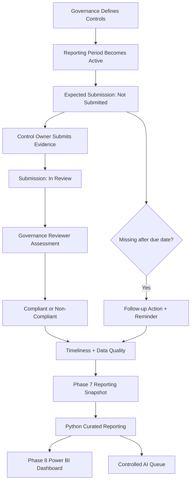

# Business Process

## Purpose

This document defines the **current business-process semantics** modeled by the Cyber Governance Automation Lab.

The project represents a simplified recurring cybersecurity-governance evidence process. It is a portfolio proof of concept and does not claim to reproduce the exact control-governance process of any real organization, bank, or regulated entity.

The process covers expected evidence Submissions, evidence intake, governance assessment, timeliness, deterministic Data Quality, follow-up Actions, reminder tracking, operational snapshot export, deterministic processing, and Power BI reporting. It does not model the technical execution of the underlying controls themselves.

## 1. Core Modeling Principles

The process is built around several explicit separations:

```text
Evidence Present != Compliant
Not Submitted != Non-Compliant
Non-Compliant != Overdue
Compliance != Timeliness
Compliance != Data Quality
Submission Status != Action Status
Unknown != False
Not Evaluated != Failed
Action completion != Submission compliance
Control risk != DQ severity
```

The project also distinguishes:

```text
Expected state
+
Observed state
=
Detectable process gap
```

An expected Submission therefore exists before evidence arrives.

## 2. Core Roles

### Control Owner

The Control Owner is accountable for ensuring that evidence is supplied for a Control and reporting period. Accountability does not require the owner to personally execute every underlying technical activity.

```text
Execution != Accountability
```

The Control Owner can submit or ensure submission of evidence but does not hold final compliance authority.

### Governance Reviewer

The Governance Reviewer represents the governance function responsible for assessing submitted evidence.

Responsibilities include:

- review submitted evidence,
- determine `Compliant` or `Non-Compliant`,
- interpret relevant exceptions where human judgment is required,
- review AI-assisted recommendations,
- retain final decision authority.

The project deliberately separates evidence submission from final governance assessment.

## 3. Business Units and Controls

The synthetic reference model uses three business units:

```text
IT Operations
Finance
Retail Banking
```

Each Control belongs to one primary business unit and one accountable owner in this PoC.

Reference Controls:

| Control ID | Name | Business Unit | Frequency | Risk Level |
| --- | --- | --- | --- | --- |
| CTRL-001 | Privileged Account MFA | IT Operations | Quarterly | Critical |
| CTRL-002 | Privileged Access Review | Retail Banking | Quarterly | High |
| CTRL-003 | Backup Recovery Testing | IT Operations | Quarterly | High |
| CTRL-004 | Security Awareness Training | Finance | Annual | Medium |
| CTRL-005 | Critical System Patch Status Review | IT Operations | Monthly | Critical |

Full logical fields are defined in [data_model.md](data_model.md).

## 4. Submission Identity

A Submission represents one expected or completed evidence-assessment record for one Control and reporting period.

Technical key:

```text
submission_id
```

Business key:

```text
control_id + reporting_period
```

The business key identifies the expected business object. The technical key is used for stable physical updates.

## 5. Expected Submission Lifecycle

Expected Submission records exist before evidence is received and begin in:

```text
Not Submitted
```

Allowed Submission statuses are exactly:

```text
Not Submitted
In Review
Compliant
Non-Compliant
```

Lifecycle:

```text
Not Submitted
      |
      v
  In Review
   /     \
  v       v
Compliant  Non-Compliant
```

`Open` is not a Submission status. It belongs to Action.

### Evidence intake transition

Phase 5 operationalizes only:

```text
Not Submitted → In Review
```

Evidence submission does not assign compliance.

### Governance assessment

The later governance assessment produces:

```text
In Review → Compliant
```

or:

```text
In Review → Non-Compliant
```

The project models these outcomes in data but does not currently implement a dedicated Governance Reviewer UI for making the decision.

## 6. Evidence-State Semantics

Expected state relationships are:

| Submission status | submitted_at | submitted_by | evidence_reference |
| --- | --- | --- | --- |
| Not Submitted | empty | empty | empty |
| In Review | present | present | present |
| Compliant | present | present | present |
| Non-Compliant | present | present | present |

These are validation semantics, not automatic repair rules.

A source row violating them remains visible and can produce a Data Quality Issue.

## 7. Reporting Frequency and Periods

Control `frequency` values:

```text
Monthly
Quarterly
Annual
```

Submission `reporting_period` representations:

```text
Monthly   → YYYY-MM
Quarterly → YYYY-QN
Annual    → YYYY
```

Examples:

```text
2026-08
2026-Q3
2026
```

## 8. Synthetic Due-Date Rules

The following rules are project assumptions for the PoC. They are not regulatory requirements.

### Monthly

```text
Due date = 10th calendar day of the following month
```

Example:

```text
2026-08 → 2026-09-10
```

### Quarterly

```text
Q1 → 10 April
Q2 → 10 July
Q3 → 10 October
Q4 → 10 January of the following year
```

### Annual

```text
Reporting year YYYY
→ 31 January of YYYY+1
```

## 9. Timeliness

### Currently overdue

```text
IF submitted_at IS NULL
AND as_of_date > due_date
THEN overdue_flag = true
```

Equality is not overdue:

```text
as_of_date == due_date
→ overdue_flag = false
```

`as_of_date` is an execution/snapshot parameter, not a persisted Submission source field.

### Submitted late

```text
IF submitted_at IS NOT NULL
AND submitted_at > due_date
THEN submission_late = true
```

A Submission can therefore be:

- compliant and late,
- non-compliant and on time,
- overdue because no Submission has arrived,
- in review after a late submission.

Compliance and timeliness are independent.

### Derived timing fields

```text
overdue_flag
submission_late
days_overdue
days_late
```

When required dates are not evaluable, the deterministic pipeline preserves unknown/missing derived state rather than forcing `False` or `0`.

## 10. Evidence Handling

Only an `evidence_reference` is modeled. Actual evidence files are not stored in this repository.

Synthetic examples may resemble:

```text
EVID-001
sharepoint://evidence/EVID-001
```

A production evidence repository would require access control, classification, retention, auditability, and lifecycle governance beyond this PoC.

## 11. Action Lifecycle

Actions are follow-up work items related to exactly one Submission.

Allowed statuses:

```text
Open
In Progress
Completed
```

Synthetic due-date rule:

```text
Action due_date = created_at + 7 calendar days
```

Reminder tracking belongs to Action:

```text
reminder_count
last_reminder_at
```

### Missing-submission follow-up

When a Submission is missing and overdue, Phase 6 may create or reuse one active follow-up Action.

Operational invariant:

```text
0 active Actions  → create one
1 active Action   → reuse it
>1 active Actions → DUPLICATE_ACTIVE_ACTION
```

The conceptual business completion condition is:

```text
missing evidence received
→ missing-submission follow-up task no longer needed
```

and therefore the **target lifecycle** can resolve that Action to:

```text
Completed
```

However, the current PoC does **not automatically implement this transition** when Phase 5 later receives evidence and moves the Submission to `In Review`.

Current implementation boundary:

```text
Phase 5 evidence intake
→ updates Submission
→ does not complete existing Action
```

Therefore an operational missing-submission Action may remain `Open` until separately resolved.

This distinction is intentional:

```text
Target process semantic
!=
Implemented automation
```

Phase 7 exports the Action state exactly as stored and does not infer lifecycle repair.

### Non-Compliant remediation Actions

An Action associated with a `Non-Compliant` Submission represents remediation work. Evidence presence does not automatically complete that Action.

### Data Quality follow-up

A Data Quality finding may conceptually require human follow-up. The deterministic pipeline surfaces DQ Issues but does not silently mutate source Submissions or invent remediation outcomes.

## 12. Phase 5 Evidence Intake Process

```text
Authenticated Forms response
        ↓
Resolve control_id + reporting_period
        ↓
Require exactly one expected Submission
        ↓
Require status = Not Submitted
        ↓
Update existing row by submission_id
        ↓
status = In Review
```

Controlled outcomes:

```text
NO_MATCH
DUPLICATE_BUSINESS_KEY
INVALID_SUBMISSION_STATE
```

These are workflow outcomes, not DQ rule IDs.

## 13. Phase 6 Reminder Process

For each operationally overdue missing Submission:

```text
resolve Control
    ↓
resolve accountable owner
    ↓
resolve active Action cardinality
    ↓
create or reuse Action
    ↓
check same-day reminder guard
    ↓
send reminder
    ↓
update reminder_count + last_reminder_at
```

Control ambiguity outcomes:

```text
CONTROL_NOT_FOUND
DUPLICATE_CONTROL
```

Action ambiguity/idempotency outcomes:

```text
DUPLICATE_ACTIVE_ACTION
SAME_DAY_REMINDER_SKIPPED
```

Reminder automation never assigns Submission compliance.

## 14. Deterministic Data Quality

The project applies exactly DQ-001 through DQ-010 to Submission source rows.

DQ findings:

- remain separate from compliance status,
- do not delete invalid rows,
- do not automatically repair malformed source facts,
- can coexist with other workflow/business states.

Derived:

```text
0 DQ issues  → Valid
1+ DQ issues → Invalid
```

See [data_quality.md](data_quality.md).

## 15. Reporting Process

Phase 7 connects current operational state to the same deterministic Python reporting semantics, and Phase 8 consumes only the resulting curated reporting outputs.

```text
Operational ControlCatalog
Operational SubmissionRegister
Operational ActionRegister
        ↓
Power Automate private snapshot package
        ↓
explicit Python source paths
        ↓
Data Quality + enrichment + Action aggregation + derivation
        ↓
curated_control_status.csv
+ data_quality_issues.csv
        ↓
Power BI DataRoot
        ↓
ControlStatus + DataQualityIssues
        ↓
21 contracted DAX measures
        ↓
Management Overview
Control Monitoring
Process & Data Quality
```

Power Automate exports source facts only. It does not assign compliance, evaluate DQ rules, aggregate Actions, or repair source state.

Power BI does not read the operational workbook or raw Phase 7 snapshots directly. It consumes only the two Python-curated CSV reporting outputs. Power Query performs technical ingestion and typing; it does not reimplement Python business rules.

The Phase 7 bridge has been accepted end to end with one private operational snapshot while preserving the canonical repository baseline. Phase 8 has been accepted against both the canonical synthetic output and a private processed Phase 7 output set using the same source-controlled PBIP/PBIR/TMDL model and a configurable `DataRoot`.

See:

- [phase7_end_to_end_acceptance.md](phase7_end_to_end_acceptance.md)
- [phase8_canonical_acceptance.md](phase8_canonical_acceptance.md)
- [phase8_operational_acceptance.md](phase8_operational_acceptance.md)
- [phase8_final_acceptance.md](phase8_final_acceptance.md)

## 16. AI Review Preparation

The minimized AI queue includes only:

```text
data_quality_status = Valid
AND
(
    submission_status = Non-Compliant
    OR
    overdue_flag = True
)
```

AI processing is review preparation. It is not the final compliance decision and it is not a Data Quality repair mechanism.

The queue artifact is implemented by the deterministic Python pipeline. External controlled AI runtime execution remains a later phase.

## 17. End-to-End Process



The diagram shows logical process relationships. It does not imply that every conceptual transition is currently automated. In particular, the Governance Reviewer decision UI and automatic Action completion after later evidence intake are not implemented.

## 18. Scope Limitations

- only five synthetic Controls are modeled,
- each Control has one primary business unit and accountable owner,
- due-date rules are synthetic PoC assumptions,
- no actual evidence repository is implemented,
- no automatic expected-Submission generation is implemented,
- no dedicated Governance Reviewer decision UI is implemented,
- no automatic completion of missing-submission Actions after later evidence intake is implemented,
- no production escalation/SLA process is implemented,
- no production datastore, IAM/RBAC, audit, telemetry, or retention architecture is implemented,
- Phase 8 Power BI reporting is implemented and accepted locally, but Power BI Service/Fabric deployment, gateways, deployment pipelines, enterprise RLS, and production monitoring are not implemented,
- the canonical Power BI fixture does not contain a direct runtime null example for every nullable timing column,
- operational Power BI acceptance requires authorized access to the private accepted Phase 7 snapshot,
- AI runtime and REST API remain later phases.

## 19. Source of Truth

This document defines current process semantics. Phase-specific acceptance documents define what was actually implemented and tested in each phase.

When target process behavior and current PoC automation differ, the implementation limitation must be explicit rather than silently treating the target behavior as already automated.
