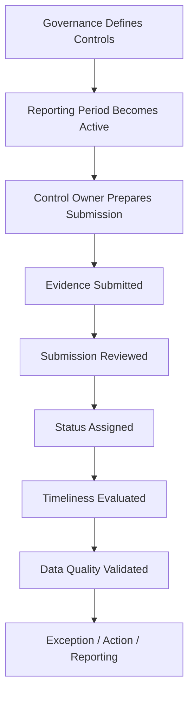

# Business Process

## Purpose

This document defines the simplified, recurring cybersecurity governance process modeled by this project. In this process, control owners periodically provide evidence that a security control is implemented and operating as expected.

This is a portfolio proof of concept. The process is intentionally simplified and does not claim to represent the exact governance process of any real organization, bank, or regulated entity.

## Process Scope

The process covers the recurring lifecycle of a security control's evidence submission: from the moment a reporting period becomes active, through evidence submission and review, to status assessment, timeliness evaluation, data quality validation, and downstream reporting/actions.

It does not cover control design, control implementation, or the technical execution of the underlying security measures themselves.

## Core Roles

### Control Owner

The control owner is accountable for a security control from a governance perspective. The control owner is responsible for ensuring that evidence is submitted for each reporting period, even if the underlying technical activity is performed by someone else.

`Execution does not necessarily equal accountability.`

A control owner does not need to personally execute every technical activity related to the control (for example, running a patch scan or configuring MFA). Their accountability is for ensuring the control is confirmed and evidenced on time, not for performing every underlying technical task themselves.

## Business Units

This project uses exactly three business units:

* IT Operations
* Finance
* Retail Banking

For this proof of concept, each control belongs to exactly:

* one primary business unit, and
* one accountable control owner.

This is a deliberate simplification. A production solution could model controls with multiple business units and multiple accountable owners, shared ownership, or delegated ownership. That complexity is out of scope here.

## Security Controls

Five security controls are used as the reference dataset for this project:

| Control ID | Name | Business Unit | Frequency | Risk Level |
| --- | --- | --- | --- | --- |
| CTRL-001 | Privileged Account MFA | IT Operations | Quarterly | Critical |
| CTRL-002 | Privileged Access Review | Retail Banking | Quarterly | High |
| CTRL-003 | Backup Recovery Testing | IT Operations | Quarterly | High |
| CTRL-004 | Security Awareness Training | Finance | Annual | Medium |
| CTRL-005 | Critical System Patch Status Review | IT Operations | Monthly | Critical |

Full field-level definitions for each control are documented in [data_model.md](data_model.md).

## Submission Lifecycle

A submission record exists for every expected control/reporting-period combination from the moment the reporting period becomes active, not only once evidence has been provided. This record starts in `Not Submitted`, then progresses through review and receives a status once evidence has been assessed. The submission lifecycle is described in detail in [Status Model](#status-model).

At a high level, for each active reporting period and control:

1. The reporting period becomes active; the expected submission record is created with status `Not Submitted`.
2. The control owner prepares and submits evidence.
3. The submission is reviewed.
4. A status is assigned.
5. Timeliness is evaluated.
6. Data quality is validated.
7. Exceptions, actions, or reporting outputs are generated as needed.

## Status Model

Submissions use exactly the following status values:

```text
Not Submitted
In Review
Compliant
Non-Compliant
```

`Open` is not a valid submission status. `Open` is only used in the [Action Lifecycle](#action-lifecycle).

Lifecycle:

```text
Not Submitted
      |
      v
  In Review
   /     \
  v       v
Compliant  Non-Compliant
```

Important distinctions:

```text
Not Submitted != Non-Compliant
```

A missing submission is not the same as a control that was assessed and found non-compliant.

```text
Non-Compliant != Overdue
```

A submission can be non-compliant and still on time, or compliant and still have been submitted late. Compliance status and timeliness are evaluated independently.

```text
Evidence Present != Compliant
```

Attaching evidence does not by itself make a submission compliant. Compliance is a review outcome, not a byproduct of evidence being present.

## Reporting Frequency and Periods

Each control has a fixed `frequency`:

```text
Monthly
Quarterly
Annual
```

Each submission has a `reporting_period`, which identifies the specific period being assessed:

```text
Monthly   -> YYYY-MM
Quarterly -> YYYY-QN
Annual    -> YYYY
```

Examples:

```text
2026-08
2026-Q3
2026
```

`frequency` belongs to the control (how often it is assessed). `reporting_period` belongs to the individual submission (which specific period it covers).

## Due-Date Logic

The following due-date rules are synthetic project assumptions used for this proof of concept. They are not derived from any regulatory requirement.

### Monthly

Due date = 10th calendar day of the following month.

```text
Reporting Period: 2026-08
Due Date: 2026-09-10
```

### Quarterly

Due date = 10th calendar day after quarter end.

```text
Reporting Period: 2026-Q3
Quarter End: 2026-09-30
Due Date: 2026-10-10
```

### Annual

Due date = January 31 of the following year.

```text
Reporting Period: 2026
Due Date: 2027-01-31
```

## Overdue and Late Submission Logic

### Currently Overdue

```text
IF submitted_at IS NULL
AND as_of_date > due_date
THEN overdue_flag = true
```

A submission is currently overdue when it is still missing after the deadline has passed.

`as_of_date` is the reference date used when evaluating whether an unsubmitted submission is currently overdue.

```text
Normal execution:
as_of_date = current processing date

Tests / synthetic scenarios:
as_of_date may be explicitly supplied as a fixed date for reproducible results
```

`as_of_date` is not stored as a source field on every submission. It is a parameter of the overdue evaluation, not a persisted attribute of the Submission entity.

### Late Submission

```text
IF submitted_at > due_date
THEN submission_late = true
```

A late submission is one that was eventually submitted, but after the deadline.

### Derived Fields

The following fields are computed, not manually maintained:

```text
overdue_flag
submission_late
days_overdue
days_late
```

### Examples

#### On time and compliant

```text
due_date: 2026-08-10
submitted_at: 2026-08-08
status: Compliant

overdue_flag: false
submission_late: false
days_overdue: 0
days_late: 0
```

#### On time but non-compliant

```text
due_date: 2026-08-10
submitted_at: 2026-08-09
status: Non-Compliant

overdue_flag: false
submission_late: false
```

#### Missing and overdue

```text
due_date: 2026-08-10
submitted_at: null
as_of_date: 2026-08-15
status: Not Submitted

overdue_flag: true
days_overdue: 5
```

#### Submitted late

```text
due_date: 2026-08-10
submitted_at: 2026-08-14
status: In Review

overdue_flag: false
submission_late: true
days_late: 4
```

## Evidence Handling

Evidence is a traceable record demonstrating that a control has been implemented or reviewed.

| Control | Example Evidence |
| --- | --- |
| Privileged Account MFA | MFA configuration report |
| Privileged Access Review | Access review report |
| Backup Recovery Testing | Recovery test report |
| Security Awareness Training | Training completion report |
| Critical System Patch Status Review | Patch status report |

This project does not store actual evidence files. Only an `evidence_reference` is stored, for example:

```text
EVID-001
```

or, synthetically:

```text
sharepoint://evidence/EVID-001
```

No real security reports, credentials, tokens, personal data, internal company data, real system names, or confidential findings are stored in this repository. All evidence references are synthetic.

## Action Lifecycle

Actions are follow-up work items and are tracked separately from submissions. Actions use their own status model:

```text
Open
In Progress
Completed
```

```text
Submission Status
!=
Action Status
```

A submission status describes the assessment outcome of a specific reporting period. An action status describes the progress of a follow-up task (for example, remediating a non-compliant finding or chasing a missing submission). The two are related but independent.

## End-to-End Process



## Scope Limitations

* Only five controls are modeled.
* Each control has exactly one business unit and one accountable owner.
* Due-date rules are synthetic PoC assumptions, not regulatory requirements.
* No real evidence files, credentials, or personal data are stored.
* This document describes process logic only; it does not describe implementation (Power Automate flows, Python code, or Power BI reports are documented separately as they are built).
