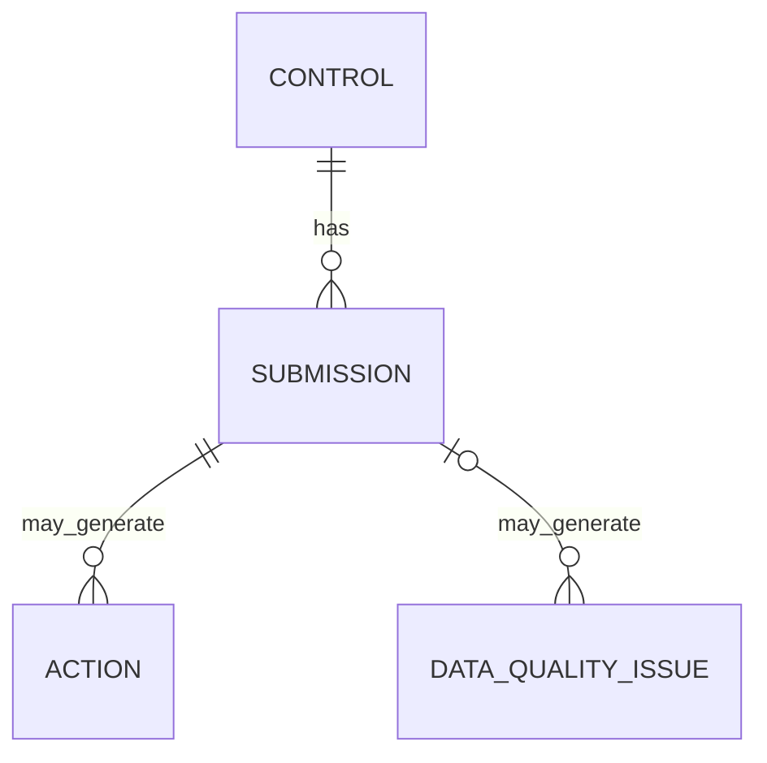

# Data Model

## Purpose

This document defines the logical business data model for the Cyber Governance Automation Lab: entities, fields, relationships, keys, enumerations, and derived-state semantics.

Physical CSV serialization is defined separately in [data_contract.md](data_contract.md). Operational Microsoft 365 table mappings are documented in the Phase 5 and Phase 6 workflow contracts.

## 1. Modeling Principles

- The logical model contains exactly four core entities.
- Source data and derived data remain separate.
- Business identity and technical identity remain separate.
- Compliance, timeliness, Data Quality, and workflow state remain separate dimensions.
- Canonical repository identities and e-mail addresses are synthetic.
- Operational workbook data may evolve independently from canonical repository fixtures.

## 2. Entity Overview

The four core entities are:

- **Control** — stable definition of a security control.
- **Submission** — one expected or completed evidence-assessment record for one Control and reporting period.
- **Action** — follow-up work related to exactly one Submission.
- **Data Quality Issue** — deterministic validation finding against a raw Submission source row.

```text
CONTROL
   │ 1:n
   ▼
SUBMISSION
   ├──────────────► ACTION
   └──────────────► DATA QUALITY ISSUE
```

No additional physical table, runtime parameter, screenshot, or workflow branch creates another core business entity.

## 3. Control

| Field | Description |
| --- | --- |
| `control_id` | Unique Control identifier |
| `control_name` | Human-readable name |
| `control_statement` | Testable Control requirement |
| `business_unit` | Primary responsible business unit |
| `owner_role` | Accountable organizational role |
| `owner_email` | Synthetic repository contact address |
| `frequency` | Monthly, Quarterly, or Annual |
| `risk_level` | Low, Medium, High, or Critical |

Canonical Control inventory:

| control_id | control_name | business_unit | owner_role | owner_email | frequency | risk_level |
| --- | --- | --- | --- | --- | --- | --- |
| CTRL-001 | Privileged Account MFA | IT Operations | Identity & Access Manager | `alice@example.com` | Quarterly | Critical |
| CTRL-002 | Privileged Access Review | Retail Banking | Access Governance Manager | `bob@example.com` | Quarterly | High |
| CTRL-003 | Backup Recovery Testing | IT Operations | Infrastructure & Resilience Manager | `carol@example.com` | Quarterly | High |
| CTRL-004 | Security Awareness Training | Finance | Security Awareness Coordinator | `diana@example.com` | Annual | Medium |
| CTRL-005 | Critical System Patch Status Review | IT Operations | Vulnerability & Patch Manager | `erin@example.com` | Monthly | Critical |

Canonical Control statements:

| control_id | control_statement |
| --- | --- |
| CTRL-001 | Multi-factor authentication must be enabled for all privileged accounts. |
| CTRL-002 | Privileged user accounts and access assignments must be reviewed at defined intervals. |
| CTRL-003 | Recovery from backups must be tested at defined intervals and the test result must be documented. |
| CTRL-004 | Staff must complete security awareness training at defined intervals. |
| CTRL-005 | The patch status of critical systems must be reviewed at defined intervals and documented. |

[data/reference/control_catalog.json](../data/reference/control_catalog.json) must match these canonical values.

## 4. Submission

A Submission is a period-specific expected assessment record for a Control. One record exists for each expected Control/reporting-period combination before evidence is received.

This means:

```text
status = Not Submitted
```

is an explicit expected process state, not an absence of data. Pre-existing expected records make overdue detection possible.

| Field | Description |
| --- | --- |
| `submission_id` | Unique technical Submission identifier |
| `control_id` | Reference to related Control |
| `reporting_period` | Period being assessed |
| `due_date` | Submission deadline |
| `status` | Submission assessment/workflow status |
| `evidence_reference` | Reference to supporting evidence |
| `submitted_at` | Submission date |
| `submitted_by` | Synthetic repository submitter identity |
| `comment` | Short contextual note |

### Submission business key

```text
control_id + reporting_period
```

The business key is not extended with `business_unit`, because business unit is already a Control attribute.

### Submission technical key

```text
submission_id
```

## 5. Action

An Action is a follow-up work item related to exactly one Submission. Through that Submission, it is also related to one Control.

| Field | Description |
| --- | --- |
| `action_id` | Unique Action identifier |
| `control_id` | Denormalized related Control identifier |
| `submission_id` | Related Submission |
| `owner_email` | Responsible Action owner |
| `created_at` | Action creation date |
| `due_date` | Action deadline |
| `status` | Open, In Progress, or Completed |
| `reminder_count` | Number of confirmed reminders sent |
| `last_reminder_at` | Date of latest confirmed reminder |
| `description` | Short follow-up description |

`control_id` is retained as a denormalized convenience field for flat-file reporting and Excel-based workflows. It does not create an independent Action-to-Control relationship.

Consistency rule:

```text
action.control_id
=
submission.control_id
for action.submission_id
```

### Action Data Constraints

The following invariants apply to canonical Action data and the operational `ActionRegister`:

- `action_id` is required and unique,
- `submission_id` is required,
- `control_id` is required,
- Action `control_id` must match the referenced Submission,
- `owner_email` is required and must contain `@` as a simple plausibility check,
- `reminder_count` is a non-negative integer,
- `reminder_count = 0` permits empty `last_reminder_at`,
- `reminder_count > 0` requires `last_reminder_at`,
- `created_at` is required,
- `due_date` is required,
- synthetic PoC rule: `due_date = created_at + 7 calendar days`,
- `status` is one of `Open`, `In Progress`, `Completed`,
- a Submission may have at most one non-completed Action (`Open` or `In Progress`) for missing-submission reminder tracking.

The deterministic Python pipeline does not currently implement Action-specific DQ rule IDs. Phase 6 enforces active-Action cardinality operationally and fails safely with `DUPLICATE_ACTIVE_ACTION` when more than one active Action exists for an overdue Submission.

## 6. Data Quality Issue

| Field | Description |
| --- | --- |
| `issue_id` | Unique DQ issue identifier |
| `submission_id` | Related Submission; nullable when source ID is missing |
| `control_id` | Related Control; nullable when source ID is missing |
| `source_row_number` | 1-based raw Submission row number |
| `rule` | Triggered DQ rule label |
| `severity` | High, Medium, or Low |
| `field` | Field(s) associated with the finding |
| `message` | Human-readable issue description |

`source_row_number` is technical lineage metadata, not a fifth entity. It preserves traceability even for malformed source rows whose business identifiers are missing or duplicated.

The canonical rule catalog is defined in [data_quality.md](data_quality.md).

## 7. Relationships



The optional identifiable-Submission side of the Data Quality Issue relationship reflects malformed raw input. Every DQ issue still maps to a raw source row through `source_row_number`.

## 8. Status and Enumeration Contracts

### Submission status

```text
Not Submitted
In Review
Compliant
Non-Compliant
```

### Action status

```text
Open
In Progress
Completed
```

### Frequency

```text
Monthly
Quarterly
Annual
```

### Risk level

```text
Low
Medium
High
Critical
```

### Data Quality severity

```text
High
Medium
Low
```

### Business unit

```text
IT Operations
Finance
Retail Banking
```

## 9. Derived Metrics

The following are derived values, not raw Submission source fields:

```text
evidence_present
overdue_flag
submission_late
days_overdue
days_late
data_quality_status
```

`as_of_date` is an execution parameter used for overdue evaluation. It is not persisted as a Submission source field.

### `evidence_present`

```text
IF evidence_reference is present and non-empty
THEN evidence_present = true
ELSE evidence_present = false
```

### `overdue_flag`

```text
IF submitted_at IS NULL
AND as_of_date > due_date
THEN overdue_flag = true
ELSE overdue_flag = false
```

Equality is not overdue:

```text
as_of_date == due_date
→ overdue_flag = false
```

### `submission_late`

```text
IF submitted_at IS NOT NULL
AND submitted_at > due_date
THEN submission_late = true
ELSE submission_late = false
```

### `days_overdue`

```text
IF overdue_flag = true
THEN days_overdue = as_of_date - due_date in calendar days
ELSE days_overdue = 0
```

### `days_late`

```text
IF submission_late = true
THEN days_late = submitted_at - due_date in calendar days
ELSE days_late = 0
```

### `data_quality_status`

Allowed derived values:

```text
Valid
Invalid
```

Derivation:

```text
0 DQ issues  → Valid
1+ DQ issues → Invalid
```

`Invalid` is a Data Quality result, not a compliance outcome.

## 10. Critical Semantic Separations

```text
Evidence Present != Compliant
Not Submitted != Non-Compliant
Non-Compliant != Overdue
Compliance != Timeliness
Compliance != Data Quality
Submission Status != Action Status
Unknown != False
Not Evaluated != Failed
Action completion != Submission compliance
```

These distinctions are contractual across documentation, Python derivation, and Power Automate workflows.

## 11. Operational Mapping

Phase 5–6 map the existing logical entities into physical Excel tables:

```text
Control    → ControlCatalog
Submission → SubmissionRegister
Action     → ActionRegister
```

This operational representation does not replace the canonical repository fixtures and does not add new logical entities.

See:

- [phase5_evidence_intake.md](phase5_evidence_intake.md)
- [phase6_reminder_automation.md](phase6_reminder_automation.md)

## 12. Production Considerations

This model is intentionally minimal for a portfolio proof of concept. A production system could reasonably add versioned Control definitions, shared/delegated ownership, formal evidence storage, richer review/approval workflows, Action validation and telemetry, and a transactional datastore such as Dataverse or a relational database. None of those extensions are claimed as implemented here.
