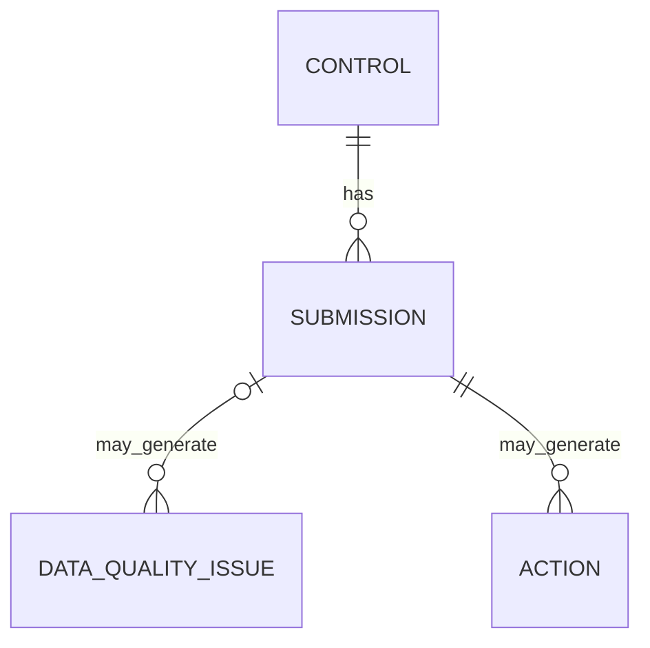

# Data Model

## Purpose

This document defines the business data model for the Cyber Governance Automation Lab: the entities, fields, relationships, and enumerations used by the governance process described in [business_process.md](business_process.md).

This document defines the logical data model. The physical serialization and flat-file representation are defined separately in the [Raw Data Contract](data_contract.md). This document does not create any data files.

## Modeling Principles

* The model is intentionally small: four entities, no more than needed to demonstrate the end-to-end process.
* A clear distinction is maintained between source data (entered or submitted) and derived data (computed from source data and business rules).
* Business keys are kept as simple as possible while remaining unambiguous.
* All identities, emails, and references used as examples are synthetic.

## Entity Overview

Four entities make up the model:

* **Control** — a stable, slowly-changing definition of a security control.
* **Submission** — a period-specific reporting record representing the expected or completed evidence submission for a control, one per expected control/reporting-period combination.
* **Action** — a follow-up work item related to exactly one Submission, and through that Submission, indirectly to exactly one Control.
* **Data Quality Issue** — a validation finding raised against a submission.

## Control

| Field | Description |
| --- | --- |
| control_id | Unique identifier of the security control |
| control_name | Human-readable control name |
| control_statement | Testable control requirement |
| business_unit | Primary responsible business unit |
| owner_role | Accountable organizational role |
| owner_email | Synthetic contact address |
| frequency | Monthly, Quarterly, or Annual |
| risk_level | Low, Medium, High, or Critical |

Example rows:

| control_id | control_name | business_unit | owner_role | owner_email | frequency | risk_level |
| --- | --- | --- | --- | --- | --- | --- |
| CTRL-001 | Privileged Account MFA | IT Operations | Identity & Access Manager | `alice@example.com` | Quarterly | Critical |
| CTRL-002 | Privileged Access Review | Retail Banking | Access Governance Manager | `bob@example.com` | Quarterly | High |
| CTRL-003 | Backup Recovery Testing | IT Operations | Infrastructure & Resilience Manager | `carol@example.com` | Quarterly | High |
| CTRL-004 | Security Awareness Training | Finance | Security Awareness Coordinator | `diana@example.com` | Annual | Medium |
| CTRL-005 | Critical System Patch Status Review | IT Operations | Vulnerability & Patch Manager | `erin@example.com` | Monthly | Critical |

`control_statement` is omitted from the table above for readability and documented separately below, as the canonical text for each control's testable requirement.

Canonical control statements:

| control_id | control_statement |
| --- | --- |
| CTRL-001 | Multi-factor authentication must be enabled for all privileged accounts. |
| CTRL-002 | Privileged user accounts and access assignments must be reviewed at defined intervals. |
| CTRL-003 | Recovery from backups must be tested at defined intervals and the test result must be documented. |
| CTRL-004 | Staff must complete security awareness training at defined intervals. |
| CTRL-005 | The patch status of critical systems must be reviewed at defined intervals and documented. |

These are the canonical statements. Any machine-readable representation, including [data/reference/control_catalog.json](../data/reference/control_catalog.json), must match this table exactly.

## Submission

**Submission** — a period-specific reporting record representing the expected or completed evidence submission for a control. One record exists for each expected control/reporting-period combination, from the moment the reporting period becomes active, regardless of whether evidence has been provided yet.

This means a submission record with `status = Not Submitted` is not the absence of data — it is the expected record for that control/reporting-period combination, created before any evidence exists, with `submitted_at` and `evidence_reference` still null. This record is what allows an overdue check to be performed: without it, there would be nothing to compare against `due_date` when a control owner has not submitted anything.

| Field | Description |
| --- | --- |
| submission_id | Unique submission identifier |
| control_id | Reference to the related control |
| reporting_period | Reporting period being assessed |
| due_date | Submission deadline |
| status | Submission assessment status |
| evidence_reference | Reference to supporting evidence |
| submitted_at | Submission date |
| submitted_by | Synthetic submitter identity |
| comment | Short contextual note |

No submission data file is created by this document. This section defines the structure only.

## Action

An Action is a follow-up work item related to exactly one Submission. Through that Submission, the Action is also related to exactly one Control. There is no direct Action-to-Control relationship independent of a Submission.

| Field | Description |
| --- | --- |
| action_id | Unique action identifier |
| control_id | Related control |
| submission_id | Related submission |
| owner_email | Responsible action owner |
| created_at | Action creation date |
| due_date | Action deadline |
| status | Open, In Progress, or Completed |
| reminder_count | Number of reminders sent |
| last_reminder_at | Date of last reminder |
| description | Short action description |

`control_id` is retained on Action as a denormalized convenience field for simple reporting and Excel-based workflows, even though it is reachable via `submission_id`. The following consistency rule applies:

```text
action.control_id
must equal
submission.control_id
for the Action's submission_id
```

This is a business/data consistency constraint. It is documented here but not yet implemented in validation code.

### Action Data Constraints

The following invariants apply to synthetic Action data and when Action validation is implemented later:

* `action_id` is required and unique.
* `submission_id` is required.
* `control_id` is required.
* `action.control_id` must equal the `control_id` of the referenced Submission.
* `owner_email` is required and must contain `@` as a simple plausibility check.
* `reminder_count` must be an integer greater than or equal to zero.
* If `reminder_count = 0`, `last_reminder_at` may be null.
* If `reminder_count > 0`, `last_reminder_at` must be present.
* `created_at` is required.
* `due_date` is required.
* `due_date` must equal `created_at + 7 calendar days` under the synthetic proof-of-concept rule.
* `status` must be one of `Open`, `In Progress`, or `Completed`.
* A Submission may have at most one non-completed Action (`Open` or `In Progress`) for proof-of-concept reminder tracking.

These constraints do not introduce Action-specific Data Quality rule IDs at this stage.

## Data Quality Issue

| Field | Description |
| --- | --- |
| issue_id | Unique DQ issue identifier |
| submission_id | Related submission; nullable if the source Submission row has no submission_id |
| control_id | Related control; nullable if the source Submission row has no control_id |
| source_row_number | 1-based row number in the raw Submission dataset |
| rule | Triggered data-quality rule |
| severity | High, Medium, or Low |
| field | Field associated with the issue |
| message | Human-readable issue description |

The full rule catalog is documented in [data_quality.md](data_quality.md).

`source_row_number` is technical traceability metadata for the flat-file proof of concept. It allows a finding to be traced to its source record even when `submission_id` or `control_id` is unavailable. It does not create a fifth business entity.

## Derived Metrics

```text
evidence_present
overdue_flag
submission_late
days_overdue
days_late
data_quality_status
```

These fields are derived values, not source-of-truth inputs. They are computed from source data and validation outputs using the business rules defined in [business_process.md](business_process.md) and the data-quality rules defined in [data_quality.md](data_quality.md), not entered directly.

```text
Source Data
    |
    v
Business Logic
    |
    v
Derived Metrics
```

All date differences below are calendar-day differences. `as_of_date` is the reference date used for overdue evaluation: the current processing date in normal execution, or an explicitly supplied fixed date in tests and synthetic scenarios. It is an execution parameter and is not a Submission source field.

### evidence_present

```text
IF evidence_reference is not null
AND evidence_reference is not empty
THEN evidence_present = true
ELSE evidence_present = false
```

### overdue_flag

```text
IF submitted_at IS NULL
AND as_of_date > due_date
THEN overdue_flag = true
ELSE overdue_flag = false
```

### submission_late

```text
IF submitted_at IS NOT NULL
AND submitted_at > due_date
THEN submission_late = true
ELSE submission_late = false
```

### days_overdue

```text
IF overdue_flag = true
THEN days_overdue = as_of_date - due_date in calendar days
ELSE days_overdue = 0
```

### days_late

```text
IF submission_late = true
THEN days_late = submitted_at - due_date in calendar days
ELSE days_late = 0
```

### data_quality_status

`data_quality_status` is a derived reporting field on Submission with exactly two allowed values:

```text
Valid
Invalid
```

Derivation:

```text
0 Data Quality Issues
-> Valid

1 or more Data Quality Issues
-> Invalid
```

`data_quality_status` is not manually entered and is not added to raw Submission source data — it is computed from the associated Data Quality Issue records. `Invalid` means the Submission has at least one Data Quality Issue; it does not represent security control compliance and does not automatically make the related Control Non-Compliant. Compliance, timeliness, and data quality remain separate concepts, as described in [data_quality.md](data_quality.md#out-of-scope).

All six derived values are computed downstream and are not stored in the raw source CSV.

## Relationships



No additional entities are introduced beyond Control, Submission, Action, and Data Quality Issue.

The optional Submission side of the Data Quality Issue relationship reflects malformed raw input: a Data Quality Issue may not resolve to a Submission when `submission_id` is missing. Every issue still belongs to exactly one raw source row through `source_row_number`. An identifiable Submission may generate zero or many Data Quality Issues.

## Business Keys

The business key for Submission is:

```text
control_id + reporting_period
```

It is not:

```text
control_id + reporting_period + business_unit
```

`business_unit` is already a property of the control and is not part of the submission's identity. Including it in the key would allow the same control/period combination to be duplicated under different business units, which is not a valid state in this model.

## Enumerations

### Submission status

```text
Not Submitted
In Review
Compliant
Non-Compliant
```

### Action status

```text
Open
In Progress
Completed
```

### Frequency

```text
Monthly
Quarterly
Annual
```

### Risk level

```text
Low
Medium
High
Critical
```

### Data quality severity

```text
High
Medium
Low
```

### Business unit

```text
IT Operations
Finance
Retail Banking
```

## Production Considerations

This model is deliberately minimal for a portfolio proof of concept. A production system could reasonably extend it with: multiple business units and shared ownership per control, historical/versioned control definitions, a formal evidence storage integration instead of a reference string, multi-approver review workflows, and a relational database or Dataverse implementation instead of flat files. None of these extensions are implemented here.
