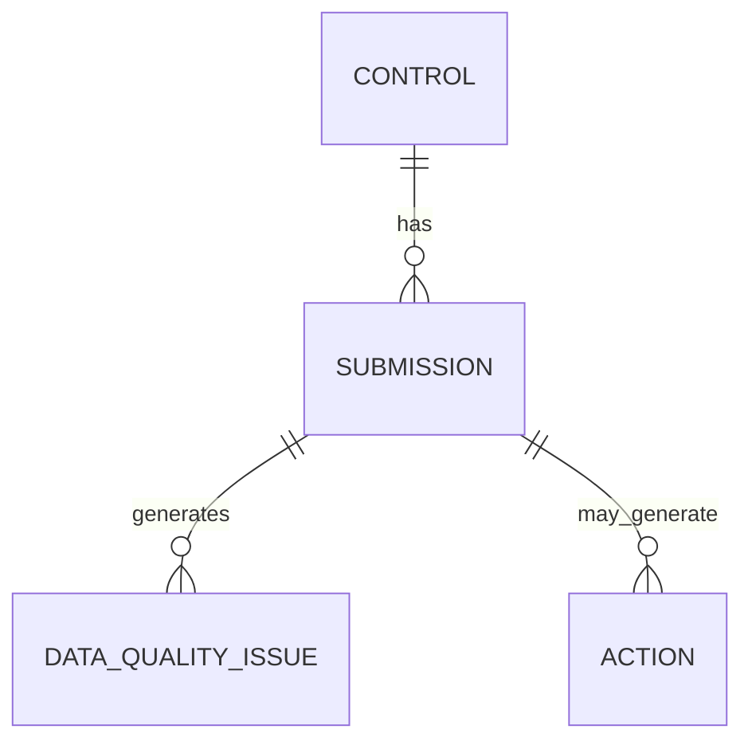

# Data Model

## Purpose

This document defines the business data model for the Cyber Governance Automation Lab: the entities, fields, relationships, and enumerations used by the governance process described in [business_process.md](business_process.md).

This document describes the data model only. It does not create any data files. No CSV or JSON data files are produced as part of this document.

## Modeling Principles

* The model is intentionally small: four entities, no more than needed to demonstrate the end-to-end process.
* A clear distinction is maintained between source data (entered or submitted) and derived data (computed from source data and business rules).
* Business keys are kept as simple as possible while remaining unambiguous.
* All identities, emails, and references used as examples are synthetic.

## Entity Overview

Four entities make up the model:

* **Control** — a stable, slowly-changing definition of a security control.
* **Submission** — a period-specific reporting record representing the expected or completed evidence submission for a control, one per expected control/reporting-period combination.
* **Action** — a follow-up work item related to a control and/or submission.
* **Data Quality Issue** — a validation finding raised against a submission.

## Control

| Field | Description |
| --- | --- |
| control_id | Unique identifier of the security control |
| control_name | Human-readable control name |
| control_statement | Testable control requirement |
| business_unit | Primary responsible business unit |
| owner_role | Accountable organizational role |
| owner_email | Synthetic contact address |
| frequency | Monthly, Quarterly, or Annual |
| risk_level | Low, Medium, High, or Critical |

Example rows:

| control_id | control_name | business_unit | owner_role | owner_email | frequency | risk_level |
| --- | --- | --- | --- | --- | --- | --- |
| CTRL-001 | Privileged Account MFA | IT Operations | Identity & Access Manager | `alice@example.com` | Quarterly | Critical |
| CTRL-002 | Privileged Access Review | Retail Banking | Access Governance Manager | `bob@example.com` | Quarterly | High |
| CTRL-003 | Backup Recovery Testing | IT Operations | Infrastructure & Resilience Manager | `carol@example.com` | Quarterly | High |
| CTRL-004 | Security Awareness Training | Finance | Security Awareness Coordinator | `diana@example.com` | Annual | Medium |
| CTRL-005 | Critical System Patch Status Review | IT Operations | Vulnerability & Patch Manager | `erin@example.com` | Monthly | Critical |

`control_statement` is omitted from the table above for readability and documented separately below, as the canonical text for each control's testable requirement.

Canonical control statements:

| control_id | control_statement |
| --- | --- |
| CTRL-001 | Multi-factor authentication must be enabled for all privileged accounts. |
| CTRL-002 | Privileged user accounts and access assignments must be reviewed at defined intervals. |
| CTRL-003 | Recovery from backups must be tested at defined intervals and the test result must be documented. |
| CTRL-004 | Staff must complete security awareness training at defined intervals. |
| CTRL-005 | The patch status of critical systems must be reviewed at defined intervals and documented. |

These are the canonical statements. Any machine-readable representation, including [data/reference/control_catalog.json](../data/reference/control_catalog.json), must match this table exactly.

## Submission

**Submission** — a period-specific reporting record representing the expected or completed evidence submission for a control. One record exists for each expected control/reporting-period combination, from the moment the reporting period becomes active, regardless of whether evidence has been provided yet.

This means a submission record with `status = Not Submitted` is not the absence of data — it is the expected record for that control/reporting-period combination, created before any evidence exists, with `submitted_at` and `evidence_reference` still null. This record is what allows an overdue check to be performed: without it, there would be nothing to compare against `due_date` when a control owner has not submitted anything.

| Field | Description |
| --- | --- |
| submission_id | Unique submission identifier |
| control_id | Reference to the related control |
| reporting_period | Reporting period being assessed |
| due_date | Submission deadline |
| status | Submission assessment status |
| evidence_reference | Reference to supporting evidence |
| submitted_at | Submission timestamp/date |
| submitted_by | Synthetic submitter identity |
| comment | Short contextual note |

No submission data file is created by this document. This section defines the structure only.

## Action

| Field | Description |
| --- | --- |
| action_id | Unique action identifier |
| control_id | Related control |
| submission_id | Related submission |
| owner_email | Responsible action owner |
| created_at | Action creation date |
| due_date | Action deadline |
| status | Open, In Progress, or Completed |
| reminder_count | Number of reminders sent |
| last_reminder_at | Timestamp/date of last reminder |
| description | Short action description |

## Data Quality Issue

| Field | Description |
| --- | --- |
| issue_id | Unique DQ issue identifier |
| submission_id | Related submission |
| control_id | Related control |
| rule | Triggered data-quality rule |
| severity | High, Medium, or Low |
| field | Field associated with the issue |
| message | Human-readable issue description |

The full rule catalog is documented in [data_quality.md](data_quality.md).

## Derived Metrics

```text
evidence_present
overdue_flag
submission_late
days_overdue
days_late
data_quality_status
```

These fields are derived values, not source-of-truth inputs. They are computed from source data using the business rules defined in [business_process.md](business_process.md), not entered directly.

```text
Source Data
    |
    v
Business Logic
    |
    v
Derived Metrics
```

## Relationships



No additional entities are introduced beyond Control, Submission, Action, and Data Quality Issue.

## Business Keys

The business key for Submission is:

```text
control_id + reporting_period
```

It is not:

```text
control_id + reporting_period + business_unit
```

`business_unit` is already a property of the control and is not part of the submission's identity. Including it in the key would allow the same control/period combination to be duplicated under different business units, which is not a valid state in this model.

## Enumerations

### Submission status

```text
Not Submitted
In Review
Compliant
Non-Compliant
```

### Action status

```text
Open
In Progress
Completed
```

### Frequency

```text
Monthly
Quarterly
Annual
```

### Risk level

```text
Low
Medium
High
Critical
```

### Data quality severity

```text
High
Medium
Low
```

### Business unit

```text
IT Operations
Finance
Retail Banking
```

## Production Considerations

This model is deliberately minimal for a portfolio proof of concept. A production system could reasonably extend it with: multiple business units and shared ownership per control, historical/versioned control definitions, a formal evidence storage integration instead of a reference string, multi-approver review workflows, and a relational database or Dataverse implementation instead of flat files. None of these extensions are implemented here.
