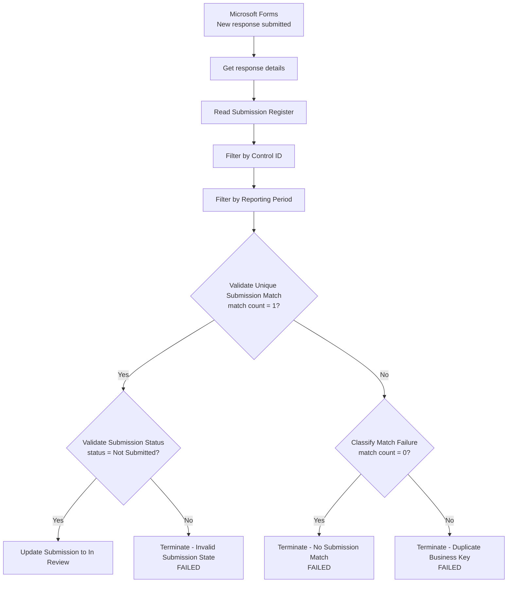
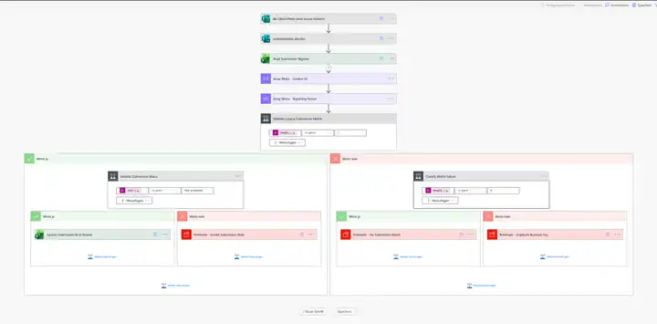
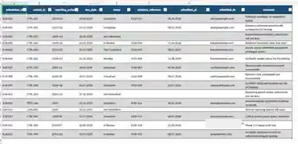
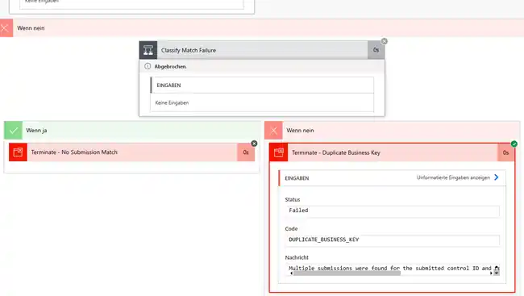

# Power Automate Evidence Intake Workflow

## Phase 5 Status

**Phase 5 core evidence-intake flow: IMPLEMENTED AND ACCEPTANCE-TESTED**

This document describes the implemented Microsoft Forms → Power Automate → Excel evidence-intake workflow for the Cyber Governance Automation Lab.

The workflow is a portfolio proof of concept. It demonstrates controlled evidence intake, expected-Submission lookup, state validation, deterministic update behavior, and explicit failure handling. It is not presented as a production-ready Power Platform implementation.

The original project roadmap also illustrated a separate confirmation email. That specific action is **not** implemented in the current flow and is documented as a roadmap delta rather than being claimed as complete.

## 1. Purpose

Phase 5 automates the first operational step of the cybersecurity-governance evidence process.

A Control Owner submits evidence for an already expected Control and reporting period. Power Automate identifies the corresponding expected Submission in the operational register and updates that existing record.

The workflow deliberately does **not** create a new Submission row for every Form response.

```text
Expected Submission already exists
        ↓
status = Not Submitted
        ↓
Control Owner submits evidence
        ↓
Power Automate identifies expected Submission
        ↓
existing row is updated
        ↓
status = In Review
        ↓
Governance Reviewer assesses evidence later
        ↓
Compliant OR Non-Compliant
```

Core governance principle:

> Evidence submission is not a compliance decision.

## 2. Scope

Phase 5 implements:

- Microsoft Forms evidence intake,
- authenticated responder identity capture,
- Power Automate orchestration,
- Excel Online / OneDrive operational Submission Register,
- lookup by the Submission business key,
- update of the existing expected Submission,
- `Not Submitted → In Review` state transition,
- resubmission / overwrite protection,
- no-match protection,
- duplicate-business-key protection,
- explicit controlled failure states,
- acceptance testing of success and failure paths.

Phase 5 does **not** implement:

- automated compliance decisions,
- Governance Reviewer decision UI,
- scheduled reminder automation,
- Action creation or reminder counters,
- Power BI reporting,
- AI review execution,
- file-upload evidence storage,
- production monitoring / alerting,
- automatic generation of expected reporting-period instances,
- automatic synchronization of the operational Excel workbook into repository raw CSV,
- a custom confirmation email,
- production database storage.

Reminder automation belongs to **Phase 6**. The cross-platform reporting snapshot/export belongs to **Phase 7**.

## 3. Governance Principles

### Evidence does not equal compliance

The Control Owner provides evidence. The Control Owner does not select `Compliant` or `Non-Compliant`.

Phase 5 only performs:

```text
Not Submitted → In Review
```

Final compliance assessment remains a human Governance Reviewer responsibility.

### Expected state exists before observed evidence

Expected Submission records already exist in the register. This makes missing process events observable.

```text
Expected state + observed evidence = detectable process state
```

### Business key and technical key are different

Submission business key:

```text
control_id + reporting_period
```

Technical key:

```text
submission_id
```

The workflow first resolves and validates the business key, then uses the matched `submission_id` as the technical Excel update key.

### No silent repair

If the workflow cannot identify exactly one valid target Submission, it does not guess, deduplicate, or overwrite a record. Processing is stopped explicitly.

## 4. Components

| Component | Responsibility |
| --- | --- |
| Microsoft Forms | Evidence intake |
| Power Automate | Workflow orchestration and guardrails |
| Excel Online / OneDrive | Operational Submission Register |
| Existing project contracts | Business rules and Submission state semantics |

Operational workbook:

```text
Cyber_Governance_Control_Register.xlsx
```

Worksheet:

```text
Submissions
```

Excel table:

```text
SubmissionRegister
```

The workbook is an operational Microsoft 365 artifact and is intentionally not a canonical repository dataset.

## 5. Submission Register Contract

The operational Excel table uses the canonical raw Submission fields:

```text
submission_id
control_id
reporting_period
due_date
status
evidence_reference
submitted_at
submitted_by
comment
```

No helper-key column or new business entity was introduced.

The workflow preserves:

```text
submission_id
control_id
reporting_period
due_date
```

during evidence intake.

## 6. Microsoft Forms Intake Contract

Form name:

```text
Cyber Governance Evidence Submission
```

Form description:

> Submit evidence for an existing cybersecurity control and reporting period. Evidence submissions are subject to governance review. Submission of evidence does not constitute a compliance decision.

### User-entered fields

| Form field | Type | Required | Purpose |
| --- | --- | ---: | --- |
| Control ID | Choice | Yes | `control_id` lookup input |
| Reporting Period | Text | Yes | `reporting_period` lookup input |
| Evidence Reference | Text | Yes | `evidence_reference` |
| Comment | Long text | No | `comment` |

Allowed Control IDs:

```text
CTRL-001
CTRL-002
CTRL-003
CTRL-004
CTRL-005
```

Reporting Period remains text because the representation depends on Control frequency:

```text
Quarterly → 2026-Q3
Monthly   → 2026-07
Annual    → 2026
```

### Fields intentionally not collected

The form does not ask the submitter for:

```text
submission_id
due_date
status
submitted_at
business_unit
risk_level
owner_email
compliance decision
```

These remain system/reference/governance-owned values.

### Submitter identity

The form is organization-restricted and records authenticated responder identity. `submitted_by` is populated from the authenticated Forms responder rather than a manually entered email field.

Multiple responses per authenticated person are allowed because the same person may submit evidence for multiple Controls and periods.

## 7. Evidence Handling Boundary

Phase 5 stores only:

```text
evidence_reference
```

It does not upload or store actual evidence files.

Actual security evidence may contain confidential content and would require additional design for access control, retention, auditability, classification, storage permissions, and lifecycle management. That is outside the PoC scope.

## 8. Operational vs. Repository Data Boundary

The live Phase 5 workbook and the repository raw dataset are separate artifacts.

Operational Phase 5 state:

```text
Microsoft Forms
      ↓
Power Automate
      ↓
Cyber_Governance_Control_Register.xlsx
```

Deterministic repository state:

```text
data/raw/evidence_submissions.csv
      ↓
Python pipeline
```

Phase 5 does **not** automatically export the Excel register into `data/raw/evidence_submissions.csv`.

This distinction is intentional. The Phase 5 happy-path test changed the live operational `SUB-014` record to `In Review` on 2026-08-21. The canonical repository dataset keeps `SUB-014` as `Not Submitted` because it is the deterministic Phase 2–4 acceptance scenario evaluated at `as_of_date = 2026-08-15`.

A future reporting snapshot/export is planned in Phase 7.

## 9. Implemented Flow Architecture



The flow intentionally separates lookup, uniqueness validation, state validation, and update.

## 10. Implemented Power Automate Actions

1. **Bei Übermitteln einer neuen Antwort** — Microsoft Forms trigger.
2. **Antwortdetails abrufen** — retrieves form fields using Response ID.
3. **Read Submission Register** — reads `SubmissionRegister` through Excel Online (Business).
4. **Array filtern - Control ID** — filters `row.control_id = Forms.Control ID`.
5. **Array filtern - Reporting Period** — filters the previous result by reporting period.
6. **Validate Unique Submission Match** — requires exactly one candidate row.
7. **Validate Submission Status** — requires `status = Not Submitted`.
8. **Update Submission to In Review** — updates the existing Excel row using `submission_id`.
9. **Classify Match Failure** — distinguishes zero from multiple matches.
10. **Terminate - No Submission Match**.
11. **Terminate - Duplicate Business Key**.
12. **Terminate - Invalid Submission State**.

## 11. Expressions and Dynamic Content

Power Automate stores Forms question identifiers as generated internal IDs. Those IDs are tenant/form-specific and are not useful as portable business documentation. The contract therefore documents the stable expressions and business fields.

### Control ID filter

Logical expression:

```text
@equals(item()?['control_id'], <Forms Control ID>)
```

The source array is the `value` array returned by **Read Submission Register**.

### Reporting Period filter

Logical expression:

```text
@equals(item()?['reporting_period'], <Forms Reporting Period>)
```

The source array is the output of **Array filtern - Control ID**, not the original unfiltered Excel row set.

### Unique-match validation

Implemented comparison:

```text
length(body('Array_filtern_-_Reporting_Period')) = 1
```

The designer-generated internal action name can differ if the flow is recreated, but the invariant must remain `length(matches) = 1`.

### Current-state validation

Implemented lookup:

```text
first(body('Array_filtern_-_Reporting_Period'))?['status']
```

Required value:

```text
Not Submitted
```

### Technical update key

Implemented key lookup:

```text
first(body('Array_filtern_-_Reporting_Period'))?['submission_id']
```

Excel key column:

```text
submission_id
```

### Submitted date

Implemented expression:

```text
convertTimeZone(utcNow(),'UTC','W. Europe Standard Time','yyyy-MM-dd')
```

This writes the local Central European calendar date while preserving the project's date-only `YYYY-MM-DD` logical contract.

## 12. Lookup Logic

The two sequential filters produce candidates for the complete business key:

```text
control_id + reporting_period
```

Unique-match validation requires:

```text
length(filtered_matches) = 1
```

Exactly one match is required before any write operation.

## 13. Submission-State Guardrail

Even a unique match is writable only when:

```text
status = Not Submitted
```

This protects existing workflow/governance states from overwrite:

```text
In Review
Compliant
Non-Compliant
```

The workflow therefore permits:

```text
Not Submitted → In Review
```

and rejects resubmission against an already progressed record.

## 14. Excel Update Mapping

Excel update key:

```text
Key Column = submission_id
```

Key Value is the `submission_id` of the uniquely matched expected Submission.

Updated fields:

| Submission field | Source |
| --- | --- |
| `status` | literal `In Review` |
| `evidence_reference` | Forms `Evidence Reference` |
| `submitted_at` | `convertTimeZone(...)` system date expression |
| `submitted_by` | authenticated Forms responder |
| `comment` | Forms `Comment` |

Preserved fields:

```text
submission_id
control_id
reporting_period
due_date
```

The workflow updates an expected Submission; it does not create a new business object.

Excel Online may display the date according to workbook/user locale, for example `21.08.2026`. The repository CSV serialization contract remains `YYYY-MM-DD`.

## 15. Explicit Failure Handling

### `NO_MATCH`

Condition:

```text
business-key match count = 0
```

Terminate action:

```text
Terminate - No Submission Match
```

Status: `Failed`

Code:

```text
NO_MATCH
```

Message:

> No expected submission was found for the submitted control ID and reporting period.

### `DUPLICATE_BUSINESS_KEY`

Condition:

```text
business-key match count > 1
```

Terminate action:

```text
Terminate - Duplicate Business Key
```

Status: `Failed`

Code:

```text
DUPLICATE_BUSINESS_KEY
```

Message:

> Multiple submissions were found for the submitted control ID and reporting period. Automated processing was stopped.

### `INVALID_SUBMISSION_STATE`

Condition:

```text
exactly one match
AND
status != Not Submitted
```

Terminate action:

```text
Terminate - Invalid Submission State
```

Status: `Failed`

Code:

```text
INVALID_SUBMISSION_STATE
```

Message:

> The submission exists but is not in status 'Not Submitted'. Resubmission or overwrite is not permitted.

The explicit `Failed` result makes invalid workflow states visible in Power Automate run history rather than silently ending as successful no-op runs.

## 16. Confirmation Behavior and Roadmap Delta

The original project roadmap illustrated:

```text
successful Excel write
        ↓
Confirmation Email
```

The current flow does **not** contain this custom confirmation-email action.

No documentation should claim otherwise. The core Phase 5 DoD is accepted because the Forms submission updates the expected Control Register record and the success/failure paths are validated. If strict parity with the original illustrative roadmap is required, adding a confirmation-email action remains the only identified Phase 5 workflow follow-up.

## 17. Acceptance Tests

Phase 5 was tested manually through Microsoft Forms submissions and Power Automate run history.

### Happy path

Input:

```text
Control ID:         CTRL-005
Reporting Period:   2026-07
Evidence Reference: EVID-016
Comment:            Phase 5.3 happy-path test.
```

Expected target:

```text
SUB-014
```

Initial state:

```text
status = Not Submitted
```

Observed operational result:

```text
submission_id       = SUB-014
control_id          = CTRL-005
reporting_period    = 2026-07
due_date            = unchanged
status              = In Review
evidence_reference  = EVID-016
submitted_at        = 2026-08-21
submitted_by        = authenticated organizational user
comment             = Phase 5.3 happy-path test.
```

The operational register remained at **15 Submission rows**. No new row was appended.

Result: **PASS**

### Resubmission / invalid state

Tested `CTRL-005 + 2026-07` after the operational `SUB-014` was already `In Review`.

Observed:

```text
unique match = true
status validation = false
Excel update = skipped
Terminate - Invalid Submission State = executed
```

Failure code: `INVALID_SUBMISSION_STATE`

Result: **PASS**

### No expected Submission

Test:

```text
CTRL-001 + 2099-Q1
```

Observed:

```text
business-key matches = 0
Excel update = not executed
Terminate - No Submission Match = executed
```

Failure code: `NO_MATCH`

Result: **PASS**

### Duplicate business key

Test:

```text
CTRL-003 + 2026-Q2
```

The canonical synthetic seed dataset deliberately contains both `SUB-008` and `SUB-009` for this business key.

Observed:

```text
business-key matches = 2
Excel update = not executed
Terminate - Duplicate Business Key = executed
```

Failure code: `DUPLICATE_BUSINESS_KEY`

Result: **PASS**

## 18. Acceptance Matrix

| Scenario | Match Count | Current Status | Expected Outcome | Result |
| --- | ---: | --- | --- | --- |
| Normal evidence intake | 1 | Not Submitted | Update existing row → In Review | PASS |
| Resubmission | 1 | In Review | Fail: `INVALID_SUBMISSION_STATE` | PASS |
| Missing business key | 0 | n/a | Fail: `NO_MATCH` | PASS |
| Duplicate business key | >1 | n/a | Fail: `DUPLICATE_BUSINESS_KEY` | PASS |

## 19. Core Invariants Demonstrated

```text
Form response != new Submission
```

```text
control_id + reporting_period must identify exactly one expected Submission
```

```text
Only Not Submitted may transition through evidence intake
```

```text
Evidence intake does not assign Compliant or Non-Compliant
```

```text
Existing governance decisions must not be overwritten by resubmission
```

```text
Ambiguous data must fail safely rather than be silently repaired
```

## 20. Security and Governance Considerations

- repository business records and identities are synthetic,
- the operational workbook can contain authenticated Microsoft 365 identity and is therefore not a repository source artifact,
- actual evidence files are not stored in the repository,
- credentials, API keys, tokens, passwords, and private keys must not be committed,
- screenshots committed to the public repository are sanitized where necessary to avoid publishing authenticated account identifiers,
- evidence submitters cannot self-declare compliance,
- ambiguous, missing, or invalid-state records are rejected rather than modified,
- Excel/OneDrive is explicitly documented as a PoC storage boundary.

## 21. Proof-of-Concept Limitations

Excel Online / OneDrive is intentionally used because it is simple and integrates directly with Power Automate. It is not treated as the preferred production datastore.

Production concerns not engineered in this phase include:

- concurrency and workbook locking,
- transactional guarantees,
- service accounts,
- environment separation,
- Power Platform DLP policies,
- RBAC,
- audit logging,
- monitoring and alerting,
- retry strategy,
- retention and recovery,
- production evidence storage.

Potential production alternatives include Dataverse, SharePoint Lists, or a relational database.

Power Automate flows are not committed as importable packages. This is permitted by the project plan; the repository instead contains the workflow contract, expressions, screenshots, trigger/action descriptions, conditions, and acceptance evidence required to understand and review the implementation.

## 22. Boundary to Phase 6 and Phase 7

### Phase 6

Phase 6 will implement scheduled reminder automation. Phase 5 does not send scheduled overdue reminders, increment `reminder_count`, update `last_reminder_at`, or create/resolve reminder Actions.

The canonical overdue rule remains:

```text
submitted_at IS NULL
AND
as_of_date > due_date
```

Reminder logic must not be simplified to `status != Compliant`.

### Phase 7

Phase 7 will create the Power Platform reporting snapshot/export that makes the connection to Python visible.

Phase 5 does not currently produce or synchronize a repository raw CSV from the live workbook.

## 23. Screenshot Evidence

### Complete Power Automate flow overview



### Core lookup and validation steps


### Microsoft Forms evidence intake


### Microsoft Forms access and identity settings


### Happy-path Power Automate execution


### Updated expected Submission in Excel

The authenticated test-account identifier is redacted in the repository screenshot.



### Invalid Submission state failure


### No-match failure


### Duplicate business-key failure



## 24. Core Definition of Done

The implemented Phase 5 core is accepted because:

- Microsoft Forms evidence intake exists,
- authenticated responder identity is captured,
- the operational Excel Submission Register exists,
- the workflow reads existing expected Submissions,
- the business key is `control_id + reporting_period`,
- exactly one business-key match is required,
- current state must be `Not Submitted`,
- the existing row is updated rather than appended,
- `submission_id` is used as the technical Excel update key,
- status transitions to `In Review`,
- evidence reference, submission date, authenticated submitter, and optional comment are populated,
- Submission identity and due date remain unchanged,
- resubmission cannot overwrite an already progressed Submission,
- no-match situations fail explicitly,
- duplicate business keys fail explicitly,
- invalid Submission state fails explicitly,
- the happy path and all three failure paths were executed successfully,
- operational Submission row count remains unchanged during intake,
- no automated compliance decision is performed,
- Phase 6 reminder behavior remains out of scope.

**Phase 5 core acceptance status: COMPLETE**

**Original-roadmap confirmation-email action: NOT IMPLEMENTED**

## 25. Key Architectural Takeaway

The central Phase 5 design decision is:

```text
Form response != new Submission
```

Instead:

```text
Expected Submission
        +
Evidence intake
        ↓
Controlled state transition
```

The workflow therefore demonstrates:

```text
Expected state
→ authenticated observation
→ deterministic identity resolution
→ guardrails
→ controlled update
→ human review
```

The next integration boundaries are reminder automation in Phase 6 and the reporting snapshot/export in Phase 7.
