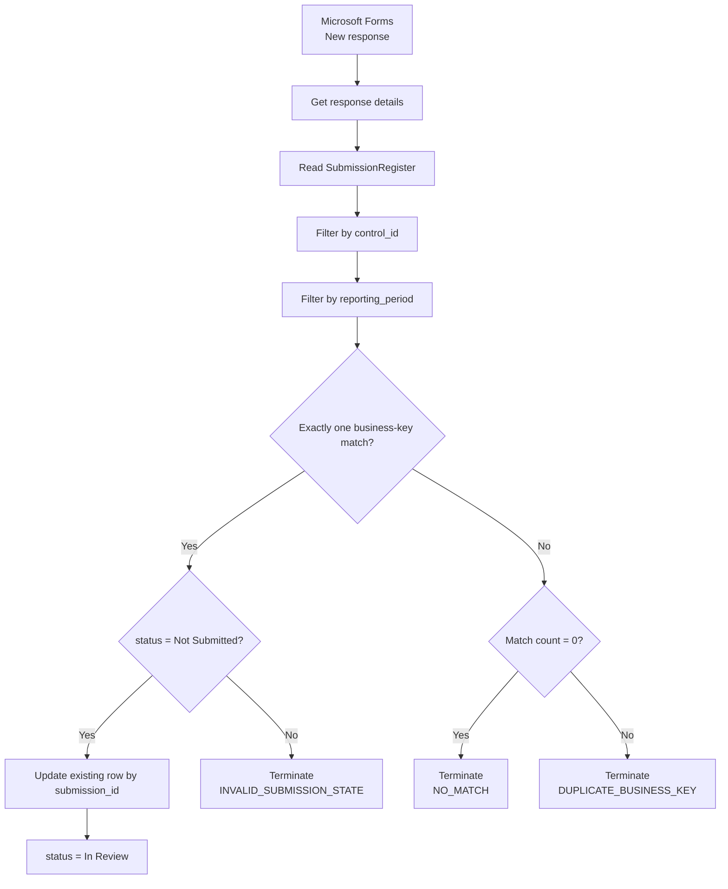
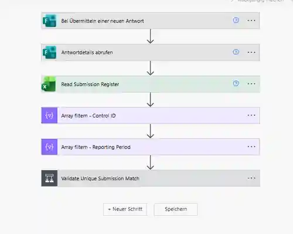
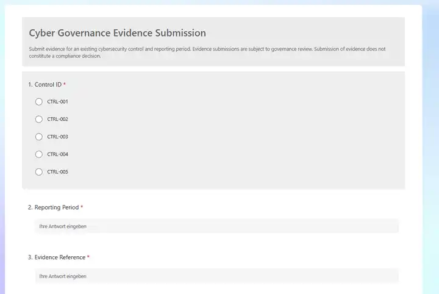
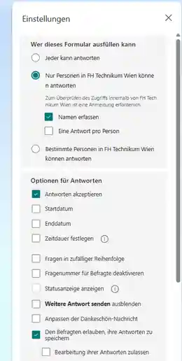
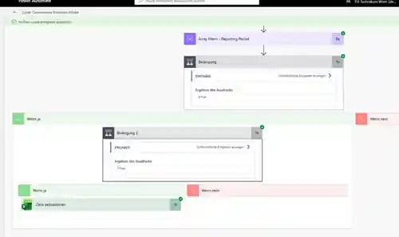
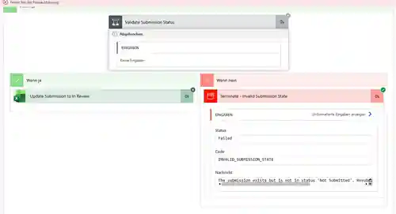
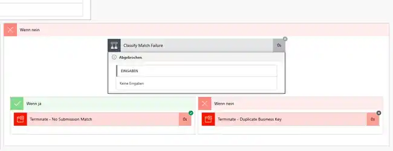

# Phase 5 Evidence Intake Automation

## Status

**IMPLEMENTED AND ACCEPTANCE-TESTED**

Phase 5 implements the operational Microsoft Forms → Power Automate → Excel evidence-intake workflow for the Cyber Governance Automation Lab.

The workflow is a portfolio proof of concept. It demonstrates authenticated evidence intake, deterministic lookup of an expected Submission, controlled state transition, explicit failure handling, and preservation of the project’s governance semantics. It is not presented as a production-ready Power Platform implementation.

The original roadmap illustrated a separate custom confirmation e-mail after a successful intake. That specific action is **not implemented** and remains a documented roadmap delta.

## 1. Purpose

A Control Owner submits evidence for an already expected Control and reporting period. Power Automate resolves the corresponding expected Submission and updates that existing operational record.

The workflow deliberately performs:

```text
Expected Submission
        +
Evidence Intake
        ↓
Controlled State Transition
```

not:

```text
Every Form Response
        ↓
New Submission Row
```

Core governance principle:

```text
Evidence submission != compliance decision
```

Phase 5 permits only:

```text
Not Submitted → In Review
```

Final `Compliant` / `Non-Compliant` assessment remains a human Governance Reviewer decision.

## 2. Scope

Phase 5 implements:

- Microsoft Forms evidence intake,
- authenticated responder identity capture,
- Power Automate orchestration,
- Excel Online / OneDrive operational Submission Register,
- lookup by the Submission business key,
- exactly-one-match validation,
- current-state validation,
- update of the existing expected Submission,
- resubmission / overwrite protection,
- no-match protection,
- duplicate-business-key protection,
- explicit controlled failure outcomes,
- manual acceptance testing of the success and failure paths.

Phase 5 itself does **not** implement:

- automated compliance decisions,
- Governance Reviewer decision UI,
- scheduled overdue reminders,
- Action creation or reminder counters,
- Power BI reporting,
- AI review execution,
- file-upload evidence storage,
- production monitoring / alerting,
- automatic generation of expected reporting-period instances,
- automatic synchronization of the operational workbook into repository raw data,
- a custom confirmation e-mail,
- production database storage.

Scheduled overdue follow-up is implemented separately in [Phase 6 Reminder Automation](phase6_reminder_automation.md). Phase 7 remains the planned reporting snapshot/export bridge.

## 3. Governance Principles

### Expected state exists before observed evidence

Expected Submission records exist before evidence arrives. This makes missing process events observable.

Submission business key:

```text
control_id + reporting_period
```

Technical key:

```text
submission_id
```

The workflow first resolves and validates the business key, then uses the matched `submission_id` as the technical Excel update key.

### Compliance, evidence, and workflow state remain separate

```text
Evidence Present != Compliant
Not Submitted != Non-Compliant
Submission Status != Action Status
```

The Control Owner supplies evidence but cannot assign the compliance result.

### Ambiguity fails safely

If the workflow cannot identify exactly one writable target Submission, it does not guess, deduplicate, append a replacement, or overwrite an existing governance state.

## 4. Operational Components

| Component | Responsibility |
| --- | --- |
| Microsoft Forms | Authenticated evidence intake |
| Power Automate | Lookup, guardrails, and controlled update |
| Excel Online / OneDrive | Operational Submission state |
| Existing project contracts | Business rules and Submission semantics |

Operational workbook:

```text
Cyber_Governance_Control_Register.xlsx
```

Worksheet:

```text
Submissions
```

Excel table:

```text
SubmissionRegister
```

The workbook is an operational Microsoft 365 artifact. It is not a canonical repository dataset and is intentionally excluded from version control.

## 5. Submission Register Contract

The operational `SubmissionRegister` uses the canonical Submission source fields:

```text
submission_id
control_id
reporting_period
due_date
status
evidence_reference
submitted_at
submitted_by
comment
```

During Phase 5 intake, the workflow preserves:

```text
submission_id
control_id
reporting_period
due_date
```

and updates only intake-owned fields.

No helper key or additional business entity is introduced.

## 6. Microsoft Forms Intake Contract

Form name:

```text
Cyber Governance Evidence Submission
```

User-entered fields:

| Form field | Type | Required | Purpose |
| --- | --- | ---: | --- |
| Control ID | Choice | Yes | `control_id` lookup input |
| Reporting Period | Text | Yes | `reporting_period` lookup input |
| Evidence Reference | Text | Yes | `evidence_reference` |
| Comment | Long text | No | `comment` |

Allowed Control IDs:

```text
CTRL-001
CTRL-002
CTRL-003
CTRL-004
CTRL-005
```

Reporting-period representation follows Control frequency:

```text
Monthly   → YYYY-MM
Quarterly → YYYY-QN
Annual    → YYYY
```

The form does not ask the submitter for system- or governance-owned values such as `submission_id`, `due_date`, `status`, `submitted_at`, Control metadata, owner metadata, or a compliance decision.

The form is organization-restricted and records authenticated responder identity. `submitted_by` is populated from the authenticated responder rather than from a manually entered e-mail field.

## 7. Evidence Handling Boundary

Phase 5 stores only an `evidence_reference`; it does not store actual evidence files in the repository or operational workbook contract documented here.

Actual evidence may require dedicated access control, retention, classification, auditability, lifecycle management, and storage permissions. That is outside this proof-of-concept scope.

## 8. Operational vs. Repository Data Boundary

Operational plane:

```text
Microsoft Forms
      ↓
Power Automate Evidence Intake
      ↓
Cyber_Governance_Control_Register.xlsx
```

Deterministic repository plane:

```text
data/raw/evidence_submissions.csv
      ↓
Python pipeline
```

Phase 5 does **not** export the live workbook into `data/raw/evidence_submissions.csv`.

The Phase 5 happy-path test changed operational `SUB-014` to `In Review` on 2026-08-21. The canonical repository fixture intentionally keeps `SUB-014` as `Not Submitted` because the deterministic Phase 2–4 acceptance scenario is evaluated at:

```text
as_of_date = 2026-08-15
```

This is a deliberate data-plane boundary, not an inconsistency.

## 9. Implemented Workflow



Implemented Power Automate actions logically perform:

1. Forms trigger.
2. Get response details.
3. Read `SubmissionRegister`.
4. Filter by Control ID.
5. Filter by Reporting Period.
6. Require exactly one candidate.
7. Require `status = Not Submitted`.
8. Update existing row using `submission_id`.
9. Classify zero vs. multiple business-key matches.
10. Terminate explicitly on invalid paths.

Power Automate may generate tenant-specific internal action/question identifiers. Those identifiers are not treated as portable business-contract names.

## 10. Stable Expressions and Guardrails

Logical Control filter:

```text
@equals(item()?['control_id'], <Forms Control ID>)
```

Logical reporting-period filter:

```text
@equals(item()?['reporting_period'], <Forms Reporting Period>)
```

Unique-match invariant:

```text
length(filtered_business_key_matches) = 1
```

Current-state invariant:

```text
first(filtered_business_key_matches)?['status'] = 'Not Submitted'
```

Technical update key:

```text
Key Column = submission_id
```

Submitted local date:

```text
convertTimeZone(utcNow(),'UTC','W. Europe Standard Time','yyyy-MM-dd')
```

## 11. Excel Update Mapping

| Submission field | Source |
| --- | --- |
| `status` | literal `In Review` |
| `evidence_reference` | Forms Evidence Reference |
| `submitted_at` | local system-date expression |
| `submitted_by` | authenticated Forms responder |
| `comment` | Forms Comment |

Preserved fields:

```text
submission_id
control_id
reporting_period
due_date
```

The workflow updates the expected Submission; it does not append another Submission.

Excel may display dates according to workbook/user locale. The logical repository date contract remains `YYYY-MM-DD`.

## 12. Controlled Failure Outcomes

| Outcome | Condition | Effect |
| --- | --- | --- |
| `NO_MATCH` | business-key match count = 0 | No update; flow fails explicitly |
| `DUPLICATE_BUSINESS_KEY` | business-key match count > 1 | No arbitrary target; flow fails explicitly |
| `INVALID_SUBMISSION_STATE` | exactly one match but status != `Not Submitted` | No overwrite; flow fails explicitly |

These are Phase 5 workflow outcomes. They are not new Data Quality rule IDs.

## 13. Acceptance Tests

### 13.1 Happy path

Input:

```text
Control ID:         CTRL-005
Reporting Period:   2026-07
Evidence Reference: EVID-016
Comment:            Phase 5.3 happy-path test.
```

Expected target:

```text
SUB-014
```

Observed operational result:

```text
submission_id       = SUB-014
control_id          = CTRL-005
reporting_period    = 2026-07
due_date            = unchanged
status              = In Review
evidence_reference  = EVID-016
submitted_at        = 2026-08-21
submitted_by        = authenticated organizational user
comment             = Phase 5.3 happy-path test.
```

The operational register remained at 15 Submission rows. No row was appended.

Result: **PASS**

### 13.2 Resubmission / invalid state

A second submission for `CTRL-005 + 2026-07` was tested after operational `SUB-014` was already `In Review`.

Observed:

```text
unique match = true
status validation = false
Excel update = skipped
INVALID_SUBMISSION_STATE
```

Result: **PASS**

### 13.3 No expected Submission

Test:

```text
CTRL-001 + 2099-Q1
```

Observed:

```text
business-key match count = 0
Excel update = skipped
NO_MATCH
```

Result: **PASS**

### 13.4 Duplicate business key

Test:

```text
CTRL-003 + 2026-Q2
```

The canonical synthetic seed data contains both `SUB-008` and `SUB-009` for this business key.

Observed:

```text
business-key match count = 2
Excel update = skipped
DUPLICATE_BUSINESS_KEY
```

Result: **PASS**

## 14. Acceptance Matrix

| Scenario | Match Count | Current Status | Expected Outcome | Result |
| --- | ---: | --- | --- | --- |
| Normal evidence intake | 1 | Not Submitted | Update existing row → In Review | PASS |
| Resubmission | 1 | In Review | `INVALID_SUBMISSION_STATE` | PASS |
| Missing business key | 0 | n/a | `NO_MATCH` | PASS |
| Duplicate business key | >1 | n/a | `DUPLICATE_BUSINESS_KEY` | PASS |

## 15. Roadmap Delta

The original project roadmap illustrated:

```text
successful Excel write
        ↓
Confirmation Email
```

The implemented Phase 5 workflow does **not** contain this custom confirmation e-mail. The core Phase 5 Definition of Done is accepted because evidence intake updates the correct expected Submission and the success/failure paths are validated.

Scheduled reminder e-mails are a different capability and are implemented in Phase 6; they do not close this Phase 5 confirmation-email delta.

## 16. Security and Privacy Boundary

- repository business records and identities are synthetic,
- the operational workbook can contain authenticated Microsoft 365 identity,
- actual evidence files are not stored in the repository,
- credentials, tokens, keys, tenant identifiers, and secrets must not be committed,
- evidence submitters cannot self-declare compliance,
- ambiguous or invalid-state targets are rejected rather than modified,
- public screenshots are sanitized where needed.

## 17. Limitations

Phase 5 remains a proof of concept. Production concerns not engineered in this phase include stronger concurrency/transaction guarantees, service accounts, environment separation, Power Platform DLP policies, RBAC, audit logging, monitoring, retry strategy, retention/recovery, and a production evidence repository.

Power Automate flows are not committed as importable packages. The repository documents workflow contracts, expressions, screenshots, conditions, and acceptance evidence instead.

Phase 6 reminder automation is implemented separately. Phase 7 remains responsible for the planned operational reporting export.

## 18. Definition of Done

Phase 5 is complete because:

- authenticated Forms intake exists,
- the operational `SubmissionRegister` exists,
- expected Submissions are read rather than blindly appended,
- the business key is `control_id + reporting_period`,
- exactly one business-key match is required,
- current state must be `Not Submitted`,
- `submission_id` is used as the technical update key,
- the existing row moves to `In Review`,
- intake-owned evidence fields are populated,
- Submission identity and due date remain unchanged,
- resubmission cannot overwrite progressed state,
- no-match and duplicate-match situations fail explicitly,
- no automated compliance decision is performed,
- the happy path and all three failure paths were acceptance-tested.

**Phase 5 core acceptance status: COMPLETE**

**Original-roadmap confirmation-email action: NOT IMPLEMENTED**

## 19. Evidence Screenshots

### Flow overview


### Core lookup and validation steps



### Microsoft Forms evidence intake



### Microsoft Forms access and identity settings



### Happy-path execution



### Updated operational Submission Register

The authenticated test-account identifier is redacted in the public screenshot.


### Invalid Submission state



### No expected Submission



### Duplicate business key


