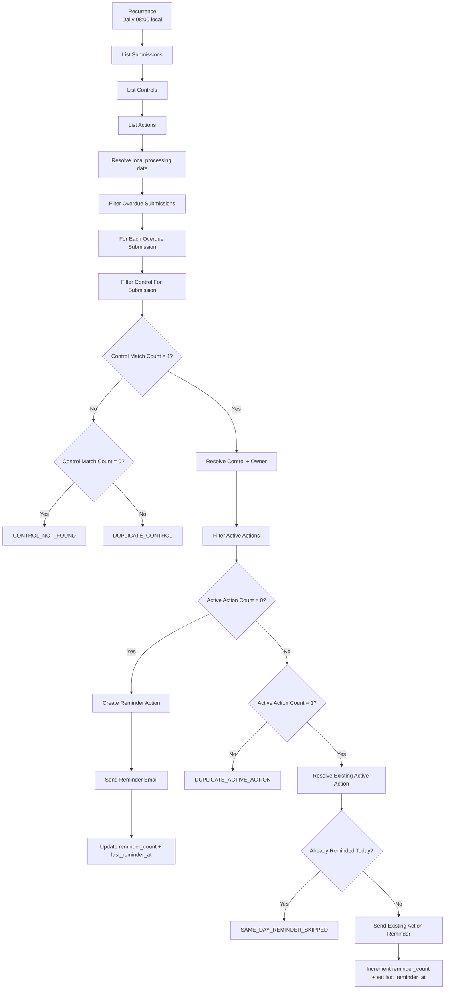
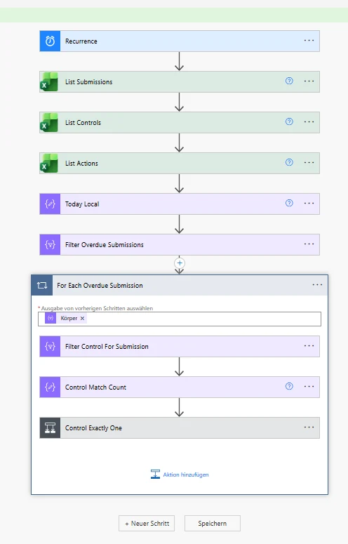
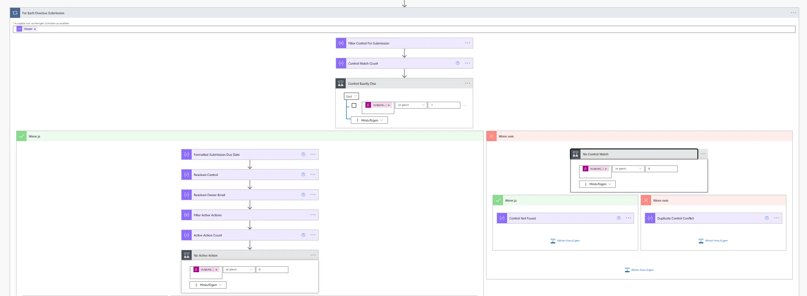
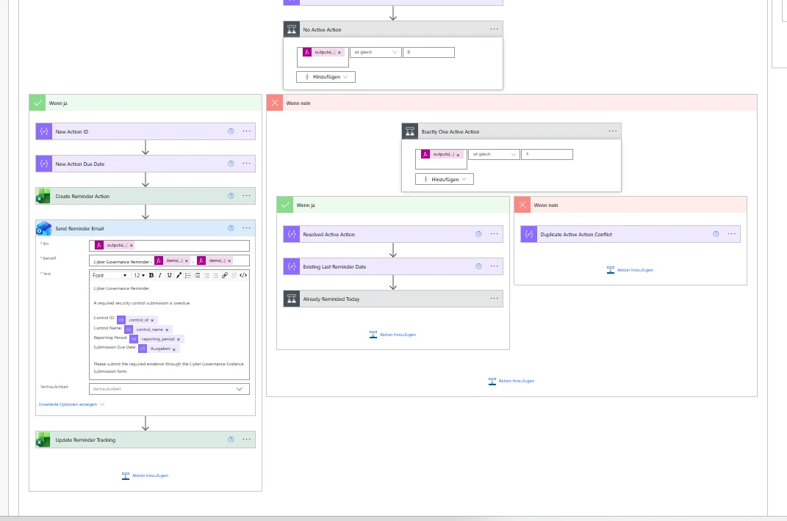
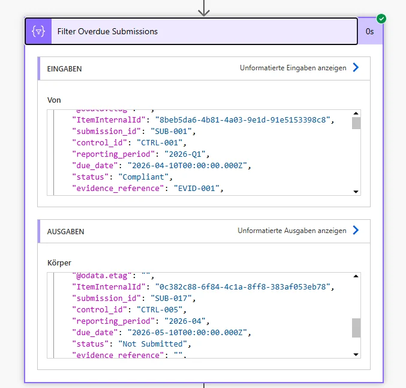
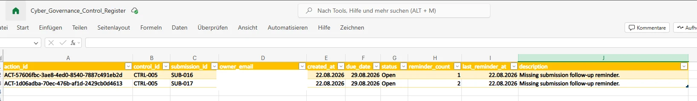
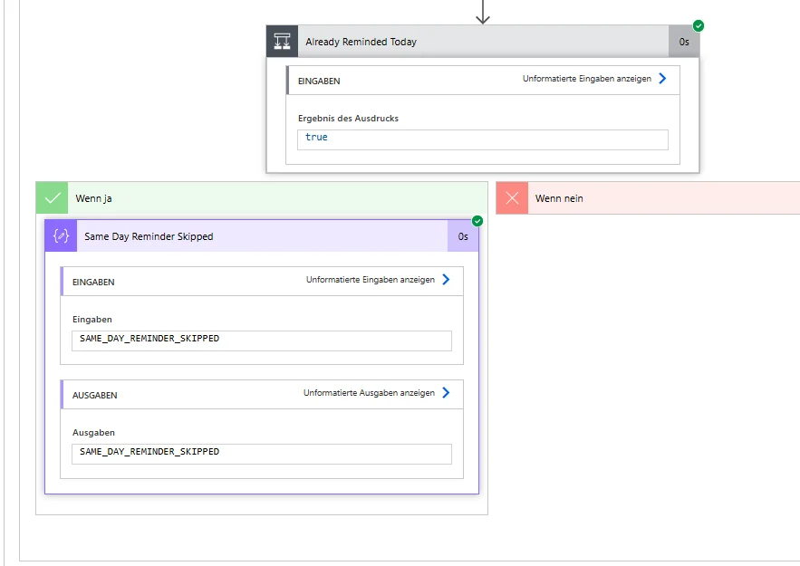
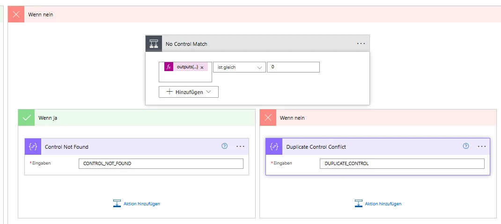

# Phase 6 Reminder Automation

## Status

**IMPLEMENTED AND ACCEPTANCE-TESTED**

Phase 6 extends the operational Microsoft 365 proof of concept with a scheduled reminder workflow for expected security-control Submissions that are still missing after their due date.

The workflow was implemented and manually acceptance-tested on 2026-08-22. It is intentionally a small Power Automate + Excel Online proof of concept rather than a production workflow engine.

## 1. Purpose

Phase 6 automates follow-up for currently overdue expected Submissions without changing Submission compliance state.

The workflow:

1. runs on a daily schedule,
2. reads operational Submissions, Controls, and Actions,
3. identifies currently overdue Submissions,
4. resolves the accountable Control Owner,
5. creates or reuses one active follow-up Action,
6. prevents duplicate same-day reminders,
7. sends the reminder,
8. updates reminder tracking only after a successful send,
9. fails safely when Control or Action state is ambiguous.

Core governance principle:

```text
Reminder workflow state belongs to ACTION.
Submission compliance state remains separate.
```

The flow does **not** convert an overdue Submission into `Non-Compliant`, does not assign compliance, and does not mutate the canonical repository acceptance dataset.

## 2. Operational Data Model

Phase 6 uses the operational workbook:

```text
Cyber_Governance_Control_Register.xlsx
```

Physical Excel tables:

| Worksheet | Excel table | Purpose |
| --- | --- | --- |
| `Submissions` | `SubmissionRegister` | Expected and submitted evidence records |
| `Controls` | `ControlCatalog` | Operational Control metadata and owner resolution |
| `Actions` | `ActionRegister` | Follow-up Actions and reminder tracking |

These are physical representations of existing logical entities. Phase 6 does not introduce a fifth core entity.

### `SubmissionRegister`

The Phase 5 Submission contract remains unchanged:

```text
submission_id
control_id
reporting_period
due_date
status
evidence_reference
submitted_at
submitted_by
comment
```

Reminder state is deliberately not stored on the Submission source record.

### `ControlCatalog`

```text
control_id
control_name
control_statement
business_unit
owner_role
owner_email
frequency
risk_level
```

The reminder flow resolves `owner_email` from the Control rather than adding owner fields to the Submission contract.

### `ActionRegister`

```text
action_id
control_id
submission_id
owner_email
created_at
due_date
status
reminder_count
last_reminder_at
description
```

Allowed Action statuses:

```text
Open
In Progress
Completed
```

Synthetic Action due-date rule:

```text
Action due_date = created_at + 7 calendar days
```

Reminder tracking invariant:

```text
reminder_count = 0
→ last_reminder_at may be empty

reminder_count > 0
→ last_reminder_at must be present
```

## 3. Operational vs. Repository Data Boundary

Phase 6 extends the live Microsoft 365 operational plane. It does **not** write into:

```text
data/raw/evidence_submissions.csv
data/raw/actions.csv
```

Those repository files remain deterministic Phase 2–4 acceptance fixtures used by the Python pipeline and automated tests.

Therefore Phase 6 operational acceptance rows and Actions do not change the canonical repository inventory:

```text
Controls       = 5
Submissions    = 15
Actions        = 5
```

Phase 7 remains responsible for the planned reporting snapshot/export bridge between the operational workbook and downstream reporting.

## 4. Schedule

Flow name:

```text
Cyber Governance - Overdue Submission Reminder
```

Schedule:

```text
Frequency: 1 day
Local time: 08:00
Time zone: W. Europe Standard Time
```

Using the Windows time-zone identifier avoids a hard-coded UTC offset and follows Central European daylight-saving changes.

## 5. Implemented Workflow



The flow processes each overdue Submission independently. A malformed individual business object does not require a global `Terminate` that aborts unrelated overdue records in the same batch.

## 6. Overdue Rule

Canonical rule:

```text
submitted_at IS NULL
AND
as_of_date > due_date
```

Phase 6 evaluates `as_of_date` as the current local processing date.

The operational implementation additionally requires:

```text
status = Not Submitted
```

as a consistency guard. This does not redefine overdue; it prevents a missing-submission reminder from being sent for an internally inconsistent live record.

The workflow deliberately does **not** use:

```text
status != Compliant
```

because that would conflate timeliness, evidence state, and compliance outcome.

Boundary behavior:

```text
as_of_date == due_date → not overdue
as_of_date > due_date  → overdue when submitted_at is empty
```

## 7. Date Handling

Excel list actions use ISO 8601 output where configured. Example connector value:

```text
2026-05-10T00:00:00.000Z
```

Local processing date:

```text
formatDateTime(
  convertTimeZone(utcNow(),'UTC','W. Europe Standard Time'),
  'yyyy-MM-dd'
)
```

The reminder message formats the Submission due date as:

```text
yyyy-MM-dd
```

rather than exposing the raw connector timestamp.

## 8. Control Resolution Guardrails

For each overdue Submission, `ControlCatalog` is filtered by `control_id` and match cardinality is evaluated:

```text
0 matches → CONTROL_NOT_FOUND
1 match   → resolve Control and Owner
>1 match  → DUPLICATE_CONTROL
```

The flow does not guess a recipient when Control reference data is missing or ambiguous.

Successful resolution exposes:

```text
Resolved Control
Resolved Owner Email
```

for downstream Action and reminder processing.

## 9. Active Action Resolution

An Action is active when:

```text
status = Open
OR
status = In Progress
```

The flow filters active Actions for the current `submission_id` and evaluates cardinality:

```text
0 active Actions → create a new Action
1 active Action  → reuse the existing Action
>1 active Actions → DUPLICATE_ACTIVE_ACTION
```

This operationally enforces the project invariant that at most one non-completed Action should represent the active missing-submission follow-up for one Submission.

The workflow does not select an arbitrary Action when multiple active candidates exist.

## 10. New Action Creation

When no active Action exists, the flow creates:

```text
action_id        = ACT-<GUID>
control_id       = current overdue Submission.control_id
submission_id    = current overdue Submission.submission_id
owner_email      = resolved Control owner
created_at       = local processing date
due_date         = created_at + 7 calendar days
status           = Open
reminder_count   = 0
last_reminder_at = empty
description      = Missing submission follow-up reminder.
```

The Action is created **before** the e-mail is sent. If delivery fails, the open Action can remain with:

```text
reminder_count = 0
last_reminder_at = empty
```

which accurately records that follow-up exists but no reminder has been confirmed as sent.

## 11. Reminder Delivery and Tracking

### Create path

```text
Create Reminder Action
      ↓
Send Reminder Email
      ↓
Update Reminder Tracking
```

After a successful first reminder:

```text
reminder_count = 1
last_reminder_at = local processing date
```

### Existing Action path

When exactly one active Action exists, the same Action is reused.

After a later successful reminder:

```text
reminder_count = previous reminder_count + 1
last_reminder_at = local processing date
```

The counter is incremented dynamically rather than hard-coded to a fixed second-reminder value.

Tracking is updated only after the corresponding send action succeeds.

## 12. Same-Day Idempotency Guard

The existing-Action path normalizes `last_reminder_at` to `yyyy-MM-dd` and compares it with the current local processing date.

```text
last_reminder_at == today
→ SAME_DAY_REMINDER_SKIPPED
```

In this branch:

- no e-mail is sent,
- `reminder_count` is unchanged,
- `last_reminder_at` is unchanged,
- no new Action is created.

This protects against duplicate delivery caused by manual reruns or repeated execution on the same day.

## 13. Reminder Message Contract

Subject:

```text
Cyber Governance Reminder - <control_id> - <reporting_period>
```

Body contains:

- Control ID,
- Control Name,
- reporting period,
- formatted Submission due date,
- request to submit the required evidence.

The Create path sends to the currently resolved Control Owner. The existing-Action path sends to the `owner_email` persisted on the active Action.

No compliance decision or sensitive evidence content is included in the reminder.

## 14. Controlled Outcomes

| Outcome | Condition | Effect |
| --- | --- | --- |
| `CONTROL_NOT_FOUND` | Control match count = 0 | No Action / no reminder |
| `DUPLICATE_CONTROL` | Control match count > 1 | No arbitrary owner / no reminder |
| `DUPLICATE_ACTIVE_ACTION` | Active Action count > 1 | No arbitrary Action / no reminder |
| `SAME_DAY_REMINDER_SKIPPED` | Existing Action already reminded today | No duplicate e-mail / no counter update |

These are workflow guard outcomes, not new Submission DQ rule IDs. The canonical DQ catalog remains DQ-001 through DQ-010.

## 15. Acceptance Tests

Phase 6 was manually acceptance-tested in the operational Microsoft 365 environment on 2026-08-22.

### 15.1 Overdue detection

Operational fixture:

```text
SUB-016
control_id       = CTRL-005
reporting_period = 2026-05
due_date         = 2026-06-10
status           = Not Submitted
submitted_at     = empty
```

Observed:

```text
SUB-016 included in overdue set
future-due Not Submitted records excluded
past-due but already submitted In Review record excluded
```

Result: **PASS**

### 15.2 Create Action + first reminder

For an overdue Submission with no active Action:

```text
Active Action Count = 0
```

Observed:

```text
new Open Action created
reminder delivered
reminder_count = 1
last_reminder_at = 2026-08-22
```

Result: **PASS**

### 15.3 Independent second create-path test

Second operational fixture:

```text
SUB-017
control_id       = CTRL-005
reporting_period = 2026-04
due_date         = 2026-05-10
status           = Not Submitted
submitted_at     = empty
```

The flow created an independent Action for `SUB-017` and delivered the reminder without creating another Action for `SUB-016`.

Result: **PASS**

### 15.4 Same-day idempotency

With existing Actions already carrying:

```text
last_reminder_at = 2026-08-22
```

a same-day rerun produced:

```text
Already Reminded Today = true
SAME_DAY_REMINDER_SKIPPED
```

No additional e-mail, Action, or counter increment occurred.

Result: **PASS**

### 15.5 Existing Action reuse and counter increment

For `SUB-017`, acceptance state was temporarily adjusted to simulate a prior-day reminder while preserving:

```text
status = Open
reminder_count = 1
```

Observed:

```text
Active Action Count = 1
Exactly One Active Action = true
Already Reminded Today = false
existing Action reused
reminder delivered
reminder_count: 1 → 2
last_reminder_at = 2026-08-22
```

No third real acceptance Action was created.

Result: **PASS**

### 15.6 Duplicate active Action

A temporary second `Open` Action was created for `SUB-017`.

Observed:

```text
Filter Active Actions → 2 records
Active Action Count   → 2
Exactly One Active Action → false
DUPLICATE_ACTIVE_ACTION
```

No Action was selected arbitrarily and no reminder was sent through the reuse path. The temporary duplicate was removed after the test.

Result: **PASS**

### 15.7 Control not found

A temporary overdue Submission referencing an unknown Control was created.

Observed:

```text
Control Match Count = 0
Control Exactly One = false
No Control Match = true
CONTROL_NOT_FOUND
```

No owner, Action, or reminder was produced. The temporary fixture was removed.

Result: **PASS**

### 15.8 Duplicate Control

A temporary duplicate `CTRL-005` row was created in the operational `ControlCatalog`.

Observed:

```text
Control Match Count = 2
Control Exactly One = false
No Control Match = false
DUPLICATE_CONTROL
```

No owner was selected arbitrarily and the normal Action/reminder branch was skipped. The temporary duplicate Control was removed.

Result: **PASS**

## 16. Acceptance Matrix

| Scenario | Expected result | Status |
| --- | --- | --- |
| Missing + past due | Included in overdue set | PASS |
| Not Submitted + future due | Excluded from overdue set | PASS |
| Past due but already submitted | Excluded from missing-submission reminder | PASS |
| One Control match | Resolve owner | PASS |
| Zero Control matches | `CONTROL_NOT_FOUND` | PASS |
| Multiple Control matches | `DUPLICATE_CONTROL` | PASS |
| Zero active Actions | Create one Action | PASS |
| One active Action | Reuse existing Action | PASS |
| Multiple active Actions | `DUPLICATE_ACTIVE_ACTION` | PASS |
| First successful reminder | `reminder_count = 1` | PASS |
| Later successful reminder | Increment existing count | PASS |
| Same-day rerun | `SAME_DAY_REMINDER_SKIPPED` | PASS |
| Reminder tracking | Update only after successful send | PASS |

## 17. Process Impact Metrics Enabled by Phase 6

Phase 6 operationalizes:

```text
reminder_count
last_reminder_at
```

These support later reporting measures such as:

```text
Total Automated Reminders
Submissions Requiring Follow-up
Average Reminder Count
Open Actions
```

No unmeasured labour-savings or ROI claims are made.

Phase 7 must carry operational Action/reminder state into the reporting snapshot before Phase 8 Power BI measures can represent live reminder execution.

## 18. Security and Privacy Boundary

- repository identities remain synthetic,
- reachable acceptance-test recipients remain operational/private data,
- real e-mail addresses are not published in repository documentation or evidence,
- reminder messages contain governance metadata only, not evidence contents,
- the operational workbook remains outside the repository,
- credentials, connection tokens, tenant identifiers, and secrets are not committed.

## 19. Limitations

Phase 6 remains a proof of concept. Current limitations include:

- Excel Online / OneDrive rather than a transactional workflow datastore,
- no production-grade locking or concurrency-control service,
- no escalation hierarchy or SLA engine,
- no enterprise notification preferences,
- no dedicated operational error/telemetry datastore,
- no automatic completion of missing-submission Actions when Phase 5 later receives evidence,
- no operational workbook → repository/reporting synchronization until Phase 7,
- no claim of production IAM/RBAC, audit, retention, or compliance certification.

The flow is processed sequentially for the small PoC dataset to reduce Excel write/concurrency risk.

## 20. Definition of Done

Phase 6 is complete because the implemented workflow demonstrates and acceptance-tests:

- scheduled execution,
- canonical overdue detection,
- local-date handling,
- Control owner resolution,
- Action creation,
- Action reuse,
- duplicate Action protection,
- missing/duplicate Control protection,
- actual reminder delivery,
- reminder counter updates,
- same-day idempotency,
- preserved Submission/compliance separation,
- preserved deterministic repository baseline.

No Python source changes or new Python dependencies were required for Phase 6. The existing Python regression suite remains the repository engineering baseline.

## 21. Evidence Screenshots

All committed Phase 6 screenshots are sanitized public evidence. Authenticated recipient identities and tenant-specific information are not published.

### Flow overview



### Control and Action decision tree



### Create and reuse paths



### Overdue detection



### Operational Action Register

The public screenshot redacts operational recipient addresses.



### Same-day idempotency path



### Control lookup guard branches



The duplicate-active-Action acceptance outcome is documented in Section 15.6 and represented structurally in the decision-tree evidence. A separate sanitized run screenshot is not required to establish the documented workflow contract.
