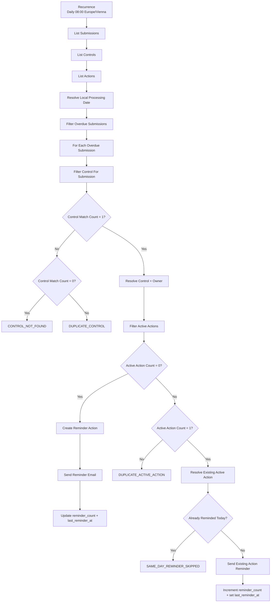

# Phase 6 Reminder Automation

## Status

**IMPLEMENTED AND ACCEPTANCE-TESTED**

Phase 6 extends the operational Microsoft 365 proof of concept with a scheduled reminder workflow for expected security-control submissions that are still missing after their due date.

The workflow was implemented and manually acceptance-tested on 2026-08-22. It is intentionally a small Power Automate + Excel Online proof of concept rather than a production workflow engine.

## 1. Purpose

Phase 6 automates follow-up for overdue expected Submissions without changing Submission compliance state.

The workflow:

1. runs on a schedule,
2. reads operational Submissions, Controls, and Actions,
3. identifies currently overdue Submissions,
4. resolves the accountable Control Owner,
5. creates or reuses one active follow-up Action,
6. sends a reminder,
7. updates reminder tracking only after a successful send,
8. fails safely when Control or Action state is ambiguous.

Core governance principle:

```text
Reminder workflow state belongs to ACTION.
Submission compliance state remains separate.
```

The flow does **not** convert an overdue Submission into `Non-Compliant`, does not assign compliance, and does not mutate the canonical repository acceptance dataset.

## 2. Operational Data Model

Phase 6 uses the existing operational workbook:

```text
Cyber_Governance_Control_Register.xlsx
```

The workbook contains three physical Excel tables:

| Worksheet | Excel table | Purpose |
| --- | --- | --- |
| `Submissions` | `SubmissionRegister` | Expected and submitted control-evidence records |
| `Controls` | `ControlCatalog` | Operational Control metadata and owner resolution |
| `Actions` | `ActionRegister` | Follow-up Actions and reminder tracking |

These tables are physical representations of the existing logical entities. Phase 6 does not introduce a fifth core business entity.

### `SubmissionRegister`

The Phase 5 Submission contract remains unchanged:

```text
submission_id
control_id
reporting_period
due_date
status
evidence_reference
submitted_at
submitted_by
comment
```

Reminder fields are deliberately **not** added to the Submission source record.

### `ControlCatalog`

The operational Control table contains:

```text
control_id
control_name
control_statement
business_unit
owner_role
owner_email
frequency
risk_level
```

`owner_email` is resolved from the Control rather than denormalized into the Submission contract.

Repository identities remain synthetic. Reachable test recipients used during Microsoft 365 acceptance are operational test data and are not committed to the repository.

### `ActionRegister`

The operational Action table uses the existing Action contract:

```text
action_id
control_id
submission_id
owner_email
created_at
due_date
status
reminder_count
last_reminder_at
description
```

Allowed Action statuses remain:

```text
Open
In Progress
Completed
```

Action due-date rule:

```text
Action due_date = created_at + 7 calendar days
```

Reminder tracking invariant:

```text
reminder_count = 0
→ last_reminder_at may be empty

reminder_count > 0
→ last_reminder_at must be present
```

## 3. Operational vs. Repository Data Boundary

Phase 6 extends the live Microsoft 365 operational plane. It does **not** write into:

```text
data/raw/evidence_submissions.csv
data/raw/actions.csv
```

Those repository files remain the deterministic Phase 2–4 acceptance fixtures used by the Python pipeline and automated tests.

Operational acceptance rows and Actions created during Phase 6 therefore do not change the canonical repository counts:

```text
Canonical synthetic Submissions = 15
Canonical raw Actions           = 5
```

Phase 7 is responsible for the planned reporting snapshot/export bridge between the operational workbook and downstream reporting.

## 4. Schedule

The Power Automate flow is named:

```text
Cyber Governance - Overdue Submission Reminder
```

Schedule:

```text
Frequency: 1 day
Local time: 08:00
Time zone: W. Europe Standard Time
```

Using the Windows time-zone identifier keeps the schedule aligned with Central European daylight-saving changes instead of hard-coding a UTC offset.

## 5. Implemented Flow Architecture



The flow processes overdue Submissions independently. A malformed individual business object does not require a global `Terminate` that aborts unrelated overdue records in the same batch.

## 6. Overdue Rule

The canonical project rule remains:

```text
submitted_at IS NULL
AND
as_of_date > due_date
```

Phase 6 evaluates `as_of_date` as the current local processing date.

The Power Automate implementation also requires:

```text
status = Not Submitted
```

as an operational guardrail. This does not redefine overdue. It protects against sending a missing-submission reminder for an internally inconsistent live record.

The implementation deliberately does **not** use:

```text
status != Compliant
```

because that would incorrectly conflate missing evidence, compliance outcome, and timeliness.

Boundary behavior remains:

```text
as_of_date == due_date → not overdue
as_of_date >  due_date → overdue when submitted_at is empty
```

## 7. Date Handling

Excel list actions use ISO 8601 date/time output.

Example connector value:

```text
2026-05-10T00:00:00.000Z
```

The local processing date is derived with:

```text
formatDateTime(
  convertTimeZone(utcNow(),'UTC','W. Europe Standard Time'),
  'yyyy-MM-dd'
)
```

Reminder e-mails display the Submission due date as:

```text
yyyy-MM-dd
```

rather than exposing the raw Excel connector timestamp.

## 8. Control Resolution Guardrails

For each overdue Submission, the flow filters `ControlCatalog` by `control_id` and evaluates match cardinality.

```text
0 matches → CONTROL_NOT_FOUND
1 match   → resolve Control and Owner
>1 match  → DUPLICATE_CONTROL
```

The flow does not guess a recipient when Control reference data is missing or ambiguous.

The successful resolution path exposes:

```text
Resolved Control
Resolved Owner Email
```

for downstream Action and reminder processing.

## 9. Active Action Resolution

An Action is considered active when:

```text
status = Open
OR
status = In Progress
```

The flow filters active Actions for the current `submission_id` and evaluates cardinality:

```text
0 active Actions → create a new Action
1 active Action  → reuse the existing Action
>1 active Actions → DUPLICATE_ACTIVE_ACTION
```

This implements the project invariant that at most one non-completed Action should represent the active missing-submission follow-up for one Submission.

The workflow deliberately does not call `first()` when multiple active Actions exist.

## 10. New Action Creation

When no active Action exists, the flow creates an Action with:

```text
action_id        = ACT-<GUID>
control_id       = current overdue Submission.control_id
submission_id    = current overdue Submission.submission_id
owner_email      = resolved Control owner
created_at       = local processing date
due_date         = created_at + 7 calendar days
status           = Open
reminder_count   = 0
last_reminder_at = empty
description      = Missing submission follow-up reminder.
```

The Action is created **before** the e-mail is sent.

This means a failed e-mail send can leave a valid open follow-up Action with:

```text
reminder_count = 0
last_reminder_at = empty
```

which accurately records that the follow-up exists but no reminder has yet been confirmed as sent.

## 11. Reminder Delivery and Tracking

### Create path

```text
Create Reminder Action
      ↓
Send Reminder Email
      ↓
Update Reminder Tracking
```

After a successful first reminder:

```text
reminder_count = 1
last_reminder_at = local processing date
```

Tracking is updated only after the send action succeeds.

### Existing Action path

When exactly one active Action already exists, the flow reuses that Action rather than creating another one.

After a successful later reminder:

```text
reminder_count = previous reminder_count + 1
last_reminder_at = local processing date
```

The counter expression is dynamic rather than hard-coded to a fixed second reminder.

## 12. Same-Day Idempotency Guard

The existing Action path normalizes `last_reminder_at` to `yyyy-MM-dd` and compares it with the current local processing date.

```text
last_reminder_at == today
→ SAME_DAY_REMINDER_SKIPPED
```

In that case:

- no reminder e-mail is sent,
- `reminder_count` is not incremented,
- `last_reminder_at` is not changed,
- no new Action is created.

This protects against duplicate reminder delivery caused by manual reruns or repeated execution on the same day.

## 13. Reminder Message Contract

The final reminder subject is contextual rather than generic:

```text
Cyber Governance Reminder - <control_id> - <reporting_period>
```

The e-mail body contains:

- Control ID,
- Control Name,
- reporting period,
- formatted Submission due date,
- request to submit the required evidence.

The Create path sends to the currently resolved Control Owner. The existing-Action path sends to the `owner_email` stored on the persistent Action.

No compliance decision or sensitive evidence content is included in the reminder.

## 14. Controlled Outcomes

Phase 6 uses explicit operational outcome codes:

| Outcome | Condition | Effect |
| --- | --- | --- |
| `CONTROL_NOT_FOUND` | Control match count = 0 | No Action / no reminder |
| `DUPLICATE_CONTROL` | Control match count > 1 | No Action / no reminder |
| `DUPLICATE_ACTIVE_ACTION` | Active Action count > 1 | No arbitrary Action selection / no reminder |
| `SAME_DAY_REMINDER_SKIPPED` | Existing Action already reminded on local processing date | No duplicate e-mail / no counter update |

These are workflow control outcomes, not new Submission Data Quality rule IDs. The canonical DQ catalogue remains DQ-001 through DQ-010.

## 15. Acceptance Tests

Phase 6 was manually acceptance-tested in the operational Microsoft 365 environment.

### 15.1 Overdue detection

Operational fixture:

```text
SUB-016
control_id       = CTRL-005
reporting_period = 2026-05
due_date         = 2026-06-10
status           = Not Submitted
submitted_at     = empty
```

Observed on 2026-08-22:

```text
Filter Overdue Submissions
→ SUB-016
```

Future-due `Not Submitted` records were excluded, and an already submitted `In Review` record with a past due date was also excluded.

Result: **PASS**

### 15.2 Create Action + first reminder

For an overdue Submission with no active Action:

```text
Active Action Count = 0
```

Observed result:

```text
new Open Action created
reminder e-mail delivered
reminder_count = 1
last_reminder_at = 2026-08-22
```

Result: **PASS**

### 15.3 Independent second create-path test

A second overdue operational fixture was added:

```text
SUB-017
control_id       = CTRL-005
reporting_period = 2026-04
due_date         = 2026-05-10
status           = Not Submitted
submitted_at     = empty
```

A second reachable acceptance-test recipient was used in the private operational workbook. The flow created a second independent Action and delivered the reminder without creating another Action for `SUB-016`.

Result: **PASS**

### 15.4 Same-day idempotency

Both existing Actions had:

```text
last_reminder_at = 2026-08-22
```

A same-day rerun produced:

```text
Already Reminded Today = true
SAME_DAY_REMINDER_SKIPPED
```

Observed:

```text
no additional e-mail
no additional Action
reminder_count unchanged
```

Result: **PASS**

### 15.5 Existing Action reuse and counter increment

For `SUB-017`, the acceptance state was temporarily adjusted to simulate a prior-day reminder while preserving:

```text
status = Open
reminder_count = 1
```

Observed:

```text
Active Action Count = 1
Exactly One Active Action = true
Already Reminded Today = false
existing Action reused
reminder e-mail delivered
reminder_count: 1 → 2
last_reminder_at: → 2026-08-22
```

The Action table remained at two real acceptance Actions; no third Action was created.

Result: **PASS**

### 15.6 Duplicate active Action

A temporary second `Open` Action was created for `SUB-017`.

Observed:

```text
Filter Active Actions → 2 records
Active Action Count   → 2
Exactly One Active Action → false
Duplicate Active Action Conflict → DUPLICATE_ACTIVE_ACTION
```

No Action was selected arbitrarily and no reminder was sent through the reuse path.

The temporary duplicate Action was removed after the test.

Result: **PASS**

### 15.7 Control not found

A temporary overdue Submission referencing an unknown Control was created.

Observed:

```text
Control Match Count = 0
Control Exactly One = false
No Control Match = true
Control Not Found = CONTROL_NOT_FOUND
```

No owner, Action, or reminder was produced. The temporary Submission was removed after the test.

Result: **PASS**

### 15.8 Duplicate Control

A temporary duplicate `CTRL-005` row was created in the operational `ControlCatalog`.

Observed:

```text
Control Match Count = 2
Control Exactly One = false
No Control Match = false
Duplicate Control Conflict = DUPLICATE_CONTROL
```

No owner was selected arbitrarily and the normal Action/reminder branch was skipped. The temporary duplicate Control row was removed after the test.

Result: **PASS**

## 16. Acceptance Matrix

| Scenario | Expected result | Status |
| --- | --- | --- |
| Missing + past due | Included in overdue set | PASS |
| Not Submitted + future due | Excluded from overdue set | PASS |
| Past due but already submitted | Excluded from missing-submission reminder | PASS |
| One Control match | Resolve owner | PASS |
| Zero Control matches | `CONTROL_NOT_FOUND` | PASS |
| Multiple Control matches | `DUPLICATE_CONTROL` | PASS |
| Zero active Actions | Create one Action | PASS |
| One active Action | Reuse existing Action | PASS |
| Multiple active Actions | `DUPLICATE_ACTIVE_ACTION` | PASS |
| First successful reminder | `reminder_count = 1` | PASS |
| Later successful reminder | increment existing count | PASS |
| Same-day rerun | `SAME_DAY_REMINDER_SKIPPED` | PASS |
| Reminder tracking | updated only after successful send | PASS |

## 17. Process Impact Metrics Enabled by Phase 6

Phase 6 operationalizes the Action reminder fields required for later process-impact reporting:

```text
reminder_count
last_reminder_at
```

These support later Phase 8 measures such as:

```text
Total Automated Reminders
Submissions Requiring Follow-up
Average Reminder Count
Open Actions
```

The project does not invent labour-savings or ROI figures that have not been measured.

Phase 7 must carry operational Action reminder data into the reporting snapshot if downstream Power BI metrics are to represent live reminder execution rather than only the deterministic repository fixture.

## 18. Security and Privacy Boundary

- Repository identities remain synthetic.
- Reachable acceptance-test recipients are operational/private data.
- Real e-mail addresses must not be published in repository screenshots or documentation.
- Reminder messages contain governance metadata only, not evidence contents.
- The workbook remains outside the repository.
- No credentials, connection tokens, or tenant identifiers are committed.

## 19. Limitations

Phase 6 remains a proof of concept.

Current limitations include:

- Excel Online / OneDrive rather than a transactional workflow datastore,
- no production-grade locking or concurrency-control service,
- no escalation hierarchy or SLA engine,
- no enterprise notification preferences,
- no dedicated operational error/telemetry datastore,
- no automatic completion of missing-submission Actions when Phase 5 later receives evidence,
- no automatic operational workbook → repository/reporting synchronization until Phase 7,
- no claim of production IAM/RBAC, audit, retention, or compliance certification.

The flow is intentionally processed sequentially for the small PoC dataset to reduce Excel write/concurrency risk.

## 20. Definition of Done

Phase 6 is considered complete because the implemented workflow demonstrates and acceptance-tests:

- scheduled execution,
- canonical overdue detection,
- local-date handling,
- operational Control owner resolution,
- Action creation,
- Action reuse,
- duplicate Action protection,
- missing/duplicate Control protection,
- actual reminder delivery,
- reminder counter updates,
- same-day idempotency,
- preserved Submission/compliance separation,
- preserved repository deterministic baseline.

No Python source changes or new Python dependencies are required for Phase 6. The existing Python regression suite remains the repository engineering baseline.

## 21. Evidence Screenshots

Phase 6 acceptance evidence should be committed only after sanitizing authenticated recipient identities and tenant-specific information.

Recommended public evidence set:

```text
phase6_flow_overview.webp
phase6_overdue_detection.webp
phase6_action_register.webp
phase6_reminder_email.webp
phase6_same_day_skip.webp
phase6_duplicate_active_action.webp
phase6_control_lookup_guard.webp
```

The screenshots are supporting evidence; the workflow contract and acceptance results in this document define the documented Phase 6 behavior.
