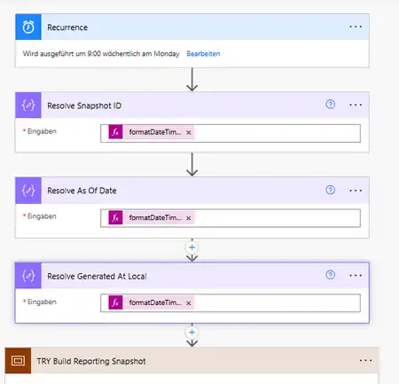
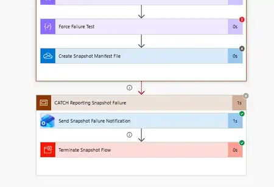
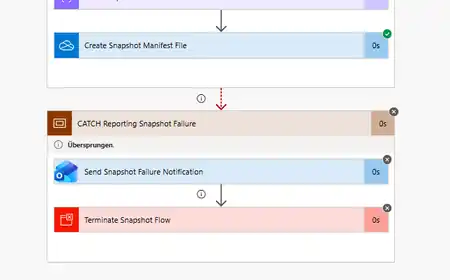

# Phase 7.2 — Power Automate Reporting Snapshot Acceptance

## Status

**POWER AUTOMATE RUNTIME IMPLEMENTED AND ACCEPTANCE-TESTED**

Phase 7.2 implements the scheduled Power Automate reporting snapshot defined by the Phase 7.0 contract and prepared in Phase 7.1.

This document records the Power Automate-specific acceptance evidence. Subsequent Phase 7.3 Python external-input implementation and WP3 end-to-end acceptance are documented separately and are now complete.

## Implemented Flow

```text
Cyber Governance - Weekly Reporting Snapshot
```

Schedule:

```text
Weekly
Monday
09:00
W. Europe Standard Time
```

Implemented structure:

```text
Recurrence
↓
Resolve Snapshot ID
↓
Resolve As Of Date
↓
Resolve Generated At Local
↓
TRY Build Reporting Snapshot
   ├── List Control Catalog
   ├── List Submission Register
   ├── List Action Register
   ├── Select Control Fields
   ├── Select Submission Fields
   ├── Select Action Fields
   ├── Create Control JSON
   ├── Create Submission CSV
   ├── Create Action CSV
   ├── Create Control Snapshot File
   ├── Create Submission Snapshot File
   ├── Create Action Snapshot File
   ├── Count Control Rows
   ├── Count Submission Rows
   ├── Count Action Rows
   ├── Build Snapshot Manifest
   └── Create Snapshot Manifest File

CATCH Reporting Snapshot Failure
   ├── Send Snapshot Failure Notification
   └── Terminate Snapshot Flow
```

## Source Reads

All three Excel Online (Business) reads use:

```text
dateTimeFormat = ISO 8601
pagination = enabled
pagination threshold = 5000
```

Runtime sources:

```text
ControlCatalog
SubmissionRegister
ActionRegister
```

The final flow contains no temporary failure-injection action or empty-test Action table.

## Normal Happy-Path Acceptance

After blank Excel table rows discovered during the first run were removed from the source workbook, the clean operational package contained:

```text
Controls:     5
Submissions: 17
Actions:      2
status: complete
```

Physical outputs:

```text
security_control_snapshot_<snapshot_id>.json
security_submission_snapshot_<snapshot_id>.csv
security_action_snapshot_<snapshot_id>.csv
security_snapshot_manifest_<snapshot_id>.json
```

Validated properties:

- Control snapshot is a top-level JSON array with exactly eight Control fields.
- Submission CSV contains the exact nine-column contract.
- Action CSV contains the exact ten-column contract.
- Dates serialize as `YYYY-MM-DD`.
- Empty optional values remain empty fields.
- CSV quoting preserves fields containing commas.
- `reminder_count` and `last_reminder_at` are preserved from Action source state.
- manifest filenames match the generated source artifacts.
- manifest row counts match source rows.
- `status = complete`.
- CATCH is skipped on a successful run.

## Source-Data Hygiene Finding

The first happy-path run exposed fully blank Excel table rows in the operational source tables.

Power Automate correctly exported those source facts rather than silently filtering them. The workbook source was corrected and the flow was rerun.

No filtering rule was added because the project boundary remains:

```text
Power Automate exports source facts.
Python owns deterministic validation.
```

## Failure-Path Acceptance

A reversible deterministic runtime failure was injected inside TRY using a division-by-zero expression.

Observed behavior:

```text
TRY Build Reporting Snapshot       → Failed
Create Snapshot Manifest File      → Skipped
CATCH Reporting Snapshot Failure   → Executed
Send Snapshot Failure Notification → Succeeded
Terminate Snapshot Flow            → Executed as Failed
Overall flow run                    → Failed
```

Source files written before the injected failure could remain, but the completion manifest for that run was not created.

This proves:

```text
partial source files
without completion manifest
!=
valid snapshot package
```

The temporary failure-injection action was removed after acceptance.

## Empty-Action Acceptance

A temporary Action table with the exact schema and zero data rows was used without deleting the real operational Action records.

Observed manifest state:

```text
control_rows = 5
submission_rows = 17
action_rows = 0
status = complete
```

The generated Action CSV was header-only with the exact contract:

```csv
action_id,control_id,submission_id,owner_email,created_at,due_date,status,reminder_count,last_reminder_at,description
```

No special empty-dataset branch was required.

The temporary test table was removed and the runtime source restored to `ActionRegister`.

## Final Smoke Run

After all test-only changes were removed, the final normal run again produced:

```text
control_rows = 5
submission_rows = 17
action_rows = 2
status = complete
```

This confirms the accepted final runtime state rather than a test-modified flow.

## Flow-as-Code / ALM Evidence

The flow was developed using a real unmanaged Solution scaffold and a controlled export/unpack/modify/pack/import loop rather than inventing a tenant package from scratch.

Final private unmanaged export inspected during acceptance:

```text
Version: 1.0.0.5
Managed: 0
SHA-256: ac8cedbea709c7ac06d928ed77de8f685f17b79e0cb20a126263a77efaea4213
```

The tenant deployment ZIP itself is intentionally not committed.

The public repository contains a sanitized workflow representation under:

```text
power_automate/solutions/cyber_governance_automation/
```

Environment-specific values are replaced by explicit placeholders.

## Public Screenshot Evidence

The committed Phase 7 screenshots are selected from the actual designer/run acceptance evidence and contain no reachable recipient address, authenticated submitter identity, tenant identifier, connection identifier, or private workbook/table binding.

### Snapshot context and schedule



### Controlled failure path



### Successful run skips CATCH



The public evidence set is intentionally minimal. Raw acceptance captures that exposed identity or environment/resource metadata were not committed.

## Acceptance Matrix

| Test | Result |
| --- | --- |
| Solution import | PASS |
| Connection Reference mapping | PASS |
| Workflow designer rendering | PASS |
| Weekly Monday 09:00 schedule | PASS |
| Snapshot context | PASS |
| ISO-8601 reads | PASS |
| Pagination | PASS |
| Happy-path package | PASS |
| Shared snapshot ID | PASS |
| Control JSON contract | PASS |
| Submission CSV contract | PASS |
| Action CSV contract | PASS |
| Manifest consistency | PASS |
| Reminder-state propagation | PASS |
| Failure path | PASS |
| Failure notification | PASS |
| Explicit failed termination | PASS |
| No manifest for failed partial package | PASS |
| Empty ActionRegister | PASS |
| Header-only Action CSV | PASS |
| Final cleanup / smoke run | PASS |

## Subsequent Phase 7 Completion

Phase 7.2 itself remains the Power Automate acceptance boundary documented above.

After this acceptance:

- Phase 7.3 implemented the explicit Python external-input boundary,
- WP3 processed a real private operational snapshot end to end,
- manifest source counts matched Python source counts,
- Phase 6 reminder fields were observed in curated reporting,
- the canonical regression remained unchanged,
- the complete suite remained 53 passing tests.

Therefore full Phase 7 is now complete.

See:

- [phase7_python_external_input.md](phase7_python_external_input.md)
- [phase7_end_to_end_acceptance.md](phase7_end_to_end_acceptance.md)
